# SED2 Specification

*This file is generated by `tools/build_specification.py` from `core-spec.md` and every Data Sheet under `specsheets/`. Do not hand-edit it - re-run the script instead.*

## Table of Contents

- [Core Specification](#core-specification)
    - [1. What a SED2 document is](#1-what-a-sed2-document-is)
    - [2. Every element (`SEDBase`)](#2-every-element-sedbase)
    - [3. The DAG design: inputs, outputs, and the chronological rule](#3-the-dag-design-inputs-outputs-and-the-chronological-rule)
    - [4. Types and references](#4-types-and-references)
    - [5. Tasks](#5-tasks)
    - [6. Outputs](#6-outputs)
    - [7. Namespaces](#7-namespaces)
    - [8. Data Sheet folder layout and versioning](#8-data-sheet-folder-layout-and-versioning)
    - [9. Validating a document against these schemas](#9-validating-a-document-against-these-schemas)
    - [10. Known gaps and inconsistencies (flagged, not fixed here)](#10-known-gaps-and-inconsistencies-flagged-not-fixed-here)
    - [11. Multi-target consistency reminder](#11-multi-target-consistency-reminder)
- [Class Reference](#class-reference)
    - [Core Classes](#core-classes)
        - [SEDBase](#sedbase)
        - [SEDDocument](#seddocument)
        - [Style](#style)
        - [Types](#types)
    - [Task Classes](#task-classes)
        - [AbstractODESimulation](#abstractodesimulation)
        - [AbstractSimulation](#abstractsimulation)
        - [AbstractStochasticSimulation](#abstractstochasticsimulation)
        - [AbstractTask](#abstracttask)
        - [AggregationCalculation](#aggregationcalculation)
        - [BoundedODESimulation](#boundedodesimulation)
        - [BoundedStochasticSimulation](#boundedstochasticsimulation)
        - [Calculation](#calculation)
        - [CreateDataBlock](#createdatablock)
        - [CsvImport](#csvimport)
        - [DataImport](#dataimport)
        - [DrawFromDistribution](#drawfromdistribution)
        - [ExplicitODESimulation](#explicitodesimulation)
        - [ExplicitStochasticSimulation](#explicitstochasticsimulation)
        - [FluxBalanceAnalysis](#fluxbalanceanalysis)
        - [JacobianFull](#jacobianfull)
        - [JacobianReduced](#jacobianreduced)
        - [Loop](#loop)
        - [ModelChange](#modelchange)
        - [ModelElementList](#modelelementlist)
        - [ModelImport](#modelimport)
        - [NumericRange](#numericrange)
        - [OneStepODESimulation](#onestepodesimulation)
        - [OneStepStochasticSimulation](#onestepstochasticsimulation)
        - [ParameterRange](#parameterrange)
        - [ParameterScan](#parameterscan)
        - [Range](#range)
        - [RelabelData](#relabeldata)
        - [Repeat](#repeat)
        - [Scatter](#scatter)
        - [SteadyState](#steadystate)
        - [StringFormation](#stringformation)
    - [Output Classes](#output-classes)
        - [AbstractOutput](#abstractoutput)
        - [Plot](#plot)
        - [Plot2D](#plot2d)
        - [Plot3D](#plot3d)
        - [Report](#report)
        - [Surface](#surface)
    - [Auxiliary Classes](#auxiliary-classes)
        - [AbstractCurve](#abstractcurve)
        - [Annotation](#annotation)
        - [Axis](#axis)
        - [Curve](#curve)
        - [LoopVariable](#loopvariable)
        - [OutputParameter](#outputparameter)
        - [Span](#span)
        - [TaskParameter](#taskparameter)
        - [WorkingAlgorithm](#workingalgorithm)

---

## Core Specification

*Source: [core-spec.md](core-spec.md)*

This document describes the overall shape and design of a SED2 document. It is deliberately short: the detailed, per-class rules (attributes, types, outputs, UML diagram) now live in individual **Specification Sheets** under `specsheets/`, one per Task, Output, and supporting class, each versioned (`v1.0.0/`, and later `v1.0.1/`, etc.) so the spec can evolve without breaking documents or tools written against an earlier version.

### 1. What a SED2 document is

*Source: [core-spec.md, line 5](core-spec.md#L5)*


A SED2 document contains two main sections for describing a simulation experiment: **Tasks** and **Outputs**. Tasks define *how to do things*; Outputs define *how to report the results*. The document also holds predefined **constants** (centrally located so they can be referenced and changed in one place) and **styles** (presentation settings used by plots - still a placeholder, see below).

Full attribute list and UML: [`specsheets/core/SEDDocument/v1.0.0/`](specsheets/core/SEDDocument/v1.0.0/description.md)

```json
{
    "version": "v1.0.0",
    "constants": { "maxTime": 200, "pi": 3.14159 },
    "tasks": { "model1": {}, "sim1": {} },
    "outputs": { "plot1": {} },
    "styles": { "style1": {} }
}
```

### 2. Every element (`SEDBase`)

*Source: [core-spec.md, line 21](core-spec.md#L21)*


Every element in a SED2 document may optionally carry `name`, `description`, `notes` (markdown), and `annotations` (qualifier/value pairs). Most elements also have an implicit `id`, which is not a child field but the dictionary key under which the element appears in its parent collection.

Full detail: [`specsheets/core/SEDBase/v1.0.0/`](specsheets/core/SEDBase/v1.0.0/description.md)

### 3. The DAG design: inputs, outputs, and the chronological rule

*Source: [core-spec.md, line 27](core-spec.md#L27)*


Every SED2 element defines its inputs and outputs, so a document can be understood as a **Directed Acyclic Graph (DAG)**: Tasks and Outputs are nodes, and references between them (`#tasks:...`, `#constants:...`, etc.) are the edges.

**Chronological organization.** No Task nor Output may depend on input from a later Task. A conforming reader can therefore always execute a document correctly by walking `tasks` and then `outputs` in file order - while a more sophisticated interpreter may instead distribute independent Tasks across parallel workers by following the DAG's connected components. When a Repeat (`Scatter`/`Loop`/`ParameterScan`) defines child `subTasks`, those children follow the same internal ordering rule.

**Abstraction.** SED2 resembles a workflow language, but describes general, abstract tasks rather than specific implementations. Where a workflow language might run `ls -asF`, SED2 would describe a "list the contents of a directory" task with an input directory, a list-of-strings output, and parameters for whether to include sizes and file/directory type.

### 4. Types and references

*Source: [core-spec.md, line 35](core-spec.md#L35)*


Every value in a SED2 document is either a literal or a **reference** (an `SIdRef`) to a value elsewhere in the document - anywhere a `double` is expected, a string like `"#tasks:sim1.model['S1']"` may appear instead, and must be resolved to a double at execution time. 

The references point to task outputs.  Each task defines what the shape of its output or outputs are.  The three basic types of output references are:
* `[id]`: a number or block of numbers, in AnnotatedData format.
* `[id].model`: a model.
* `[id].strings`: a string or block of strings, in AnnotatedData format.

Other references may be defined by individual tasks, but every task must explicitly state which, if any, of the three basic references are valid, and, if so, what shape they take.

A full primitive/reference type catalogue: [`specsheets/core/Types/v1.0.0/`](specsheets/core/Types/v1.0.0/description.md)

### 5. Tasks

*Source: [core-spec.md, line 48](core-spec.md#L48)*


Every Task derives from `AbstractTask`, which itself derives from `SEDBase`: an implicit id plus a `_type` discriminator naming the concrete task class. Every concrete Task subclass must define what its output(s) are - see [`specsheets/core/SEDBase`](specsheets/core/SEDBase/v1.0.0/description.md) and each task's own Data Sheet under [`specsheets/tasks/`](specsheets/tasks/) for the details.


### 6. Outputs

*Source: [core-spec.md, line 53](core-spec.md#L53)*


Every Output derives from `AbstractOutput`, which itself derives from `SEDBase`. An `AbstractOutput` may **never** be used as input to anything else in the document - it is always the final stage of processing; anything that needs to be reused belongs in a Task instead. SED2 dictates only what data an output must contain, not the concrete form it takes (an in-memory object, a web page, exported files).

There are two basic families, documented under [`specsheets/outputs/`](specsheets/outputs/):

- **`Report`** - exports raw data.
- **`Plot`** - exports graphical output.

### 7. Namespaces

*Source: [core-spec.md, line 62](core-spec.md#L62)*


SED2 allows third parties to extend a document with their own attributes and classes under a **namespace**, written `namespace@identifier` (e.g. `saurolab@thisFactor` as an extra attribute, or `saurolab@thisAnalysis` as a whole new type). This applies at two levels:

- **Attribute-level**: an extra `namespace@key` field alongside an element's normal attributes.
- **Class-level**: a `_type` value of the form `namespace@identifier` naming an entirely new task or output type, not one of the built-in concrete classes.

A namespace a reader doesn't recognize should not be treated as an error: readers that don't know a given namespace store its content as opaque, unvalidated data and pass it through unchanged. A namespace that supplies its own schema can be validated against it by tools that know about it: known namespaces are composed directly into the schema at generate time, from a `namespaces/<prefix>/` directory.

A namespace also carries its own version, independent of the document's own `version` attribute. Any document that uses a given namespace anywhere must declare that namespace's version too, as a `<prefix>@version` attribute on the document itself (e.g. `saurolab@version`).

### 8. Data Sheet folder layout and versioning

*Source: [core-spec.md, line 73](core-spec.md#L73)*


```
specsheets/
  core/          - document-level & base-class infrastructure (not a Task or Output itself)
    Types/v1.0.0/
    SEDBase/v1.0.0/
    SEDDocument/v1.0.0/
    Style/v1.0.0/
  tasks/         - every class that can appear as a "tasks" dictionary entry, plus their shared abstract bases
    AbstractTask/v1.0.0/
    ModelImport/v1.0.0/
    ... (one folder per task class)
  outputs/       - every class that can appear as an "outputs" dictionary entry, plus their shared abstract bases
    AbstractOutput/v1.0.0/
    Report/v1.0.0/
    ...
  auxiliary/     - child/component types that are never themselves a "tasks" or "outputs" dictionary entry
    Range/v1.0.0/
    Axis/v1.0.0/
    Curve/v1.0.0/
    ...
```

Each `<Category>/<ClassName>/<version>/` folder normally contains exactly:

- **`schema.json`** - a standalone JSON Schema (2020-12) for that one class, with its own `$id`. Shared primitives and base-class fields are pulled in via `$ref` to the relevant `core/`/`tasks/`/`outputs/`/`auxiliary/` schema file rather than duplicated, so the file stays small; it can still be dropped into another JSON Schema document and resolved as long as the relative folder layout above is preserved (or the `$id` is used with a schema-aware `$ref` resolver/registry).
- **`description.md`** - A description of the class, including a link to the class's UML diagram (or a note that one doesn't exist yet), what the class does, a table of its child attributes (name, type, required/optional), and a description of what referencing the class's id produces as output.
- **`<ClassName>.png`** - the UML class diagram, when one exists.
- **`outputs.json`** - A formal JSON description of the valid outputs for the class.

The `schema.json` file should contain special elements to assist with library validation.  They are:
* *`x-required-rule-ids`*: A sibling of the `required` array, mapping each required field's name to the numbered validation rule that documents its presence requirement.
* *`x-rule-id`*: A sibling to any `_type` discriminator `const`, or a type/shape check beyond bare presence.  It is a single rule-ID string, or an array of them when more than one rule governs the same property (most commonly an `OrRef` field's separate direct-value and reference-form rules, e.g. `AbstractODESimulation.forcePhysicalCorrectness`). 
* *`x-ref-target`*: Any bare `SIdRef` property that must resolve to a particular kind of thing also carries `"x-ref-target": "model"` (SEDBase-0016) or `"x-ref-target": "annotatedData"` (SEDBase-0017).
* *`x-anyof-required-rule-id`*: For classes the require at least one of multiple attribute children (thus far, only `Repeat`, whose subclasses need at least one of `outputVariableMap` or `aggregateOutputVariables`) rather than a fixed set - expresses that as an `anyOf` of single-field `required` objects at the class's own top level (sibling to `properties`), with a sibling `x-anyof-required-rule-id` naming the one rule documenting the whole disjunction, rather than forcing it into `x-required-rule-ids`'s per-field mapping.
* *`x-missing-type-rule-id`*: A `oneOf` discriminator built via `x-generated-oneOf` (see Design.md's Classes section) can similarly carry a sibling `x-missing-type-rule-id`, naming a rule for the narrower case where `_type` is absent from the instance entirely, rather than present but unrecognized - a more specific error than the discriminator's own catch-all, for whichever discriminators want to distinguish it (e.g. `AbstractTask-0002`).

All of these are inert to any JSON Schema validator (unknown keywords are ignored) and exist purely as generator-only metadata so the generator can wire each hand-written `validate()` check straight to the schema location it corresponds to rather than re-deriving that mapping itself. 

Not every numbered rule has a schema-visible home this way: most are semantic (cross-reference resolution, math well-formedness, tolerance interactions, and the like) with no single JSON Schema keyword to attach to; only presence, discriminator, and simple type/shape constraints get one.


**Task outputs (`outputs.json`).** Every concrete (non-abstract) `Task` class additionally carries an `outputs.json`. The top level element of this file is 'outputs', and the children of this element is a dictionary of output descriptions, with the key being each valid output `[id]` and `[id].[suffix]` for that class. Any listed id or id/suffix combination is valid, and anything not listed (including a bare `[id]`) is not valid. 

The value for these id keys are another dictionary.  `type` is required, and lists the type of that output: `annotatedData`, `model`, or `stringList`.

If the `type` is `annotatedData`, a second child `dimensions` must be included to describe the dimensions of the outputted data, whether known or unknown.  There are two forms available:
   - **A single sourced object describing the whole shape** Used when the shape is not fully determined by the task, and is instead determined from a different input reference, or determined at runtime.
   - **An array of per-dimension entries.** Used whenever the shape can always be described one dimension at a time (the usual case: rows by columns, one column per output variable, and so on). An empty array, `[]`, means the output has no dimensions - it is a single value (e.g. `Loop`'s `[id].range`).

The characteristics of individual dimensions can also be determined by other objects. These 'sourced objects' take this form:

3. **Write each `size` as a sourced object.** A sourced object always has a `source` field saying where the knowledge comes from. Use the first of these that applies:
   - `"static"` - computable from the task's own attribute values alone. Fields: `expr` (required; an expression in the notation defined below, e.g. `len(outputVariables)`, `1 + len(outputVariables)`, `independentVariableRange.numberOfSteps`) and `note` (optional).
   - `"input-file"` - knowable only by reading the external resource that one of the task's fields points to (e.g. `JacobianFull`'s species count comes from its `model`; `CsvImport`'s column headers come from its `location`). Fields, all required: `from` (the name of the task field that points to the resource), `extract` (what to read from it, e.g. `rowCount`, `columnHeaders`) and `note`. There is no formula here, because the actual parsing is format-specific generator work, not something this file does itself.
   - `"runtime"` - genuinely not derivable without executing the simulation (e.g. `BoundedODESimulation`'s solver-chosen row count under variable step size, or `Loop`'s iteration count). Fields: `note` (required; always explain why it cannot be known earlier) and `min` (optional; an integer >= 0 giving a guaranteed lower bound, only if one is actually known, e.g. 2 for "at least 2 rows"). When `min` is given, `SEDBase-0014` flags an index or range that needs more entries than `min` guarantees as a warning rather than an error, since it may still be valid once the simulation actually runs.


**If you chose the array, write each element as one of two kinds of entry.** The array lists the dimensions in order, and the two kinds may be mixed.
   - **An ordinary entry** describes one dimension. Its requied fields are `size` and `labels`, and it may have an optional `note` with free text.
   - **A `repeat` entry** expands to one dimension per entry of a named array-valued attribute (e.g. `ParameterScan` has one dimension per entry of `parameterRanges`). Its only field is `repeat`, an object with `over` (required; the name of the array-valued attribute), `size` and `labels` (both required, written as for an ordinary entry), and `note` (optional). Inside a `repeat` entry's `size` and `labels`, a bare identifier refers to a field of the *current entry* of `over` (not of the task), and `self` refers to that entry as a whole.

3. **Write each `size` as a sourced object.** A sourced object always has a `source` field saying where the knowledge comes from. Use the first of these that applies:
   - `"static"` - computable from the task's own attribute values alone. Fields: `expr` (required; an expression in the notation defined below, e.g. `len(outputVariables)`, `1 + len(outputVariables)`, `independentVariableRange.numberOfSteps`) and `note` (optional).
   - `"input-file"` - knowable only by reading the external resource that one of the task's fields points to (e.g. `JacobianFull`'s species count comes from its `model`; `CsvImport`'s column headers come from its `location`). Fields, all required: `from` (the name of the task field that points to the resource), `extract` (what to read from it, e.g. `rowCount`, `columnHeaders`) and `note`. There is no formula here, because the actual parsing is format-specific generator work, not something this file does itself.
   - `"runtime"` - genuinely not derivable without executing the simulation (e.g. `BoundedODESimulation`'s solver-chosen row count under variable step size, or `Calculation`'s result shape, which depends on evaluating its math against the operands' actual values). Fields: `note` (required; always explain why it cannot be known earlier) and `min` (optional; an integer >= 0 giving a guaranteed lower bound, only if one is actually known, e.g. 2 for "at least 2 rows"). When `min` is given, `SEDBase-0014` flags an index or range that needs more entries than `min` guarantees as a warning rather than an error, since it may still be valid once the simulation actually runs.

4. **Write each `labels` value** (ordinary and `repeat` entries only). It is one of:
   - `null` - the dimension has no labels.
   - An array of literal strings - fixed labels.
   - A sourced object, written as in step 3 - e.g. `{ "source": "static", "expr": "[independentVariable] + outputVariables" }`.

5. **If you chose the whole-shape form,** write one sourced object (step 3) that describes the entire shape; it has no separate `size` or `labels`. The usual cases are:
   - `static` with `shapeOf(input)` - the same shape as another reference's output (`RelabelData`).
   - `static` with `shapeOf(input) - dim(...)` - that shape with one or more dimensions removed (`AggregationCalculation`).
   - `input-file` - the shape is whatever an external file has (`DataImport`).
   - `runtime` - the shape depends on values only known during execution (`Calculation`, `StringFormation`).

6. **Check your work.** `schema/outputs-meta.schema.json` validates the structure described above (which fields are present, which `source` values are allowed), but it does not parse the contents of `expr` or `note` strings; `expr` is defined by the notation paragraph below, and a generator's shape-inference step implements it by hand.

Examples (the `dimensions` part of an entry; `ExplicitODESimulation`'s `[id]`, then `ParameterScan`'s `[id]`, then `RelabelData`'s `[id]`):

```json
"dimensions": [
  { "size":   { "source": "static", "expr": "len(independentVariableRange)" },
    "labels": null },
  { "size":   { "source": "static", "expr": "1 + len(outputVariables)" },
    "labels": { "source": "static", "expr": "[independentVariable] + outputVariables" } }
]
```

```json
"dimensions": [
  { "repeat": { "over": "parameterRanges",
                "size":   { "source": "static", "expr": "len(self)" },
                "labels": { "source": "static", "expr": "modelElement" } } },
  { "size":   { "source": "static", "expr": "len(outputVariableMap)" },
    "labels": null }
]
```

```json
"dimensions": { "source": "static", "expr": "shapeOf(input)" }
```

Abstract/mixin classes (`AbstractSimulation` and friends, `Repeat`) carry no `outputs.json` of their own, the same reasoning as why they carry no `_type` - nothing is ever instantiated as one directly, so "what does referencing this task's output produce" has no meaning until a concrete leaf class answers it, flatly, the same way those classes already flatten every other inherited constraint into their own `schema.json`.

A listed entry may carry an optional `valid` field meaning "valid if": a boolean expression string over the task's own fields, e.g. `"outputModel == true"`, `"provided(range)"`; with no `valid` field the entry is always valid. 

**The `expr`/`valid` notation.** Both fields reuse one small expression language, evaluated against the task's own attribute values at generate/validate time - never against runtime data, and not the SED2 math grammar `Types-0001` through `Types-0004` validate (see this section's `x-rule-id` paragraph above and `Design.md`'s Math section for that separate grammar): `outputs.json` describes shape, `math` describes computation. A bare identifier names one of the task's own attributes and evaluates to its value (`outputVariables`); a dotted path reaches into a nested attribute the same way (`independentVariableRange.numberOfSteps`). `[x]` is an array literal (`[independentVariable]`); JSON numbers and `true`/`false` are literals too. Five functions: `len(x)` - the length of an array-valued `x`; or, when `x` is a Range-family value (a `RangeInline`/`NumericRangeInline`/`ParameterRangeInline`-typed field, or the reserved identifier `self` inside a `repeat` entry - see below), the number of points it resolves to, dispatched on `x`'s own discriminated type: `len(x.values) if provided(x.values) else x.numberOfSteps + 1` for `NumericRange`/`ParameterRange`, or just `len(x.values)` for a bare `Range` (which has no `numberOfSteps` alternative); `keys(x)` - the keys of an object-valued `x`, as an array; `shapeOf(x)` - the whole `dimensions` shape of a referenced AnnotatedData value; `dim(x)` - the dimension(s) named by `x` (a single name or a list of names) within a shape, meaningful only as the right operand of `-`; `provided(x)` - `true` iff attribute `x` was given a value in the document. Operators, at ordinary precedence: `!x` (boolean negation); `x == y` (equality); `x + y` (numeric addition when both operands are numbers, array concatenation when both are arrays - `1 + len(outputVariables)` vs. `[independentVariable] + outputVariables`); `shapeOf(x) - dim(y)` (a shape with the named dimension(s) removed - the only place `-` appears); `x or y` (`x`'s value when `provided(x)` holds, else the literal `y` - used for a field with a documented default, e.g. `dim(appliedDimensions or outermost)`, where `outermost` is a sentinel meaning the shape's own first dimension); and a conditional `x if provided(y) else z` for a value with two different derivations depending on whether an alternate field was given instead (e.g. `NumericRange`'s `len(values) if provided(values) else numberOfSteps + 1`). This is the only formal definition of the notation - `schema/outputs-meta.schema.json` does not parse it, as noted above - so a generator's shape-inference step implements it by hand. Inside a `dimensions` array's `repeat` entry (see above), this same notation applies to that entry's own `size`/`labels`, with two scoping additions: a bare identifier there resolves against the current array entry's own fields, not the task's top-level attributes; and the reserved identifier `self` refers to the current entry as a whole (for taking its `len()`, per above) rather than one of its fields. `ParameterScan`'s `repeat` over `parameterRanges` uses `size: len(self)`, letting each entry's own type (`Range`/`NumericRange`/`ParameterRange`) determine its own length the same way `Scatter`'s `len(range)` and `ExplicitODESimulation`'s `len(independentVariableRange)` do for their own named Range-family fields.

**Exception - the three Range "inline" wrappers.** `Range`, `NumericRange`, and `ParameterRange` can each be used two ways: standalone, as an entry in the `tasks` dictionary (with the full task apparatus - the `_type` discriminator, `taskParameters`, etc.), or embedded as a named child field of another task (e.g. `ExplicitODESimulation.independentVariableRange`, `Scatter.range`, `ParameterScan.parameterRanges[]`). The schema represents the second, embedded form with three small wrapper `$defs` - `RangeInline`, `NumericRangeInline`, `ParameterRangeInline` - that exist purely to give the embedded-child usage its own schema seam (so it could diverge from the standalone-task form later) without being a distinct modeled *class* with its own UML diagram. Rather than give each of those three its own folder, they are merged into their base class's folder as extra schema files:

```
tasks/Range/v1.0.0/                  tasks/NumericRange/v1.0.0/             tasks/ParameterRange/v1.0.0/
  schema.json   (Range)              schema.json   (NumericRange)          schema.json   (ParameterRange)
  common.schema.json (RangeCommon)   common.schema.json (NumericRangeCommon)
  inline.schema.json (RangeInline)   inline.schema.json (NumericRangeInline) inline.schema.json (ParameterRangeInline)
  Range.png                          NumericRange.png                       ParameterRange.png
  description.md                     description.md                        description.md
```

`Range` and `NumericRange` carry an extra `common.schema.json` that `ParameterRange` doesn't need: `Range` is both directly instantiable and the parent of `NumericRange`, and `NumericRange` is in turn both directly instantiable and the parent of `ParameterRange` - so each contributes a `RangeCommon`/`NumericRangeCommon` mixin (composed via `allOf`) carrying the fields its subclass inherits, alongside its own `schema.json` for the standalone-task form. `ParameterRange` is a leaf - nothing subclasses it - so it needs no such split. Each mixin composes the next one up in turn (`NumericRangeCommon` composes `RangeCommon`, which composes `AbstractTaskCommon`), so a concrete class's own `allOf` names only its one most specific ancestor mixin - `ParameterRange` lists just `NumericRangeCommon`, not `RangeCommon` and `NumericRangeCommon` side by side - mirroring the UML chain directly rather than flattening every ancestor into each leaf; see `Design.md`'s Classes section for why.

Each `description.md` in these three folders explains all of that folder's schema files. Everything else in the document - including every cross-reference into these three classes from other Data Sheets' `schema.json` files - still resolves correctly; this was verified by validating real SED2 example documents against the split schemas after the merge. All three live under `tasks/`, so each also carries the ordinary `outputs.json` every concrete `tasks/` class does, describing its `[id]` output for when it is used as a standalone `tasks` entry.

**`Span` follows the same two-file pattern, but is an auxiliary class.** `Span` (`auxiliary/Span/v1.0.0/`) is a simple `start`/`end` pair, used only as the embedded child `independentVariableSpan` of `BoundedODESimulation` and `BoundedStochasticSimulation`. Unlike the Range family it does not inherit from `AbstractTask` and is not in `AbstractTask`'s union, so it can never be a standalone `tasks` entry and carries no `outputs.json` (like every non-`tasks/` class). It still keeps its own `schema.json` (`Span`) and `inline.schema.json` (`SpanInline`) in the one folder, with its `description.md` explaining both, exactly as above; `SpanInline` is unwrapped by the generator the same way the Range inline wrappers are.

**Exception - the two `*Common` mixins.** `AbstractTaskCommon` and `AbstractOutputCommon` are schema-only mixins (composed via `allOf`) rather than modeled classes with their own UML box: they contribute the fields every concrete Task (or Output) picks up beyond `SEDBase` - `taskParameters`/`outputParameters` - but have no `_type` of their own and are never instantiated directly. Rather than give them placeholder folders, each is merged into its family's base-class folder as a second schema file:

```
tasks/AbstractTask/v1.0.0/              outputs/AbstractOutput/v1.0.0/
  schema.json      (AbstractTask)     schema.json      (AbstractOutput)
  common.schema.json (AbstractTaskCommon) common.schema.json (AbstractOutputCommon)
  AbstractTask.png                    AbstractOutput.png
  description.md                      description.md
```

`schema.json` in each of these two folders still holds only the `oneOf` discriminator over the concrete subclasses, unchanged; `common.schema.json` holds the mixin, and every concrete Task/Output's own `schema.json` still `$ref`s the mixin the same way it always did - just pointed at `common.schema.json` instead of a dropped standalone folder. Re-validated the same way as the inline-wrapper merge above. This `oneOf` is generator-populated rather than hand-maintained: each discriminator-bearing `$defs` entry (`AbstractTask`, `AbstractOutput`, and `RangeInline` - see the exception above) carries a structured pointer at the `common.schema.json` mixin it discriminates over, and the generator finds every concrete class that composes that same mixin and pins a `_type` const, treating each as a branch - so a newly-introduced abstract-class family needs no generator code changes, just its own mixin file and pointer. See `Design.md`'s Classes section for the full algorithm.

**Exception - standalone schema-only mixins with no oneOf of their own.** `AbstractSimulation`, `AbstractODESimulation`, and `AbstractStochasticSimulation` (all under `tasks/`) are schema-only mixins too, but unlike `AbstractTaskCommon`/`AbstractOutputCommon` above, nothing else ever needs to reference them as a field type, so there's no bare oneOf-bearing sibling to merge them into. Each simply gets its own ordinary-looking folder (`schema.json` + `description.md` + `<ClassName>.png`) whose `schema.json` holds a mixin instead of a concrete class - no `_type`, no `oneOf`, composed via `allOf` by its subclasses like any other mixin. `AbstractSimulation` provides the fields shared by every ODE/stochastic simulation task (superseding the former `SimulationCommon` - see Section 10); `AbstractODESimulation` and `AbstractStochasticSimulation` each add solver-tuning fields on top of it, composing `AbstractSimulation` via `allOf` in turn. `ExplicitODESimulation`/`BoundedODESimulation`/`OneStepODESimulation` and their three stochastic counterparts then each compose only their own one most-specific mixin (`AbstractODESimulation` or `AbstractStochasticSimulation`), which already reaches `AbstractSimulation`, `AbstractTaskCommon`, and `SEDBaseFields` transitively - mirroring the UML inheritance chain directly rather than flattening every ancestor's composition at the leaf (see Classes). `WorkingAlgorithm` (`auxiliary/WorkingAlgorithm/v1.0.0/`, referenced from `AbstractSimulation.workingAlgorithms`) needs no such exception - it's an ordinary directly-instantiable class inheriting only from `SEDBase`, following the general folder pattern above.

Any future changes to a class creates a sibling `v#.#.#/` folder alongside `v1.0.0/`, leaving existing references to `v1.0.0/` intact.

### 9. Validating a document against these schemas

*Source: [core-spec.md, line 220](core-spec.md#L220)*


To validate a whole SED2 document, `$ref` the appropriate `specsheets/core/SEDDocument/v1.0.0/schema.json` (which itself only needs `AbstractTask`/`AbstractOutput`, which in turn enumerate the concrete task/output classes) with a schema registry that can resolve relative file `$ref`s - e.g. Python's `referencing`/`jsonschema` packages, pointed at the `specsheets/` root. To validate or compose against just one class (e.g. embedding `ExplicitODESimulation`'s schema inside a larger tool-specific document), `$ref` that class's own `specsheets/tasks/ExplicitODESimulation/v1.0.0/schema.json` directly - its external refs resolve the same way.

### 10. Known gaps and inconsistencies (flagged, not fixed here)

*Source: [core-spec.md, line 224](core-spec.md#L224)*


Per the project's own working rule, this split is descriptive - it surfaces inconsistencies for you to resolve rather than silently deciding them:

- **`Style` is unspecified.** Both the prose (`"[To be filled in; should be a straight copy of SED-ML's Style class.]"`) and the schema (a permissive `{"type": "object"}` placeholder) mark this as incomplete.
- **9 classes have no standalone UML diagram of their own**, and instead their `description.md` links directly to another class's diagram (a relative-path image reference, not a copied file) rather than claiming no diagram exists. 6 of these are fully drawn inside the referenced diagram as a linked box with their own attributes: `auxiliary/Annotation` (in `core/SEDBase`'s diagram), `auxiliary/TaskParameter` (in `tasks/AbstractTask`'s), `auxiliary/OutputParameter` (in `outputs/AbstractOutput`'s), `auxiliary/LoopVariable` (in `tasks/Loop`'s), `auxiliary/Axis` (in `outputs/Plot`'s), and `auxiliary/WorkingAlgorithm` (in `tasks/AbstractSimulation`'s). The other 3 don't have a separately-cropped diagram of their own: `tasks/NumericRange` and `tasks/ParameterRange` just point to `tasks/Range`'s diagram, since inheriting from `Range` is all there is to show, and `auxiliary/Curve` points to `auxiliary/AbstractCurve`'s diagram, which already draws `Curve` directly as `AbstractCurve`'s one concrete subclass.
- **`core/Style` is the one class with genuinely no UML diagram anywhere**, as it does not yet have a full definition. It keeps its `DIAGRAM-PENDING.md` for now.
- **`tasks/AbstractTaskCommon` and `outputs/AbstractOutputCommon` are schema-only mixins, not modeled classes** - they were never drawn as their own UML box (their fields are drawn flattened onto `AbstractTask`'s/`AbstractOutput`'s own box instead), so there's no gap to flag for them; see Section 8's exception for how they're now filed as a second schema file (`common.schema.json`) in their base class's folder.
- **`sed\spec\sed2.schema.json` (in the `sed` repo/folder) is corrupted** - it has a complete, valid JSON document followed by ~1,140 bytes of duplicated trailing content that makes the file as a whole invalid JSON. This split was generated from the *valid prefix* of that file (which is also the more complete of the two `sed2.schema.json` copies found - `SED2\spec\sed2.schema.json` is missing the `Surface` definition and part of `Curve`). Worth cleaning up that file directly.
- **`Jacobian`'s worked example** repeats the `_type` key four times with different, mutually exclusive values in the same JSON object - a copy/paste artifact that should be cleaned up in the prose. (The schema-level ambiguity this reflected is now resolved: `Jacobian` has been split into `JacobianFull`/`JacobianReduced`, each with its own `_type` and no `isFull` flag - but the `description.md` prose still needs its own cleanup to match.)
- **`CSVImport`'s prose section is an unfinished sentence** ("All of the other arguments are optional,"), while the schema fully specifies `organization`/`separator`/`headers`/`columnNames`/`ncols`/`nrows`/`units`. The Data Sheet leans on the schema; the prose should be filled in to match.
- **`AggregationCalculation` and `DrawFromDistribution` are expected to be split into one concrete class per variant, the way `Jacobian` was split into `JacobianFull`/`JacobianReduced`.** Neither currently has a clean way to select or parameterize its variant: `AggregationCalculation` dropped its `kisaoID` attribute (rolled into `_type`, see Section 8) without gaining a replacement, so nothing in its schema says which KISAO:0000824 aggregation function (sum, mean, standard deviation, ...) is actually being computed. `DrawFromDistribution` has a `distribution` attribute naming which of the 12 SBML distrib functions to draw from, but `arguments` is still a flat, unlabeled array - there's no schema-level way to say a `normal` draw needs `mean`/`stdev` (or `mean`/`stdev`/`min`/`max`) while a `cauchy` draw needs a different, differently-shaped parameter list (see `schema/predefined-functions.json`'s `distrib` entries). The expected fix in both cases mirrors `Jacobian`'s: one concrete class per variant (e.g. `SumCalculation`/`MeanCalculation`/... per KISAO:0000824 child; `DrawFromNormalDistribution`/`DrawFromCauchyDistribution`/... per distrib function), each with its own `_type` and properly named, properly required attributes instead of a generic `arguments` array or an absent selector. Not yet designed or scoped.
- **Checks that require reading a referenced model or data file are not yet drafted** (e.g. that a task's `outputVariables` names actually exist in the SBML model its `model` points at, or that a `CsvImport`'s named columns exist in its file). `outputs.json`'s `"input-file"` dimension-source entries already anticipate this; each needs its own per-format reader before it can become a rule. Later work.
- **Open design questions carried over verbatim from original:** whether `ModelChange.replaceElements` should be kept in SED2 at all; whether it's acceptable that `OneStepODESimulation` neither tracks nor outputs the independent variable's own final value; a COMBINE-2026 note wanting `AggregationCalculation` to be usable as an objective function (e.g. "scan and return the best").

### 11. Multi-target consistency reminder

*Source: [core-spec.md, line 239](core-spec.md#L239)*


Per this project's own working rules: any future design change to the SED2 class model, cross-reference/math syntax, or validation rules must be reflected in **all three** generated libraries (C++, Java, Python) in the same change - this document split does not touch code generation, but any content change that follows from resolving Section 10's open items will.

---

## Class Reference

### Core Classes

#### SEDBase

*Source: [specsheets/core/SEDBase/v1.0.0/description.md](specsheets/core/SEDBase/v1.0.0/description.md)*

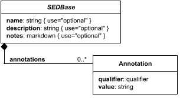

**Category:** core  
**Version:** v1  
**Schema:** [`schema.json`](specsheets/core/SEDBase/v1.0.0/schema.json)

##### What it does

Every element in a SED2 document may optionally carry a `name`, `description`, `notes`, and `annotations`. `name` and `description` are unrestricted strings; `notes` is markdown; `annotations` is a list of qualifier/value pairs describing the parent object (e.g. `{"qualifier": "bibo:Journal", "value": "..."}`).

Many SED2 elements also have an implicit `id`: this is not a child field of the object itself, but the dictionary key under which the object appears in its parent collection (e.g. a task's key in the `tasks` dictionary). Elements that can appear more than once in the same list (tasks, styles, algorithm parameters, etc.) get an id this way; one-off elements (most Ranges, for instance) do not.

Every other Data Sheet's schema composes `SEDBaseFields` via `allOf` to pick up these four optional fields, so this page documents them once rather than repeating them on every sheet.

##### Attributes

All classes additionally inherit the optional `name`, `description`, `notes`, and `annotations` fields from `SEDBase` - see [`core/SEDBase`](#sedbase).

_This class defines no additional attributes beyond `SEDBaseFields`._

##### Outputs

Every element inherits `SEDBase`, but whether `[id]`, `[id].model`, or `[id].strings` apply depends entirely on the concrete Task/Output subclass - `SEDBase` itself is never independently addressed this way.

##### Validation Rules

**`SEDBase-0000`** (error) - The element fails a JSON Schema constraint attributable to SEDBase that does not match any other numbered rule. ([source](specsheets/core/SEDBase/v1.0.0/validation/SEDBase-0000.md))

> Catch-all rule for schema-pass failures attributable to SEDBase (or a
> more specific descendant whose own class's failure location can't be
> resolved to any other numbered rule). See Design.md, Schema-Pass Errors.

**`SEDBase-0001`** (error) - The name attribute of a SEDBase-derived element, if present, must be a string. ([source](specsheets/core/SEDBase/v1.0.0/validation/SEDBase-0001.md))

> `name` is an unrestricted string in SEDBaseFields.

**`SEDBase-0002`** (error) - The description attribute of a SEDBase-derived element, if present, must be a string. ([source](specsheets/core/SEDBase/v1.0.0/validation/SEDBase-0002.md))

> `description` is an unrestricted string in SEDBaseFields.

**`SEDBase-0003`** (error) - The notes attribute of a SEDBase-derived element, if present, must be a markdown-formatted string. ([source](specsheets/core/SEDBase/v1.0.0/validation/SEDBase-0003.md))

> `notes` is a `MarkdownString` in SEDBaseFields - a CommonMark-formatted string.

**`SEDBase-0004`** (error) - The annotations attribute of a SEDBase-derived element, if present, must be an array of Annotation objects. ([source](specsheets/core/SEDBase/v1.0.0/validation/SEDBase-0004.md))

> `annotations` is an array of `Annotation` objects in SEDBaseFields, each with a required `qualifier` (a `Qualifier` string, e.g. 'bqbiol:hasPart') and a required `value` (`AnyValueOrRef`).

**`SEDBase-0005`** (error) - The first segment of a reference must name one of SEDDocument's ID-keyed collections: tasks, constants, outputs, or styles. ([source](specsheets/core/SEDBase/v1.0.0/validation/SEDBase-0005.md))

> Applies to every reference anywhere in the document: a whole attribute value,
> an element of an array or object value, or a REFERENCE token embedded in a
> math string (see Types-0001). Owned by SEDBase rather than repeated on
> every class, since every class can hold references; {class} in the message
> names the element that holds the reference, not SEDBase.
>
> Listing #outputs as a legal root keeps this rule purely syntactic;
> SEDBase-0007 is the rule that rejects actually using it.

**`SEDBase-0006`** (error) - Every colon-delimited segment of a reference must resolve to an existing element. ([source](specsheets/core/SEDBase/v1.0.0/validation/SEDBase-0006.md))

> Walks the containment tree one colon segment at a time: #tasks:loop1 must name
> a key of SEDDocument.tasks; #tasks:loop1:subTasks:sim1 must name a key of
> that Repeat's subTasks; #tasks:loop1:loopVariables:x must name a key of that
> Loop's loopVariables. Only ID-keyed children can be walked this way; a
> segment naming a plain attribute (e.g. #tasks:sim1:model) does not resolve.
> This is the check behind getSEDReference() returning null.
>
> {subvalue} is the longest prefix that failed to resolve, e.g.
> '#tasks:loop1:subTasks:sim9' when loop1 exists but has no sim9 subTask.
> (Uses {subvalue} rather than {location} - which is reserved everywhere else
> for the JSON-pointer location of the offending attribute itself, filled in
> automatically by make_problem() - to avoid a placeholder collision: this
> rule needs a second, independent piece of text in its message, the failed
> reference-path prefix, which is exactly what {subvalue} already means for
> the other reference rules below (SEDBase-0008 through -0011).)

**`SEDBase-0007`** (error) - A reference must not target an AbstractOutput, or anything contained in one. ([source](specsheets/core/SEDBase/v1.0.0/validation/SEDBase-0007.md))

> Enforces core-spec.md Section 6: an AbstractOutput is always a final stage
> and is never an input to anything else. This includes an output referencing
> another output.

**`SEDBase-0008`** (error) - A dot-accessor in a reference must be one the target declares valid. ([source](specsheets/core/SEDBase/v1.0.0/validation/SEDBase-0008.md))

> For a task target, the accessor must be listed in that task class's outputs.json
> (a suffix that is not listed is not valid), and, if the entry has a "valid"
> field, that field's expression must evaluate to true against the target's own
> fields. An entry with no "valid" field is always valid. When the expression cannot be evaluated
> statically (it depends on a reference that resolves only at run time), the
> rule does not fire.
>
> For a constants, loopVariables, or styles target, no dot-accessor is valid.
>
> The bare [id] form (no accessor) is checked the same way, against outputs.json's
> "[id]" entry: referencing a ModelImport as '#tasks:m1' with no .model fires this
> rule, with {subvalue} empty.

**`SEDBase-0009`** (error) - A reference must not apply more bracket indices than its target has dimensions. ([source](specsheets/core/SEDBase/v1.0.0/validation/SEDBase-0009.md))

> Only fires when the target's dimension count is static in outputs.json (a
> fixed "dimensions" array, or one whose count is computable from the target's
> own literal fields). A "runtime" or "input-file" dimension count never fires
> this rule. {count} is the number of indices used; {expected-count} is the
> number of dimensions available.

**`SEDBase-0010`** (error) - A label index in a reference must name one of the labels of the dimension it indexes. ([source](specsheets/core/SEDBase/v1.0.0/validation/SEDBase-0010.md))

> Only fires when that dimension's labels are "static" in outputs.json and all
> the fields they are computed from are literals. For example, with
> outputVariables ["S1","S2"], '#tasks:sim1['S3']' fires this rule; with
> outputVariables given as a reference, it cannot fire.

**`SEDBase-0011`** (error) - An integer or range index in a reference must fall within the size of the dimension it indexes. ([source](specsheets/core/SEDBase/v1.0.0/validation/SEDBase-0011.md))

> Only fires when that dimension's size is "static" and computable. Negative
> indices count from the end (Python-style), so for size n the legal integer
> indices are -n..n-1. For a range [a:b], both ends must be within -n..n, and
> the range must select at least one element.

**`SEDBase-0012`** (error) - A bracket index into a constant must match the structure of that constant's literal value. ([source](specsheets/core/SEDBase/v1.0.0/validation/SEDBase-0012.md))

> Constants have no outputs.json; their shape is simply their literal JSON value.
> An integer index requires an array of sufficient length, a label index requires
> an object with that key, and any index into a scalar fires this rule. A
> constant whose value is itself a reference is followed first.

**`SEDBase-0013`** (error) - A reference to a Repeat's subTasks, its .range/.index outputs, or one of its loop variables is only legal when the element holding the reference is that Repeat itself, or lies within that Repeat's own subTasks (at any depth, including through a nested Repeat). ([source](specsheets/core/SEDBase/v1.0.0/validation/SEDBase-0013.md))

> Consolidates three rules that were drafted separately (AbstractTask-0004,
> Repeat-0007, Loop-0006) into one, moved to SEDBase rather than AbstractTask
> so the same restriction reaches Plots and Reports too, not just other tasks.
> A subTask runs once per iteration, and a Repeat's .range/.index and loop
> variables only have a value during one, so a reference from outside that
> Repeat's own subTasks has no single well-defined value.
>
> This never blocks a Repeat's own outputVariableMap (Repeat-0008),
> aggregateOutputVariables (Repeat-0009), or a loopVariable's subsequentValues
> (LoopVariable-0004): those are fields declared directly on the Repeat/Loop
> itself, not an outside reference reaching in. Nor does it block an ordinary
> reference to the Repeat's own output - #tasks:loop1 or #tasks:loop1.aggregates
> - from anywhere; that targets the Repeat itself and is governed by
> SEDBase-0008 like any other task reference. The only way a subTask's
> per-iteration result leaves its Repeat is through one of those two exports.

**`SEDBase-0014`** (warning) - An integer or range index into a dimension whose size is sourced as runtime and documents a min should warn when the index requires more entries than min guarantees. ([source](specsheets/core/SEDBase/v1.0.0/validation/SEDBase-0014.md))

> Only fires when the target dimension's outputs.json size entry has
> `source: "runtime"` and carries a `min`. A bare index `n` needs `min > n`;
> a range `[a:b]` needs `min >= b` - both end-exclusive, per the Python-style
> range convention (see Grammar). This is a warning, not an error: the index
> might still be valid once the simulation actually runs, since `min` is a
> guarantee, not the true count. Distinct from SEDBase-0011, which fires as
> an error against a dimension whose size is statically known for certain.

**`SEDBase-0015`** (error) - A reference required to resolve to a scalar value must apply enough non-range indices to reduce its target's shape to zero remaining dimensions. ([source](specsheets/core/SEDBase/v1.0.0/validation/SEDBase-0015.md))

> This is the rule that actually backs every "must be a reference to a
> number/string/..." field-level rule (see check: ref-type under Validation)
> when the reference's target is a shaped AnnotatedData rather than a flat
> constant. A range index (`[a:b]`) keeps its dimension in the result; a
> positional or label index drops it (see Grammar). Resolving to a scalar
> therefore requires every dimension to be eliminated by a positional or
> label index, never a range. Applies uniformly to any scalar target type
> (number, string, boolean, ...), not only numbers; the resolved scalar's
> own type is then checked as usual by the field's own ref-type rule, not
> by this one - this rule only covers the "still shaped" failure mode.

**`SEDBase-0016`** (error) - A reference required to resolve to a model must resolve to a model. ([source](specsheets/core/SEDBase/v1.0.0/validation/SEDBase-0016.md))

> Applies to every field whose schema property carries `"x-ref-target": "model"`
> (the `model` attribute of the simulation, FluxBalanceAnalysis, Jacobian,
> SteadyState, ParameterScan and ModelElementList classes, and ModelChange's
> `inputModel`). A model is a type, like a number or a boolean: a reference
> resolves to one only when it names a task output whose outputs.json entry has
> "type": "model" (for example #tasks:model1.model). A constant is never a model,
> and neither is a task's data output (#tasks:sim1).
>
> A reference that does not resolve at all (SEDBase-0006), targets an output
> (SEDBase-0007), or uses an accessor its target does not declare (SEDBase-0008)
> fires those rules instead of this one. {resolved-value} describes what the
> reference did resolve to, such as "a number", "an array", "an object", or
> "a annotatedData value".

**`SEDBase-0017`** (error) - A reference required to resolve to AnnotatedData must resolve to AnnotatedData. ([source](specsheets/core/SEDBase/v1.0.0/validation/SEDBase-0017.md))

> Applies to every field whose schema property carries
> `"x-ref-target": "annotatedData"` (AbstractCurve's `x`; Curve's `y`, `xErrorUpper`,
> `xErrorLower`, `yErrorUpper`, `yErrorLower`, `yFrom` and `yTo`; Surface's `x`, `y`
> and `z`; RelabelData's `input`; Report's `data`).
>
> AnnotatedData is an n-dimensional block of values, labeled or not, and a bare
> scalar is the 0-dimensional case. A reference resolves to it when it names (a) a
> constant whose value is a number, string, boolean or array (an unlabeled
> AnnotatedData), or (b) a task output whose outputs.json entry has "type":
> "annotatedData" or "stringList". A model is not AnnotatedData, and neither is an
> object constant.
>
> A reference that does not resolve at all (SEDBase-0006), targets an output
> (SEDBase-0007), or uses an accessor its target does not declare (SEDBase-0008)
> fires those rules instead of this one.

#### SEDDocument

*Source: [specsheets/core/SEDDocument/v1.0.0/description.md](specsheets/core/SEDDocument/v1.0.0/description.md)*

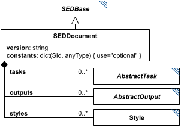

**Category:** core  
**Version:** v1  
**Schema:** [`schema.json`](specsheets/core/SEDDocument/v1.0.0/schema.json)

##### What it does

A SED2 document is the root object of a SED2 file. It has one required child, `version` (a string, of the form `v#.#.#` - e.g. `v1.0.0` - naming the document format version this document was written against, see Design.md's Versioning section), and four optional dictionary children: `constants`, `tasks`, `outputs`, and `styles`.

`constants` is simply a dictionary of ids associated with data, centrally located so they can be referenced and changed in one place. `tasks` is a dictionary of `AbstractTask`-derived objects describing *how to do things*; `outputs` is a dictionary of `AbstractOutput`-derived objects describing *how to organize results*. `styles` is a dictionary of `Style` objects (used by plots; the Style class itself is still a placeholder - see its own Data Sheet). In every dictionary, the key is the element's id and the value is the element itself.

**Chronological organization.** No Task nor Output may rely on input from a later Task: a document can always be executed by walking `tasks` then `outputs` in file order. More sophisticated interpreters may instead distribute Tasks across parallel workers by following the DAG formed by input/output references. When a Repeat (Scatter/Loop/ParameterScan) defines child subTasks, those children follow the same ordering rule among themselves.

**Abstraction.** SED2 resembles a workflow language, but it describes general, abstract tasks rather than specific implementations: instead of a shell command like `ls -asF`, SED2 would describe a 'list the contents of a directory' task with an input directory, a list-of-strings output, and parameters indicating whether to include sizes and file/directory type.

##### Attributes

All classes additionally inherit the optional `name`, `description`, `notes`, and `annotations` fields from `SEDBase` - see [`core/SEDBase`](#sedbase).

| Attribute | Type | Required | Notes |
|---|---|---|---|
| `version` | string | yes | Document format version; must match `v#.#.#`. |
| `constants` | object (values: AnyValueOrRef) | no | Predefined constants. Keys are SIds; values may be any JSON value. |
| `tasks` | object (values: AbstractTask) | no | Tasks describe how to do things (simulations, calculations, imports, conversions, etc.). |
| `outputs` | object (values: AbstractOutput) | no | Outputs describe how to package results (reports, plots). |
| `styles` | object (values: Style) | no | Styles used by plots. Permissive placeholder; the formal Style spec is TBD. |

###### Attribute details

**`version`** (string, required) - The document format version this document was written against (e.g. `v1.0.0`), used to resolve which version directory each class in the document resolves to (see Design.md's Versioning section). Must match the pattern `v#.#.#`.

**`constants`** (object (values: AnyValueOrRef), optional) - Predefined constants. Keys are SIds; values may be any JSON value.

**`tasks`** (object (values: AbstractTask), optional) - Tasks describe how to do things (simulations, calculations, imports, conversions, etc.).

**`outputs`** (object (values: AbstractOutput), optional) - Outputs describe how to package results (reports, plots).

**`styles`** (object (values: Style), optional) - Styles used by plots. Permissive placeholder; the formal Style spec is TBD.


##### Outputs

The document itself is the top-level container and is not referenced from within itself; every reference within the document (`#tasks:...`, `#constants:...`, `#outputs:...` where relevant) resolves against this root object's `tasks`, `constants`, `outputs`, and `styles` dictionaries.

- `[id]`: **Invalid**
- `[id].model`: **Invalid**
- `[id].strings`: **Invalid**

(Any output suffix not listed above is invalid for this class.)

The document is the root container, not an addressable element - it is never referenced via `#tasks:`/`#outputs:` itself; everything else in the document is referenced against its own `tasks`/`constants`/`outputs`/`styles` dictionaries.

##### Validation Rules

**`SEDDocument-0000`** (error) - The element fails a JSON Schema constraint attributable to SEDDocument that does not match any other numbered rule. ([source](specsheets/core/SEDDocument/v1.0.0/validation/SEDDocument-0000.md))

> Catch-all rule for schema-pass failures attributable to SEDDocument (or a
> more specific descendant whose own class's failure location can't be
> resolved to any other numbered rule). See Design.md, Schema-Pass Errors.

**`SEDDocument-0001`** (error) - The version attribute of a SEDDocument is required. ([source](specsheets/core/SEDDocument/v1.0.0/validation/SEDDocument-0001.md))

> `version` is required.

**`SEDDocument-0002`** (error) - The version attribute of a SEDDocument must be a string. ([source](specsheets/core/SEDDocument/v1.0.0/validation/SEDDocument-0002.md))

> `version` is `string`: it must be a string.

**`SEDDocument-0003`** (error) - The version attribute of a SEDDocument must match the format v#.#.# (major.minor.patch). ([source](specsheets/core/SEDDocument/v1.0.0/validation/SEDDocument-0003.md))

> `version` must match the pattern `v#.#.#` (e.g. `v1.0.0`).

**`SEDDocument-0005`** (error) - The constants attribute of a SEDDocument must be an object whose values are AnyValueOrRef. ([source](specsheets/core/SEDDocument/v1.0.0/validation/SEDDocument-0005.md))

> `constants` is `object (values: AnyValueOrRef)`: it must be an object whose values are AnyValueOrRef.

**`SEDDocument-0006`** (error) - The tasks attribute of a SEDDocument must be an object whose values are AbstractTask. ([source](specsheets/core/SEDDocument/v1.0.0/validation/SEDDocument-0006.md))

> `tasks` is `object (values: AbstractTask)`: it must be an object whose values are AbstractTask.

**`SEDDocument-0007`** (error) - The outputs attribute of a SEDDocument must be an object whose values are AbstractOutput. ([source](specsheets/core/SEDDocument/v1.0.0/validation/SEDDocument-0007.md))

> `outputs` is `object (values: AbstractOutput)`: it must be an object whose values are AbstractOutput.

**`SEDDocument-0008`** (error) - The styles attribute of a SEDDocument must be an object whose values are Style. ([source](specsheets/core/SEDDocument/v1.0.0/validation/SEDDocument-0008.md))

> `styles` is `object (values: Style)`: it must be an object whose values are Style.

**`SEDDocument-0009`** (error) - For every namespace prefix used anywhere in the document, SEDDocument must declare a <prefix>@version attribute. ([source](specsheets/core/SEDDocument/v1.0.0/validation/SEDDocument-0009.md))

> Applies to registered and unregistered prefixes alike: 'used' means any
> attribute key or _type value of the form prefix@identifier, anywhere in the
> document. The <prefix>@version attribute itself does not count as a use.
> The version's format (v#.#.#) is a generated schema pattern for a registered
> prefix (see Design.md's Namespaces section); for an unregistered prefix,
> SEDDocument-0014 checks it by hand instead.

**`SEDDocument-0010`** (warning) - A <prefix>@version attribute should not be declared for a namespace the document never uses. ([source](specsheets/core/SEDDocument/v1.0.0/validation/SEDDocument-0010.md))

> Harmless but likely a leftover.

**`SEDDocument-0011`** (warning) - The version of a SEDDocument should not be newer than the newest document version this library knows. ([source](specsheets/core/SEDDocument/v1.0.0/validation/SEDDocument-0011.md))

> Version resolution picks the newest directory not greater than the
> document's version, so a v1.3.0 document silently validates against v1.2.x
> rules. This makes that visible.

**`SEDDocument-0012`** (error) - No JSON object in a SED2 document may contain the same key more than once. ([source](specsheets/core/SEDDocument/v1.0.0/validation/SEDDocument-0012.md))

> JSON parsers silently keep one copy of a duplicated key (usually the last),
> so a document with two tasks named sim1 would lose one without any error.
> Catching this needs a parser-level hook in each language rather than
> ordinary schema/tree-walk validation, since the duplicate is already gone
> by the time normal parsing completes: Python's object_pairs_hook,
> Jackson's STRICT_DUPLICATE_DETECTION (which throws and halts the parse,
> rather than collecting alongside other errors the way every other rule
> does), and a custom cursor-level handler for jsoncons in C++ (which has
> no built-in duplicate-key option).
>
> Decided not to implement detection for this rule in v1 - a genuinely
> custom, per-language parser-level detector isn't worth the engineering
> cost for what's expected to be a rare, hand-editing-only mistake. A
> document with a duplicate key silently keeps whichever value the
> underlying parser resolves to, with no error reported, in all three
> languages. Because of this, no fixture should chain this rule onto
> another rule's filename the way Testing otherwise allows - see Testing.

**`SEDDocument-0013`** (error) - A constant may only reference constants that appear before it in the constants dictionary. ([source](specsheets/core/SEDDocument/v1.0.0/validation/SEDDocument-0013.md))

> constants is described as coming before tasks, so a constant referencing a
> task would break file-order execution. Constants may only reference earlier
> constants, the same chronological principle AbstractTask-0003 applies to
> tasks.

**`SEDDocument-0014`** (error) - An unregistered namespace's <prefix>@version attribute must match the format v#.#.# (major.minor.patch). ([source](specsheets/core/SEDDocument/v1.0.0/validation/SEDDocument-0014.md))

> For a registered namespace this is already enforced as a generated schema
> pattern (see Design.md's Namespaces section) - the same mechanism as
> SEDDocument's own version attribute. An unregistered namespace has no such
> generated property, so nothing in the schema constrains its <prefix>@version
> attribute's shape; this rule closes that gap by hand, so every
> <prefix>@version in the document matches v#.#.# whether or not its
> namespace is registered.

#### Style

*Source: [specsheets/core/Style/v1.0.0/description.md](specsheets/core/Style/v1.0.0/description.md)*

*(No UML diagram exists yet for `Style` in the source spec - see [`DIAGRAM-PENDING.md`](specsheets/core/Style/v1.0.0/DIAGRAM-PENDING.md).)*

**Category:** core  
**Version:** v1  
**Schema:** [`schema.json`](specsheets/core/Style/v1.0.0/schema.json)

##### What it does

`styles` is one of the four optional top-level dictionaries of a SED2 document, referenced from `Curve`/`Surface`/`Axis` children (via their `style` attribute) to control presentation.

**This class is not yet specified.** The current spec text says only: *"To be filled in; should be a straight copy of SED-ML's Style class."* The combined schema currently treats `Style` as a permissive placeholder (`{"type": "object"}`) accepting any object.

##### Attributes

All classes additionally inherit the optional `name`, `description`, `notes`, and `annotations` fields from `SEDBase` - see [`core/SEDBase`](#sedbase).

_This class defines no additional attributes beyond `SEDBaseFields`._

##### Outputs

- `[id]`: **Invalid**
- `[id].model`: **Invalid**
- `[id].strings`: **Invalid**

(Any output suffix not listed above is invalid for this class.)

`Style` is an unspecified placeholder (see above) - how, or whether, a `Style` entry is referenced at all is not yet defined in the spec.

##### Open issues / notes

- Style is a placeholder in both the prose spec and the schema. Once SED-ML's Style class is ported over, this Data Sheet (schema, diagram, and description) needs a full rewrite - flagging for your review rather than inventing a design here.

##### Validation Rules

**`Style-0000`** (error) - The element fails a JSON Schema constraint attributable to Style that does not match any other numbered rule. ([source](specsheets/core/Style/v1.0.0/validation/Style-0000.md))

> Catch-all rule for schema-pass failures attributable to Style (or a
> more specific descendant whose own class's failure location can't be
> resolved to any other numbered rule). See Design.md, Schema-Pass Errors.

#### Types

*Source: [specsheets/core/Types/v1.0.0/description.md](specsheets/core/Types/v1.0.0/description.md)*

*(This page bundles the shared primitive and reference-helper types; it has no single UML class box of its own - see `core/SEDBase` for the base class every element derives from.)*

**Category:** core  
**Schema:** [`schema.json`](specsheets/core/Types/v1.0.0/schema.json)

##### What this covers

Every value in a SED2 document is either a literal value or a *reference* to a value elsewhere in the document. Anywhere the spec calls for, say, a `double`, that slot may instead hold a string reference such as `"#tasks:sim1.model['S1']"` that resolves to a double at read time. This page collects the primitive and reference-helper types used throughout the rest of the spec; it has no UML class of its own.

**Base value kinds.** Numbers (integers, doubles, etc.), Booleans, Strings, AnnotatedData (n-dimensional matrices of values with labeled coordinates and dimensions, modeled after `xarray.DataArray`), Models (a set of values/state plus the rules for how those values change), and Maps (a 1:1 mapping of one type to another, e.g. `{SId: SIdRef}`).

**Special number rules.** The strings `"nan"`, `"inf"`, and `"-inf"` (any capitalization) represent NaN, +Infinity and -Infinity respectively when found among numbers; a mix of strings and numbers in the same 1D AnnotatedData is an error unless every string is one of these three. Booleans may be parsed numerically as 1 or 0.

**References.** A reference is a `#`-prefixed, colon-delimited path following the document's hierarchical structure (e.g. `#tasks:sim1`, `#tasks:sim1.loc[0]`, `#tasks:sim1.model["S1"]`, `#tasks:data_import["S1"].loc[3]`, `#constants:time_end`). A task's own id always has an implicit `.model` accessor when it exports a model, and a `.strings` accessor when it exports a list of strings. AnnotatedData supports positional indexing (`data[0, :]`), `.loc` (positional + coordinate label), `.isel` (dimension name + integer label), and `.sel` (dimension name + coordinate label), following the equivalent xarray/pandas/numpy conventions.

##### Attributes

Not attributes of a class - `Types` instead bundles the following primitive/reference-helper `$defs`, each usable via `$ref` from any other Data Sheet's schema:

| Name | Description |
|---|---|
| `SId` | An identifier: starts with an English letter or underscore, may be followed by alphanumerics or underscores. |
| `SIdRef` | A reference to another SED element. Always starts with '#'. May include a colon-delimited path, dot-accessors (e.g. .model, .strings, .aggregates), and indexing ([n], [-n], ['label'], [a:b]). |
| `KISAOId` | A KiSAO identifier of the form KISAO:nnnnnnn (7 digits). |
| `URI` | A URI string. Can be absolute or relative. |
| `URN` | A URN string. |
| `MarkdownString` | A CommonMark-formatted markdown string. |
| `NumberWithNaN` | A number, Boolean, or one of the special strings nan / inf / -inf (case-insensitive), which represent NaN, +Infinity, and -Infinity respectively. |
| `ScaleType` | One of `"linear"` or `"log10"`. |
| `CurveType` | One of `"points"`, `"bar"`, `"barStacked"`, `"horizontalBar"`, `"horizontalBarStacked"`, or `"shadedArea"`. |
| `SurfaceType` | One of `"parametricCurve"`, `"surfaceMesh"`, `"surfaceContour"`, `"contour"`, `"heatMap"`, `"stackedCurves"`, or `"bar"`. |
| `Qualifier` | A 'namespace:term' qualifier string (e.g., 'bqbiol:hasPart', 'dc:title'). |
| `StringOrRef` | Any string. Note: any string starting with '#' is treated as an SIdRef. |
| `NumberOrRef` |  |
| `IntegerOrRef` |  |
| `PositiveIntegerOrRef` |  |
| `NonNegativeIntegerOrRef` |  |
| `PositiveDoubleOrRef` |  |
| `BooleanOrRef` |  |
| `URIOrRef` |  |
| `URNOrRef` |  |
| `KISAOIdOrRef` |  |
| `ScaleTypeOrRef` |  |
| `ListOfStringsOrRef` |  |
| `ListOfNumbersOrRef` |  |
| `ListOfAnyOrRef` |  |
| `AnyValueOrRef` | Any JSON value. Per the SED2 spec, an SIdRef string may substitute for any value. |

###### Attribute details

**`SId`** - An identifier: starts with an English letter or underscore, may be followed by alphanumerics or underscores.

**`SIdRef`** - A reference to another SED element. Always starts with '#'. May include a colon-delimited path, dot-accessors (e.g. .model, .strings, .aggregates), and indexing ([n], [-n], ['label'], [a:b]).

**`KISAOId`** - A KiSAO identifier of the form KISAO:nnnnnnn (7 digits).

**`URI`** - A URI string. Can be absolute or relative.

**`URN`** - A URN string.

**`MarkdownString`** - A CommonMark-formatted markdown string.

**`NumberWithNaN`** - A number, Boolean, or one of the special strings nan / inf / -inf (case-insensitive), which represent NaN, +Infinity, and -Infinity respectively.

**`ScaleType`** - One of `"linear"` or `"log10"`.

**`CurveType`** - One of `"points"`, `"bar"`, `"barStacked"`, `"horizontalBar"`, `"horizontalBarStacked"`, or `"shadedArea"`.

**`SurfaceType`** - One of `"parametricCurve"`, `"surfaceMesh"`, `"surfaceContour"`, `"contour"`, `"heatMap"`, `"stackedCurves"`, or `"bar"`.

**`Qualifier`** - A 'namespace:term' qualifier string (e.g., 'bqbiol:hasPart', 'dc:title').

**`StringOrRef`** - Any string. Note: any string starting with '#' is treated as an SIdRef.

**`NumberOrRef`** - _(no description yet - placeholder, needs to be filled in)_

**`IntegerOrRef`** - _(no description yet - placeholder, needs to be filled in)_

**`PositiveIntegerOrRef`** - _(no description yet - placeholder, needs to be filled in)_

**`NonNegativeIntegerOrRef`** - _(no description yet - placeholder, needs to be filled in)_

**`PositiveDoubleOrRef`** - _(no description yet - placeholder, needs to be filled in)_

**`BooleanOrRef`** - _(no description yet - placeholder, needs to be filled in)_

**`URIOrRef`** - _(no description yet - placeholder, needs to be filled in)_

**`URNOrRef`** - _(no description yet - placeholder, needs to be filled in)_

**`KISAOIdOrRef`** - _(no description yet - placeholder, needs to be filled in)_

**`ScaleTypeOrRef`** - _(no description yet - placeholder, needs to be filled in)_

**`ListOfStringsOrRef`** - _(no description yet - placeholder, needs to be filled in)_

**`ListOfNumbersOrRef`** - _(no description yet - placeholder, needs to be filled in)_

**`ListOfAnyOrRef`** - _(no description yet - placeholder, needs to be filled in)_

**`AnyValueOrRef`** - Any JSON value. Per the SED2 spec, an SIdRef string may substitute for any value.


##### Outputs

Not applicable - `Types` bundles primitive/reference-helper definitions; it is not itself an element with an id.

##### Validation Rules

**`Types-0001`** (error) - A math expression must be a well-formed expression under the SED2 infix grammar. ([source](specsheets/core/Types/v1.0.0/validation/Types-0001.md))

> The grammar is the one in Design.md's Math section (math.g4). {parse-message}
> is the parser's own error text. When the math attribute is itself a
> reference, this and the following math rules (Types-0002 through Types-0004)
> apply only if the reference resolves statically to a string constant.
>
> Lives on Types, alongside StringOrRef (the schema type every math-bearing
> attribute uses), rather than on Calculation: Calculation's math is the only
> field that uses these rules today, but Design.md's Classes section notes
> that may not stay true, and a shared home avoids either duplicating these
> four rules per class or attaching Calculation-specific numbering to a
> generic grammar concern.

**`Types-0002`** (error) - Every function called in a math expression must be defined in the predefined-functions registry. ([source](specsheets/core/Types/v1.0.0/validation/Types-0002.md))

> The registry is schema/predefined-functions.json: the SBML L3 Core MathML
> subset, the 12 distrib functions, and SED2's own additions (currently sum).
> A namespace cannot add functions today; if that is wanted, the registry needs
> a namespace extension point.

**`Types-0003`** (error) - Every function called in a math expression must be given a number of arguments its registry entry allows. ([source](specsheets/core/Types/v1.0.0/validation/Types-0003.md))

> Arity comes from the function's registry entry, including the distrib
> functions' alternative argument counts (e.g. normal takes 2 or 4).

**`Types-0004`** (error) - Every bare identifier in a math expression must be a predefined constant. ([source](specsheets/core/Types/v1.0.0/validation/Types-0004.md))

> SED2 math has no free variables: anything that is not a number, a predefined
> constant (pi, exponentiale, true, false, notanumber, infinity), or a function
> name must be written as a #reference. This catches the common mistake of
> writing 'S1' instead of "#tasks:sim1['S1']".

---

### Task Classes

#### AbstractODESimulation

*Source: [specsheets/tasks/AbstractODESimulation/v1.0.0/description.md](specsheets/tasks/AbstractODESimulation/v1.0.0/description.md)*

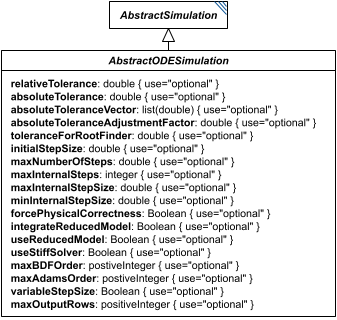

**Category:** tasks  
**Version:** v1  
**Schema:** [`schema.json`](specsheets/tasks/AbstractODESimulation/v1.0.0/schema.json)  

##### What it does

`AbstractODESimulation` is a schema-only mixin (composed via `allOf`, not instantiated directly, no `_type` or diagram box of its own beyond the one shown here) contributing ODE-solver tuning fields shared by `ExplicitODESimulation`, `BoundedODESimulation`, and `OneStepODESimulation`, on top of what `AbstractSimulation` already provides. Every field here is optional - a solver is free to use its own defaults for anything not set.

##### Attributes

All classes additionally inherit the optional `name`, `description`, `notes`, and `annotations` fields from `SEDBase` - see [`core/SEDBase`](#sedbase).

| Attribute | Type | Required | Notes |
|---|---|---|---|
| `relativeTolerance` | NumberOrRef | no |  |
| `absoluteTolerance` | NumberOrRef | no |  |
| `absoluteToleranceVector` | ListOfNumbersOrRef | no |  |
| `absoluteToleranceAdjustmentFactor` | NumberOrRef | no |  |
| `toleranceForRootFinder` | NumberOrRef | no |  |
| `initialStepSize` | NumberOrRef | no |  |
| `maxNumberOfSteps` | NumberOrRef | no |  |
| `maxInternalSteps` | IntegerOrRef | no |  |
| `maxInternalStepSize` | NumberOrRef | no |  |
| `minInternalStepSize` | NumberOrRef | no |  |
| `forcePhysicalCorrectness` | BooleanOrRef | no |  |
| `integrateReducedModel` | BooleanOrRef | no |  |
| `useReducedModel` | BooleanOrRef | no |  |
| `useStiffSolver` | BooleanOrRef | no |  |
| `maxBDForder` | PositiveIntegerOrRef | no |  |
| `maxAdamsOrder` | PositiveIntegerOrRef | no |  |
| `variableStepSize` | BooleanOrRef | no |  |
| `maxOutputRows` | PositiveIntegerOrRef | no |  |

###### Attribute details

**`relativeTolerance`** (NumberOrRef, optional) - _(no description yet - placeholder, needs to be filled in)_

**`absoluteTolerance`** (NumberOrRef, optional) - _(no description yet - placeholder, needs to be filled in)_

**`absoluteToleranceVector`** (ListOfNumbersOrRef, optional) - _(no description yet - placeholder, needs to be filled in)_

**`absoluteToleranceAdjustmentFactor`** (NumberOrRef, optional) - _(no description yet - placeholder, needs to be filled in)_

**`toleranceForRootFinder`** (NumberOrRef, optional) - _(no description yet - placeholder, needs to be filled in)_

**`initialStepSize`** (NumberOrRef, optional) - _(no description yet - placeholder, needs to be filled in)_

**`maxNumberOfSteps`** (NumberOrRef, optional) - _(no description yet - placeholder, needs to be filled in)_

**`maxInternalSteps`** (IntegerOrRef, optional) - _(no description yet - placeholder, needs to be filled in)_

**`maxInternalStepSize`** (NumberOrRef, optional) - _(no description yet - placeholder, needs to be filled in)_

**`minInternalStepSize`** (NumberOrRef, optional) - _(no description yet - placeholder, needs to be filled in)_

**`forcePhysicalCorrectness`** (BooleanOrRef, optional) - _(no description yet - placeholder, needs to be filled in)_

**`integrateReducedModel`** (BooleanOrRef, optional) - _(no description yet - placeholder, needs to be filled in)_

**`useReducedModel`** (BooleanOrRef, optional) - _(no description yet - placeholder, needs to be filled in)_

**`useStiffSolver`** (BooleanOrRef, optional) - _(no description yet - placeholder, needs to be filled in)_

**`maxBDForder`** (PositiveIntegerOrRef, optional) - _(no description yet - placeholder, needs to be filled in)_

**`maxAdamsOrder`** (PositiveIntegerOrRef, optional) - _(no description yet - placeholder, needs to be filled in)_

**`variableStepSize`** (BooleanOrRef, optional) - _(no description yet - placeholder, needs to be filled in)_

**`maxOutputRows`** (PositiveIntegerOrRef, optional) - _(no description yet - placeholder, needs to be filled in)_


##### Outputs

There is no output rule for `AbstractODESimulation` itself - see `ExplicitODESimulation`, `BoundedODESimulation`, and `OneStepODESimulation` for their concrete output shapes.

##### Validation Rules

**`AbstractODESimulation-0000`** (error) - The element fails a JSON Schema constraint attributable to AbstractODESimulation that does not match any other numbered rule. ([source](specsheets/tasks/AbstractODESimulation/v1.0.0/validation/AbstractODESimulation-0000.md))

> Catch-all rule for schema-pass failures attributable to AbstractODESimulation (or a
> more specific descendant whose own class's failure location can't be
> resolved to any other numbered rule). See Design.md, Schema-Pass Errors.

**`AbstractODESimulation-0001`** (error) - When the value of relativeTolerance of an AbstractODESimulation is provided directly, it must be a number. ([source](specsheets/tasks/AbstractODESimulation/v1.0.0/validation/AbstractODESimulation-0001.md))

> `relativeTolerance` is `NumberOrRef`: the value, when not a reference, must be a number.

**`AbstractODESimulation-0002`** (error) - When the value of relativeTolerance of an AbstractODESimulation is a reference, it must be a reference to a number. ([source](specsheets/tasks/AbstractODESimulation/v1.0.0/validation/AbstractODESimulation-0002.md))

> `relativeTolerance` is `NumberOrRef`: when the value is a reference, it must resolve to a number.

**`AbstractODESimulation-0003`** (error) - When the value of absoluteTolerance of an AbstractODESimulation is provided directly, it must be a number. ([source](specsheets/tasks/AbstractODESimulation/v1.0.0/validation/AbstractODESimulation-0003.md))

> `absoluteTolerance` is `NumberOrRef`: the value, when not a reference, must be a number.

**`AbstractODESimulation-0004`** (error) - When the value of absoluteTolerance of an AbstractODESimulation is a reference, it must be a reference to a number. ([source](specsheets/tasks/AbstractODESimulation/v1.0.0/validation/AbstractODESimulation-0004.md))

> `absoluteTolerance` is `NumberOrRef`: when the value is a reference, it must resolve to a number.

**`AbstractODESimulation-0005`** (error) - When the value of absoluteToleranceVector of an AbstractODESimulation is provided directly, it must be an array of numbers. ([source](specsheets/tasks/AbstractODESimulation/v1.0.0/validation/AbstractODESimulation-0005.md))

> `absoluteToleranceVector` is `ListOfNumbersOrRef`: the value, when not a reference, must be an array of numbers.

**`AbstractODESimulation-0006`** (error) - When the value of absoluteToleranceVector of an AbstractODESimulation is a reference, it must be a reference to an array of numbers. ([source](specsheets/tasks/AbstractODESimulation/v1.0.0/validation/AbstractODESimulation-0006.md))

> `absoluteToleranceVector` is `ListOfNumbersOrRef`: when the value is a reference, it must resolve to an array of numbers.

**`AbstractODESimulation-0007`** (error) - When the value of absoluteToleranceAdjustmentFactor of an AbstractODESimulation is provided directly, it must be a number. ([source](specsheets/tasks/AbstractODESimulation/v1.0.0/validation/AbstractODESimulation-0007.md))

> `absoluteToleranceAdjustmentFactor` is `NumberOrRef`: the value, when not a reference, must be a number.

**`AbstractODESimulation-0008`** (error) - When the value of absoluteToleranceAdjustmentFactor of an AbstractODESimulation is a reference, it must be a reference to a number. ([source](specsheets/tasks/AbstractODESimulation/v1.0.0/validation/AbstractODESimulation-0008.md))

> `absoluteToleranceAdjustmentFactor` is `NumberOrRef`: when the value is a reference, it must resolve to a number.

**`AbstractODESimulation-0009`** (error) - When the value of toleranceForRootFinder of an AbstractODESimulation is provided directly, it must be a number. ([source](specsheets/tasks/AbstractODESimulation/v1.0.0/validation/AbstractODESimulation-0009.md))

> `toleranceForRootFinder` is `NumberOrRef`: the value, when not a reference, must be a number.

**`AbstractODESimulation-0010`** (error) - When the value of toleranceForRootFinder of an AbstractODESimulation is a reference, it must be a reference to a number. ([source](specsheets/tasks/AbstractODESimulation/v1.0.0/validation/AbstractODESimulation-0010.md))

> `toleranceForRootFinder` is `NumberOrRef`: when the value is a reference, it must resolve to a number.

**`AbstractODESimulation-0011`** (error) - When the value of initialStepSize of an AbstractODESimulation is provided directly, it must be a number. ([source](specsheets/tasks/AbstractODESimulation/v1.0.0/validation/AbstractODESimulation-0011.md))

> `initialStepSize` is `NumberOrRef`: the value, when not a reference, must be a number.

**`AbstractODESimulation-0012`** (error) - When the value of initialStepSize of an AbstractODESimulation is a reference, it must be a reference to a number. ([source](specsheets/tasks/AbstractODESimulation/v1.0.0/validation/AbstractODESimulation-0012.md))

> `initialStepSize` is `NumberOrRef`: when the value is a reference, it must resolve to a number.

**`AbstractODESimulation-0013`** (error) - When the value of maxNumberOfSteps of an AbstractODESimulation is provided directly, it must be a number. ([source](specsheets/tasks/AbstractODESimulation/v1.0.0/validation/AbstractODESimulation-0013.md))

> `maxNumberOfSteps` is `NumberOrRef`: the value, when not a reference, must be a number.

**`AbstractODESimulation-0014`** (error) - When the value of maxNumberOfSteps of an AbstractODESimulation is a reference, it must be a reference to a number. ([source](specsheets/tasks/AbstractODESimulation/v1.0.0/validation/AbstractODESimulation-0014.md))

> `maxNumberOfSteps` is `NumberOrRef`: when the value is a reference, it must resolve to a number.

**`AbstractODESimulation-0015`** (error) - When the value of maxInternalSteps of an AbstractODESimulation is provided directly, it must be an integer. ([source](specsheets/tasks/AbstractODESimulation/v1.0.0/validation/AbstractODESimulation-0015.md))

> `maxInternalSteps` is `IntegerOrRef`: the value, when not a reference, must be an integer.

**`AbstractODESimulation-0016`** (error) - When the value of maxInternalSteps of an AbstractODESimulation is a reference, it must be a reference to an integer. ([source](specsheets/tasks/AbstractODESimulation/v1.0.0/validation/AbstractODESimulation-0016.md))

> `maxInternalSteps` is `IntegerOrRef`: when the value is a reference, it must resolve to an integer.

**`AbstractODESimulation-0017`** (error) - When the value of maxInternalStepSize of an AbstractODESimulation is provided directly, it must be a number. ([source](specsheets/tasks/AbstractODESimulation/v1.0.0/validation/AbstractODESimulation-0017.md))

> `maxInternalStepSize` is `NumberOrRef`: the value, when not a reference, must be a number.

**`AbstractODESimulation-0018`** (error) - When the value of maxInternalStepSize of an AbstractODESimulation is a reference, it must be a reference to a number. ([source](specsheets/tasks/AbstractODESimulation/v1.0.0/validation/AbstractODESimulation-0018.md))

> `maxInternalStepSize` is `NumberOrRef`: when the value is a reference, it must resolve to a number.

**`AbstractODESimulation-0019`** (error) - When the value of minInternalStepSize of an AbstractODESimulation is provided directly, it must be a number. ([source](specsheets/tasks/AbstractODESimulation/v1.0.0/validation/AbstractODESimulation-0019.md))

> `minInternalStepSize` is `NumberOrRef`: the value, when not a reference, must be a number.

**`AbstractODESimulation-0020`** (error) - When the value of minInternalStepSize of an AbstractODESimulation is a reference, it must be a reference to a number. ([source](specsheets/tasks/AbstractODESimulation/v1.0.0/validation/AbstractODESimulation-0020.md))

> `minInternalStepSize` is `NumberOrRef`: when the value is a reference, it must resolve to a number.

**`AbstractODESimulation-0021`** (error) - When the value of forcePhysicalCorrectness of an AbstractODESimulation is provided directly, it must be a boolean. ([source](specsheets/tasks/AbstractODESimulation/v1.0.0/validation/AbstractODESimulation-0021.md))

> `forcePhysicalCorrectness` is `BooleanOrRef`: the value, when not a reference, must be a boolean.

**`AbstractODESimulation-0022`** (error) - When the value of forcePhysicalCorrectness of an AbstractODESimulation is a reference, it must be a reference to a boolean. ([source](specsheets/tasks/AbstractODESimulation/v1.0.0/validation/AbstractODESimulation-0022.md))

> `forcePhysicalCorrectness` is `BooleanOrRef`: when the value is a reference, it must resolve to a boolean.

**`AbstractODESimulation-0023`** (error) - When the value of integrateReducedModel of an AbstractODESimulation is provided directly, it must be a boolean. ([source](specsheets/tasks/AbstractODESimulation/v1.0.0/validation/AbstractODESimulation-0023.md))

> `integrateReducedModel` is `BooleanOrRef`: the value, when not a reference, must be a boolean.

**`AbstractODESimulation-0024`** (error) - When the value of integrateReducedModel of an AbstractODESimulation is a reference, it must be a reference to a boolean. ([source](specsheets/tasks/AbstractODESimulation/v1.0.0/validation/AbstractODESimulation-0024.md))

> `integrateReducedModel` is `BooleanOrRef`: when the value is a reference, it must resolve to a boolean.

**`AbstractODESimulation-0025`** (error) - When the value of useReducedModel of an AbstractODESimulation is provided directly, it must be a boolean. ([source](specsheets/tasks/AbstractODESimulation/v1.0.0/validation/AbstractODESimulation-0025.md))

> `useReducedModel` is `BooleanOrRef`: the value, when not a reference, must be a boolean.

**`AbstractODESimulation-0026`** (error) - When the value of useReducedModel of an AbstractODESimulation is a reference, it must be a reference to a boolean. ([source](specsheets/tasks/AbstractODESimulation/v1.0.0/validation/AbstractODESimulation-0026.md))

> `useReducedModel` is `BooleanOrRef`: when the value is a reference, it must resolve to a boolean.

**`AbstractODESimulation-0027`** (error) - When the value of useStiffSolver of an AbstractODESimulation is provided directly, it must be a boolean. ([source](specsheets/tasks/AbstractODESimulation/v1.0.0/validation/AbstractODESimulation-0027.md))

> `useStiffSolver` is `BooleanOrRef`: the value, when not a reference, must be a boolean.

**`AbstractODESimulation-0028`** (error) - When the value of useStiffSolver of an AbstractODESimulation is a reference, it must be a reference to a boolean. ([source](specsheets/tasks/AbstractODESimulation/v1.0.0/validation/AbstractODESimulation-0028.md))

> `useStiffSolver` is `BooleanOrRef`: when the value is a reference, it must resolve to a boolean.

**`AbstractODESimulation-0029`** (error) - When the value of maxBDForder of an AbstractODESimulation is provided directly, it must be a positive integer. ([source](specsheets/tasks/AbstractODESimulation/v1.0.0/validation/AbstractODESimulation-0029.md))

> `maxBDForder` is `PositiveIntegerOrRef`: the value, when not a reference, must be a positive integer.

**`AbstractODESimulation-0030`** (error) - When the value of maxBDForder of an AbstractODESimulation is a reference, it must be a reference to a positive integer. ([source](specsheets/tasks/AbstractODESimulation/v1.0.0/validation/AbstractODESimulation-0030.md))

> `maxBDForder` is `PositiveIntegerOrRef`: when the value is a reference, it must resolve to a positive integer.

**`AbstractODESimulation-0031`** (error) - When the value of maxAdamsOrder of an AbstractODESimulation is provided directly, it must be a positive integer. ([source](specsheets/tasks/AbstractODESimulation/v1.0.0/validation/AbstractODESimulation-0031.md))

> `maxAdamsOrder` is `PositiveIntegerOrRef`: the value, when not a reference, must be a positive integer.

**`AbstractODESimulation-0032`** (error) - When the value of maxAdamsOrder of an AbstractODESimulation is a reference, it must be a reference to a positive integer. ([source](specsheets/tasks/AbstractODESimulation/v1.0.0/validation/AbstractODESimulation-0032.md))

> `maxAdamsOrder` is `PositiveIntegerOrRef`: when the value is a reference, it must resolve to a positive integer.

**`AbstractODESimulation-0033`** (error) - When the value of variableStepSize of an AbstractODESimulation is provided directly, it must be a boolean. ([source](specsheets/tasks/AbstractODESimulation/v1.0.0/validation/AbstractODESimulation-0033.md))

> `variableStepSize` is `BooleanOrRef`: the value, when not a reference, must be a boolean.

**`AbstractODESimulation-0034`** (error) - When the value of variableStepSize of an AbstractODESimulation is a reference, it must be a reference to a boolean. ([source](specsheets/tasks/AbstractODESimulation/v1.0.0/validation/AbstractODESimulation-0034.md))

> `variableStepSize` is `BooleanOrRef`: when the value is a reference, it must resolve to a boolean.

**`AbstractODESimulation-0035`** (error) - When the value of maxOutputRows of an AbstractODESimulation is provided directly, it must be a positive integer. ([source](specsheets/tasks/AbstractODESimulation/v1.0.0/validation/AbstractODESimulation-0035.md))

> `maxOutputRows` is `PositiveIntegerOrRef`: the value, when not a reference, must be a positive integer.

**`AbstractODESimulation-0036`** (error) - When the value of maxOutputRows of an AbstractODESimulation is a reference, it must be a reference to a positive integer. ([source](specsheets/tasks/AbstractODESimulation/v1.0.0/validation/AbstractODESimulation-0036.md))

> `maxOutputRows` is `PositiveIntegerOrRef`: when the value is a reference, it must resolve to a positive integer.

#### AbstractSimulation

*Source: [specsheets/tasks/AbstractSimulation/v1.0.0/description.md](specsheets/tasks/AbstractSimulation/v1.0.0/description.md)*

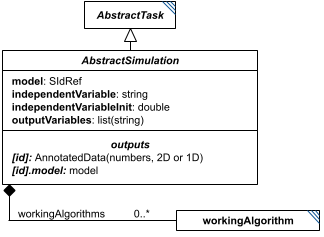

**Category:** tasks  
**Version:** v1  
**Schema:** [`schema.json`](specsheets/tasks/AbstractSimulation/v1.0.0/schema.json)  

##### What it does

`AbstractSimulation` is a schema-only mixin (composed via `allOf`, not instantiated directly, no `_type` or diagram box of its own beyond the one shown here) contributing the fields shared by every ODE or stochastic simulation task, by way of `AbstractODESimulation` and `AbstractStochasticSimulation`. It replaces the earlier `SimulationCommon`, and (unlike `SimulationCommon`) is no longer used by `SteadyState` or `FluxBalanceAnalysis`, which now declare their own fields directly (including their own `workingAlgorithms` lists).

Beyond the fields it inherits from `AbstractTask`, it contributes `model`, `independentVariable`, `independentVariableInit`, `outputVariables`, and `workingAlgorithms` - a list of `WorkingAlgorithm` entries describing the algorithm(s) used internally by the simulation.

##### Attributes

All classes additionally inherit the optional `name`, `description`, `notes`, and `annotations` fields from `SEDBase` - see [`core/SEDBase`](#sedbase).

| Attribute | Type | Required | Notes |
|---|---|---|---|
| `model` | SIdRef | no |  |
| `independentVariable` | StringOrRef | no |  |
| `independentVariableInit` | NumberOrRef | no |  |
| `outputVariables` | ListOfStringsOrRef | no |  |
| `workingAlgorithms` | array of WorkingAlgorithm | no |  |

###### Attribute details

**`model`** (SIdRef, required by every concrete subclass) - _(no description yet - placeholder, needs to be filled in)_

**`independentVariable`** (StringOrRef, required by every concrete subclass) - _(no description yet - placeholder, needs to be filled in)_

**`independentVariableInit`** (NumberOrRef, optional) - _(no description yet - placeholder, needs to be filled in)_

**`outputVariables`** (ListOfStringsOrRef, required by every concrete subclass) - _(no description yet - placeholder, needs to be filled in)_

**`workingAlgorithms`** (array of WorkingAlgorithm, optional) - _(no description yet - placeholder, needs to be filled in)_


##### Outputs

There is no single output rule for `AbstractSimulation` itself - see each concrete subclass's Data Sheet. As a family: `[id]` yields an `AnnotatedData` of `outputVariables` (2D for `ExplicitODESimulation`/`BoundedODESimulation`/`ExplicitStochasticSimulation`/`BoundedStochasticSimulation`, 1D for the `OneStep*` variants), and `[id].model` always yields the model's end-of-run state (no longer conditional on an `outputModel` flag - that flag has been removed).

`AbstractSimulation` states the general framework only - see each concrete subclass's own Data Sheet for its exact output shape.

##### Validation Rules

**`AbstractSimulation-0000`** (error) - The element fails a JSON Schema constraint attributable to AbstractSimulation that does not match any other numbered rule. ([source](specsheets/tasks/AbstractSimulation/v1.0.0/validation/AbstractSimulation-0000.md))

> Catch-all rule for schema-pass failures attributable to AbstractSimulation (or a
> more specific descendant whose own class's failure location can't be
> resolved to any other numbered rule). See Design.md, Schema-Pass Errors.

**`AbstractSimulation-0001`** (error) - The model attribute of an AbstractSimulation, if present, must be a reference (a string starting with '#'). ([source](specsheets/tasks/AbstractSimulation/v1.0.0/validation/AbstractSimulation-0001.md))

> `model` is defined as `SIdRef` in AbstractSimulation - always a reference, never a literal value.

**`AbstractSimulation-0002`** (error) - When the value of independentVariable of an AbstractSimulation is provided directly, it must be a string. ([source](specsheets/tasks/AbstractSimulation/v1.0.0/validation/AbstractSimulation-0002.md))

> `independentVariable` is `StringOrRef` in AbstractSimulation: the value, when not a reference, must be a string.

**`AbstractSimulation-0003`** (error) - When the value of independentVariable of an AbstractSimulation is a reference, it must be a reference to a string. ([source](specsheets/tasks/AbstractSimulation/v1.0.0/validation/AbstractSimulation-0003.md))

> `independentVariable` is `StringOrRef` in AbstractSimulation: when the value is a reference, it must resolve to a string.

**`AbstractSimulation-0004`** (error) - When the value of independentVariableInit of an AbstractSimulation is provided directly, it must be a number. ([source](specsheets/tasks/AbstractSimulation/v1.0.0/validation/AbstractSimulation-0004.md))

> `independentVariableInit` is `NumberOrRef` in AbstractSimulation: the value, when not a reference, must be a number.

**`AbstractSimulation-0005`** (error) - When the value of independentVariableInit of an AbstractSimulation is a reference, it must be a reference to a number. ([source](specsheets/tasks/AbstractSimulation/v1.0.0/validation/AbstractSimulation-0005.md))

> `independentVariableInit` is `NumberOrRef` in AbstractSimulation: when the value is a reference, it must resolve to a number.

**`AbstractSimulation-0006`** (error) - When the value of outputVariables of an AbstractSimulation is provided directly, it must be an array of strings. ([source](specsheets/tasks/AbstractSimulation/v1.0.0/validation/AbstractSimulation-0006.md))

> `outputVariables` is `ListOfStringsOrRef` in AbstractSimulation: the value, when not a reference, must be an array of strings.

**`AbstractSimulation-0007`** (error) - When the value of outputVariables of an AbstractSimulation is a reference, it must be a reference to an array of strings. ([source](specsheets/tasks/AbstractSimulation/v1.0.0/validation/AbstractSimulation-0007.md))

> `outputVariables` is `ListOfStringsOrRef` in AbstractSimulation: when the value is a reference, it must resolve to an array of strings.

**`AbstractSimulation-0008`** (error) - The workingAlgorithms attribute of an AbstractSimulation, if present, must be an array of WorkingAlgorithm objects. ([source](specsheets/tasks/AbstractSimulation/v1.0.0/validation/AbstractSimulation-0008.md))

> `workingAlgorithms` is optional; when present, each entry must be a `WorkingAlgorithm` object.

#### AbstractStochasticSimulation

*Source: [specsheets/tasks/AbstractStochasticSimulation/v1.0.0/description.md](specsheets/tasks/AbstractStochasticSimulation/v1.0.0/description.md)*

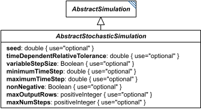

**Category:** tasks  
**Version:** v1  
**Schema:** [`schema.json`](specsheets/tasks/AbstractStochasticSimulation/v1.0.0/schema.json)  

##### What it does

`AbstractStochasticSimulation` is a schema-only mixin (composed via `allOf`, not instantiated directly, no `_type` or diagram box of its own beyond the one shown here) contributing stochastic-solver tuning fields shared by `ExplicitStochasticSimulation`, `BoundedStochasticSimulation`, and `OneStepStochasticSimulation`, on top of what `AbstractSimulation` already provides. Every field here is optional - a solver is free to use its own defaults for anything not set.

##### Attributes

All classes additionally inherit the optional `name`, `description`, `notes`, and `annotations` fields from `SEDBase` - see [`core/SEDBase`](#sedbase).

| Attribute | Type | Required | Notes |
|---|---|---|---|
| `seed` | NumberOrRef | no |  |
| `timeDependentRelativeTolerance` | NumberOrRef | no |  |
| `variableStepSize` | BooleanOrRef | no |  |
| `minimumTimeStep` | NumberOrRef | no |  |
| `maximumTimeStep` | NumberOrRef | no |  |
| `nonNegative` | BooleanOrRef | no |  |
| `maxOutputRows` | PositiveIntegerOrRef | no |  |
| `maxNumSteps` | PositiveIntegerOrRef | no |  |

###### Attribute details

**`seed`** (NumberOrRef, optional) - _(no description yet - placeholder, needs to be filled in)_

**`timeDependentRelativeTolerance`** (NumberOrRef, optional) - _(no description yet - placeholder, needs to be filled in)_

**`variableStepSize`** (BooleanOrRef, optional) - _(no description yet - placeholder, needs to be filled in)_

**`minimumTimeStep`** (NumberOrRef, optional) - _(no description yet - placeholder, needs to be filled in)_

**`maximumTimeStep`** (NumberOrRef, optional) - _(no description yet - placeholder, needs to be filled in)_

**`nonNegative`** (BooleanOrRef, optional) - _(no description yet - placeholder, needs to be filled in)_

**`maxOutputRows`** (PositiveIntegerOrRef, optional) - _(no description yet - placeholder, needs to be filled in)_

**`maxNumSteps`** (PositiveIntegerOrRef, optional) - _(no description yet - placeholder, needs to be filled in)_


##### Outputs

There is no output rule for `AbstractStochasticSimulation` itself - see `ExplicitStochasticSimulation`, `BoundedStochasticSimulation`, and `OneStepStochasticSimulation` for their concrete output shapes.

##### Validation Rules

**`AbstractStochasticSimulation-0000`** (error) - The element fails a JSON Schema constraint attributable to AbstractStochasticSimulation that does not match any other numbered rule. ([source](specsheets/tasks/AbstractStochasticSimulation/v1.0.0/validation/AbstractStochasticSimulation-0000.md))

> Catch-all rule for schema-pass failures attributable to AbstractStochasticSimulation (or a
> more specific descendant whose own class's failure location can't be
> resolved to any other numbered rule). See Design.md, Schema-Pass Errors.

**`AbstractStochasticSimulation-0001`** (error) - When the value of seed of an AbstractStochasticSimulation is provided directly, it must be a number. ([source](specsheets/tasks/AbstractStochasticSimulation/v1.0.0/validation/AbstractStochasticSimulation-0001.md))

> `seed` is `NumberOrRef`: the value, when not a reference, must be a number.

**`AbstractStochasticSimulation-0002`** (error) - When the value of seed of an AbstractStochasticSimulation is a reference, it must be a reference to a number. ([source](specsheets/tasks/AbstractStochasticSimulation/v1.0.0/validation/AbstractStochasticSimulation-0002.md))

> `seed` is `NumberOrRef`: when the value is a reference, it must resolve to a number.

**`AbstractStochasticSimulation-0003`** (error) - When the value of timeDependentRelativeTolerance of an AbstractStochasticSimulation is provided directly, it must be a number. ([source](specsheets/tasks/AbstractStochasticSimulation/v1.0.0/validation/AbstractStochasticSimulation-0003.md))

> `timeDependentRelativeTolerance` is `NumberOrRef`: the value, when not a reference, must be a number.

**`AbstractStochasticSimulation-0004`** (error) - When the value of timeDependentRelativeTolerance of an AbstractStochasticSimulation is a reference, it must be a reference to a number. ([source](specsheets/tasks/AbstractStochasticSimulation/v1.0.0/validation/AbstractStochasticSimulation-0004.md))

> `timeDependentRelativeTolerance` is `NumberOrRef`: when the value is a reference, it must resolve to a number.

**`AbstractStochasticSimulation-0005`** (error) - When the value of variableStepSize of an AbstractStochasticSimulation is provided directly, it must be a boolean. ([source](specsheets/tasks/AbstractStochasticSimulation/v1.0.0/validation/AbstractStochasticSimulation-0005.md))

> `variableStepSize` is `BooleanOrRef`: the value, when not a reference, must be a boolean.

**`AbstractStochasticSimulation-0006`** (error) - When the value of variableStepSize of an AbstractStochasticSimulation is a reference, it must be a reference to a boolean. ([source](specsheets/tasks/AbstractStochasticSimulation/v1.0.0/validation/AbstractStochasticSimulation-0006.md))

> `variableStepSize` is `BooleanOrRef`: when the value is a reference, it must resolve to a boolean.

**`AbstractStochasticSimulation-0007`** (error) - When the value of minimumTimeStep of an AbstractStochasticSimulation is provided directly, it must be a number. ([source](specsheets/tasks/AbstractStochasticSimulation/v1.0.0/validation/AbstractStochasticSimulation-0007.md))

> `minimumTimeStep` is `NumberOrRef`: the value, when not a reference, must be a number.

**`AbstractStochasticSimulation-0008`** (error) - When the value of minimumTimeStep of an AbstractStochasticSimulation is a reference, it must be a reference to a number. ([source](specsheets/tasks/AbstractStochasticSimulation/v1.0.0/validation/AbstractStochasticSimulation-0008.md))

> `minimumTimeStep` is `NumberOrRef`: when the value is a reference, it must resolve to a number.

**`AbstractStochasticSimulation-0009`** (error) - When the value of maximumTimeStep of an AbstractStochasticSimulation is provided directly, it must be a number. ([source](specsheets/tasks/AbstractStochasticSimulation/v1.0.0/validation/AbstractStochasticSimulation-0009.md))

> `maximumTimeStep` is `NumberOrRef`: the value, when not a reference, must be a number.

**`AbstractStochasticSimulation-0010`** (error) - When the value of maximumTimeStep of an AbstractStochasticSimulation is a reference, it must be a reference to a number. ([source](specsheets/tasks/AbstractStochasticSimulation/v1.0.0/validation/AbstractStochasticSimulation-0010.md))

> `maximumTimeStep` is `NumberOrRef`: when the value is a reference, it must resolve to a number.

**`AbstractStochasticSimulation-0011`** (error) - When the value of nonNegative of an AbstractStochasticSimulation is provided directly, it must be a boolean. ([source](specsheets/tasks/AbstractStochasticSimulation/v1.0.0/validation/AbstractStochasticSimulation-0011.md))

> `nonNegative` is `BooleanOrRef`: the value, when not a reference, must be a boolean.

**`AbstractStochasticSimulation-0012`** (error) - When the value of nonNegative of an AbstractStochasticSimulation is a reference, it must be a reference to a boolean. ([source](specsheets/tasks/AbstractStochasticSimulation/v1.0.0/validation/AbstractStochasticSimulation-0012.md))

> `nonNegative` is `BooleanOrRef`: when the value is a reference, it must resolve to a boolean.

**`AbstractStochasticSimulation-0013`** (error) - When the value of maxOutputRows of an AbstractStochasticSimulation is provided directly, it must be a positive integer. ([source](specsheets/tasks/AbstractStochasticSimulation/v1.0.0/validation/AbstractStochasticSimulation-0013.md))

> `maxOutputRows` is `PositiveIntegerOrRef`: the value, when not a reference, must be a positive integer.

**`AbstractStochasticSimulation-0014`** (error) - When the value of maxOutputRows of an AbstractStochasticSimulation is a reference, it must be a reference to a positive integer. ([source](specsheets/tasks/AbstractStochasticSimulation/v1.0.0/validation/AbstractStochasticSimulation-0014.md))

> `maxOutputRows` is `PositiveIntegerOrRef`: when the value is a reference, it must resolve to a positive integer.

**`AbstractStochasticSimulation-0015`** (error) - When the value of maxNumSteps of an AbstractStochasticSimulation is provided directly, it must be a positive integer. ([source](specsheets/tasks/AbstractStochasticSimulation/v1.0.0/validation/AbstractStochasticSimulation-0015.md))

> `maxNumSteps` is `PositiveIntegerOrRef`: the value, when not a reference, must be a positive integer.

**`AbstractStochasticSimulation-0016`** (error) - When the value of maxNumSteps of an AbstractStochasticSimulation is a reference, it must be a reference to a positive integer. ([source](specsheets/tasks/AbstractStochasticSimulation/v1.0.0/validation/AbstractStochasticSimulation-0016.md))

> `maxNumSteps` is `PositiveIntegerOrRef`: when the value is a reference, it must resolve to a positive integer.

#### AbstractTask

*Source: [specsheets/tasks/AbstractTask/v1.0.0/description.md](specsheets/tasks/AbstractTask/v1.0.0/description.md)*

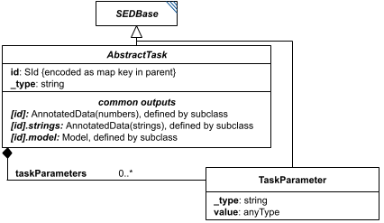

**Category:** tasks  
**Version:** v1  
**Schema:** [`schema.json`](specsheets/tasks/AbstractTask/v1.0.0/schema.json) + [`common.schema.json`](specsheets/tasks/AbstractTask/v1.0.0/common.schema.json) (`AbstractTaskCommon`)

##### What it does

`AbstractTask` is the base class every concrete Task class derives from (which in turn derives from `SEDBase`). It contributes an implicit id (its key in the `tasks` dictionary) and a `_type` discriminator field that names the concrete task class.

Every concrete subclass of `AbstractTask` must define what its output (or outputs) are. In particular, a task's own id (`#tasks:id`) - when the task defines it - always resolves to an `AnnotatedData` value (dimensions vary by task). A task's id suffixed with `.model` (`#tasks:id.model`) is used whenever the task exports a model; suffixed with `.strings` (`#tasks:id.strings`) whenever it exports a list of strings. Other output suffixes may be used when needed, but common suffixes should stay standardized across tasks.

**Two schema files in this folder.** `schema.json` defines `AbstractTask` itself. `common.schema.json` defines `AbstractTaskCommon` - a schema-only mixin (composed via `allOf`, not instantiated directly, no `_type` or diagram box of its own) contributing the fields every concrete task picks up beyond `SEDBase`: `taskParameters` (a list of `TaskParameter` objects further configuring the algorithm).

##### Attributes

All classes additionally inherit the optional `name`, `description`, `notes`, and `annotations` fields from `SEDBase` - see [`core/SEDBase`](#sedbase).

_This class defines no additional attributes beyond `SEDBaseFields`._

##### Outputs

There is no single output rule for `AbstractTask` itself - see each concrete subclass's Data Sheet for its specific output. As a family, though, `[id]` yields `AnnotatedData` when defined, `[id].model` yields a model when the task exports one, and `[id].strings` yields a list of strings when the task exports one.

`AbstractTask` states the general framework only - see each concrete Task's own Data Sheet for which of `[id]`/`[id].model`/`[id].strings` actually apply to it.

##### Validation Rules

**`AbstractTask-0000`** (error) - The element fails a JSON Schema constraint attributable to AbstractTask that does not match any other numbered rule. ([source](specsheets/tasks/AbstractTask/v1.0.0/validation/AbstractTask-0000.md))

> Catch-all rule for schema-pass failures attributable to AbstractTask (or a
> more specific descendant whose own class's failure location can't be
> resolved to any other numbered rule). See Design.md, Schema-Pass Errors.

**`AbstractTask-0001`** (error) - The taskParameters attribute of an AbstractTask must be an array of TaskParameter objects. ([source](specsheets/tasks/AbstractTask/v1.0.0/validation/AbstractTask-0001.md))

> `taskParameters` is `array of TaskParameter` in AbstractTaskCommon: it must be an array of TaskParameter objects.

**`AbstractTask-0002`** (error) - A value that must resolve to a concrete AbstractTask subtype must declare a _type attribute. ([source](specsheets/tasks/AbstractTask/v1.0.0/validation/AbstractTask-0002.md))

> A narrower case of AbstractTask-0000's catch-all: fires specifically when
> the generated oneOf fails because _type is missing entirely, rather than
> present but unrecognized. Wired via the x-missing-type-rule-id keyword,
> a sibling of x-generated-oneOf; see core-spec.md Section 8 and Design.md's
> Classes section.

**`AbstractTask-0003`** (error) - A task may only reference constants, tasks that appear earlier in the same tasks dictionary, or (for a subTask) the elements listed in this rule's explanation. ([source](specsheets/tasks/AbstractTask/v1.0.0/validation/AbstractTask-0003.md))

> The chronological rule (core-spec.md Section 3), made checkable. For a task
> at the top level of SEDDocument.tasks, a reference may target:
> - any constant;
> - any task that appears earlier in SEDDocument.tasks.
>
> For a subTask of a Repeat R, a reference may additionally target:
> - any earlier sibling subTask of R;
> - anything that R itself was allowed to reference;
> - R itself, or any Repeat enclosing R, but only through .range/.index
>   or a loopVariables child (see SEDBase-0013).
>
> A task never references itself. Since everything must be earlier, cycles are
> impossible, and the document is always a DAG executable in file order.

#### AggregationCalculation

*Source: [specsheets/tasks/AggregationCalculation/v1.0.0/description.md](specsheets/tasks/AggregationCalculation/v1.0.0/description.md)*

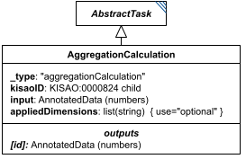

**Category:** tasks  
**Version:** v1  
**Schema:** [`schema.json`](specsheets/tasks/AggregationCalculation/v1.0.0/schema.json)  
**`_type` discriminator:** `"aggregationCalculation"`

##### What it does

Reduces dimensional data by an aggregation calculation (sum, average, standard deviation, etc.). By default only the outermost dimension of `input` is reduced (e.g. averaging every value of a matrix along its first axis), but `appliedDimensions` can name one or more specific dimensions to reduce instead.

When used as a Loop's `aggregateOutputVariables` entry, the reduction defaults to the loop's own dimension (e.g. averaging a simulation's id across loop iterations); `appliedDimensions` can override this default too.

This is an implementation of KISAO:0000824 (aggregation function).

##### Attributes

All classes additionally inherit the optional `name`, `description`, `notes`, and `annotations` fields from `SEDBase` - see [`core/SEDBase`](#sedbase).

| Attribute | Type | Required | Notes |
|---|---|---|---|
| `taskParameters` | array of TaskParameter | no |  |
| `input` | AnyValueOrRef | yes |  |
| `appliedDimensions` | ListOfStringsOrRef | no |  |

###### Attribute details

**`taskParameters`** (array of TaskParameter, optional) - _(no description yet - placeholder, needs to be filled in)_

**`input`** (AnyValueOrRef, required) - _(no description yet - placeholder, needs to be filled in)_

**`appliedDimensions`** (ListOfStringsOrRef, optional) - _(no description yet - placeholder, needs to be filled in)_


##### Outputs

The aggregated value, accessible as `[id]`.

- `[id]`: **Valid**
    - Dimensions: Same shape as `input`, minus the dimension(s) named in `appliedDimensions` (or minus the outermost dimension by default) - e.g. reducing a 2D `input` along its outermost dimension yields 1D.
- `[id].model`: **Invalid**
- `[id].strings`: **Invalid**

##### Open issues / notes

- A COMBINE 2026 meeting note in the spec flags a desired future capability: letting `AggregationCalculation` define an objective function, so a ParameterScan/Repeat could, e.g., 'fit and return the best' result - not yet designed.
- No attribute currently selects which KISAO:0000824 aggregation function (sum, mean, standard deviation, ...) this instance computes - `kisaoID` was rolled into `_type` (see `tasks/AbstractTask`) without a replacement, and `_type` itself is a fixed `"aggregationCalculation"` const. Expected fix: split into one concrete class per aggregation function, the way `Jacobian` was split into `JacobianFull`/`JacobianReduced` - see core-spec.md Section 10. Not yet designed. Decided: frozen as a single class for v1; the split is deferred, not scheduled.

##### Validation Rules

**`AggregationCalculation-0000`** (error) - The element fails a JSON Schema constraint attributable to AggregationCalculation that does not match any other numbered rule. ([source](specsheets/tasks/AggregationCalculation/v1.0.0/validation/AggregationCalculation-0000.md))

> Catch-all rule for schema-pass failures attributable to AggregationCalculation (or a
> more specific descendant whose own class's failure location can't be
> resolved to any other numbered rule). See Design.md, Schema-Pass Errors.

**`AggregationCalculation-0001`** (error) - The input attribute of an AggregationCalculation is required. ([source](specsheets/tasks/AggregationCalculation/v1.0.0/validation/AggregationCalculation-0001.md))

> `input` is required.

**`AggregationCalculation-0002`** (error) - When the value of appliedDimensions of an AggregationCalculation is provided directly, it must be an array of strings. ([source](specsheets/tasks/AggregationCalculation/v1.0.0/validation/AggregationCalculation-0002.md))

> `appliedDimensions` is `ListOfStringsOrRef`: the value, when not a reference, must be an array of strings.

**`AggregationCalculation-0003`** (error) - When the value of appliedDimensions of an AggregationCalculation is a reference, it must be a reference to an array of strings. ([source](specsheets/tasks/AggregationCalculation/v1.0.0/validation/AggregationCalculation-0003.md))

> `appliedDimensions` is `ListOfStringsOrRef`: when the value is a reference, it must resolve to an array of strings.

**`AggregationCalculation-0004`** (error) - The _type attribute of an AggregationCalculation must be "aggregationCalculation". ([source](specsheets/tasks/AggregationCalculation/v1.0.0/validation/AggregationCalculation-0004.md))

> `_type` is the discriminator field. For `AggregationCalculation` it must always equal `"aggregationCalculation"`.

#### BoundedODESimulation

*Source: [specsheets/tasks/BoundedODESimulation/v1.0.0/description.md](specsheets/tasks/BoundedODESimulation/v1.0.0/description.md)*

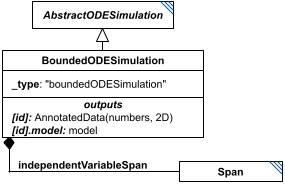

**Category:** tasks  
**Version:** v1  
**Schema:** [`schema.json`](specsheets/tasks/BoundedODESimulation/v1.0.0/schema.json)  
**`_type` discriminator:** `"boundedODESimulation"`  

##### What it does

Like `ExplicitODESimulation`, but defines only a start/end `Span` (`independentVariableSpan`) rather than a fully-explicit range - the solver chooses its own output points, typically denser where the simulation is changing rapidly and sparser where it is slow. Algorithm parameters (`taskParameters`) may further refine how output points are chosen.

Its child `Span` - a simple `start`/`end` pair - is documented on its own Data Sheet since it is reused by `BoundedStochasticSimulation` as well.

This is an implementation of KISAO:0000694 (ODE solver).

##### Attributes

All classes additionally inherit the optional `name`, `description`, `notes`, and `annotations` fields from `SEDBase` - see [`core/SEDBase`](#sedbase).

| Attribute | Type | Required | Notes |
|---|---|---|---|
| `taskParameters` | array of TaskParameter | no |  |
| `model` | SIdRef | yes |  |
| `independentVariable` | StringOrRef | yes |  |
| `independentVariableInit` | NumberOrRef | no |  |
| `outputVariables` | ListOfStringsOrRef | yes |  |
| `workingAlgorithms` | array of WorkingAlgorithm | no |  |
| `independentVariableSpan` | SpanInline | yes |  |
| `relativeTolerance` | NumberOrRef | no |  |
| `absoluteTolerance` | NumberOrRef | no |  |
| `absoluteToleranceVector` | ListOfNumbersOrRef | no |  |
| `absoluteToleranceAdjustmentFactor` | NumberOrRef | no |  |
| `toleranceForRootFinder` | NumberOrRef | no |  |
| `initialStepSize` | NumberOrRef | no |  |
| `maxNumberOfSteps` | NumberOrRef | no |  |
| `maxInternalSteps` | IntegerOrRef | no |  |
| `maxInternalStepSize` | NumberOrRef | no |  |
| `minInternalStepSize` | NumberOrRef | no |  |
| `forcePhysicalCorrectness` | BooleanOrRef | no |  |
| `integrateReducedModel` | BooleanOrRef | no |  |
| `useReducedModel` | BooleanOrRef | no |  |
| `useStiffSolver` | BooleanOrRef | no |  |
| `maxBDForder` | PositiveIntegerOrRef | no |  |
| `maxAdamsOrder` | PositiveIntegerOrRef | no |  |
| `variableStepSize` | BooleanOrRef | no |  |
| `maxOutputRows` | PositiveIntegerOrRef | no |  |

###### Attribute details

**`taskParameters`** (array of TaskParameter, optional) - _(no description yet - placeholder, needs to be filled in)_

**`model`** (SIdRef, required) - _(no description yet - placeholder, needs to be filled in)_

**`independentVariable`** (StringOrRef, required) - _(no description yet - placeholder, needs to be filled in)_

**`independentVariableInit`** (NumberOrRef, optional) - _(no description yet - placeholder, needs to be filled in)_

**`outputVariables`** (ListOfStringsOrRef, required) - _(no description yet - placeholder, needs to be filled in)_

**`workingAlgorithms`** (array of WorkingAlgorithm, optional) - _(no description yet - placeholder, needs to be filled in)_

**`independentVariableSpan`** (SpanInline, required) - _(no description yet - placeholder, needs to be filled in)_

**`relativeTolerance`** (NumberOrRef, optional) - _(no description yet - placeholder, needs to be filled in)_

**`absoluteTolerance`** (NumberOrRef, optional) - _(no description yet - placeholder, needs to be filled in)_

**`absoluteToleranceVector`** (ListOfNumbersOrRef, optional) - _(no description yet - placeholder, needs to be filled in)_

**`absoluteToleranceAdjustmentFactor`** (NumberOrRef, optional) - _(no description yet - placeholder, needs to be filled in)_

**`toleranceForRootFinder`** (NumberOrRef, optional) - _(no description yet - placeholder, needs to be filled in)_

**`initialStepSize`** (NumberOrRef, optional) - _(no description yet - placeholder, needs to be filled in)_

**`maxNumberOfSteps`** (NumberOrRef, optional) - _(no description yet - placeholder, needs to be filled in)_

**`maxInternalSteps`** (IntegerOrRef, optional) - _(no description yet - placeholder, needs to be filled in)_

**`maxInternalStepSize`** (NumberOrRef, optional) - _(no description yet - placeholder, needs to be filled in)_

**`minInternalStepSize`** (NumberOrRef, optional) - _(no description yet - placeholder, needs to be filled in)_

**`forcePhysicalCorrectness`** (BooleanOrRef, optional) - _(no description yet - placeholder, needs to be filled in)_

**`integrateReducedModel`** (BooleanOrRef, optional) - _(no description yet - placeholder, needs to be filled in)_

**`useReducedModel`** (BooleanOrRef, optional) - _(no description yet - placeholder, needs to be filled in)_

**`useStiffSolver`** (BooleanOrRef, optional) - _(no description yet - placeholder, needs to be filled in)_

**`maxBDForder`** (PositiveIntegerOrRef, optional) - _(no description yet - placeholder, needs to be filled in)_

**`maxAdamsOrder`** (PositiveIntegerOrRef, optional) - _(no description yet - placeholder, needs to be filled in)_

**`variableStepSize`** (BooleanOrRef, optional) - _(no description yet - placeholder, needs to be filled in)_

**`maxOutputRows`** (PositiveIntegerOrRef, optional) - _(no description yet - placeholder, needs to be filled in)_


##### Outputs

A 2D matrix of numbers, accessible as `[id]`, with the same column layout as `ExplicitODESimulation` but with solver-chosen row spacing. The model's end-of-run state is always also available as `[id].model`.

- `[id]`: **Valid**
    - Dimensions: 2D: columns = `independentVariable` plus one column per entry of `outputVariables` (same layout as `ExplicitODESimulation`), but row count is chosen by the solver at run time - not fixed by `independentVariableSpan` (only its `start`/`end` are).
- `[id].model`: **Valid**
- `[id].strings`: **Invalid**

##### Validation Rules

**`BoundedODESimulation-0000`** (error) - The element fails a JSON Schema constraint attributable to BoundedODESimulation that does not match any other numbered rule. ([source](specsheets/tasks/BoundedODESimulation/v1.0.0/validation/BoundedODESimulation-0000.md))

> Catch-all rule for schema-pass failures attributable to BoundedODESimulation (or a
> more specific descendant whose own class's failure location can't be
> resolved to any other numbered rule). See Design.md, Schema-Pass Errors.

**`BoundedODESimulation-0001`** (error) - The model attribute of a BoundedODESimulation is required. ([source](specsheets/tasks/BoundedODESimulation/v1.0.0/validation/BoundedODESimulation-0001.md))

> `model` is required.

**`BoundedODESimulation-0002`** (error) - The independentVariable attribute of a BoundedODESimulation is required. ([source](specsheets/tasks/BoundedODESimulation/v1.0.0/validation/BoundedODESimulation-0002.md))

> `independentVariable` is required.

**`BoundedODESimulation-0003`** (error) - The outputVariables attribute of a BoundedODESimulation is required. ([source](specsheets/tasks/BoundedODESimulation/v1.0.0/validation/BoundedODESimulation-0003.md))

> `outputVariables` is required.

**`BoundedODESimulation-0004`** (error) - The independentVariableSpan attribute of a BoundedODESimulation is required. ([source](specsheets/tasks/BoundedODESimulation/v1.0.0/validation/BoundedODESimulation-0004.md))

> `independentVariableSpan` is required.

**`BoundedODESimulation-0005`** (error) - The independentVariableSpan attribute of a BoundedODESimulation must be a SpanInline object. ([source](specsheets/tasks/BoundedODESimulation/v1.0.0/validation/BoundedODESimulation-0005.md))

> `independentVariableSpan` is `SpanInline`: it must be a SpanInline object.

**`BoundedODESimulation-0006`** (error) - The _type attribute of a BoundedODESimulation must be "boundedODESimulation". ([source](specsheets/tasks/BoundedODESimulation/v1.0.0/validation/BoundedODESimulation-0006.md))

> `_type` is the discriminator field. For `BoundedODESimulation` it must always equal `"boundedODESimulation"`.

#### BoundedStochasticSimulation

*Source: [specsheets/tasks/BoundedStochasticSimulation/v1.0.0/description.md](specsheets/tasks/BoundedStochasticSimulation/v1.0.0/description.md)*

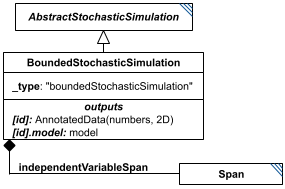

**Category:** tasks  
**Version:** v1  
**Schema:** [`schema.json`](specsheets/tasks/BoundedStochasticSimulation/v1.0.0/schema.json)  
**`_type` discriminator:** `"boundedStochasticSimulation"`  

##### What it does

A stochastic simulation (see `ExplicitStochasticSimulation`) where only the start/end times are defined via the child `independentVariableSpan` (`Span`); between those points the simulator may output whenever it wishes - typically at every stochastic event, though `taskParameters` can control this if that would be too frequent.

This is an implementation of KISAO:0000319 (Monte Carlo method).

##### Attributes

All classes additionally inherit the optional `name`, `description`, `notes`, and `annotations` fields from `SEDBase` - see [`core/SEDBase`](#sedbase).

| Attribute | Type | Required | Notes |
|---|---|---|---|
| `taskParameters` | array of TaskParameter | no |  |
| `model` | SIdRef | yes |  |
| `independentVariable` | StringOrRef | yes |  |
| `independentVariableInit` | NumberOrRef | no |  |
| `outputVariables` | ListOfStringsOrRef | yes |  |
| `workingAlgorithms` | array of WorkingAlgorithm | no |  |
| `independentVariableSpan` | SpanInline | yes |  |
| `seed` | NumberOrRef | no |  |
| `timeDependentRelativeTolerance` | NumberOrRef | no |  |
| `variableStepSize` | BooleanOrRef | no |  |
| `minimumTimeStep` | NumberOrRef | no |  |
| `maximumTimeStep` | NumberOrRef | no |  |
| `nonNegative` | BooleanOrRef | no |  |
| `maxOutputRows` | PositiveIntegerOrRef | no |  |
| `maxNumSteps` | PositiveIntegerOrRef | no |  |

###### Attribute details

**`taskParameters`** (array of TaskParameter, optional) - _(no description yet - placeholder, needs to be filled in)_

**`model`** (SIdRef, required) - _(no description yet - placeholder, needs to be filled in)_

**`independentVariable`** (StringOrRef, required) - _(no description yet - placeholder, needs to be filled in)_

**`independentVariableInit`** (NumberOrRef, optional) - _(no description yet - placeholder, needs to be filled in)_

**`outputVariables`** (ListOfStringsOrRef, required) - _(no description yet - placeholder, needs to be filled in)_

**`workingAlgorithms`** (array of WorkingAlgorithm, optional) - _(no description yet - placeholder, needs to be filled in)_

**`independentVariableSpan`** (SpanInline, required) - _(no description yet - placeholder, needs to be filled in)_

**`seed`** (NumberOrRef, optional) - _(no description yet - placeholder, needs to be filled in)_

**`timeDependentRelativeTolerance`** (NumberOrRef, optional) - _(no description yet - placeholder, needs to be filled in)_

**`variableStepSize`** (BooleanOrRef, optional) - _(no description yet - placeholder, needs to be filled in)_

**`minimumTimeStep`** (NumberOrRef, optional) - _(no description yet - placeholder, needs to be filled in)_

**`maximumTimeStep`** (NumberOrRef, optional) - _(no description yet - placeholder, needs to be filled in)_

**`nonNegative`** (BooleanOrRef, optional) - _(no description yet - placeholder, needs to be filled in)_

**`maxOutputRows`** (PositiveIntegerOrRef, optional) - _(no description yet - placeholder, needs to be filled in)_

**`maxNumSteps`** (PositiveIntegerOrRef, optional) - _(no description yet - placeholder, needs to be filled in)_


##### Outputs

A 2D matrix of numbers, accessible as `[id]`, with solver-chosen row spacing. The model's end-of-run state is always also available as `[id].model`.

- `[id]`: **Valid**
    - Dimensions: 2D: columns = `independentVariable` plus one column per entry of `outputVariables`; row count is chosen by the simulator at run time (typically once per stochastic event) rather than fixed by `independentVariableSpan`.
- `[id].model`: **Valid**
- `[id].strings`: **Invalid**

##### Validation Rules

**`BoundedStochasticSimulation-0000`** (error) - The element fails a JSON Schema constraint attributable to BoundedStochasticSimulation that does not match any other numbered rule. ([source](specsheets/tasks/BoundedStochasticSimulation/v1.0.0/validation/BoundedStochasticSimulation-0000.md))

> Catch-all rule for schema-pass failures attributable to BoundedStochasticSimulation (or a
> more specific descendant whose own class's failure location can't be
> resolved to any other numbered rule). See Design.md, Schema-Pass Errors.

**`BoundedStochasticSimulation-0001`** (error) - The model attribute of a BoundedStochasticSimulation is required. ([source](specsheets/tasks/BoundedStochasticSimulation/v1.0.0/validation/BoundedStochasticSimulation-0001.md))

> `model` is required.

**`BoundedStochasticSimulation-0002`** (error) - The independentVariable attribute of a BoundedStochasticSimulation is required. ([source](specsheets/tasks/BoundedStochasticSimulation/v1.0.0/validation/BoundedStochasticSimulation-0002.md))

> `independentVariable` is required.

**`BoundedStochasticSimulation-0003`** (error) - The outputVariables attribute of a BoundedStochasticSimulation is required. ([source](specsheets/tasks/BoundedStochasticSimulation/v1.0.0/validation/BoundedStochasticSimulation-0003.md))

> `outputVariables` is required.

**`BoundedStochasticSimulation-0004`** (error) - The independentVariableSpan attribute of a BoundedStochasticSimulation is required. ([source](specsheets/tasks/BoundedStochasticSimulation/v1.0.0/validation/BoundedStochasticSimulation-0004.md))

> `independentVariableSpan` is required.

**`BoundedStochasticSimulation-0005`** (error) - The independentVariableSpan attribute of a BoundedStochasticSimulation must be a SpanInline object. ([source](specsheets/tasks/BoundedStochasticSimulation/v1.0.0/validation/BoundedStochasticSimulation-0005.md))

> `independentVariableSpan` is `SpanInline`: it must be a SpanInline object.

**`BoundedStochasticSimulation-0006`** (error) - The _type attribute of a BoundedStochasticSimulation must be "boundedStochasticSimulation". ([source](specsheets/tasks/BoundedStochasticSimulation/v1.0.0/validation/BoundedStochasticSimulation-0006.md))

> `_type` is the discriminator field. For `BoundedStochasticSimulation` it must always equal `"boundedStochasticSimulation"`.

#### Calculation

*Source: [specsheets/tasks/Calculation/v1.0.0/description.md](specsheets/tasks/Calculation/v1.0.0/description.md)*

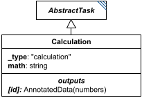

**Category:** tasks  
**Version:** v1  
**Schema:** [`schema.json`](specsheets/tasks/Calculation/v1.0.0/schema.json)  
**`_type` discriminator:** `"calculation"`

##### What it does

Performs a calculation written in infix as the `math` attribute; its id may then be used as that calculation's result elsewhere in the document.

References to `AnnotatedData` may appear within `math`, evaluated element-by-element: combining a lower-dimension value with a higher-dimension one broadcasts the lower one across the higher (e.g. `5 + [list]` adds 5 to every element; `[1D] * [2D]` multiplies each row); combining two same-dimension values requires matching keys (dictionaries) or matching lengths (lists). Allowed operations are `+ - * / ^`, parentheses, standard PEMDAS ordering, the functions allowed in SBML, and the constants allowed in SBML (`pi`, `exponentiale`, etc.).

##### Attributes

All classes additionally inherit the optional `name`, `description`, `notes`, and `annotations` fields from `SEDBase` - see [`core/SEDBase`](#sedbase).

| Attribute | Type | Required | Notes |
|---|---|---|---|
| `taskParameters` | array of TaskParameter | no |  |
| `math` | StringOrRef | yes |  |

###### Attribute details

**`taskParameters`** (array of TaskParameter, optional) - _(no description yet - placeholder, needs to be filled in)_

**`math`** (StringOrRef, required) - _(no description yet - placeholder, needs to be filled in)_


##### Outputs

The result of evaluating `math`, accessible as `[id]`.

- `[id]`: **Valid**
    - Dimensions: Matches the shape of the evaluated `math` expression: scalar if every operand is scalar, otherwise broadcasts across the shape of any `AnnotatedData` operand(s) per the broadcasting rules above - not fixed ahead of time.
- `[id].model`: **Invalid**
- `[id].strings`: **Invalid**

##### Validation Rules

**`Calculation-0000`** (error) - The element fails a JSON Schema constraint attributable to Calculation that does not match any other numbered rule. ([source](specsheets/tasks/Calculation/v1.0.0/validation/Calculation-0000.md))

> Catch-all rule for schema-pass failures attributable to Calculation (or a
> more specific descendant whose own class's failure location can't be
> resolved to any other numbered rule). See Design.md, Schema-Pass Errors.

**`Calculation-0001`** (error) - The math attribute of a Calculation is required. ([source](specsheets/tasks/Calculation/v1.0.0/validation/Calculation-0001.md))

> `math` is required.

**`Calculation-0002`** (error) - When the value of math of a Calculation is provided directly, it must be a string. ([source](specsheets/tasks/Calculation/v1.0.0/validation/Calculation-0002.md))

> `math` is `StringOrRef`: the value, when not a reference, must be a string.

**`Calculation-0003`** (error) - When the value of math of a Calculation is a reference, it must be a reference to a string. ([source](specsheets/tasks/Calculation/v1.0.0/validation/Calculation-0003.md))

> `math` is `StringOrRef`: when the value is a reference, it must resolve to a string.

**`Calculation-0004`** (error) - The _type attribute of a Calculation must be "calculation". ([source](specsheets/tasks/Calculation/v1.0.0/validation/Calculation-0004.md))

> `_type` is the discriminator field. For `Calculation` it must always equal `"calculation"`.

#### CreateDataBlock

*Source: [specsheets/tasks/CreateDataBlock/v1.0.0/description.md](specsheets/tasks/CreateDataBlock/v1.0.0/description.md)*

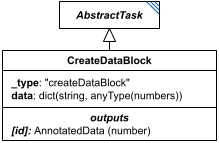

**Category:** tasks  
**Version:** v1  
**Schema:** [`schema.json`](specsheets/tasks/CreateDataBlock/v1.0.0/schema.json)  
**`_type` discriminator:** `"createDataBlock"`

##### What it does

`CreateDataBlock` assembles a new block of `AnnotatedData` from several other pieces of data. Its `data` attribute is a dictionary mapping labels to values (numbers, lists, or `AnnotatedData`).

##### Attributes

All classes additionally inherit the optional `name`, `description`, `notes`, and `annotations` fields from `SEDBase` - see [`core/SEDBase`](#sedbase).

| Attribute | Type | Required | Notes |
|---|---|---|---|
| `taskParameters` | array of TaskParameter | no |  |
| `data` | object (values: AnyValueOrRef) or SIdRef | yes |  |

###### Attribute details

**`taskParameters`** (array of TaskParameter, optional) - _(no description yet - placeholder, needs to be filled in)_

**`data`** (object (values: AnyValueOrRef) or SIdRef, required) - _(no description yet - placeholder, needs to be filled in)_


##### Outputs

A new `AnnotatedData` object whose labels are the `data` dictionary's keys and whose content is the corresponding values, accessible as `[id]`.

- `[id]`: **Valid**
    - Dimensions: 1D, length = number of keys in the `data` dictionary, labeled by those keys - unless a value in `data` is itself multi-dimensional (a list or `AnnotatedData`), in which case that value's own dimensions carry through for that entry. _(Whether/how mixed-dimension entries combine into one overall shape is open - placeholder.)_
- `[id].model`: **Invalid**
- `[id].strings`: **Invalid**

##### Validation Rules

**`CreateDataBlock-0000`** (error) - The element fails a JSON Schema constraint attributable to CreateDataBlock that does not match any other numbered rule. ([source](specsheets/tasks/CreateDataBlock/v1.0.0/validation/CreateDataBlock-0000.md))

> Catch-all rule for schema-pass failures attributable to CreateDataBlock (or a
> more specific descendant whose own class's failure location can't be
> resolved to any other numbered rule). See Design.md, Schema-Pass Errors.

**`CreateDataBlock-0001`** (error) - The data attribute of a CreateDataBlock is required. ([source](specsheets/tasks/CreateDataBlock/v1.0.0/validation/CreateDataBlock-0001.md))

> `data` is required.

**`CreateDataBlock-0002`** (error) - When the value of data of a CreateDataBlock is provided directly, it must be an object whose values are AnyValueOrRef. ([source](specsheets/tasks/CreateDataBlock/v1.0.0/validation/CreateDataBlock-0002.md))

> `data` is `object (values: AnyValueOrRef) or SIdRef`: the value, when not a reference, must be an object whose values are AnyValueOrRef.

**`CreateDataBlock-0003`** (error) - When the value of data of a CreateDataBlock is a reference, it must be a reference to an object whose values are AnyValueOrRef. ([source](specsheets/tasks/CreateDataBlock/v1.0.0/validation/CreateDataBlock-0003.md))

> `data` is `object (values: AnyValueOrRef) or SIdRef`: when the value is a reference, it must resolve to an object whose values are AnyValueOrRef.

**`CreateDataBlock-0004`** (error) - The _type attribute of a CreateDataBlock must be "createDataBlock". ([source](specsheets/tasks/CreateDataBlock/v1.0.0/validation/CreateDataBlock-0004.md))

> `_type` is the discriminator field. For `CreateDataBlock` it must always equal `"createDataBlock"`.

#### CsvImport

*Source: [specsheets/tasks/CsvImport/v1.0.0/description.md](specsheets/tasks/CsvImport/v1.0.0/description.md)*

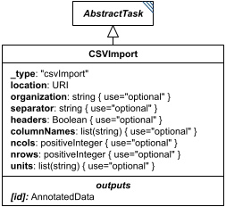

**Category:** tasks  
**Version:** v1  
**Schema:** [`schema.json`](specsheets/tasks/CsvImport/v1.0.0/schema.json)  
**`_type` discriminator:** `"csvImport"`

##### What it does

`CsvImport` imports a CSV (or other delimiter-separated-values) file found at `location` and converts it to a numeric `AnnotatedData` object. Only `location` is strictly required; the schema additionally defines `organization`, `separator`, `headers`, `columnNames`, `ncols`, `nrows`, and `units` to further describe how to parse the file, all of which are optional.

##### Attributes

All classes additionally inherit the optional `name`, `description`, `notes`, and `annotations` fields from `SEDBase` - see [`core/SEDBase`](#sedbase).

| Attribute | Type | Required | Notes |
|---|---|---|---|
| `taskParameters` | array of TaskParameter | no |  |
| `location` | URIOrRef | yes |  |
| `organization` | StringOrRef | no |  |
| `separator` | StringOrRef | no |  |
| `headers` | BooleanOrRef | no |  |
| `columnNames` | ListOfStringsOrRef | no |  |
| `ncols` | PositiveIntegerOrRef | no |  |
| `nrows` | PositiveIntegerOrRef | no |  |
| `units` | ListOfStringsOrRef | no |  |

###### Attribute details

**`taskParameters`** (array of TaskParameter, optional) - _(no description yet - placeholder, needs to be filled in)_

**`location`** (URIOrRef, required) - _(no description yet - placeholder, needs to be filled in)_

**`organization`** (StringOrRef, optional) - _(no description yet - placeholder, needs to be filled in)_

**`separator`** (StringOrRef, optional) - _(no description yet - placeholder, needs to be filled in)_

**`headers`** (BooleanOrRef, optional) - _(no description yet - placeholder, needs to be filled in)_

**`columnNames`** (ListOfStringsOrRef, optional) - _(no description yet - placeholder, needs to be filled in)_

**`ncols`** (PositiveIntegerOrRef, optional) - _(no description yet - placeholder, needs to be filled in)_

**`nrows`** (PositiveIntegerOrRef, optional) - _(no description yet - placeholder, needs to be filled in)_

**`units`** (ListOfStringsOrRef, optional) - _(no description yet - placeholder, needs to be filled in)_


##### Outputs

The imported numeric `AnnotatedData`, accessible as `[id]`.

- `[id]`: **Valid**
    - Dimensions: 2D: rows x columns, as determined by the CSV file at `location` together with `organization`/`headers`/`columnNames`/`ncols`/`nrows`/`separator`.
- `[id].model`: **Invalid**
- `[id].strings`: **Invalid**

##### Open issues / notes

- The prose spec's "CSVImport" section is a single unfinished sentence ("All of the other arguments are optional,") - the schema is noticeably more complete than the prose here (it names `organization`/`separator`/`headers`/`columnNames`/`ncols`/`nrows`/`units` explicitly), so this Data Sheet leans on the schema; the prose section should be filled back in to match.

##### Validation Rules

**`CsvImport-0000`** (error) - The element fails a JSON Schema constraint attributable to CsvImport that does not match any other numbered rule. ([source](specsheets/tasks/CsvImport/v1.0.0/validation/CsvImport-0000.md))

> Catch-all rule for schema-pass failures attributable to CsvImport (or a
> more specific descendant whose own class's failure location can't be
> resolved to any other numbered rule). See Design.md, Schema-Pass Errors.

**`CsvImport-0001`** (error) - The location attribute of a CsvImport is required. ([source](specsheets/tasks/CsvImport/v1.0.0/validation/CsvImport-0001.md))

> `location` is required.

**`CsvImport-0002`** (error) - When the value of location of a CsvImport is provided directly, it must be a URI string. ([source](specsheets/tasks/CsvImport/v1.0.0/validation/CsvImport-0002.md))

> `location` is `URIOrRef`: the value, when not a reference, must be a URI string.

**`CsvImport-0003`** (error) - When the value of location of a CsvImport is a reference, it must be a reference to a URI string. ([source](specsheets/tasks/CsvImport/v1.0.0/validation/CsvImport-0003.md))

> `location` is `URIOrRef`: when the value is a reference, it must resolve to a URI string.

**`CsvImport-0004`** (error) - When the value of organization of a CsvImport is provided directly, it must be a string. ([source](specsheets/tasks/CsvImport/v1.0.0/validation/CsvImport-0004.md))

> `organization` is `StringOrRef`: the value, when not a reference, must be a string.

**`CsvImport-0005`** (error) - When the value of organization of a CsvImport is a reference, it must be a reference to a string. ([source](specsheets/tasks/CsvImport/v1.0.0/validation/CsvImport-0005.md))

> `organization` is `StringOrRef`: when the value is a reference, it must resolve to a string.

**`CsvImport-0006`** (error) - When the value of separator of a CsvImport is provided directly, it must be a string. ([source](specsheets/tasks/CsvImport/v1.0.0/validation/CsvImport-0006.md))

> `separator` is `StringOrRef`: the value, when not a reference, must be a string.

**`CsvImport-0007`** (error) - When the value of separator of a CsvImport is a reference, it must be a reference to a string. ([source](specsheets/tasks/CsvImport/v1.0.0/validation/CsvImport-0007.md))

> `separator` is `StringOrRef`: when the value is a reference, it must resolve to a string.

**`CsvImport-0008`** (error) - When the value of headers of a CsvImport is provided directly, it must be a boolean. ([source](specsheets/tasks/CsvImport/v1.0.0/validation/CsvImport-0008.md))

> `headers` is `BooleanOrRef`: the value, when not a reference, must be a boolean.

**`CsvImport-0009`** (error) - When the value of headers of a CsvImport is a reference, it must be a reference to a boolean. ([source](specsheets/tasks/CsvImport/v1.0.0/validation/CsvImport-0009.md))

> `headers` is `BooleanOrRef`: when the value is a reference, it must resolve to a boolean.

**`CsvImport-0010`** (error) - When the value of columnNames of a CsvImport is provided directly, it must be an array of strings. ([source](specsheets/tasks/CsvImport/v1.0.0/validation/CsvImport-0010.md))

> `columnNames` is `ListOfStringsOrRef`: the value, when not a reference, must be an array of strings.

**`CsvImport-0011`** (error) - When the value of columnNames of a CsvImport is a reference, it must be a reference to an array of strings. ([source](specsheets/tasks/CsvImport/v1.0.0/validation/CsvImport-0011.md))

> `columnNames` is `ListOfStringsOrRef`: when the value is a reference, it must resolve to an array of strings.

**`CsvImport-0012`** (error) - When the value of ncols of a CsvImport is provided directly, it must be a positive integer. ([source](specsheets/tasks/CsvImport/v1.0.0/validation/CsvImport-0012.md))

> `ncols` is `PositiveIntegerOrRef`: the value, when not a reference, must be a positive integer.

**`CsvImport-0013`** (error) - When the value of ncols of a CsvImport is a reference, it must be a reference to a positive integer. ([source](specsheets/tasks/CsvImport/v1.0.0/validation/CsvImport-0013.md))

> `ncols` is `PositiveIntegerOrRef`: when the value is a reference, it must resolve to a positive integer.

**`CsvImport-0014`** (error) - When the value of nrows of a CsvImport is provided directly, it must be a positive integer. ([source](specsheets/tasks/CsvImport/v1.0.0/validation/CsvImport-0014.md))

> `nrows` is `PositiveIntegerOrRef`: the value, when not a reference, must be a positive integer.

**`CsvImport-0015`** (error) - When the value of nrows of a CsvImport is a reference, it must be a reference to a positive integer. ([source](specsheets/tasks/CsvImport/v1.0.0/validation/CsvImport-0015.md))

> `nrows` is `PositiveIntegerOrRef`: when the value is a reference, it must resolve to a positive integer.

**`CsvImport-0016`** (error) - When the value of units of a CsvImport is provided directly, it must be an array of strings. ([source](specsheets/tasks/CsvImport/v1.0.0/validation/CsvImport-0016.md))

> `units` is `ListOfStringsOrRef`: the value, when not a reference, must be an array of strings.

**`CsvImport-0017`** (error) - When the value of units of a CsvImport is a reference, it must be a reference to an array of strings. ([source](specsheets/tasks/CsvImport/v1.0.0/validation/CsvImport-0017.md))

> `units` is `ListOfStringsOrRef`: when the value is a reference, it must resolve to an array of strings.

**`CsvImport-0018`** (error) - The _type attribute of a CsvImport must be "csvImport". ([source](specsheets/tasks/CsvImport/v1.0.0/validation/CsvImport-0018.md))

> `_type` is the discriminator field. For `CsvImport` it must always equal `"csvImport"`.

#### DataImport

*Source: [specsheets/tasks/DataImport/v1.0.0/description.md](specsheets/tasks/DataImport/v1.0.0/description.md)*

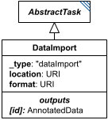

**Category:** tasks  
**Version:** v1  
**Schema:** [`schema.json`](specsheets/tasks/DataImport/v1.0.0/schema.json)  
**`_type` discriminator:** `"dataImport"`

##### What it does

`DataImport` pulls in a file at `location` (in the format named by `format`) and imports it into an `AnnotatedData` object. `taskParameters` may be used to further specify how a particular file should be imported (e.g. a delimiter, or whether a header row is present).

`DataImport` is meant for non-standard file formats; common formats such as CSV have their own specialized importer (`CsvImport`).

##### Attributes

All classes additionally inherit the optional `name`, `description`, `notes`, and `annotations` fields from `SEDBase` - see [`core/SEDBase`](#sedbase).

| Attribute | Type | Required | Notes |
|---|---|---|---|
| `taskParameters` | array of TaskParameter | no |  |
| `location` | URIOrRef | yes |  |
| `format` | URIOrRef | yes |  |

###### Attribute details

**`taskParameters`** (array of TaskParameter, optional) - _(no description yet - placeholder, needs to be filled in)_

**`location`** (URIOrRef, required) - _(no description yet - placeholder, needs to be filled in)_

**`format`** (URIOrRef, required) - _(no description yet - placeholder, needs to be filled in)_


##### Outputs

The imported `AnnotatedData`, accessible as `[id]` (e.g. `#tasks:data1`).

- `[id]`: **Valid**
    - Dimensions: Whatever shape the imported file itself has - not fixed by the schema; depends on `format` and the file at `location`.
- `[id].model`: **Invalid**
- `[id].strings`: **Invalid**

##### Validation Rules

**`DataImport-0000`** (error) - The element fails a JSON Schema constraint attributable to DataImport that does not match any other numbered rule. ([source](specsheets/tasks/DataImport/v1.0.0/validation/DataImport-0000.md))

> Catch-all rule for schema-pass failures attributable to DataImport (or a
> more specific descendant whose own class's failure location can't be
> resolved to any other numbered rule). See Design.md, Schema-Pass Errors.

**`DataImport-0001`** (error) - The location attribute of a DataImport is required. ([source](specsheets/tasks/DataImport/v1.0.0/validation/DataImport-0001.md))

> `location` is required.

**`DataImport-0002`** (error) - When the value of location of a DataImport is provided directly, it must be a URI string. ([source](specsheets/tasks/DataImport/v1.0.0/validation/DataImport-0002.md))

> `location` is `URIOrRef`: the value, when not a reference, must be a URI string.

**`DataImport-0003`** (error) - When the value of location of a DataImport is a reference, it must be a reference to a URI string. ([source](specsheets/tasks/DataImport/v1.0.0/validation/DataImport-0003.md))

> `location` is `URIOrRef`: when the value is a reference, it must resolve to a URI string.

**`DataImport-0004`** (error) - The format attribute of a DataImport is required. ([source](specsheets/tasks/DataImport/v1.0.0/validation/DataImport-0004.md))

> `format` is required.

**`DataImport-0005`** (error) - When the value of format of a DataImport is provided directly, it must be a URI string. ([source](specsheets/tasks/DataImport/v1.0.0/validation/DataImport-0005.md))

> `format` is `URIOrRef`: the value, when not a reference, must be a URI string.

**`DataImport-0006`** (error) - When the value of format of a DataImport is a reference, it must be a reference to a URI string. ([source](specsheets/tasks/DataImport/v1.0.0/validation/DataImport-0006.md))

> `format` is `URIOrRef`: when the value is a reference, it must resolve to a URI string.

**`DataImport-0007`** (error) - The _type attribute of a DataImport must be "dataImport". ([source](specsheets/tasks/DataImport/v1.0.0/validation/DataImport-0007.md))

> `_type` is the discriminator field. For `DataImport` it must always equal `"dataImport"`.

#### DrawFromDistribution

*Source: [specsheets/tasks/DrawFromDistribution/v1.0.0/description.md](specsheets/tasks/DrawFromDistribution/v1.0.0/description.md)*

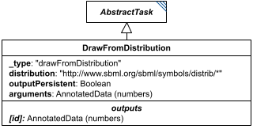

**Category:** tasks  
**Version:** v1  
**Schema:** [`schema.json`](specsheets/tasks/DrawFromDistribution/v1.0.0/schema.json)  
**`_type` discriminator:** `"drawFromDistribution"`

##### What it does

Draws from one of the distributions defined in the SBML distrib package - normal, uniform, bernoulli, binomial, cauchy, chisquare, exponential, gamma, laplace, lognormal, poisson, and rayleigh - named by the `distribution` attribute, which holds that distribution's `http://www.sbml.org/sbml/symbols/distrib/*` definitionURL (see `core/Types`'s `DistributionURI`, kept in sync with `schema/predefined-functions.json`'s `distrib` registry). `arguments` supplies the distribution's parameters in the order SBML defines them - e.g. a normal distribution takes `(mean, stdev)` or `(mean, stdev, min, max)`. For distributions outside this list, other ontologies (e.g. UncertML, though dormant) may be used, with `distribution` given as a reference instead of a direct URI value.

`outputPersistent` controls whether every reference to this task's id always yields the same drawn value (`true` - useful when multiple tasks must share one draw) or yields a fresh draw from the same distribution each time it's referenced (`false` - useful when multiple tasks need independent draws).

##### Attributes

All classes additionally inherit the optional `name`, `description`, `notes`, and `annotations` fields from `SEDBase` - see [`core/SEDBase`](#sedbase). Which distribution to draw from is named explicitly by the `distribution` attribute, since every `DrawFromDistribution` shares the one `"drawFromDistribution"` `_type`.

| Attribute | Type | Required | Notes |
|---|---|---|---|
| `taskParameters` | array of TaskParameter | no |  |
| `distribution` | DistributionURI or SIdRef | yes | Which distribution to draw from |
| `arguments` | ListOfAnyOrRef | yes |  |
| `outputPersistent` | BooleanOrRef | no |  |

###### Attribute details

**`taskParameters`** (array of TaskParameter, optional) - _(no description yet - placeholder, needs to be filled in)_

**`distribution`** (DistributionURI or SIdRef, required) - Names the distribution to draw from, as one of the 12 `http://www.sbml.org/sbml/symbols/distrib/*` definitionURL values (see `core/Types`'s `DistributionURI`) - or a reference to a value that resolves to one of them.

**`arguments`** (ListOfAnyOrRef, required) - _(no description yet - placeholder, needs to be filled in)_

**`outputPersistent`** (BooleanOrRef, optional) - _(no description yet - placeholder, needs to be filled in)_


##### Outputs

Officially `AnnotatedData`, usually a single number accessible as `[id][0]`; the type is multidimensional to leave room for future draws of correlated values.

- `[id]`: **Valid**
    - Dimensions: Currently always a single value, at `[id][0]` (effectively 0-D/scalar today). _(How a future correlated multi-value draw would be shaped is open - placeholder.)_
- `[id].model`: **Invalid**
- `[id].strings`: **Invalid**

Typically a single number, indexed as `[id][0]`; the type is multidimensional `AnnotatedData` to leave room for correlated multi-value draws in the future.

##### Open issues / notes

- `arguments` is a flat, unlabeled `ListOfAnyOrRef` array, but each distribution named by `distribution` needs a different number of differently-meaning parameters (a `normal` draw takes `mean`/`stdev`, optionally `min`/`max`; a `cauchy` draw takes `scale`, or `location`/`scale`, or `location`/`scale`/`min`/`max` - see `schema/predefined-functions.json`'s `distrib` entries for the full per-distribution argument lists). Nothing in the schema ties a specific positional `arguments` entry to its meaning for the chosen distribution. Expected fix: split into one concrete class per distribution (e.g. `DrawFromNormalDistribution`, `DrawFromCauchyDistribution`, ...), each with its own `_type` and properly named attributes instead of a generic `distribution` + `arguments` pair - the way `Jacobian` was split into `JacobianFull`/`JacobianReduced` - see core-spec.md Section 10. Not yet designed. Decided: frozen as a single class for v1; the split is deferred, not scheduled.

##### Validation Rules

**`DrawFromDistribution-0000`** (error) - The element fails a JSON Schema constraint attributable to DrawFromDistribution that does not match any other numbered rule. ([source](specsheets/tasks/DrawFromDistribution/v1.0.0/validation/DrawFromDistribution-0000.md))

> Catch-all rule for schema-pass failures attributable to DrawFromDistribution (or a
> more specific descendant whose own class's failure location can't be
> resolved to any other numbered rule). See Design.md, Schema-Pass Errors.

**`DrawFromDistribution-0001`** (error) - The arguments attribute of a DrawFromDistribution is required. ([source](specsheets/tasks/DrawFromDistribution/v1.0.0/validation/DrawFromDistribution-0001.md))

> `arguments` is required.

**`DrawFromDistribution-0002`** (error) - When the value of arguments of a DrawFromDistribution is provided directly, it must be an array of values. ([source](specsheets/tasks/DrawFromDistribution/v1.0.0/validation/DrawFromDistribution-0002.md))

> `arguments` is `ListOfAnyOrRef`: the value, when not a reference, must be an array of values.

**`DrawFromDistribution-0003`** (error) - When the value of arguments of a DrawFromDistribution is a reference, it must be a reference to an array of values. ([source](specsheets/tasks/DrawFromDistribution/v1.0.0/validation/DrawFromDistribution-0003.md))

> `arguments` is `ListOfAnyOrRef`: when the value is a reference, it must resolve to an array of values.

**`DrawFromDistribution-0004`** (error) - When the value of outputPersistent of a DrawFromDistribution is provided directly, it must be a boolean. ([source](specsheets/tasks/DrawFromDistribution/v1.0.0/validation/DrawFromDistribution-0004.md))

> `outputPersistent` is `BooleanOrRef`: the value, when not a reference, must be a boolean.

**`DrawFromDistribution-0005`** (error) - When the value of outputPersistent of a DrawFromDistribution is a reference, it must be a reference to a boolean. ([source](specsheets/tasks/DrawFromDistribution/v1.0.0/validation/DrawFromDistribution-0005.md))

> `outputPersistent` is `BooleanOrRef`: when the value is a reference, it must resolve to a boolean.

**`DrawFromDistribution-0006`** (error) - The _type attribute of a DrawFromDistribution must be "drawFromDistribution". ([source](specsheets/tasks/DrawFromDistribution/v1.0.0/validation/DrawFromDistribution-0006.md))

> `_type` is the discriminator field. For `DrawFromDistribution` it must always equal `"drawFromDistribution"`.

**`DrawFromDistribution-0007`** (error) - The distribution attribute of a DrawFromDistribution is required. ([source](specsheets/tasks/DrawFromDistribution/v1.0.0/validation/DrawFromDistribution-0007.md))

> `distribution` is required.

**`DrawFromDistribution-0008`** (error) - When the value of distribution of a DrawFromDistribution is provided directly, it must be one of the SBML distrib package's definitionURL values. ([source](specsheets/tasks/DrawFromDistribution/v1.0.0/validation/DrawFromDistribution-0008.md))

> `distribution` is `DistributionURI | SIdRef`: the value, when not a reference, must be one of the 12 `http://www.sbml.org/sbml/symbols/distrib/*` URIs listed in `core/Types`'s `DistributionURI` (kept in sync with `schema/predefined-functions.json`'s `distrib` registry).

**`DrawFromDistribution-0009`** (error) - When the value of distribution of a DrawFromDistribution is a reference, it must be a reference to one of the SBML distrib package's definitionURL values. ([source](specsheets/tasks/DrawFromDistribution/v1.0.0/validation/DrawFromDistribution-0009.md))

> `distribution` is `DistributionURI | SIdRef`: when the value is a reference, it must resolve to one of the 12 allowed distribution URIs.

#### ExplicitODESimulation

*Source: [specsheets/tasks/ExplicitODESimulation/v1.0.0/description.md](specsheets/tasks/ExplicitODESimulation/v1.0.0/description.md)*

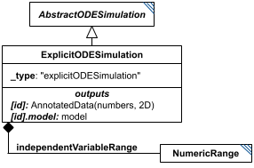

**Category:** tasks  
**Version:** v1  
**Schema:** [`schema.json`](specsheets/tasks/ExplicitODESimulation/v1.0.0/schema.json)  
**`_type` discriminator:** `"explicitODESimulation"`  

##### What it does

Simulates a model along `independentVariable` with fully explicit output steps, defined by the child `independentVariableRange` (a `NumericRange`).

The explicit output range only constrains *where output is recorded* - the underlying solver's actual step size is usually adaptive and much finer than the requested output interval.

This is an implementation of KISAO:0000694 (ODE solver).

##### Attributes

All classes additionally inherit the optional `name`, `description`, `notes`, and `annotations` fields from `SEDBase` - see [`core/SEDBase`](#sedbase).

| Attribute | Type | Required | Notes |
|---|---|---|---|
| `taskParameters` | array of TaskParameter | no |  |
| `model` | SIdRef | yes |  |
| `independentVariable` | StringOrRef | yes |  |
| `independentVariableInit` | NumberOrRef | no |  |
| `outputVariables` | ListOfStringsOrRef | yes |  |
| `workingAlgorithms` | array of WorkingAlgorithm | no |  |
| `independentVariableRange` | NumericRangeInline | yes |  |
| `relativeTolerance` | NumberOrRef | no |  |
| `absoluteTolerance` | NumberOrRef | no |  |
| `absoluteToleranceVector` | ListOfNumbersOrRef | no |  |
| `absoluteToleranceAdjustmentFactor` | NumberOrRef | no |  |
| `toleranceForRootFinder` | NumberOrRef | no |  |
| `initialStepSize` | NumberOrRef | no |  |
| `maxNumberOfSteps` | NumberOrRef | no |  |
| `maxInternalSteps` | IntegerOrRef | no |  |
| `maxInternalStepSize` | NumberOrRef | no |  |
| `minInternalStepSize` | NumberOrRef | no |  |
| `forcePhysicalCorrectness` | BooleanOrRef | no |  |
| `integrateReducedModel` | BooleanOrRef | no |  |
| `useReducedModel` | BooleanOrRef | no |  |
| `useStiffSolver` | BooleanOrRef | no |  |
| `maxBDForder` | PositiveIntegerOrRef | no |  |
| `maxAdamsOrder` | PositiveIntegerOrRef | no |  |
| `variableStepSize` | BooleanOrRef | no |  |
| `maxOutputRows` | PositiveIntegerOrRef | no |  |

###### Attribute details

**`taskParameters`** (array of TaskParameter, optional) - _(no description yet - placeholder, needs to be filled in)_

**`model`** (SIdRef, required) - _(no description yet - placeholder, needs to be filled in)_

**`independentVariable`** (StringOrRef, required) - _(no description yet - placeholder, needs to be filled in)_

**`independentVariableInit`** (NumberOrRef, optional) - _(no description yet - placeholder, needs to be filled in)_

**`outputVariables`** (ListOfStringsOrRef, required) - _(no description yet - placeholder, needs to be filled in)_

**`workingAlgorithms`** (array of WorkingAlgorithm, optional) - _(no description yet - placeholder, needs to be filled in)_

**`independentVariableRange`** (NumericRangeInline, required) - _(no description yet - placeholder, needs to be filled in)_

**`relativeTolerance`** (NumberOrRef, optional) - _(no description yet - placeholder, needs to be filled in)_

**`absoluteTolerance`** (NumberOrRef, optional) - _(no description yet - placeholder, needs to be filled in)_

**`absoluteToleranceVector`** (ListOfNumbersOrRef, optional) - _(no description yet - placeholder, needs to be filled in)_

**`absoluteToleranceAdjustmentFactor`** (NumberOrRef, optional) - _(no description yet - placeholder, needs to be filled in)_

**`toleranceForRootFinder`** (NumberOrRef, optional) - _(no description yet - placeholder, needs to be filled in)_

**`initialStepSize`** (NumberOrRef, optional) - _(no description yet - placeholder, needs to be filled in)_

**`maxNumberOfSteps`** (NumberOrRef, optional) - _(no description yet - placeholder, needs to be filled in)_

**`maxInternalSteps`** (IntegerOrRef, optional) - _(no description yet - placeholder, needs to be filled in)_

**`maxInternalStepSize`** (NumberOrRef, optional) - _(no description yet - placeholder, needs to be filled in)_

**`minInternalStepSize`** (NumberOrRef, optional) - _(no description yet - placeholder, needs to be filled in)_

**`forcePhysicalCorrectness`** (BooleanOrRef, optional) - _(no description yet - placeholder, needs to be filled in)_

**`integrateReducedModel`** (BooleanOrRef, optional) - _(no description yet - placeholder, needs to be filled in)_

**`useReducedModel`** (BooleanOrRef, optional) - _(no description yet - placeholder, needs to be filled in)_

**`useStiffSolver`** (BooleanOrRef, optional) - _(no description yet - placeholder, needs to be filled in)_

**`maxBDForder`** (PositiveIntegerOrRef, optional) - _(no description yet - placeholder, needs to be filled in)_

**`maxAdamsOrder`** (PositiveIntegerOrRef, optional) - _(no description yet - placeholder, needs to be filled in)_

**`variableStepSize`** (BooleanOrRef, optional) - _(no description yet - placeholder, needs to be filled in)_

**`maxOutputRows`** (PositiveIntegerOrRef, optional) - _(no description yet - placeholder, needs to be filled in)_


##### Outputs

A 2D matrix of numbers, accessible as `[id]`: the first column is `independentVariable`, subsequent columns are (in order) each variable from `outputVariables`, all columns labeled accordingly. The model's end-of-run state is always also available as `[id].model`.

- `[id]`: **Valid**
    - Dimensions: 2D: rows = each value in `independentVariableRange` (a `NumericRange`, so row count = the number of points it resolves to); columns = `independentVariable` plus one column per entry of `outputVariables`.
- `[id].model`: **Valid**
- `[id].strings`: **Invalid**

##### Validation Rules

**`ExplicitODESimulation-0000`** (error) - The element fails a JSON Schema constraint attributable to ExplicitODESimulation that does not match any other numbered rule. ([source](specsheets/tasks/ExplicitODESimulation/v1.0.0/validation/ExplicitODESimulation-0000.md))

> Catch-all rule for schema-pass failures attributable to ExplicitODESimulation (or a
> more specific descendant whose own class's failure location can't be
> resolved to any other numbered rule). See Design.md, Schema-Pass Errors.

**`ExplicitODESimulation-0001`** (error) - The model attribute of an ExplicitODESimulation is required. ([source](specsheets/tasks/ExplicitODESimulation/v1.0.0/validation/ExplicitODESimulation-0001.md))

> `model` is required.

**`ExplicitODESimulation-0002`** (error) - The independentVariable attribute of an ExplicitODESimulation is required. ([source](specsheets/tasks/ExplicitODESimulation/v1.0.0/validation/ExplicitODESimulation-0002.md))

> `independentVariable` is required.

**`ExplicitODESimulation-0003`** (error) - The outputVariables attribute of an ExplicitODESimulation is required. ([source](specsheets/tasks/ExplicitODESimulation/v1.0.0/validation/ExplicitODESimulation-0003.md))

> `outputVariables` is required.

**`ExplicitODESimulation-0004`** (error) - The independentVariableRange attribute of an ExplicitODESimulation is required. ([source](specsheets/tasks/ExplicitODESimulation/v1.0.0/validation/ExplicitODESimulation-0004.md))

> `independentVariableRange` is required.

**`ExplicitODESimulation-0005`** (error) - The independentVariableRange attribute of an ExplicitODESimulation must be a NumericRangeInline object. ([source](specsheets/tasks/ExplicitODESimulation/v1.0.0/validation/ExplicitODESimulation-0005.md))

> `independentVariableRange` is `NumericRangeInline`: it must be a NumericRangeInline object.

**`ExplicitODESimulation-0006`** (error) - The _type attribute of an ExplicitODESimulation must be "explicitODESimulation". ([source](specsheets/tasks/ExplicitODESimulation/v1.0.0/validation/ExplicitODESimulation-0006.md))

> `_type` is the discriminator field. For `ExplicitODESimulation` it must always equal `"explicitODESimulation"`.

#### ExplicitStochasticSimulation

*Source: [specsheets/tasks/ExplicitStochasticSimulation/v1.0.0/description.md](specsheets/tasks/ExplicitStochasticSimulation/v1.0.0/description.md)*

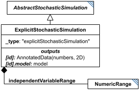

**Category:** tasks  
**Version:** v1  
**Schema:** [`schema.json`](specsheets/tasks/ExplicitStochasticSimulation/v1.0.0/schema.json)  
**`_type` discriminator:** `"explicitStochasticSimulation"`  

##### What it does

A stochastic simulation is one where the model's processes (e.g. SBML reactions) are treated as statistical likelihoods of occurring, rather than as continuous rates of change - distinct from a Stochastic Differential Equation, where the rates themselves are stochastic.

`ExplicitStochasticSimulation` has its output points defined by the child `independentVariableRange`. The stochastic events themselves need not fall on those output points - whatever the model's element values are *at* each output point is what gets recorded.

This is an implementation of KISAO:0000319 (Monte Carlo method).

##### Attributes

All classes additionally inherit the optional `name`, `description`, `notes`, and `annotations` fields from `SEDBase` - see [`core/SEDBase`](#sedbase).

| Attribute | Type | Required | Notes |
|---|---|---|---|
| `taskParameters` | array of TaskParameter | no |  |
| `model` | SIdRef | yes |  |
| `independentVariable` | StringOrRef | yes |  |
| `independentVariableInit` | NumberOrRef | no |  |
| `outputVariables` | ListOfStringsOrRef | yes |  |
| `workingAlgorithms` | array of WorkingAlgorithm | no |  |
| `independentVariableRange` | NumericRangeInline | yes |  |
| `seed` | NumberOrRef | no |  |
| `timeDependentRelativeTolerance` | NumberOrRef | no |  |
| `variableStepSize` | BooleanOrRef | no |  |
| `minimumTimeStep` | NumberOrRef | no |  |
| `maximumTimeStep` | NumberOrRef | no |  |
| `nonNegative` | BooleanOrRef | no |  |
| `maxOutputRows` | PositiveIntegerOrRef | no |  |
| `maxNumSteps` | PositiveIntegerOrRef | no |  |

###### Attribute details

**`taskParameters`** (array of TaskParameter, optional) - _(no description yet - placeholder, needs to be filled in)_

**`model`** (SIdRef, required) - _(no description yet - placeholder, needs to be filled in)_

**`independentVariable`** (StringOrRef, required) - _(no description yet - placeholder, needs to be filled in)_

**`independentVariableInit`** (NumberOrRef, optional) - _(no description yet - placeholder, needs to be filled in)_

**`outputVariables`** (ListOfStringsOrRef, required) - _(no description yet - placeholder, needs to be filled in)_

**`workingAlgorithms`** (array of WorkingAlgorithm, optional) - _(no description yet - placeholder, needs to be filled in)_

**`independentVariableRange`** (NumericRangeInline, required) - _(no description yet - placeholder, needs to be filled in)_

**`seed`** (NumberOrRef, optional) - _(no description yet - placeholder, needs to be filled in)_

**`timeDependentRelativeTolerance`** (NumberOrRef, optional) - _(no description yet - placeholder, needs to be filled in)_

**`variableStepSize`** (BooleanOrRef, optional) - _(no description yet - placeholder, needs to be filled in)_

**`minimumTimeStep`** (NumberOrRef, optional) - _(no description yet - placeholder, needs to be filled in)_

**`maximumTimeStep`** (NumberOrRef, optional) - _(no description yet - placeholder, needs to be filled in)_

**`nonNegative`** (BooleanOrRef, optional) - _(no description yet - placeholder, needs to be filled in)_

**`maxOutputRows`** (PositiveIntegerOrRef, optional) - _(no description yet - placeholder, needs to be filled in)_

**`maxNumSteps`** (PositiveIntegerOrRef, optional) - _(no description yet - placeholder, needs to be filled in)_


##### Outputs

A 2D matrix of numbers, accessible as `[id]`: the first column is `independentVariable`, subsequent columns are (in order) each variable from `outputVariables`. The model's end-of-run state is always also available as `[id].model`.

- `[id]`: **Valid**
    - Dimensions: 2D: rows = each value in `independentVariableRange`; columns = `independentVariable` plus one column per entry of `outputVariables` (same layout as `ExplicitODESimulation`).
- `[id].model`: **Valid**
- `[id].strings`: **Invalid**

##### Validation Rules

**`ExplicitStochasticSimulation-0000`** (error) - The element fails a JSON Schema constraint attributable to ExplicitStochasticSimulation that does not match any other numbered rule. ([source](specsheets/tasks/ExplicitStochasticSimulation/v1.0.0/validation/ExplicitStochasticSimulation-0000.md))

> Catch-all rule for schema-pass failures attributable to ExplicitStochasticSimulation (or a
> more specific descendant whose own class's failure location can't be
> resolved to any other numbered rule). See Design.md, Schema-Pass Errors.

**`ExplicitStochasticSimulation-0001`** (error) - The model attribute of an ExplicitStochasticSimulation is required. ([source](specsheets/tasks/ExplicitStochasticSimulation/v1.0.0/validation/ExplicitStochasticSimulation-0001.md))

> `model` is required.

**`ExplicitStochasticSimulation-0002`** (error) - The independentVariable attribute of an ExplicitStochasticSimulation is required. ([source](specsheets/tasks/ExplicitStochasticSimulation/v1.0.0/validation/ExplicitStochasticSimulation-0002.md))

> `independentVariable` is required.

**`ExplicitStochasticSimulation-0003`** (error) - The outputVariables attribute of an ExplicitStochasticSimulation is required. ([source](specsheets/tasks/ExplicitStochasticSimulation/v1.0.0/validation/ExplicitStochasticSimulation-0003.md))

> `outputVariables` is required.

**`ExplicitStochasticSimulation-0004`** (error) - The independentVariableRange attribute of an ExplicitStochasticSimulation is required. ([source](specsheets/tasks/ExplicitStochasticSimulation/v1.0.0/validation/ExplicitStochasticSimulation-0004.md))

> `independentVariableRange` is required.

**`ExplicitStochasticSimulation-0005`** (error) - The independentVariableRange attribute of an ExplicitStochasticSimulation must be a NumericRangeInline object. ([source](specsheets/tasks/ExplicitStochasticSimulation/v1.0.0/validation/ExplicitStochasticSimulation-0005.md))

> `independentVariableRange` is `NumericRangeInline`: it must be a NumericRangeInline object.

**`ExplicitStochasticSimulation-0006`** (error) - The _type attribute of an ExplicitStochasticSimulation must be "explicitStochasticSimulation". ([source](specsheets/tasks/ExplicitStochasticSimulation/v1.0.0/validation/ExplicitStochasticSimulation-0006.md))

> `_type` is the discriminator field. For `ExplicitStochasticSimulation` it must always equal `"explicitStochasticSimulation"`.

#### FluxBalanceAnalysis

*Source: [specsheets/tasks/FluxBalanceAnalysis/v1.0.0/description.md](specsheets/tasks/FluxBalanceAnalysis/v1.0.0/description.md)*

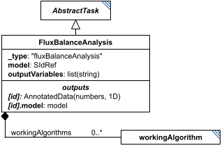

**Category:** tasks  
**Version:** v1  
**Schema:** [`schema.json`](specsheets/tasks/FluxBalanceAnalysis/v1.0.0/schema.json)  
**`_type` discriminator:** `"fluxBalanceAnalysis"`

##### What it does

Uses an objective function and reaction rate bounds (both defined within the model itself) to determine the set of reaction rates that maximizes the objective function. Unlike the other simulation tasks, FBA has no independent variable.

This is an implementation of KISAO:0000437 (FBA). The algorithm(s) it uses internally may be listed in the optional `workingAlgorithms` (see `WorkingAlgorithm`).

##### Attributes

All classes additionally inherit the optional `name`, `description`, `notes`, and `annotations` fields from `SEDBase` - see [`core/SEDBase`](#sedbase).

| Attribute | Type | Required | Notes |
|---|---|---|---|
| `taskParameters` | array of TaskParameter | no |  |
| `model` | SIdRef | yes |  |
| `outputVariables` | ListOfStringsOrRef | yes |  |
| `workingAlgorithms` | array of WorkingAlgorithm | no |  |

###### Attribute details

**`taskParameters`** (array of TaskParameter, optional) - _(no description yet - placeholder, needs to be filled in)_

**`model`** (SIdRef, required) - _(no description yet - placeholder, needs to be filled in)_

**`outputVariables`** (ListOfStringsOrRef, required) - _(no description yet - placeholder, needs to be filled in)_

**`workingAlgorithms`** (array of WorkingAlgorithm, optional) - _(no description yet - placeholder, needs to be filled in)_


##### Outputs

A dictionary of model variables (usually fluxes) to their final values, accessible via `outputVariables` as `[id]` - analogous to a `SteadyState` result. The resulting model state is always also available as `[id].model`.

- `[id]`: **Valid**
    - Dimensions: 1D: one value per entry of `outputVariables` (typically reaction fluxes) - length depends on how many variables are named there.
- `[id].model`: **Valid**
- `[id].strings`: **Invalid**

##### Validation Rules

**`FluxBalanceAnalysis-0000`** (error) - The element fails a JSON Schema constraint attributable to FluxBalanceAnalysis that does not match any other numbered rule. ([source](specsheets/tasks/FluxBalanceAnalysis/v1.0.0/validation/FluxBalanceAnalysis-0000.md))

> Catch-all rule for schema-pass failures attributable to FluxBalanceAnalysis (or a
> more specific descendant whose own class's failure location can't be
> resolved to any other numbered rule). See Design.md, Schema-Pass Errors.

**`FluxBalanceAnalysis-0001`** (error) - The model attribute of a FluxBalanceAnalysis is required. ([source](specsheets/tasks/FluxBalanceAnalysis/v1.0.0/validation/FluxBalanceAnalysis-0001.md))

> `model` is required.

**`FluxBalanceAnalysis-0002`** (error) - The model attribute of a FluxBalanceAnalysis, if present, must be a reference (a string starting with '#'). ([source](specsheets/tasks/FluxBalanceAnalysis/v1.0.0/validation/FluxBalanceAnalysis-0002.md))

> `model` is `SIdRef` - always a reference, never a literal value.

**`FluxBalanceAnalysis-0003`** (error) - The outputVariables attribute of a FluxBalanceAnalysis is required. ([source](specsheets/tasks/FluxBalanceAnalysis/v1.0.0/validation/FluxBalanceAnalysis-0003.md))

> `outputVariables` is required.

**`FluxBalanceAnalysis-0004`** (error) - When the value of outputVariables of a FluxBalanceAnalysis is provided directly, it must be an array of strings. ([source](specsheets/tasks/FluxBalanceAnalysis/v1.0.0/validation/FluxBalanceAnalysis-0004.md))

> `outputVariables` is `ListOfStringsOrRef`: the value, when not a reference, must be an array of strings.

**`FluxBalanceAnalysis-0005`** (error) - When the value of outputVariables of a FluxBalanceAnalysis is a reference, it must be a reference to an array of strings. ([source](specsheets/tasks/FluxBalanceAnalysis/v1.0.0/validation/FluxBalanceAnalysis-0005.md))

> `outputVariables` is `ListOfStringsOrRef`: when the value is a reference, it must resolve to an array of strings.

**`FluxBalanceAnalysis-0008`** (error) - The _type attribute of a FluxBalanceAnalysis must be "fluxBalanceAnalysis". ([source](specsheets/tasks/FluxBalanceAnalysis/v1.0.0/validation/FluxBalanceAnalysis-0008.md))

> `_type` is the discriminator field. For `FluxBalanceAnalysis` it must always equal `"fluxBalanceAnalysis"`.

**`FluxBalanceAnalysis-0009`** (error) - The workingAlgorithms attribute of a FluxBalanceAnalysis, if present, must be an array of WorkingAlgorithm objects. ([source](specsheets/tasks/FluxBalanceAnalysis/v1.0.0/validation/FluxBalanceAnalysis-0009.md))

> `workingAlgorithms` is optional; when present, each entry must be a `WorkingAlgorithm` object.

#### JacobianFull

*Source: [specsheets/tasks/JacobianFull/v1.0.0/description.md](specsheets/tasks/JacobianFull/v1.0.0/description.md)*

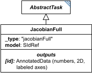

**Category:** tasks  
**Version:** v1  
**Schema:** [`schema.json`](specsheets/tasks/JacobianFull/v1.0.0/schema.json)  
**`_type` discriminator:** `"jacobianFull"`

##### What it does

Calculates the full Jacobian matrix of a model - a species-by-species matrix, with identical row and column species orderings. Split out from the former single `Jacobian` class (which distinguished full vs. reduced via an `isFull` flag) into its own `_type`, alongside `JacobianReduced`.

This is an implementation of KISAO:0000812 (full Jacobian).

##### Attributes

All classes additionally inherit the optional `name`, `description`, `notes`, and `annotations` fields from `SEDBase` - see [`core/SEDBase`](#sedbase).

| Attribute | Type | Required | Notes |
|---|---|---|---|
| `taskParameters` | array of TaskParameter | no |  |
| `model` | SIdRef | yes |  |

###### Attribute details

**`taskParameters`** (array of TaskParameter, optional) - _(no description yet - placeholder, needs to be filled in)_

**`model`** (SIdRef, required) - _(no description yet - placeholder, needs to be filled in)_


##### Outputs

The full Jacobian as a list of lists, accessible as `[id]`, with axis labels given by the ordered list of species.

- `[id]`: **Valid**
    - Dimensions: 2D: species x species - row and column ordering both match the model's ordered list of species.
- `[id].model`: **Invalid**
- `[id].strings`: **Invalid**

##### Validation Rules

**`JacobianFull-0000`** (error) - The element fails a JSON Schema constraint attributable to JacobianFull that does not match any other numbered rule. ([source](specsheets/tasks/JacobianFull/v1.0.0/validation/JacobianFull-0000.md))

> Catch-all rule for schema-pass failures attributable to JacobianFull (or a
> more specific descendant whose own class's failure location can't be
> resolved to any other numbered rule). See Design.md, Schema-Pass Errors.

**`JacobianFull-0001`** (error) - The model attribute of a JacobianFull is required. ([source](specsheets/tasks/JacobianFull/v1.0.0/validation/JacobianFull-0001.md))

> `model` is required.

**`JacobianFull-0002`** (error) - The model attribute of a JacobianFull, if present, must be a reference (a string starting with '#'). ([source](specsheets/tasks/JacobianFull/v1.0.0/validation/JacobianFull-0002.md))

> `model` is `SIdRef` - always a reference, never a literal value.

**`JacobianFull-0003`** (error) - The _type attribute of a JacobianFull must be "jacobianFull". ([source](specsheets/tasks/JacobianFull/v1.0.0/validation/JacobianFull-0003.md))

> `_type` is the discriminator field. For `JacobianFull` it must always equal `"jacobianFull"`.

#### JacobianReduced

*Source: [specsheets/tasks/JacobianReduced/v1.0.0/description.md](specsheets/tasks/JacobianReduced/v1.0.0/description.md)*

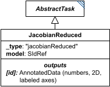

**Category:** tasks  
**Version:** v1  
**Schema:** [`schema.json`](specsheets/tasks/JacobianReduced/v1.0.0/schema.json)  
**`_type` discriminator:** `"jacobianReduced"`

##### What it does

Calculates the reduced Jacobian matrix of a model - a species-by-species matrix over a reduced subset of species, with identical row and column orderings. Split out from the former single `Jacobian` class (which distinguished full vs. reduced via an `isFull` flag) into its own `_type`, alongside `JacobianFull`.

This is an implementation of KISAO:0000809 (reduced Jacobian).

##### Attributes

All classes additionally inherit the optional `name`, `description`, `notes`, and `annotations` fields from `SEDBase` - see [`core/SEDBase`](#sedbase).

| Attribute | Type | Required | Notes |
|---|---|---|---|
| `taskParameters` | array of TaskParameter | no |  |
| `model` | SIdRef | yes |  |

###### Attribute details

**`taskParameters`** (array of TaskParameter, optional) - _(no description yet - placeholder, needs to be filled in)_

**`model`** (SIdRef, required) - _(no description yet - placeholder, needs to be filled in)_


##### Outputs

The reduced Jacobian as a list of lists, accessible as `[id]`, with axis labels given by the ordered reduced list of species.

- `[id]`: **Valid**
    - Dimensions: 2D: species x species (reduced subset) - row and column ordering both match the model's ordered, reduced list of species.
- `[id].model`: **Invalid**
- `[id].strings`: **Invalid**

##### Validation Rules

**`JacobianReduced-0000`** (error) - The element fails a JSON Schema constraint attributable to JacobianReduced that does not match any other numbered rule. ([source](specsheets/tasks/JacobianReduced/v1.0.0/validation/JacobianReduced-0000.md))

> Catch-all rule for schema-pass failures attributable to JacobianReduced (or a
> more specific descendant whose own class's failure location can't be
> resolved to any other numbered rule). See Design.md, Schema-Pass Errors.

**`JacobianReduced-0001`** (error) - The model attribute of a JacobianReduced is required. ([source](specsheets/tasks/JacobianReduced/v1.0.0/validation/JacobianReduced-0001.md))

> `model` is required.

**`JacobianReduced-0002`** (error) - The model attribute of a JacobianReduced, if present, must be a reference (a string starting with '#'). ([source](specsheets/tasks/JacobianReduced/v1.0.0/validation/JacobianReduced-0002.md))

> `model` is `SIdRef` - always a reference, never a literal value.

**`JacobianReduced-0003`** (error) - The _type attribute of a JacobianReduced must be "jacobianReduced". ([source](specsheets/tasks/JacobianReduced/v1.0.0/validation/JacobianReduced-0003.md))

> `_type` is the discriminator field. For `JacobianReduced` it must always equal `"jacobianReduced"`.

#### Loop

*Source: [specsheets/tasks/Loop/v1.0.0/description.md](specsheets/tasks/Loop/v1.0.0/description.md)*

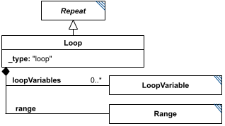

**Category:** tasks  
**Version:** v1  
**Schema:** [`schema.json`](specsheets/tasks/Loop/v1.0.0/schema.json)  
**`_type` discriminator:** `"loop"`

##### What it does

A `Repeat` whose iterations are chained: each depends on the output of the previous one, with one iteration per element of its required `range` (a `Range`/`NumericRange`/`ParameterRange`), taken in order; a `Loop` always runs all of them and cannot end early. The chaining is expressed with `loopVariables` - named `LoopVariable` entries whose value equals `initialValue` on the first iteration and thereafter equals `subsequentValues` (an output of one of the loop's `subTasks`). A subTask references a loop variable as `#tasks:[loop_id]:loopVariables:[loopvar_id]`.

##### Attributes

All classes additionally inherit the optional `name`, `description`, `notes`, and `annotations` fields from `SEDBase` - see [`core/SEDBase`](#sedbase).

| Attribute | Type | Required | Notes |
|---|---|---|---|
| `taskParameters` | array of TaskParameter | no |  |
| `subTasks` | object (values: AbstractTask) | yes |  |
| `outputVariableMap` | object (values: SIdRef) or SIdRef | no |  |
| `aggregateOutputVariables` | object (values: AggregationCalculation) | no |  |
| `range` | RangeInline | yes |  |
| `loopVariables` | object (values: LoopVariable) | yes |  |

###### Attribute details

**`taskParameters`** (array of TaskParameter, optional) - _(no description yet - placeholder, needs to be filled in)_

**`subTasks`** (object (values: AbstractTask), required) - _(no description yet - placeholder, needs to be filled in)_

**`outputVariableMap`** (object (values: SIdRef) or SIdRef, optional) - _(no description yet - placeholder, needs to be filled in)_

**`aggregateOutputVariables`** (object (values: AggregationCalculation), optional) - _(no description yet - placeholder, needs to be filled in)_

**`range`** (RangeInline, required) - _(no description yet - placeholder, needs to be filled in)_

**`loopVariables`** (object (values: LoopVariable), required) - _(no description yet - placeholder, needs to be filled in)_


##### Outputs

`[id]`: an `AnnotatedData` whose first column is the range values and whose subsequent columns follow `outputVariableMap`. `[id].aggregates`: an `AnnotatedData` following `aggregateOutputVariables`, when defined.

- `[id]`: **Valid**
    - Dimensions: 2D (or more): first dimension = one row per value in `range`; remaining dimension(s) = one column per entry of `outputVariableMap` (or just the range-values column alone, if `outputVariableMap` is empty). As with `Scatter`, the row count is known in advance from `range`. A column whose subTask output is itself multi-dimensional would add further dimensions - not pinned down further here.
- `[id].model`: **Invalid**
- `[id].strings`: **Invalid**

Additional possible outputs beyond the three standard ones:

- `[id].aggregates`: An `AnnotatedData` following `aggregateOutputVariables`.  If that attribute is not defined, the `AnnotatedData` is empty.
    - Dimensions: 1D: one entry per `aggregateOutputVariables` mapping, each collapsing the iteration dimension of `[id]` down to a single value (per `Repeat`, the applied dimension defaults to the Repeat's own iterations) - unless the underlying subTask output was itself multi-dimensional, in which case that dimensionality carries through per entry.
- `[id].range`: Within the loop, the current value of `range`.
    - Dimensions: Scalar (0-D) per iteration.
- `[id].index`: Within the loop, the current index into `range`.
    - Dimensions: Scalar (0-D) per iteration.

##### Validation Rules

**`Loop-0000`** (error) - The element fails a JSON Schema constraint attributable to Loop that does not match any other numbered rule. ([source](specsheets/tasks/Loop/v1.0.0/validation/Loop-0000.md))

> Catch-all rule for schema-pass failures attributable to Loop (or a
> more specific descendant whose own class's failure location can't be
> resolved to any other numbered rule). See Design.md, Schema-Pass Errors.

**`Loop-0001`** (error) - The subTasks attribute of a Loop is required. ([source](specsheets/tasks/Loop/v1.0.0/validation/Loop-0001.md))

> `subTasks` is required.

**`Loop-0002`** (error) - The loopVariables attribute of a Loop is required. ([source](specsheets/tasks/Loop/v1.0.0/validation/Loop-0002.md))

> `loopVariables` is required.

**`Loop-0003`** (error) - The loopVariables attribute of a Loop must be an object whose values are LoopVariable. ([source](specsheets/tasks/Loop/v1.0.0/validation/Loop-0003.md))

> `loopVariables` is `object (values: LoopVariable)`: it must be an object whose values are LoopVariable.

**`Loop-0005`** (error) - The _type attribute of a Loop must be "loop". ([source](specsheets/tasks/Loop/v1.0.0/validation/Loop-0005.md))

> `_type` is the discriminator field. For `Loop` it must always equal `"loop"`.

**`Loop-0006`** (error) - The range attribute of a Loop is required. ([source](specsheets/tasks/Loop/v1.0.0/validation/Loop-0006.md))

> `range` is required.

**`Loop-0007`** (error) - The range attribute of a Loop must be a RangeInline object. ([source](specsheets/tasks/Loop/v1.0.0/validation/Loop-0007.md))

> `range` must be a `Range`/`NumericRange`/`ParameterRange` object in its embedded `RangeInline` form.

#### ModelChange

*Source: [specsheets/tasks/ModelChange/v1.0.0/description.md](specsheets/tasks/ModelChange/v1.0.0/description.md)*

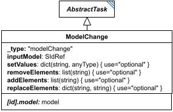

**Category:** tasks  
**Version:** v1  
**Schema:** [`schema.json`](specsheets/tasks/ModelChange/v1.0.0/schema.json)  
**`_type` discriminator:** `"modelChange"`

##### What it does

`ModelChange` modifies a model (`inputModel`, an `SIdRef` to another element's model output) and produces a new model as `[id].model`.

Four optional attributes each describe a kind of change: `setValues` (the simplest - sets the string key to the corresponding value, most commonly a model element id mapped to a number, though model-format-specific keys like `"S1.boundary"` are also possible), `removeElements` (removes the named element from the model; anything still referencing it must be separately handled), `addElements` (adds the named element to the model - e.g. an Antimony-formatted string for SBML), and `replaceElements` (each key is removed and replaced by its value, with internal references retargeted). `replaceElements` is inherited from SED-ML Level 1 and was rarely used there; the spec authors flag it as a candidate for removal from SED2, since `addElements`/`removeElements` can accomplish most of the same thing.

##### Attributes

All classes additionally inherit the optional `name`, `description`, `notes`, and `annotations` fields from `SEDBase` - see [`core/SEDBase`](#sedbase).

| Attribute | Type | Required | Notes |
|---|---|---|---|
| `taskParameters` | array of TaskParameter | no |  |
| `inputModel` | SIdRef | yes |  |
| `setValues` | object (values: AnyValueOrRef) or SIdRef | no |  |
| `removeElements` | ListOfStringsOrRef | no |  |
| `addElements` | ListOfStringsOrRef | no |  |
| `replaceElements` | object (values: StringOrRef) or SIdRef | no |  |

###### Attribute details

**`taskParameters`** (array of TaskParameter, optional) - _(no description yet - placeholder, needs to be filled in)_

**`inputModel`** (SIdRef, required) - _(no description yet - placeholder, needs to be filled in)_

**`setValues`** (object (values: AnyValueOrRef) or SIdRef, optional) - _(no description yet - placeholder, needs to be filled in)_

**`removeElements`** (ListOfStringsOrRef, optional) - _(no description yet - placeholder, needs to be filled in)_

**`addElements`** (ListOfStringsOrRef, optional) - _(no description yet - placeholder, needs to be filled in)_

**`replaceElements`** (object (values: StringOrRef) or SIdRef, optional) - _(no description yet - placeholder, needs to be filled in)_


##### Outputs

The modified model, accessible as `[id].model`.

- `[id]`: **Invalid**
- `[id].model`: **Valid**
- `[id].strings`: **Invalid**

##### Open issues / notes

- The spec text itself questions whether `replaceElements` should be kept in SED2 at all - worth a decision before this attribute is finalized.

##### Validation Rules

**`ModelChange-0000`** (error) - The element fails a JSON Schema constraint attributable to ModelChange that does not match any other numbered rule. ([source](specsheets/tasks/ModelChange/v1.0.0/validation/ModelChange-0000.md))

> Catch-all rule for schema-pass failures attributable to ModelChange (or a
> more specific descendant whose own class's failure location can't be
> resolved to any other numbered rule). See Design.md, Schema-Pass Errors.

**`ModelChange-0001`** (error) - The inputModel attribute of a ModelChange is required. ([source](specsheets/tasks/ModelChange/v1.0.0/validation/ModelChange-0001.md))

> `inputModel` is required.

**`ModelChange-0002`** (error) - The inputModel attribute of a ModelChange, if present, must be a reference (a string starting with '#'). ([source](specsheets/tasks/ModelChange/v1.0.0/validation/ModelChange-0002.md))

> `inputModel` is `SIdRef` - always a reference, never a literal value.

**`ModelChange-0003`** (error) - When the value of setValues of a ModelChange is provided directly, it must be an object whose values are AnyValueOrRef. ([source](specsheets/tasks/ModelChange/v1.0.0/validation/ModelChange-0003.md))

> `setValues` is `object (values: AnyValueOrRef) or SIdRef`: the value, when not a reference, must be an object whose values are AnyValueOrRef.

**`ModelChange-0004`** (error) - When the value of setValues of a ModelChange is a reference, it must be a reference to an object whose values are AnyValueOrRef. ([source](specsheets/tasks/ModelChange/v1.0.0/validation/ModelChange-0004.md))

> `setValues` is `object (values: AnyValueOrRef) or SIdRef`: when the value is a reference, it must resolve to an object whose values are AnyValueOrRef.

**`ModelChange-0005`** (error) - When the value of removeElements of a ModelChange is provided directly, it must be an array of strings. ([source](specsheets/tasks/ModelChange/v1.0.0/validation/ModelChange-0005.md))

> `removeElements` is `ListOfStringsOrRef`: the value, when not a reference, must be an array of strings.

**`ModelChange-0006`** (error) - When the value of removeElements of a ModelChange is a reference, it must be a reference to an array of strings. ([source](specsheets/tasks/ModelChange/v1.0.0/validation/ModelChange-0006.md))

> `removeElements` is `ListOfStringsOrRef`: when the value is a reference, it must resolve to an array of strings.

**`ModelChange-0007`** (error) - When the value of addElements of a ModelChange is provided directly, it must be an array of strings. ([source](specsheets/tasks/ModelChange/v1.0.0/validation/ModelChange-0007.md))

> `addElements` is `ListOfStringsOrRef`: the value, when not a reference, must be an array of strings.

**`ModelChange-0008`** (error) - When the value of addElements of a ModelChange is a reference, it must be a reference to an array of strings. ([source](specsheets/tasks/ModelChange/v1.0.0/validation/ModelChange-0008.md))

> `addElements` is `ListOfStringsOrRef`: when the value is a reference, it must resolve to an array of strings.

**`ModelChange-0009`** (error) - When the value of replaceElements of a ModelChange is provided directly, it must be an object whose values are StringOrRef. ([source](specsheets/tasks/ModelChange/v1.0.0/validation/ModelChange-0009.md))

> `replaceElements` is `object (values: StringOrRef) or SIdRef`: the value, when not a reference, must be an object whose values are StringOrRef.

**`ModelChange-0010`** (error) - When the value of replaceElements of a ModelChange is a reference, it must be a reference to an object whose values are StringOrRef. ([source](specsheets/tasks/ModelChange/v1.0.0/validation/ModelChange-0010.md))

> `replaceElements` is `object (values: StringOrRef) or SIdRef`: when the value is a reference, it must resolve to an object whose values are StringOrRef.

**`ModelChange-0011`** (error) - The _type attribute of a ModelChange must be "modelChange". ([source](specsheets/tasks/ModelChange/v1.0.0/validation/ModelChange-0011.md))

> `_type` is the discriminator field. For `ModelChange` it must always equal `"modelChange"`.

#### ModelElementList

*Source: [specsheets/tasks/ModelElementList/v1.0.0/description.md](specsheets/tasks/ModelElementList/v1.0.0/description.md)*

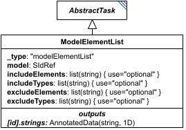

**Category:** tasks  
**Version:** v1  
**Schema:** [`schema.json`](specsheets/tasks/ModelElementList/v1.0.0/schema.json)  
**`_type` discriminator:** `"modelElementList"`

##### What it does

`ModelElementList` analyzes a model and returns a list of element-id strings, filtered by `includeElements`/`includeTypes`/`excludeElements`/`excludeTypes` - four lists of strings whose meaning is defined per model format. For example, for SBML, putting `"J0"`/`"J1"` in `includeElements`, `"species"` in `includeTypes`, and `"S1"` in `excludeElements` selects 'every species plus reactions J0 and J1, except S1'. If an element appears in both an include and an exclude list, it is excluded.

##### Attributes

All classes additionally inherit the optional `name`, `description`, `notes`, and `annotations` fields from `SEDBase` - see [`core/SEDBase`](#sedbase).

| Attribute | Type | Required | Notes |
|---|---|---|---|
| `taskParameters` | array of TaskParameter | no |  |
| `model` | SIdRef | yes |  |
| `includeElements` | ListOfStringsOrRef | no |  |
| `includeTypes` | ListOfStringsOrRef | no |  |
| `excludeElements` | ListOfStringsOrRef | no |  |
| `excludeTypes` | ListOfStringsOrRef | no |  |

###### Attribute details

**`taskParameters`** (array of TaskParameter, optional) - _(no description yet - placeholder, needs to be filled in)_

**`model`** (SIdRef, required) - _(no description yet - placeholder, needs to be filled in)_

**`includeElements`** (ListOfStringsOrRef, optional) - _(no description yet - placeholder, needs to be filled in)_

**`includeTypes`** (ListOfStringsOrRef, optional) - _(no description yet - placeholder, needs to be filled in)_

**`excludeElements`** (ListOfStringsOrRef, optional) - _(no description yet - placeholder, needs to be filled in)_

**`excludeTypes`** (ListOfStringsOrRef, optional) - _(no description yet - placeholder, needs to be filled in)_


##### Outputs

A list of element-id strings, accessible as `[id]`.

- `[id]`: **Invalid**
- `[id].model`: **Invalid**
- `[id].strings`: **Valid**
    - Dimensions: 1D: one string per matched model element (after `includeElements`/`includeTypes`/`excludeElements`/`excludeTypes` filtering) - length not fixed ahead of time, depends on the referenced model.

Corrected here to `[id].strings`, per the general `AbstractTask` addressing convention for a list-of-strings export - an earlier draft of this Data Sheet said `[id]`; flagging in case `[id]` was actually intended.

##### Validation Rules

**`ModelElementList-0000`** (error) - The element fails a JSON Schema constraint attributable to ModelElementList that does not match any other numbered rule. ([source](specsheets/tasks/ModelElementList/v1.0.0/validation/ModelElementList-0000.md))

> Catch-all rule for schema-pass failures attributable to ModelElementList (or a
> more specific descendant whose own class's failure location can't be
> resolved to any other numbered rule). See Design.md, Schema-Pass Errors.

**`ModelElementList-0001`** (error) - The model attribute of a ModelElementList is required. ([source](specsheets/tasks/ModelElementList/v1.0.0/validation/ModelElementList-0001.md))

> `model` is required.

**`ModelElementList-0002`** (error) - The model attribute of a ModelElementList, if present, must be a reference (a string starting with '#'). ([source](specsheets/tasks/ModelElementList/v1.0.0/validation/ModelElementList-0002.md))

> `model` is `SIdRef` - always a reference, never a literal value.

**`ModelElementList-0003`** (error) - When the value of includeElements of a ModelElementList is provided directly, it must be an array of strings. ([source](specsheets/tasks/ModelElementList/v1.0.0/validation/ModelElementList-0003.md))

> `includeElements` is `ListOfStringsOrRef`: the value, when not a reference, must be an array of strings.

**`ModelElementList-0004`** (error) - When the value of includeElements of a ModelElementList is a reference, it must be a reference to an array of strings. ([source](specsheets/tasks/ModelElementList/v1.0.0/validation/ModelElementList-0004.md))

> `includeElements` is `ListOfStringsOrRef`: when the value is a reference, it must resolve to an array of strings.

**`ModelElementList-0005`** (error) - When the value of includeTypes of a ModelElementList is provided directly, it must be an array of strings. ([source](specsheets/tasks/ModelElementList/v1.0.0/validation/ModelElementList-0005.md))

> `includeTypes` is `ListOfStringsOrRef`: the value, when not a reference, must be an array of strings.

**`ModelElementList-0006`** (error) - When the value of includeTypes of a ModelElementList is a reference, it must be a reference to an array of strings. ([source](specsheets/tasks/ModelElementList/v1.0.0/validation/ModelElementList-0006.md))

> `includeTypes` is `ListOfStringsOrRef`: when the value is a reference, it must resolve to an array of strings.

**`ModelElementList-0007`** (error) - When the value of excludeElements of a ModelElementList is provided directly, it must be an array of strings. ([source](specsheets/tasks/ModelElementList/v1.0.0/validation/ModelElementList-0007.md))

> `excludeElements` is `ListOfStringsOrRef`: the value, when not a reference, must be an array of strings.

**`ModelElementList-0008`** (error) - When the value of excludeElements of a ModelElementList is a reference, it must be a reference to an array of strings. ([source](specsheets/tasks/ModelElementList/v1.0.0/validation/ModelElementList-0008.md))

> `excludeElements` is `ListOfStringsOrRef`: when the value is a reference, it must resolve to an array of strings.

**`ModelElementList-0009`** (error) - When the value of excludeTypes of a ModelElementList is provided directly, it must be an array of strings. ([source](specsheets/tasks/ModelElementList/v1.0.0/validation/ModelElementList-0009.md))

> `excludeTypes` is `ListOfStringsOrRef`: the value, when not a reference, must be an array of strings.

**`ModelElementList-0010`** (error) - When the value of excludeTypes of a ModelElementList is a reference, it must be a reference to an array of strings. ([source](specsheets/tasks/ModelElementList/v1.0.0/validation/ModelElementList-0010.md))

> `excludeTypes` is `ListOfStringsOrRef`: when the value is a reference, it must resolve to an array of strings.

**`ModelElementList-0011`** (error) - The _type attribute of a ModelElementList must be "modelElementList". ([source](specsheets/tasks/ModelElementList/v1.0.0/validation/ModelElementList-0011.md))

> `_type` is the discriminator field. For `ModelElementList` it must always equal `"modelElementList"`.

#### ModelImport

*Source: [specsheets/tasks/ModelImport/v1.0.0/description.md](specsheets/tasks/ModelImport/v1.0.0/description.md)*

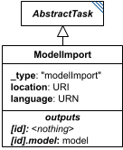

**Category:** tasks  
**Version:** v1  
**Schema:** [`schema.json`](specsheets/tasks/ModelImport/v1.0.0/schema.json)  
**`_type` discriminator:** `"modelImport"`

##### What it does

Two tasks are designed to import files from an external source: `ModelImport` and `DataImport`. All other tasks use predefined input (attribute values) or information defined elsewhere in the document.

A `ModelImport`'s `location` is a URI pointing to a model file; `language` is a URN naming what kind of model it is (e.g. `urn:sedml:language:sbml`). The task's own id carries no independent meaning and should not be referenced directly.

##### Attributes

All classes additionally inherit the optional `name`, `description`, `notes`, and `annotations` fields from `SEDBase` - see [`core/SEDBase`](#sedbase).

| Attribute | Type | Required | Notes |
|---|---|---|---|
| `taskParameters` | array of TaskParameter | no |  |
| `location` | URIOrRef | yes |  |
| `language` | URNOrRef | yes |  |

###### Attribute details

**`taskParameters`** (array of TaskParameter, optional) - _(no description yet - placeholder, needs to be filled in)_

**`location`** (URIOrRef, required) - _(no description yet - placeholder, needs to be filled in)_

**`language`** (URNOrRef, required) - _(no description yet - placeholder, needs to be filled in)_


##### Outputs

The imported model, accessible as `[id].model` (e.g. `#tasks:model1.model`). The bare id (`#tasks:model1`) has no meaning and must not be used.

- `[id]`: **Invalid**
- `[id].model`: **Valid**
- `[id].strings`: **Invalid**

The bare id (`#tasks:model1`) has no meaning and must not be used.

##### Validation Rules

**`ModelImport-0000`** (error) - The element fails a JSON Schema constraint attributable to ModelImport that does not match any other numbered rule. ([source](specsheets/tasks/ModelImport/v1.0.0/validation/ModelImport-0000.md))

> Catch-all rule for schema-pass failures attributable to ModelImport (or a
> more specific descendant whose own class's failure location can't be
> resolved to any other numbered rule). See Design.md, Schema-Pass Errors.

**`ModelImport-0001`** (error) - The location attribute of a ModelImport is required. ([source](specsheets/tasks/ModelImport/v1.0.0/validation/ModelImport-0001.md))

> `location` is required.

**`ModelImport-0002`** (error) - When the value of location of a ModelImport is provided directly, it must be a URI string. ([source](specsheets/tasks/ModelImport/v1.0.0/validation/ModelImport-0002.md))

> `location` is `URIOrRef`: the value, when not a reference, must be a URI string.

**`ModelImport-0003`** (error) - When the value of location of a ModelImport is a reference, it must be a reference to a URI string. ([source](specsheets/tasks/ModelImport/v1.0.0/validation/ModelImport-0003.md))

> `location` is `URIOrRef`: when the value is a reference, it must resolve to a URI string.

**`ModelImport-0004`** (error) - The language attribute of a ModelImport is required. ([source](specsheets/tasks/ModelImport/v1.0.0/validation/ModelImport-0004.md))

> `language` is required.

**`ModelImport-0005`** (error) - When the value of language of a ModelImport is provided directly, it must be a URN string. ([source](specsheets/tasks/ModelImport/v1.0.0/validation/ModelImport-0005.md))

> `language` is `URNOrRef`: the value, when not a reference, must be a URN string.

**`ModelImport-0006`** (error) - When the value of language of a ModelImport is a reference, it must be a reference to a URN string. ([source](specsheets/tasks/ModelImport/v1.0.0/validation/ModelImport-0006.md))

> `language` is `URNOrRef`: when the value is a reference, it must resolve to a URN string.

**`ModelImport-0007`** (error) - The _type attribute of a ModelImport must be "modelImport". ([source](specsheets/tasks/ModelImport/v1.0.0/validation/ModelImport-0007.md))

> `_type` is the discriminator field. For `ModelImport` it must always equal `"modelImport"`.

#### NumericRange

*Source: [specsheets/tasks/NumericRange/v1.0.0/description.md](specsheets/tasks/NumericRange/v1.0.0/description.md)*

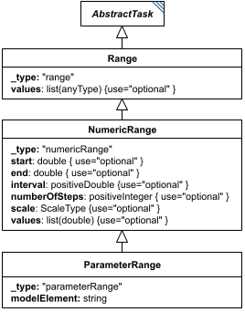

*(`NumericRange` has no standalone diagram of its own - the image above is `Range`'s diagram; `NumericRange` inherits directly from `Range` and adds nothing that would need separate illustration.)*

**Category:** tasks  
**Version:** v1  
**Schema:** [`schema.json`](specsheets/tasks/NumericRange/v1.0.0/schema.json) + [`inline.schema.json`](specsheets/tasks/NumericRange/v1.0.0/inline.schema.json) (`NumericRangeInline`)  
**`_type` discriminator:** `"numericRange"`

##### What it does

A restricted `Range` (its subclass) whose values are numeric, definable several ways. Explicitly listing every value in `values` (in which case no other attribute may be set) is one option. The other five options each use a subset of `start`, `end`, `numberOfSteps`, and `interval`:

- **`numberOfSteps` alone**: a range from 0 to `numberOfSteps` with an interval of 1.
- **`start`, `end`, `numberOfSteps` (+ required `scale`)**: the start-end interval is divided into `numberOfSteps` equal sub-intervals on a `"linear"` or `"log10"` scale, with data collected at the start and end of each sub-interval. `scale` may only (and must) be set for this combination.
- **`start`, `numberOfSteps`, `interval`**: `numberOfSteps` points collected every `interval` after `start`, with an implied end.
- **`end`, `numberOfSteps`, `interval`**: `numberOfSteps` points collected every `interval` up to `end`, with an implied start.
- **`start`, `interval`, `end`**: points collected every `interval` past `start` until `end` is reached; `end` is always included as the final point even when it doesn't fall exactly on an interval boundary. Whether a separately-calculated near-`end` point is *also* included depends on a tolerance of `interval * 1e-6`: if the nearest calculated point is within that tolerance of `end`, only `end` is kept; otherwise both are kept. For example, `start=0, end=10, interval=3` yields `[0, 3, 6, 9, 10]`; `start=0, end=10, interval=3.333` yields `[0, 3.333, 6.666, 9.999, 10]` (9.999 is far enough from 10); `interval=3.333333` instead yields `[0, 3.333333, 6.666666, 10]` (9.999999 is within tolerance of 10, so it's dropped in favor of the exact endpoint).

The spec explicitly warns that relying on readers to work out this tolerance to know what values a range produces is not best practice - output end times should generally be a simple multiple of the interval, plus the start.

**Three schema files in this folder.** `schema.json` defines `NumericRange` itself (usable standalone, as a `tasks` dictionary entry), composing `Range`'s `RangeCommon` mixin alongside its own `NumericRangeCommon`. `common.schema.json` defines `NumericRangeCommon` - `start`/`end`/`interval`/`numberOfSteps`/`scale` plus `values` narrowed to numeric-only - composed via `allOf` by `NumericRange` itself and, in turn, by `ParameterRange`. `inline.schema.json` defines `NumericRangeInline` - the wrapper used for named child fields that must be specifically numeric, e.g. `ExplicitODESimulation.independentVariableRange` / `ExplicitStochasticSimulation.independentVariableRange`. See `tasks/Range` for why the standalone and common forms are kept separate.

##### Attributes

All classes additionally inherit the optional `name`, `description`, `notes`, and `annotations` fields from `SEDBase` - see [`core/SEDBase`](#sedbase).

| Attribute | Type | Required | Notes |
|---|---|---|---|
| `taskParameters` | array of TaskParameter | no |  |
| `start` | NumberOrRef | no |  |
| `end` | NumberOrRef | no |  |
| `interval` | PositiveDoubleOrRef | no |  |
| `numberOfSteps` | PositiveIntegerOrRef | no |  |
| `scale` | ScaleTypeOrRef | no |  |
| `values` | array of NumberOrRef or SIdRef | no |  |

###### Attribute details

**`taskParameters`** (array of TaskParameter, optional) - _(no description yet - placeholder, needs to be filled in)_

**`start`** (NumberOrRef, optional) - _(no description yet - placeholder, needs to be filled in)_

**`end`** (NumberOrRef, optional) - _(no description yet - placeholder, needs to be filled in)_

**`interval`** (PositiveDoubleOrRef, optional) - _(no description yet - placeholder, needs to be filled in)_

**`numberOfSteps`** (PositiveIntegerOrRef, optional) - _(no description yet - placeholder, needs to be filled in)_

**`scale`** (ScaleTypeOrRef, optional) - _(no description yet - placeholder, needs to be filled in)_

**`values`** (array of NumberOrRef or SIdRef, optional) - _(no description yet - placeholder, needs to be filled in)_


##### Outputs

When used as a named child (e.g. `independentVariableRange`, `independentVariableSpan`'s sibling forms), `NumericRange` has no independent output - its values are consumed directly by the containing task. When it appears directly in the `tasks` dictionary, its output is the list of numeric values, accessible as `[id]`.

- `[id]`: **Valid**
    - Dimensions: 1D: one value per generated point - either `len(values)` if given explicitly, or `numberOfSteps` (+1, since both endpoints are included) when generated from `start`/`end`/`interval`/`scale`.
- `[id].model`: **Invalid**
- `[id].strings`: **Invalid**

Only valid when `NumericRange` is used directly as a `tasks` dictionary entry. As an embedded child (via `NumericRangeInline`), it has no independent output of its own.

##### Validation Rules

**`NumericRange-0000`** (error) - The element fails a JSON Schema constraint attributable to NumericRange that does not match any other numbered rule. ([source](specsheets/tasks/NumericRange/v1.0.0/validation/NumericRange-0000.md))

> Catch-all rule for schema-pass failures attributable to NumericRange (or a
> more specific descendant whose own class's failure location can't be
> resolved to any other numbered rule). See Design.md, Schema-Pass Errors.

**`NumericRange-0001`** (error) - When the value of start of a NumericRange is provided directly, it must be a number. ([source](specsheets/tasks/NumericRange/v1.0.0/validation/NumericRange-0001.md))

> `start` is `NumberOrRef`: the value, when not a reference, must be a number.

**`NumericRange-0002`** (error) - When the value of start of a NumericRange is a reference, it must be a reference to a number. ([source](specsheets/tasks/NumericRange/v1.0.0/validation/NumericRange-0002.md))

> `start` is `NumberOrRef`: when the value is a reference, it must resolve to a number.

**`NumericRange-0003`** (error) - When the value of end of a NumericRange is provided directly, it must be a number. ([source](specsheets/tasks/NumericRange/v1.0.0/validation/NumericRange-0003.md))

> `end` is `NumberOrRef`: the value, when not a reference, must be a number.

**`NumericRange-0004`** (error) - When the value of end of a NumericRange is a reference, it must be a reference to a number. ([source](specsheets/tasks/NumericRange/v1.0.0/validation/NumericRange-0004.md))

> `end` is `NumberOrRef`: when the value is a reference, it must resolve to a number.

**`NumericRange-0005`** (error) - When the value of interval of a NumericRange is provided directly, it must be a positive number (> 0). ([source](specsheets/tasks/NumericRange/v1.0.0/validation/NumericRange-0005.md))

> `interval` is `PositiveDoubleOrRef`: the value, when not a reference, must be a positive number (> 0).

**`NumericRange-0006`** (error) - When the value of interval of a NumericRange is a reference, it must be a reference to a positive number (> 0). ([source](specsheets/tasks/NumericRange/v1.0.0/validation/NumericRange-0006.md))

> `interval` is `PositiveDoubleOrRef`: when the value is a reference, it must resolve to a positive number (> 0).

**`NumericRange-0007`** (error) - When the value of numberOfSteps of a NumericRange is provided directly, it must be a positive integer. ([source](specsheets/tasks/NumericRange/v1.0.0/validation/NumericRange-0007.md))

> `numberOfSteps` is `PositiveIntegerOrRef`: the value, when not a reference, must be a positive integer.

**`NumericRange-0008`** (error) - When the value of numberOfSteps of a NumericRange is a reference, it must be a reference to a positive integer. ([source](specsheets/tasks/NumericRange/v1.0.0/validation/NumericRange-0008.md))

> `numberOfSteps` is `PositiveIntegerOrRef`: when the value is a reference, it must resolve to a positive integer.

**`NumericRange-0009`** (error) - When the value of scale of a NumericRange is provided directly, it must be one of 'linear', 'log10'. ([source](specsheets/tasks/NumericRange/v1.0.0/validation/NumericRange-0009.md))

> `ScaleType` is defined in `core/Types` with the allowed values 'linear', 'log10' (see `core/Types/v1.0.0/schema.json`).

**`NumericRange-0010`** (error) - When the value of scale of a NumericRange is a reference, it must be a reference to a valid ScaleType value. ([source](specsheets/tasks/NumericRange/v1.0.0/validation/NumericRange-0010.md))

> `scale` is `ScaleTypeOrRef`: when the value is a reference, it must resolve to a valid ScaleType value.

**`NumericRange-0011`** (error) - When the value of values of a NumericRange is provided directly, it must be an array of NumberOrRef objects. ([source](specsheets/tasks/NumericRange/v1.0.0/validation/NumericRange-0011.md))

> `values` is `array of NumberOrRef or SIdRef`: the value, when not a reference, must be an array of NumberOrRef objects.

**`NumericRange-0012`** (error) - When the value of values of a NumericRange is a reference, it must be a reference to an array of NumberOrRef objects. ([source](specsheets/tasks/NumericRange/v1.0.0/validation/NumericRange-0012.md))

> `values` is `array of NumberOrRef or SIdRef`: when the value is a reference, it must resolve to an array of NumberOrRef objects.

**`NumericRange-0013`** (error) - The _type attribute of a NumericRange must be "numericRange". ([source](specsheets/tasks/NumericRange/v1.0.0/validation/NumericRange-0013.md))

> `_type` is the discriminator field. For `NumericRange` it must always equal `"numericRange"`.

#### OneStepODESimulation

*Source: [specsheets/tasks/OneStepODESimulation/v1.0.0/description.md](specsheets/tasks/OneStepODESimulation/v1.0.0/description.md)*

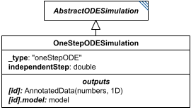

**Category:** tasks  
**Version:** v1  
**Schema:** [`schema.json`](specsheets/tasks/OneStepODESimulation/v1.0.0/schema.json)  
**`_type` discriminator:** `"oneStepODE"`  

##### What it does

A single-output-point simulation: the values of `outputVariables` after the independent variable advances by `independentStep`. Internally the solver may still take any step size it likes; only the *output* - a single final point rather than a series - distinguishes this from `BoundedODESimulation`. It is agnostic to the independent variable's starting value: it simply simulates across a given distance and reports the final values.

This is an implementation of KISAO:0000694 (ODE solver).

##### Attributes

All classes additionally inherit the optional `name`, `description`, `notes`, and `annotations` fields from `SEDBase` - see [`core/SEDBase`](#sedbase).

| Attribute | Type | Required | Notes |
|---|---|---|---|
| `taskParameters` | array of TaskParameter | no |  |
| `model` | SIdRef | yes |  |
| `independentVariable` | StringOrRef | yes |  |
| `independentVariableInit` | NumberOrRef | no |  |
| `outputVariables` | ListOfStringsOrRef | yes |  |
| `workingAlgorithms` | array of WorkingAlgorithm | no |  |
| `independentStep` | NumberOrRef | yes |  |
| `relativeTolerance` | NumberOrRef | no |  |
| `absoluteTolerance` | NumberOrRef | no |  |
| `absoluteToleranceVector` | ListOfNumbersOrRef | no |  |
| `absoluteToleranceAdjustmentFactor` | NumberOrRef | no |  |
| `toleranceForRootFinder` | NumberOrRef | no |  |
| `initialStepSize` | NumberOrRef | no |  |
| `maxNumberOfSteps` | NumberOrRef | no |  |
| `maxInternalSteps` | IntegerOrRef | no |  |
| `maxInternalStepSize` | NumberOrRef | no |  |
| `minInternalStepSize` | NumberOrRef | no |  |
| `forcePhysicalCorrectness` | BooleanOrRef | no |  |
| `integrateReducedModel` | BooleanOrRef | no |  |
| `useReducedModel` | BooleanOrRef | no |  |
| `useStiffSolver` | BooleanOrRef | no |  |
| `maxBDForder` | PositiveIntegerOrRef | no |  |
| `maxAdamsOrder` | PositiveIntegerOrRef | no |  |
| `variableStepSize` | BooleanOrRef | no |  |
| `maxOutputRows` | PositiveIntegerOrRef | no |  |

###### Attribute details

**`taskParameters`** (array of TaskParameter, optional) - _(no description yet - placeholder, needs to be filled in)_

**`model`** (SIdRef, required) - _(no description yet - placeholder, needs to be filled in)_

**`independentVariable`** (StringOrRef, required) - _(no description yet - placeholder, needs to be filled in)_

**`independentVariableInit`** (NumberOrRef, optional) - _(no description yet - placeholder, needs to be filled in)_

**`outputVariables`** (ListOfStringsOrRef, required) - _(no description yet - placeholder, needs to be filled in)_

**`workingAlgorithms`** (array of WorkingAlgorithm, optional) - _(no description yet - placeholder, needs to be filled in)_

**`independentStep`** (NumberOrRef, required) - _(no description yet - placeholder, needs to be filled in)_

**`relativeTolerance`** (NumberOrRef, optional) - _(no description yet - placeholder, needs to be filled in)_

**`absoluteTolerance`** (NumberOrRef, optional) - _(no description yet - placeholder, needs to be filled in)_

**`absoluteToleranceVector`** (ListOfNumbersOrRef, optional) - _(no description yet - placeholder, needs to be filled in)_

**`absoluteToleranceAdjustmentFactor`** (NumberOrRef, optional) - _(no description yet - placeholder, needs to be filled in)_

**`toleranceForRootFinder`** (NumberOrRef, optional) - _(no description yet - placeholder, needs to be filled in)_

**`initialStepSize`** (NumberOrRef, optional) - _(no description yet - placeholder, needs to be filled in)_

**`maxNumberOfSteps`** (NumberOrRef, optional) - _(no description yet - placeholder, needs to be filled in)_

**`maxInternalSteps`** (IntegerOrRef, optional) - _(no description yet - placeholder, needs to be filled in)_

**`maxInternalStepSize`** (NumberOrRef, optional) - _(no description yet - placeholder, needs to be filled in)_

**`minInternalStepSize`** (NumberOrRef, optional) - _(no description yet - placeholder, needs to be filled in)_

**`forcePhysicalCorrectness`** (BooleanOrRef, optional) - _(no description yet - placeholder, needs to be filled in)_

**`integrateReducedModel`** (BooleanOrRef, optional) - _(no description yet - placeholder, needs to be filled in)_

**`useReducedModel`** (BooleanOrRef, optional) - _(no description yet - placeholder, needs to be filled in)_

**`useStiffSolver`** (BooleanOrRef, optional) - _(no description yet - placeholder, needs to be filled in)_

**`maxBDForder`** (PositiveIntegerOrRef, optional) - _(no description yet - placeholder, needs to be filled in)_

**`maxAdamsOrder`** (PositiveIntegerOrRef, optional) - _(no description yet - placeholder, needs to be filled in)_

**`variableStepSize`** (BooleanOrRef, optional) - _(no description yet - placeholder, needs to be filled in)_

**`maxOutputRows`** (PositiveIntegerOrRef, optional) - _(no description yet - placeholder, needs to be filled in)_


##### Outputs

The final values of `outputVariables` after stepping by `independentStep`, accessible as `[id]`. The model's end-of-run state is always also available as `[id].model`.

- `[id]`: **Valid**
    - Dimensions: 1D: one value per entry of `outputVariables` - a single point, not a series (see `independentStep`).
- `[id].model`: **Valid**
- `[id].strings`: **Invalid**

##### Open issues / notes

- The spec text itself flags an open question here: it's unclear whether it's acceptable that the independent variable's own final value is neither tracked nor output.

##### Validation Rules

**`OneStepODESimulation-0000`** (error) - The element fails a JSON Schema constraint attributable to OneStepODESimulation that does not match any other numbered rule. ([source](specsheets/tasks/OneStepODESimulation/v1.0.0/validation/OneStepODESimulation-0000.md))

> Catch-all rule for schema-pass failures attributable to OneStepODESimulation (or a
> more specific descendant whose own class's failure location can't be
> resolved to any other numbered rule). See Design.md, Schema-Pass Errors.

**`OneStepODESimulation-0001`** (error) - The model attribute of an OneStepODESimulation is required. ([source](specsheets/tasks/OneStepODESimulation/v1.0.0/validation/OneStepODESimulation-0001.md))

> `model` is required.

**`OneStepODESimulation-0002`** (error) - The independentVariable attribute of an OneStepODESimulation is required. ([source](specsheets/tasks/OneStepODESimulation/v1.0.0/validation/OneStepODESimulation-0002.md))

> `independentVariable` is required.

**`OneStepODESimulation-0003`** (error) - The outputVariables attribute of an OneStepODESimulation is required. ([source](specsheets/tasks/OneStepODESimulation/v1.0.0/validation/OneStepODESimulation-0003.md))

> `outputVariables` is required.

**`OneStepODESimulation-0004`** (error) - The independentStep attribute of an OneStepODESimulation is required. ([source](specsheets/tasks/OneStepODESimulation/v1.0.0/validation/OneStepODESimulation-0004.md))

> `independentStep` is required.

**`OneStepODESimulation-0005`** (error) - When the value of independentStep of an OneStepODESimulation is provided directly, it must be a number. ([source](specsheets/tasks/OneStepODESimulation/v1.0.0/validation/OneStepODESimulation-0005.md))

> `independentStep` is `NumberOrRef`: the value, when not a reference, must be a number.

**`OneStepODESimulation-0006`** (error) - When the value of independentStep of an OneStepODESimulation is a reference, it must be a reference to a number. ([source](specsheets/tasks/OneStepODESimulation/v1.0.0/validation/OneStepODESimulation-0006.md))

> `independentStep` is `NumberOrRef`: when the value is a reference, it must resolve to a number.

**`OneStepODESimulation-0007`** (error) - The _type attribute of an OneStepODESimulation must be "oneStepODE". ([source](specsheets/tasks/OneStepODESimulation/v1.0.0/validation/OneStepODESimulation-0007.md))

> `_type` is the discriminator field. For `OneStepODESimulation` it must always equal `"oneStepODE"`.

#### OneStepStochasticSimulation

*Source: [specsheets/tasks/OneStepStochasticSimulation/v1.0.0/description.md](specsheets/tasks/OneStepStochasticSimulation/v1.0.0/description.md)*

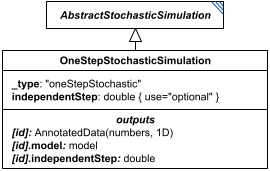

**Category:** tasks  
**Version:** v1  
**Schema:** [`schema.json`](specsheets/tasks/OneStepStochasticSimulation/v1.0.0/schema.json)  
**`_type` discriminator:** `"oneStepStochastic"`  

##### What it does

Similar to `OneStepODESimulation`, but `independentStep` is optional. If unset, the simulation runs until a stochastic event occurs, the model changes, `outputVariables` are recorded, and the step size actually taken is saved as `[id].independentStep`. If `independentStep` is set, the independent variable advances by exactly that much regardless of how many stochastic events occur in the interval (zero or more).

This is an implementation of KISAO:0000319 (Monte Carlo method).

##### Attributes

All classes additionally inherit the optional `name`, `description`, `notes`, and `annotations` fields from `SEDBase` - see [`core/SEDBase`](#sedbase).

| Attribute | Type | Required | Notes |
|---|---|---|---|
| `taskParameters` | array of TaskParameter | no |  |
| `model` | SIdRef | yes |  |
| `independentVariable` | StringOrRef | yes |  |
| `independentVariableInit` | NumberOrRef | no |  |
| `outputVariables` | ListOfStringsOrRef | yes |  |
| `workingAlgorithms` | array of WorkingAlgorithm | no |  |
| `independentStep` | NumberOrRef | no |  |
| `seed` | NumberOrRef | no |  |
| `timeDependentRelativeTolerance` | NumberOrRef | no |  |
| `variableStepSize` | BooleanOrRef | no |  |
| `minimumTimeStep` | NumberOrRef | no |  |
| `maximumTimeStep` | NumberOrRef | no |  |
| `nonNegative` | BooleanOrRef | no |  |
| `maxOutputRows` | PositiveIntegerOrRef | no |  |
| `maxNumSteps` | PositiveIntegerOrRef | no |  |

###### Attribute details

**`taskParameters`** (array of TaskParameter, optional) - _(no description yet - placeholder, needs to be filled in)_

**`model`** (SIdRef, required) - _(no description yet - placeholder, needs to be filled in)_

**`independentVariable`** (StringOrRef, required) - _(no description yet - placeholder, needs to be filled in)_

**`independentVariableInit`** (NumberOrRef, optional) - _(no description yet - placeholder, needs to be filled in)_

**`outputVariables`** (ListOfStringsOrRef, required) - _(no description yet - placeholder, needs to be filled in)_

**`workingAlgorithms`** (array of WorkingAlgorithm, optional) - _(no description yet - placeholder, needs to be filled in)_

**`independentStep`** (NumberOrRef, optional) - _(no description yet - placeholder, needs to be filled in)_

**`seed`** (NumberOrRef, optional) - _(no description yet - placeholder, needs to be filled in)_

**`timeDependentRelativeTolerance`** (NumberOrRef, optional) - _(no description yet - placeholder, needs to be filled in)_

**`variableStepSize`** (BooleanOrRef, optional) - _(no description yet - placeholder, needs to be filled in)_

**`minimumTimeStep`** (NumberOrRef, optional) - _(no description yet - placeholder, needs to be filled in)_

**`maximumTimeStep`** (NumberOrRef, optional) - _(no description yet - placeholder, needs to be filled in)_

**`nonNegative`** (BooleanOrRef, optional) - _(no description yet - placeholder, needs to be filled in)_

**`maxOutputRows`** (PositiveIntegerOrRef, optional) - _(no description yet - placeholder, needs to be filled in)_

**`maxNumSteps`** (PositiveIntegerOrRef, optional) - _(no description yet - placeholder, needs to be filled in)_


##### Outputs

The values of `outputVariables` at the end of the step, accessible as `[id]`. When `independentStep` was not provided, the actual elapsed step is available as `[id].independentStep`. The model's end-of-run state is always also available as `[id].model`.

- `[id]`: **Valid**
    - Dimensions: 1D: one value per entry of `outputVariables` - a single point, not a series.
- `[id].model`: **Valid**
- `[id].strings`: **Invalid**

Additional possible outputs beyond the three standard ones:

- `[id].independentStep`: The step size actually taken, available only when `independentStep` was *not* provided as input (the task ran until the next stochastic event).
    - Dimensions: Scalar (0-D): a single number.

##### Validation Rules

**`OneStepStochasticSimulation-0000`** (error) - The element fails a JSON Schema constraint attributable to OneStepStochasticSimulation that does not match any other numbered rule. ([source](specsheets/tasks/OneStepStochasticSimulation/v1.0.0/validation/OneStepStochasticSimulation-0000.md))

> Catch-all rule for schema-pass failures attributable to OneStepStochasticSimulation (or a
> more specific descendant whose own class's failure location can't be
> resolved to any other numbered rule). See Design.md, Schema-Pass Errors.

**`OneStepStochasticSimulation-0001`** (error) - The model attribute of an OneStepStochasticSimulation is required. ([source](specsheets/tasks/OneStepStochasticSimulation/v1.0.0/validation/OneStepStochasticSimulation-0001.md))

> `model` is required.

**`OneStepStochasticSimulation-0002`** (error) - The independentVariable attribute of an OneStepStochasticSimulation is required. ([source](specsheets/tasks/OneStepStochasticSimulation/v1.0.0/validation/OneStepStochasticSimulation-0002.md))

> `independentVariable` is required.

**`OneStepStochasticSimulation-0003`** (error) - The outputVariables attribute of an OneStepStochasticSimulation is required. ([source](specsheets/tasks/OneStepStochasticSimulation/v1.0.0/validation/OneStepStochasticSimulation-0003.md))

> `outputVariables` is required.

**`OneStepStochasticSimulation-0004`** (error) - When the value of independentStep of an OneStepStochasticSimulation is provided directly, it must be a number. ([source](specsheets/tasks/OneStepStochasticSimulation/v1.0.0/validation/OneStepStochasticSimulation-0004.md))

> `independentStep` is `NumberOrRef`: the value, when not a reference, must be a number.

**`OneStepStochasticSimulation-0005`** (error) - When the value of independentStep of an OneStepStochasticSimulation is a reference, it must be a reference to a number. ([source](specsheets/tasks/OneStepStochasticSimulation/v1.0.0/validation/OneStepStochasticSimulation-0005.md))

> `independentStep` is `NumberOrRef`: when the value is a reference, it must resolve to a number.

**`OneStepStochasticSimulation-0006`** (error) - The _type attribute of an OneStepStochasticSimulation must be "oneStepStochastic". ([source](specsheets/tasks/OneStepStochasticSimulation/v1.0.0/validation/OneStepStochasticSimulation-0006.md))

> `_type` is the discriminator field. For `OneStepStochasticSimulation` it must always equal `"oneStepStochastic"`.

#### ParameterRange

*Source: [specsheets/tasks/ParameterRange/v1.0.0/description.md](specsheets/tasks/ParameterRange/v1.0.0/description.md)*


*(`ParameterRange` has no standalone diagram of its own - the image above is `Range`'s diagram; `ParameterRange` inherits from `Range` (via `NumericRange`) and adds nothing that would need separate illustration.)*

**Category:** tasks  
**Version:** v1  
**Schema:** [`schema.json`](specsheets/tasks/ParameterRange/v1.0.0/schema.json) + [`inline.schema.json`](specsheets/tasks/ParameterRange/v1.0.0/inline.schema.json) (`ParameterRangeInline`)  
**`_type` discriminator:** `"parameterRange"`

##### What it does

A `NumericRange` (its subclass) for when a range of values over a specific model element is needed - most commonly as one of a `ParameterScan`'s `parameterRanges`. It inherits everything `NumericRange` defines (which in turn inherits from `Range`) and adds `modelElement`, the id of the model element to vary.

**Two schema files in this folder.** `schema.json` defines `ParameterRange` itself, composing `NumericRange`'s `NumericRangeCommon` mixin (which itself composes `Range`'s `RangeCommon`) alongside its own `modelElement`. Unlike `Range` and `NumericRange`, `ParameterRange` has no `common.schema.json` of its own, since nothing currently inherits further from it. `inline.schema.json` defines `ParameterRangeInline` - the wrapper used for `ParameterScan.parameterRanges` entries. See `tasks/Range` for why the standalone and common forms are kept separate.

##### Attributes

All classes additionally inherit the optional `name`, `description`, `notes`, and `annotations` fields from `SEDBase` - see [`core/SEDBase`](#sedbase).

| Attribute | Type | Required | Notes |
|---|---|---|---|
| `taskParameters` | array of TaskParameter | no |  |
| `modelElement` | StringOrRef | yes |  |
| `start` | NumberOrRef | no |  |
| `end` | NumberOrRef | no |  |
| `interval` | PositiveDoubleOrRef | no |  |
| `numberOfSteps` | PositiveIntegerOrRef | no |  |
| `scale` | ScaleTypeOrRef | no |  |
| `values` | array of NumberOrRef or SIdRef | no |  |

###### Attribute details

**`taskParameters`** (array of TaskParameter, optional) - _(no description yet - placeholder, needs to be filled in)_

**`modelElement`** (StringOrRef, required) - _(no description yet - placeholder, needs to be filled in)_

**`start`** (NumberOrRef, optional) - _(no description yet - placeholder, needs to be filled in)_

**`end`** (NumberOrRef, optional) - _(no description yet - placeholder, needs to be filled in)_

**`interval`** (PositiveDoubleOrRef, optional) - _(no description yet - placeholder, needs to be filled in)_

**`numberOfSteps`** (PositiveIntegerOrRef, optional) - _(no description yet - placeholder, needs to be filled in)_

**`scale`** (ScaleTypeOrRef, optional) - _(no description yet - placeholder, needs to be filled in)_

**`values`** (array of NumberOrRef or SIdRef, optional) - _(no description yet - placeholder, needs to be filled in)_


##### Outputs

As a `ParameterScan` child, `ParameterRange` has no independent output - its values are consumed directly by the scan. When it appears directly in the `tasks` dictionary, its output is the list of numeric values, accessible as `[id]`.

- `[id]`: **Valid**
    - Dimensions: 1D: one value per generated point, same rule as `NumericRange`.
- `[id].model`: **Invalid**
- `[id].strings`: **Invalid**

Only valid when `ParameterRange` is used directly as a `tasks` dictionary entry. As a `ParameterScan` child (via `ParameterRangeInline`), it has no independent output of its own.

##### Validation Rules

**`ParameterRange-0000`** (error) - The element fails a JSON Schema constraint attributable to ParameterRange that does not match any other numbered rule. ([source](specsheets/tasks/ParameterRange/v1.0.0/validation/ParameterRange-0000.md))

> Catch-all rule for schema-pass failures attributable to ParameterRange (or a
> more specific descendant whose own class's failure location can't be
> resolved to any other numbered rule). See Design.md, Schema-Pass Errors.

**`ParameterRange-0001`** (error) - The modelElement attribute of a ParameterRange is required. ([source](specsheets/tasks/ParameterRange/v1.0.0/validation/ParameterRange-0001.md))

> `modelElement` is required.

**`ParameterRange-0002`** (error) - When the value of modelElement of a ParameterRange is provided directly, it must be a string. ([source](specsheets/tasks/ParameterRange/v1.0.0/validation/ParameterRange-0002.md))

> `modelElement` is `StringOrRef`: the value, when not a reference, must be a string.

**`ParameterRange-0003`** (error) - When the value of modelElement of a ParameterRange is a reference, it must be a reference to a string. ([source](specsheets/tasks/ParameterRange/v1.0.0/validation/ParameterRange-0003.md))

> `modelElement` is `StringOrRef`: when the value is a reference, it must resolve to a string.

**`ParameterRange-0016`** (error) - The _type attribute of a ParameterRange must be "parameterRange". ([source](specsheets/tasks/ParameterRange/v1.0.0/validation/ParameterRange-0016.md))

> `_type` is the discriminator field. For `ParameterRange` it must always equal `"parameterRange"`.

#### ParameterScan

*Source: [specsheets/tasks/ParameterScan/v1.0.0/description.md](specsheets/tasks/ParameterScan/v1.0.0/description.md)*

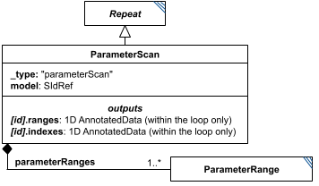

**Category:** tasks  
**Version:** v1  
**Schema:** [`schema.json`](specsheets/tasks/ParameterScan/v1.0.0/schema.json)  
**`_type` discriminator:** `"parameterScan"`

##### What it does

Runs simulations/analyses over several systematically-varied versions of a model: a `Repeat` subclass that adds a `model` child (the model to scan) and one or more `ParameterRange` children (`parameterRanges`) - each scanned element adds a dimension to the output. Each `ParameterRange` must target a distinct `modelElement` (ParameterScan-0007), which must be an id within the child `model`; the `modelElement` also serves as the entry's name in `[id].ranges` and `[id].indexes`. One of the `subTasks` must reference the scan's `model` child (`#tasks:[scanid]:model`) as its own input; the model is initialized with every combination of values across all the ranges. Mechanically it's otherwise identical to `Scatter`, and could in principle be reproduced with nested `Scatter`s plus careful `ModelChange` tasks. Within the loop, the current value and index of each range are available as `[id].ranges` and `[id].indexes` (see Outputs below).

##### Attributes

All classes additionally inherit the optional `name`, `description`, `notes`, and `annotations` fields from `SEDBase` - see [`core/SEDBase`](#sedbase).

| Attribute | Type | Required | Notes |
|---|---|---|---|
| `taskParameters` | array of TaskParameter | no |  |
| `subTasks` | object (values: AbstractTask) | yes |  |
| `outputVariableMap` | object (values: SIdRef) or SIdRef | no |  |
| `aggregateOutputVariables` | object (values: AggregationCalculation) | no |  |
| `model` | SIdRef | yes |  |
| `parameterRanges` | array of ParameterRangeInline | yes |  |

###### Attribute details

**`taskParameters`** (array of TaskParameter, optional) - _(no description yet - placeholder, needs to be filled in)_

**`subTasks`** (object (values: AbstractTask), required) - _(no description yet - placeholder, needs to be filled in)_

**`outputVariableMap`** (object (values: SIdRef) or SIdRef, optional) - _(no description yet - placeholder, needs to be filled in)_

**`aggregateOutputVariables`** (object (values: AggregationCalculation), optional) - _(no description yet - placeholder, needs to be filled in)_

**`model`** (SIdRef, required) - _(no description yet - placeholder, needs to be filled in)_

**`parameterRanges`** (array of ParameterRangeInline, required) - The ranges to scan; at least one. The `modelElement` of each entry must be distinct within the scan (ParameterScan-0007), and labels that entry in `[id].ranges` and `[id].indexes`.


##### Outputs

`[id]`: an `AnnotatedData` with one dimension per entry of `parameterRanges`, plus one further dimension sized by the number of entries in `outputVariableMap`. `[id].aggregates`: an `AnnotatedData` following `aggregateOutputVariables`, when defined.

- `[id]`: **Valid**
    - Dimensions: N-D: one dimension per entry in `parameterRanges` (each sized by that range's own number of steps, and each labeled with that range's `modelElement`), plus one further dimension sized by the number of entries in `outputVariableMap` - dimensionality grows with the number of ranges scanned.
- `[id].model`: **Invalid**
- `[id].strings`: **Invalid**

Additional possible outputs beyond the three standard ones:

- `[id].aggregates`: An `AnnotatedData` following `aggregateOutputVariables`.  If that attribute is not defined, the `AnnotatedData` is empty.
    - Dimensions: 1D: one entry per `aggregateOutputVariables` mapping. Each entry's aggregation collapses *all* of `[id]`'s scanned-range dimensions together (per `Repeat`, the applied dimension defaults to 'the Repeat' itself - here, the whole combined scan) down to a single value - unless the underlying subTask output was itself multi-dimensional, in which case that dimensionality carries through per entry.
- `[id].ranges`: Within the loop only, the current value of each of the scan's `parameterRanges`.
    - Dimensions: 1D `AnnotatedData`: one entry per `ParameterRange` child, in order, labeled with that child's `modelElement`. For example, with children whose `modelElement`s are `calc`, `phos`, and `ant`, it holds the current values of `calc`, `phos`, and `ant`, in that order, labeled accordingly.
- `[id].indexes`: Within the loop only, the current index into each of the scan's `parameterRanges`.
    - Dimensions: 1D `AnnotatedData`: one entry per `ParameterRange` child, in order, labeled with that child's `modelElement` - the current index of `calc`, `phos`, and `ant`, in that order, in the example above.

##### Validation Rules

**`ParameterScan-0000`** (error) - The element fails a JSON Schema constraint attributable to ParameterScan that does not match any other numbered rule. ([source](specsheets/tasks/ParameterScan/v1.0.0/validation/ParameterScan-0000.md))

> Catch-all rule for schema-pass failures attributable to ParameterScan (or a
> more specific descendant whose own class's failure location can't be
> resolved to any other numbered rule). See Design.md, Schema-Pass Errors.

**`ParameterScan-0001`** (error) - The model attribute of a ParameterScan is required. ([source](specsheets/tasks/ParameterScan/v1.0.0/validation/ParameterScan-0001.md))

> `model` is required.

**`ParameterScan-0002`** (error) - The model attribute of a ParameterScan, if present, must be a reference (a string starting with '#'). ([source](specsheets/tasks/ParameterScan/v1.0.0/validation/ParameterScan-0002.md))

> `model` is `SIdRef` - always a reference, never a literal value.

**`ParameterScan-0003`** (error) - The parameterRanges attribute of a ParameterScan is required. ([source](specsheets/tasks/ParameterScan/v1.0.0/validation/ParameterScan-0003.md))

> `parameterRanges` is required.

**`ParameterScan-0004`** (error) - The parameterRanges attribute of a ParameterScan must be an array of ParameterRangeInline objects. ([source](specsheets/tasks/ParameterScan/v1.0.0/validation/ParameterScan-0004.md))

> `parameterRanges` is `array of ParameterRangeInline`: it must be an array of ParameterRangeInline objects.

**`ParameterScan-0005`** (error) - The subTasks attribute of a ParameterScan is required. ([source](specsheets/tasks/ParameterScan/v1.0.0/validation/ParameterScan-0005.md))

> `subTasks` is required.

**`ParameterScan-0006`** (error) - The _type attribute of a ParameterScan must be "parameterScan". ([source](specsheets/tasks/ParameterScan/v1.0.0/validation/ParameterScan-0006.md))

> `_type` is the discriminator field. For `ParameterScan` it must always equal `"parameterScan"`.

**`ParameterScan-0007`** (error) - The entries of a ParameterScan's parameterRanges must have pairwise distinct modelElement values. ([source](specsheets/tasks/ParameterScan/v1.0.0/validation/ParameterScan-0007.md))

> Stated in ParameterScan's description.md. Each ParameterRange scans one model
> element, and its modelElement also labels its entry in [id].ranges and
> [id].indexes, so two entries with the same modelElement would be both
> ambiguous to address and redundant to scan. When modelElement is given as a
> reference, entries are compared by the string it resolves to.

#### Range

*Source: [specsheets/tasks/Range/v1.0.0/description.md](specsheets/tasks/Range/v1.0.0/description.md)*


**Category:** tasks  
**Version:** v1  
**Schema:** [`schema.json`](specsheets/tasks/Range/v1.0.0/schema.json) + [`inline.schema.json`](specsheets/tasks/Range/v1.0.0/inline.schema.json) (`RangeInline`)  
**`_type` discriminator:** `"range"`

##### What it does

A `Range` defines a list of values to be taken in sequence. It is most often used as the `range` child of a Repeat (Scatter/Loop) rather than as a standalone task, though - like `NumericRange` and `ParameterRange` - it may also appear directly as an entry in the `tasks` dictionary.

The base `Range` class simply lists the values explicitly via its `values` attribute. Its subclass `NumericRange` inherits `values` (narrowed to doubles) and adds several other ways to define a numeric sequence; see that class's Data Sheet.

**Three schema files in this folder.** `schema.json` defines `Range` itself (usable standalone, as a `tasks` dictionary entry, with the full `AbstractTaskCommon` fields). `common.schema.json` defines `RangeCommon` - just the `values` field, composed via `allOf` by `Range` itself and, in turn, by `NumericRange` (and transitively `ParameterRange`), which is how the inheritance chain `Range -> NumericRange -> ParameterRange` is expressed in JSON Schema without conflicting `_type` consts. `inline.schema.json` defines `RangeInline` - the discriminated union of every class composing `RangeCommon` (currently `Range | NumericRange | ParameterRange`, generator-populated the same way `AbstractTask`'s and `AbstractOutput`'s discriminators are - see Design.md's Classes section) used wherever a *named child* field (e.g. a Repeat's `range`) may hold any range subtype.

##### Attributes

All classes additionally inherit the optional `name`, `description`, `notes`, and `annotations` fields from `SEDBase` - see [`core/SEDBase`](#sedbase).

| Attribute | Type | Required | Notes |
|---|---|---|---|
| `taskParameters` | array of TaskParameter | no |  |
| `values` | array of AnyValueOrRef or SIdRef | no |  |

###### Attribute details

**`taskParameters`** (array of TaskParameter, optional) - _(no description yet - placeholder, needs to be filled in)_

**`values`** (array of AnyValueOrRef or SIdRef, optional) - _(no description yet - placeholder, needs to be filled in)_


##### Outputs

When used as the `range` child of a Repeat, `Range` has no independent output - its values are consumed directly by the containing task. When it instead appears directly in the `tasks` dictionary, its output is the list of values itself, accessible as `[id]`.

- `[id]`: **Valid**
    - Dimensions: 1D: one value per element of `values`, in the order given.
- `[id].model`: **Invalid**
- `[id].strings`: **Invalid**

Only valid when `Range` is used directly as a `tasks` dictionary entry. As an embedded child (via `RangeInline`, e.g. a Repeat's `range`), it has no independent output of its own - its values are consumed directly by the containing task.

##### Validation Rules

**`Range-0000`** (error) - The element fails a JSON Schema constraint attributable to Range that does not match any other numbered rule. ([source](specsheets/tasks/Range/v1.0.0/validation/Range-0000.md))

> Catch-all rule for schema-pass failures attributable to Range (or a
> more specific descendant whose own class's failure location can't be
> resolved to any other numbered rule). See Design.md, Schema-Pass Errors.

**`Range-0001`** (error) - When the value of values of a Range is provided directly, it must be an array of AnyValueOrRef objects. ([source](specsheets/tasks/Range/v1.0.0/validation/Range-0001.md))

> `values` is `array of AnyValueOrRef or SIdRef`: the value, when not a reference, must be an array of AnyValueOrRef objects.

**`Range-0002`** (error) - When the value of values of a Range is a reference, it must be a reference to an array of AnyValueOrRef objects. ([source](specsheets/tasks/Range/v1.0.0/validation/Range-0002.md))

> `values` is `array of AnyValueOrRef or SIdRef`: when the value is a reference, it must resolve to an array of AnyValueOrRef objects.

**`Range-0003`** (error) - The _type attribute of a Range must be "range". ([source](specsheets/tasks/Range/v1.0.0/validation/Range-0003.md))

> `_type` is the discriminator field. For `Range` it must always equal `"range"`.

**`Range-0004`** (error) - A value that must resolve to a concrete Range subtype must declare a _type attribute. ([source](specsheets/tasks/Range/v1.0.0/validation/Range-0004.md))

> A narrower case of Range-0000's catch-all: fires specifically when
> RangeInline's generated oneOf fails because _type is missing entirely,
> rather than present but unrecognized. Wired via the x-missing-type-rule-id
> keyword on RangeInline (inline.schema.json), a sibling of x-generated-oneOf;
> see core-spec.md Section 8 and Design.md's Classes section.

#### RelabelData

*Source: [specsheets/tasks/RelabelData/v1.0.0/description.md](specsheets/tasks/RelabelData/v1.0.0/description.md)*

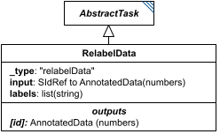

**Category:** tasks  
**Version:** v1  
**Schema:** [`schema.json`](specsheets/tasks/RelabelData/v1.0.0/schema.json)  
**`_type` discriminator:** `"relabelData"`

##### What it does

`RelabelData` replaces the existing labels of the topmost dimension of the referenced `input` `AnnotatedData` with the strings given in `labels`.

##### Attributes

All classes additionally inherit the optional `name`, `description`, `notes`, and `annotations` fields from `SEDBase` - see [`core/SEDBase`](#sedbase).

| Attribute | Type | Required | Notes |
|---|---|---|---|
| `taskParameters` | array of TaskParameter | no |  |
| `input` | SIdRef | yes |  |
| `labels` | ListOfStringsOrRef | yes |  |

###### Attribute details

**`taskParameters`** (array of TaskParameter, optional) - _(no description yet - placeholder, needs to be filled in)_

**`input`** (SIdRef, required) - _(no description yet - placeholder, needs to be filled in)_

**`labels`** (ListOfStringsOrRef, required) - _(no description yet - placeholder, needs to be filled in)_


##### Outputs

The relabeled `AnnotatedData`, accessible as `[id]`.

- `[id]`: **Valid**
    - Dimensions: Same dimensions as the referenced `input` `AnnotatedData` - this task only replaces the topmost dimension's labels, not the shape.
- `[id].model`: **Invalid**
- `[id].strings`: **Invalid**

##### Validation Rules

**`RelabelData-0000`** (error) - The element fails a JSON Schema constraint attributable to RelabelData that does not match any other numbered rule. ([source](specsheets/tasks/RelabelData/v1.0.0/validation/RelabelData-0000.md))

> Catch-all rule for schema-pass failures attributable to RelabelData (or a
> more specific descendant whose own class's failure location can't be
> resolved to any other numbered rule). See Design.md, Schema-Pass Errors.

**`RelabelData-0001`** (error) - The input attribute of a RelabelData is required. ([source](specsheets/tasks/RelabelData/v1.0.0/validation/RelabelData-0001.md))

> `input` is required.

**`RelabelData-0002`** (error) - The input attribute of a RelabelData, if present, must be a reference (a string starting with '#'). ([source](specsheets/tasks/RelabelData/v1.0.0/validation/RelabelData-0002.md))

> `input` is `SIdRef` - always a reference, never a literal value.

**`RelabelData-0003`** (error) - The labels attribute of a RelabelData is required. ([source](specsheets/tasks/RelabelData/v1.0.0/validation/RelabelData-0003.md))

> `labels` is required.

**`RelabelData-0004`** (error) - When the value of labels of a RelabelData is provided directly, it must be an array of strings. ([source](specsheets/tasks/RelabelData/v1.0.0/validation/RelabelData-0004.md))

> `labels` is `ListOfStringsOrRef`: the value, when not a reference, must be an array of strings.

**`RelabelData-0005`** (error) - When the value of labels of a RelabelData is a reference, it must be a reference to an array of strings. ([source](specsheets/tasks/RelabelData/v1.0.0/validation/RelabelData-0005.md))

> `labels` is `ListOfStringsOrRef`: when the value is a reference, it must resolve to an array of strings.

**`RelabelData-0006`** (error) - The _type attribute of a RelabelData must be "relabelData". ([source](specsheets/tasks/RelabelData/v1.0.0/validation/RelabelData-0006.md))

> `_type` is the discriminator field. For `RelabelData` it must always equal `"relabelData"`.

#### Repeat

*Source: [specsheets/tasks/Repeat/v1.0.0/description.md](specsheets/tasks/Repeat/v1.0.0/description.md)*

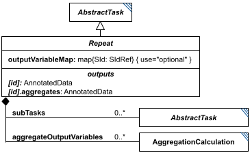

**Category:** tasks  
**Version:** v1  
**Schema:** [`schema.json`](specsheets/tasks/Repeat/v1.0.0/schema.json)

##### What it does

Like SED-ML Level 1's RepeatedTask, SED2 needs to repeat a group of tasks multiple times. `Repeat` is the set of fields shared by all three concrete subclasses (`Scatter`, `Loop`, `ParameterScan`), composed via `allOf` rather than instantiated on its own - the prose spec calls this abstract concept simply "Repeat".

The repeat's `subTasks` are true children (not references) of the parent, and may depend on each other, on outputs of tasks outside the repeat, or on the repeat's own per-iteration outputs (the current iteration's range value and position: `[id].range`/`[id].index` for `Scatter` and `Loop`, `[id].ranges`/`[id].indexes` for `ParameterScan` - see those classes). `outputVariableMap` (optional) defines the columns of the repeat's own `[id]` output: each named entry maps an output column name to a value produced by a subTask. `Scatter` and `Loop` additionally make the first column the range values, so for them `[id]` contains only the range values if `outputVariableMap` is omitted; see each subclass for its exact `[id]` shape. `aggregateOutputVariables` defines the columns of `[id].aggregates` - used to efficiently collect running summary statistics (e.g. mean/stdev) across a very large number of repeats without keeping every individual run's output; entries here may not define their own `appliedDimensions` (the applied dimension is always 'the Repeat' itself), and each `input` must reference a subTask's output.

A `Repeat`-derived task must define at least one of `outputVariableMap` or `aggregateOutputVariables`.

`Repeat` itself has no `range`: `Loop` and `Scatter` each define their own required `range` child (a `Range`/`NumericRange`/`ParameterRange`), and `ParameterScan` uses `parameterRanges` instead.

##### Attributes

All classes additionally inherit the optional `name`, `description`, `notes`, and `annotations` fields from `SEDBase` - see [`core/SEDBase`](#sedbase).

| Attribute | Type | Required | Notes |
|---|---|---|---|
| `subTasks` | object (values: AbstractTask) | no |  |
| `outputVariableMap` | object (values: SIdRef) or SIdRef | no | Optional, but at least one of this or `aggregateOutputVariables` must be provided (Repeat-0006). |
| `aggregateOutputVariables` | object (values: AggregationCalculation) | no |  |

###### Attribute details

**`subTasks`** (object (values: AbstractTask), optional) - _(no description yet - placeholder, needs to be filled in)_

**`outputVariableMap`** (object (values: SIdRef) or SIdRef, optional) - _(no description yet - placeholder, needs to be filled in)_

**`aggregateOutputVariables`** (object (values: AggregationCalculation), optional) - _(no description yet - placeholder, needs to be filled in)_


##### Outputs

Not applicable on its own - see `Scatter`, `Loop`, and `ParameterScan` for their concrete output shapes (`[id]` per `outputVariableMap`, `[id].aggregates` per `aggregateOutputVariables`). The per-iteration range outputs (`[id].range`/`[id].index` on `Scatter` and `Loop`, `[id].ranges`/`[id].indexes` on `ParameterScan`) belong to those subclasses, not to `Repeat`.

Shared mixin for the three `Repeat` subclasses - not instantiated on its own; see `Scatter`, `Loop`, `ParameterScan`.

##### Validation Rules

**`Repeat-0000`** (error) - The element fails a JSON Schema constraint attributable to Repeat that does not match any other numbered rule. ([source](specsheets/tasks/Repeat/v1.0.0/validation/Repeat-0000.md))

> Catch-all rule for schema-pass failures attributable to Repeat (or a
> more specific descendant whose own class's failure location can't be
> resolved to any other numbered rule). See Design.md, Schema-Pass Errors.

**`Repeat-0001`** (error) - The subTasks attribute of a Repeat must be an object whose values are AbstractTask. ([source](specsheets/tasks/Repeat/v1.0.0/validation/Repeat-0001.md))

> `subTasks` is `object (values: AbstractTask)` in Repeat: it must be an object whose values are AbstractTask.

**`Repeat-0002`** (error) - When the value of outputVariableMap of a Repeat is provided directly, it must be an object whose values are SIdRef. ([source](specsheets/tasks/Repeat/v1.0.0/validation/Repeat-0002.md))

> `outputVariableMap` is `object (values: SIdRef) or SIdRef` in Repeat: the value, when not a reference, must be an object whose values are SIdRef.

**`Repeat-0003`** (error) - When the value of outputVariableMap of a Repeat is a reference, it must be a reference to an object whose values are SIdRef. ([source](specsheets/tasks/Repeat/v1.0.0/validation/Repeat-0003.md))

> `outputVariableMap` is `object (values: SIdRef) or SIdRef` in Repeat: when the value is a reference, it must resolve to an object whose values are SIdRef.

**`Repeat-0004`** (error) - The aggregateOutputVariables attribute of a Repeat must be an object whose values are AggregationCalculation. ([source](specsheets/tasks/Repeat/v1.0.0/validation/Repeat-0004.md))

> `aggregateOutputVariables` is `object (values: AggregationCalculation)` in Repeat: it must be an object whose values are AggregationCalculation.

**`Repeat-0006`** (error) - A Repeat must provide at least one of outputVariableMap or aggregateOutputVariables. ([source](specsheets/tasks/Repeat/v1.0.0/validation/Repeat-0006.md))

> Repeat's schema expresses this as an `anyOf` of two single-field `required`
> alternatives rather than a flat `required` list, since either field alone
> satisfies it. See core-spec.md Section 8 for the `x-anyof-required-rule-id`
> keyword that wires this rule to that `anyOf`.

**`Repeat-0008`** (error) - Every value in a Repeat's outputVariableMap must reference one of that Repeat's own subTasks, or an output of one. ([source](specsheets/tasks/Repeat/v1.0.0/validation/Repeat-0008.md))

> outputVariableMap defines the columns of the Repeat's [id] output, each
> collected from a subTask per iteration. The reference may carry accessors and
> indices into the subTask's output (e.g. '#tasks:loop1:subTasks:sim1['S1']'),
> checked as usual by SEDBase-0008 through SEDBase-0011.

**`Repeat-0009`** (error) - The input of every entry in a Repeat's aggregateOutputVariables must reference one of that Repeat's own subTasks, or an output of one. ([source](specsheets/tasks/Repeat/v1.0.0/validation/Repeat-0009.md))

> Same as Repeat-0008, for the AggregationCalculation entries that define
> [id].aggregates.

**`Repeat-0010`** (error) - An entry in a Repeat's aggregateOutputVariables must not define appliedDimensions. ([source](specsheets/tasks/Repeat/v1.0.0/validation/Repeat-0010.md))

> Stated in Repeat's description.md. Could instead be expressed in the schema
> (a dedicated AggregationCalculation variant without appliedDimensions) and
> get an x-rule-id; left as a hand-written rule here since the schema currently
> reuses AggregationCalculation as-is.

#### Scatter

*Source: [specsheets/tasks/Scatter/v1.0.0/description.md](specsheets/tasks/Scatter/v1.0.0/description.md)*

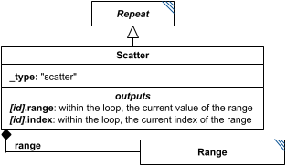

**Category:** tasks  
**Version:** v1  
**Schema:** [`schema.json`](specsheets/tasks/Scatter/v1.0.0/schema.json)  
**`_type` discriminator:** `"scatter"`

##### What it does

A `Repeat` whose iterations are guaranteed fully independent of one another - no subTask output from one iteration feeds into another - so a conforming interpreter may execute the iterations in parallel if it chooses. `range` (a required `Range`/`NumericRange`/`ParameterRange` child) defines one iteration per element.

##### Attributes

All classes additionally inherit the optional `name`, `description`, `notes`, and `annotations` fields from `SEDBase` - see [`core/SEDBase`](#sedbase).

| Attribute | Type | Required | Notes |
|---|---|---|---|
| `taskParameters` | array of TaskParameter | no |  |
| `subTasks` | object (values: AbstractTask) | yes |  |
| `outputVariableMap` | object (values: SIdRef) or SIdRef | no |  |
| `aggregateOutputVariables` | object (values: AggregationCalculation) | no |  |
| `range` | RangeInline | yes |  |

###### Attribute details

**`taskParameters`** (array of TaskParameter, optional) - _(no description yet - placeholder, needs to be filled in)_

**`subTasks`** (object (values: AbstractTask), required) - _(no description yet - placeholder, needs to be filled in)_

**`outputVariableMap`** (object (values: SIdRef) or SIdRef, optional) - _(no description yet - placeholder, needs to be filled in)_

**`aggregateOutputVariables`** (object (values: AggregationCalculation), optional) - _(no description yet - placeholder, needs to be filled in)_

**`range`** (RangeInline, required) - _(no description yet - placeholder, needs to be filled in)_


##### Outputs

`[id]`: an `AnnotatedData` whose first column is the range values and whose subsequent columns follow `outputVariableMap` (or which contains only the range values, if `outputVariableMap` is empty). `[id].aggregates`: an `AnnotatedData` following `aggregateOutputVariables`, when defined.

- `[id]`: **Valid**
    - Dimensions: 2D (or more): first dimension = one row per value in `range`; remaining dimension(s) = one column per entry of `outputVariableMap` (or just the range-values column alone, if `outputVariableMap` is empty). A column whose subTask output is itself multi-dimensional would add further dimensions - not pinned down further here.
- `[id].model`: **Invalid**
- `[id].strings`: **Invalid**

Additional possible outputs beyond the three standard ones:

- `[id].aggregates`: An `AnnotatedData` following `aggregateOutputVariables`, when that attribute is defined.
    - Dimensions: 1D: one entry per `aggregateOutputVariables` mapping. Each entry's aggregation function collapses the `range` dimension of `[id]` (per `Repeat`, the applied dimension defaults to 'the Repeat' itself, i.e. this one) down to a single value - unless the underlying subTask output was itself multi-dimensional, in which case that dimensionality carries through per entry.

- `[id].range`: Within each iteration, the current value of `range`. Always valid, since `range` is required.
    - Dimensions: Scalar (0-D) per iteration.
- `[id].index`: Within each iteration, the current index into `range`. Always valid.
    - Dimensions: Scalar (0-D) per iteration.

##### Validation Rules

**`Scatter-0000`** (error) - The element fails a JSON Schema constraint attributable to Scatter that does not match any other numbered rule. ([source](specsheets/tasks/Scatter/v1.0.0/validation/Scatter-0000.md))

> Catch-all rule for schema-pass failures attributable to Scatter (or a
> more specific descendant whose own class's failure location can't be
> resolved to any other numbered rule). See Design.md, Schema-Pass Errors.

**`Scatter-0001`** (error) - The subTasks attribute of a Scatter is required. ([source](specsheets/tasks/Scatter/v1.0.0/validation/Scatter-0001.md))

> `subTasks` is required.

**`Scatter-0003`** (error) - The _type attribute of a Scatter must be "scatter". ([source](specsheets/tasks/Scatter/v1.0.0/validation/Scatter-0003.md))

> `_type` is the discriminator field. For `Scatter` it must always equal `"scatter"`.

**`Scatter-0004`** (error) - The range attribute of a Scatter is required. ([source](specsheets/tasks/Scatter/v1.0.0/validation/Scatter-0004.md))

> `range` is required.

**`Scatter-0005`** (error) - The range attribute of a Scatter must be a RangeInline object. ([source](specsheets/tasks/Scatter/v1.0.0/validation/Scatter-0005.md))

> `range` must be a `Range`/`NumericRange`/`ParameterRange` object in its embedded `RangeInline` form.

#### SteadyState

*Source: [specsheets/tasks/SteadyState/v1.0.0/description.md](specsheets/tasks/SteadyState/v1.0.0/description.md)*

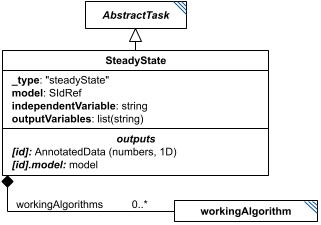

**Category:** tasks  
**Version:** v1  
**Schema:** [`schema.json`](specsheets/tasks/SteadyState/v1.0.0/schema.json)  
**`_type` discriminator:** `"steadyState"`

##### What it does

Computes the steady state of a model: where dX/dt = 0 for every varying element X of the model, with respect to the independent variable (usually time). `independentVariable` follows the same rules as the simulation tasks (either the model's own variable, or an implicit URN such as `urn:sedml:symbol:time`).

This is an implementation of KISAO:0000407 (steady-state root-finding method). The algorithm(s) it uses internally may be listed in the optional `workingAlgorithms` (see `WorkingAlgorithm`).

##### Attributes

All classes additionally inherit the optional `name`, `description`, `notes`, and `annotations` fields from `SEDBase` - see [`core/SEDBase`](#sedbase).

| Attribute | Type | Required | Notes |
|---|---|---|---|
| `taskParameters` | array of TaskParameter | no |  |
| `model` | SIdRef | yes |  |
| `independentVariable` | StringOrRef | no |  |
| `outputVariables` | ListOfStringsOrRef | yes |  |
| `workingAlgorithms` | array of WorkingAlgorithm | no |  |

###### Attribute details

**`taskParameters`** (array of TaskParameter, optional) - _(no description yet - placeholder, needs to be filled in)_

**`model`** (SIdRef, required) - _(no description yet - placeholder, needs to be filled in)_

**`independentVariable`** (StringOrRef, optional) - _(no description yet - placeholder, needs to be filled in)_

**`outputVariables`** (ListOfStringsOrRef, required) - _(no description yet - placeholder, needs to be filled in)_

**`workingAlgorithms`** (array of WorkingAlgorithm, optional) - _(no description yet - placeholder, needs to be filled in)_


##### Outputs

The steady-state values of `outputVariables`, accessible as `[id]`. The resulting model state is always also available as `[id].model`.

- `[id]`: **Valid**
    - Dimensions: 1D: one value per entry of `outputVariables`, at steady state.
- `[id].model`: **Valid**
- `[id].strings`: **Invalid**

##### Validation Rules

**`SteadyState-0000`** (error) - The element fails a JSON Schema constraint attributable to SteadyState that does not match any other numbered rule. ([source](specsheets/tasks/SteadyState/v1.0.0/validation/SteadyState-0000.md))

> Catch-all rule for schema-pass failures attributable to SteadyState (or a
> more specific descendant whose own class's failure location can't be
> resolved to any other numbered rule). See Design.md, Schema-Pass Errors.

**`SteadyState-0001`** (error) - The model attribute of a SteadyState is required. ([source](specsheets/tasks/SteadyState/v1.0.0/validation/SteadyState-0001.md))

> `model` is required.

**`SteadyState-0002`** (error) - The outputVariables attribute of a SteadyState is required. ([source](specsheets/tasks/SteadyState/v1.0.0/validation/SteadyState-0002.md))

> `outputVariables` is required.

**`SteadyState-0003`** (error) - The _type attribute of a SteadyState must be "steadyState". ([source](specsheets/tasks/SteadyState/v1.0.0/validation/SteadyState-0003.md))

> `_type` is the discriminator field. For `SteadyState` it must always equal `"steadyState"`.

**`SteadyState-0004`** (error) - The independentVariable attribute of a SteadyState, if present, must be a string. ([source](specsheets/tasks/SteadyState/v1.0.0/validation/SteadyState-0004.md))

> `independentVariable` is `StringOrRef`, which resolves to a plain string type; when present, it must be a string.

**`SteadyState-0007`** (error) - The workingAlgorithms attribute of a SteadyState, if present, must be an array of WorkingAlgorithm objects. ([source](specsheets/tasks/SteadyState/v1.0.0/validation/SteadyState-0007.md))

> `workingAlgorithms` is optional; when present, each entry must be a `WorkingAlgorithm` object.

#### StringFormation

*Source: [specsheets/tasks/StringFormation/v1.0.0/description.md](specsheets/tasks/StringFormation/v1.0.0/description.md)*

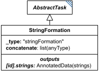

**Category:** tasks  
**Version:** v1  
**Schema:** [`schema.json`](specsheets/tasks/StringFormation/v1.0.0/schema.json)  
**`_type` discriminator:** `"stringFormation"`

##### What it does

`StringFormation` takes the `concatenate` list, converts every element to a string, and concatenates them. If an element of the list is itself a list, each of its members is concatenated into a separate output string, so the overall result becomes a list of strings matching that dimension - e.g. `["n = ", [1, 2, 3]]` yields `["n = 1", "n = 2", "n = 3"]`. If multiple elements of `concatenate` are themselves lists, their corresponding elements are combined pairwise, and all such lists must have identical lengths; multi-dimensional lists produce multi-dimensional string results the same way.

##### Attributes

All classes additionally inherit the optional `name`, `description`, `notes`, and `annotations` fields from `SEDBase` - see [`core/SEDBase`](#sedbase).

| Attribute | Type | Required | Notes |
|---|---|---|---|
| `taskParameters` | array of TaskParameter | no |  |
| `concatenate` | ListOfAnyOrRef | yes |  |

###### Attribute details

**`taskParameters`** (array of TaskParameter, optional) - _(no description yet - placeholder, needs to be filled in)_

**`concatenate`** (ListOfAnyOrRef, required) - _(no description yet - placeholder, needs to be filled in)_


##### Outputs

A string, or a (possibly multi-dimensional) list of strings, accessible as `[id]`.

- `[id]`: **Valid**
    - Dimensions: Scalar (a single string) when no element of `concatenate` is itself a list.
- `[id].model`: **Invalid**
- `[id].strings`: **Valid**
    - Dimensions: Matches the shape of the list element(s) within `concatenate`: 1D if one element of `concatenate` is a list, N-D if several list elements are combined pairwise (all must share the same length/shape per dimension).

Open question: the spec text accesses both the single-string and list-of-strings cases as plain `[id]`, which is what's shown for `id` above; `id.strings` is also marked valid here per the general `AbstractTask` convention for a list-of-strings export. Worth resolving which is actually intended when the result is a list.

##### Validation Rules

**`StringFormation-0000`** (error) - The element fails a JSON Schema constraint attributable to StringFormation that does not match any other numbered rule. ([source](specsheets/tasks/StringFormation/v1.0.0/validation/StringFormation-0000.md))

> Catch-all rule for schema-pass failures attributable to StringFormation (or a
> more specific descendant whose own class's failure location can't be
> resolved to any other numbered rule). See Design.md, Schema-Pass Errors.

**`StringFormation-0001`** (error) - The concatenate attribute of a StringFormation is required. ([source](specsheets/tasks/StringFormation/v1.0.0/validation/StringFormation-0001.md))

> `concatenate` is required.

**`StringFormation-0002`** (error) - When the value of concatenate of a StringFormation is provided directly, it must be an array of values. ([source](specsheets/tasks/StringFormation/v1.0.0/validation/StringFormation-0002.md))

> `concatenate` is `ListOfAnyOrRef`: the value, when not a reference, must be an array of values.

**`StringFormation-0003`** (error) - When the value of concatenate of a StringFormation is a reference, it must be a reference to an array of values. ([source](specsheets/tasks/StringFormation/v1.0.0/validation/StringFormation-0003.md))

> `concatenate` is `ListOfAnyOrRef`: when the value is a reference, it must resolve to an array of values.

**`StringFormation-0004`** (error) - The _type attribute of a StringFormation must be "stringFormation". ([source](specsheets/tasks/StringFormation/v1.0.0/validation/StringFormation-0004.md))

> `_type` is the discriminator field. For `StringFormation` it must always equal `"stringFormation"`.

---

### Output Classes

#### AbstractOutput

*Source: [specsheets/outputs/AbstractOutput/v1.0.0/description.md](specsheets/outputs/AbstractOutput/v1.0.0/description.md)*

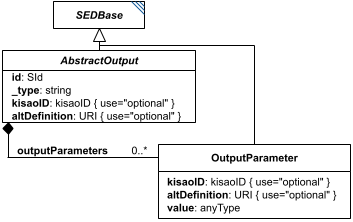

**Category:** outputs  
**Version:** v1  
**Schema:** [`schema.json`](specsheets/outputs/AbstractOutput/v1.0.0/schema.json) + [`common.schema.json`](specsheets/outputs/AbstractOutput/v1.0.0/common.schema.json) (`AbstractOutputCommon`)

##### What it does

`AbstractOutput` is the base class every concrete Output class derives from (in turn deriving from `SEDBase`); it takes data from Tasks and packages it for a person or downstream tool. Concretely this takes two basic forms: a `Report` (text/numbers) or a `Plot` (graphics). If a needed output form isn't defined in SED2 core, `outputParameters` may describe a custom algorithm.

An `AbstractOutput` may never be used as input to anything else in SED2 - it is always the final stage of processing. Anything that needs to be reused elsewhere belongs in a Task instead. SED2 also does not dictate the concrete *form* an output takes (an in-memory object, a web page, exported files); it only dictates what data the output must contain.

**Two schema files in this folder.** `schema.json` defines `AbstractOutput` itself - the `oneOf` discriminator listing `Report`/`Plot2D`/`Plot3D`. `common.schema.json` defines `AbstractOutputCommon` - a schema-only mixin (composed via `allOf`, not instantiated directly, no `_type` or diagram box of its own), mirroring `AbstractTaskCommon`'s role on the task side: `outputParameters` (a list of `OutputParameter` objects configuring it).

##### Attributes

All classes additionally inherit the optional `name`, `description`, `notes`, and `annotations` fields from `SEDBase` - see [`core/SEDBase`](#sedbase).

_This class defines no additional attributes beyond `SEDBaseFields`._

##### Outputs

By design, nothing - an `AbstractOutput` is a terminal node and cannot be referenced by anything else in the document.

- `[id]`: **Invalid**
- `[id].model`: **Invalid**
- `[id].strings`: **Invalid**

(Any output suffix not listed above is invalid for this class.)

By design, nothing - an `AbstractOutput` is always a terminal node and is never referenced by anything else in the document. This holds for every concrete Output subclass.

##### Validation Rules

**`AbstractOutput-0000`** (error) - The element fails a JSON Schema constraint attributable to AbstractOutput that does not match any other numbered rule. ([source](specsheets/outputs/AbstractOutput/v1.0.0/validation/AbstractOutput-0000.md))

> Catch-all rule for schema-pass failures attributable to AbstractOutput (or a
> more specific descendant whose own class's failure location can't be
> resolved to any other numbered rule). See Design.md, Schema-Pass Errors.

**`AbstractOutput-0001`** (error) - The outputParameters attribute of an AbstractOutput must be an array of OutputParameter objects. ([source](specsheets/outputs/AbstractOutput/v1.0.0/validation/AbstractOutput-0001.md))

> `outputParameters` is `array of OutputParameter` in AbstractOutputCommon: it must be an array of OutputParameter objects.

**`AbstractOutput-0002`** (error) - A value that must resolve to a concrete AbstractOutput subtype must declare a _type attribute. ([source](specsheets/outputs/AbstractOutput/v1.0.0/validation/AbstractOutput-0002.md))

> A narrower case of AbstractOutput-0000's catch-all: fires specifically when
> the generated oneOf fails because _type is missing entirely, rather than
> present but unrecognized. Wired via the x-missing-type-rule-id keyword,
> a sibling of x-generated-oneOf; see core-spec.md Section 8 and Design.md's
> Classes section.

#### Plot

*Source: [specsheets/outputs/Plot/v1.0.0/description.md](specsheets/outputs/Plot/v1.0.0/description.md)*

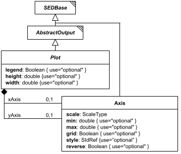

**Category:** outputs  
**Version:** v1  
**Schema:** [`schema.json`](specsheets/outputs/Plot/v1.0.0/schema.json)

##### What it does

`Plot` is the abstract parent of `Plot2D` and `Plot3D`, composed via `allOf` rather than instantiated directly. It defines the `xAxis`/`yAxis` (each an `Axis`), the rendered `width`/`height`, and whether a `legend` should be shown.

##### Attributes

All classes additionally inherit the optional `name`, `description`, `notes`, and `annotations` fields from `SEDBase` - see [`core/SEDBase`](#sedbase).

| Attribute | Type | Required | Notes |
|---|---|---|---|
| `legend` | BooleanOrRef | no |  |
| `height` | NumberOrRef | no |  |
| `width` | NumberOrRef | no |  |
| `xAxis` | Axis | no |  |
| `yAxis` | Axis | no |  |

###### Attribute details

**`legend`** (BooleanOrRef, optional) - _(no description yet - placeholder, needs to be filled in)_

**`height`** (NumberOrRef, optional) - _(no description yet - placeholder, needs to be filled in)_

**`width`** (NumberOrRef, optional) - _(no description yet - placeholder, needs to be filled in)_

**`xAxis`** (Axis, optional) - _(no description yet - placeholder, needs to be filled in)_

**`yAxis`** (Axis, optional) - _(no description yet - placeholder, needs to be filled in)_


##### Outputs

Not applicable - see `Plot2D`/`Plot3D` for the concrete output.

Shared mixin for `Plot2D`/`Plot3D` - not instantiated on its own. Every concrete Output is a terminal node regardless; see `AbstractOutput`.

##### Validation Rules

**`Plot-0000`** (error) - The element fails a JSON Schema constraint attributable to Plot that does not match any other numbered rule. ([source](specsheets/outputs/Plot/v1.0.0/validation/Plot-0000.md))

> Catch-all rule for schema-pass failures attributable to Plot (or a
> more specific descendant whose own class's failure location can't be
> resolved to any other numbered rule). See Design.md, Schema-Pass Errors.

**`Plot-0001`** (error) - When the value of legend of a Plot is provided directly, it must be a boolean. ([source](specsheets/outputs/Plot/v1.0.0/validation/Plot-0001.md))

> `legend` is `BooleanOrRef` in Plot: the value, when not a reference, must be a boolean.

**`Plot-0002`** (error) - When the value of legend of a Plot is a reference, it must be a reference to a boolean. ([source](specsheets/outputs/Plot/v1.0.0/validation/Plot-0002.md))

> `legend` is `BooleanOrRef` in Plot: when the value is a reference, it must resolve to a boolean.

**`Plot-0003`** (error) - When the value of height of a Plot is provided directly, it must be a number. ([source](specsheets/outputs/Plot/v1.0.0/validation/Plot-0003.md))

> `height` is `NumberOrRef` in Plot: the value, when not a reference, must be a number.

**`Plot-0004`** (error) - When the value of height of a Plot is a reference, it must be a reference to a number. ([source](specsheets/outputs/Plot/v1.0.0/validation/Plot-0004.md))

> `height` is `NumberOrRef` in Plot: when the value is a reference, it must resolve to a number.

**`Plot-0005`** (error) - When the value of width of a Plot is provided directly, it must be a number. ([source](specsheets/outputs/Plot/v1.0.0/validation/Plot-0005.md))

> `width` is `NumberOrRef` in Plot: the value, when not a reference, must be a number.

**`Plot-0006`** (error) - When the value of width of a Plot is a reference, it must be a reference to a number. ([source](specsheets/outputs/Plot/v1.0.0/validation/Plot-0006.md))

> `width` is `NumberOrRef` in Plot: when the value is a reference, it must resolve to a number.

**`Plot-0007`** (error) - The xAxis attribute of a Plot must be an Axis object. ([source](specsheets/outputs/Plot/v1.0.0/validation/Plot-0007.md))

> `xAxis` is `Axis` in Plot: it must be an Axis object.

**`Plot-0008`** (error) - When the value of yAxis of a Plot is a reference, it must be a reference to a valid one of `"right"`, `"left"` value. ([source](specsheets/outputs/Plot/v1.0.0/validation/Plot-0008.md))

> `yAxis` is `one of `"right"`, `"left"` or SIdRef` in Plot: when the value is a reference, it must resolve to a valid one of `"right"`, `"left"` value.

#### Plot2D

*Source: [specsheets/outputs/Plot2D/v1.0.0/description.md](specsheets/outputs/Plot2D/v1.0.0/description.md)*

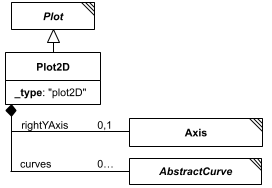

**Category:** outputs  
**Version:** v1  
**Schema:** [`schema.json`](specsheets/outputs/Plot2D/v1.0.0/schema.json)  
**`_type` discriminator:** `"plot2D"`

##### What it does

A plot of two-dimensional data. Beyond `Plot`'s x/y axes, it adds an optional `rightYAxis` and a dictionary of named `curves` (each an `AbstractCurve`-derived object) to display.

##### Attributes

All classes additionally inherit the optional `name`, `description`, `notes`, and `annotations` fields from `SEDBase` - see [`core/SEDBase`](#sedbase).

| Attribute | Type | Required | Notes |
|---|---|---|---|
| `outputParameters` | array of OutputParameter | no |  |
| `legend` | BooleanOrRef | no |  |
| `height` | NumberOrRef | no |  |
| `width` | NumberOrRef | no |  |
| `xAxis` | Axis | no |  |
| `yAxis` | Axis | no |  |
| `rightYAxis` | Axis | no |  |
| `curves` | object (values: AbstractCurve) | yes |  |

###### Attribute details

**`outputParameters`** (array of OutputParameter, optional) - _(no description yet - placeholder, needs to be filled in)_

**`legend`** (BooleanOrRef, optional) - _(no description yet - placeholder, needs to be filled in)_

**`height`** (NumberOrRef, optional) - _(no description yet - placeholder, needs to be filled in)_

**`width`** (NumberOrRef, optional) - _(no description yet - placeholder, needs to be filled in)_

**`xAxis`** (Axis, optional) - _(no description yet - placeholder, needs to be filled in)_

**`yAxis`** (Axis, optional) - _(no description yet - placeholder, needs to be filled in)_

**`rightYAxis`** (Axis, optional) - _(no description yet - placeholder, needs to be filled in)_

**`curves`** (object (values: AbstractCurve), required) - _(no description yet - placeholder, needs to be filled in)_


##### Outputs

By design, nothing further - as an `AbstractOutput`, a `Plot2D` is a terminal node.

- `[id]`: **Invalid**
- `[id].model`: **Invalid**
- `[id].strings`: **Invalid**

(Any output suffix not listed above is invalid for this class.)

Terminal node - see `AbstractOutput`.

##### Validation Rules

**`Plot2D-0000`** (error) - The element fails a JSON Schema constraint attributable to Plot2D that does not match any other numbered rule. ([source](specsheets/outputs/Plot2D/v1.0.0/validation/Plot2D-0000.md))

> Catch-all rule for schema-pass failures attributable to Plot2D (or a
> more specific descendant whose own class's failure location can't be
> resolved to any other numbered rule). See Design.md, Schema-Pass Errors.

**`Plot2D-0001`** (error) - The curves attribute of a Plot2D is required. ([source](specsheets/outputs/Plot2D/v1.0.0/validation/Plot2D-0001.md))

> `curves` is required.

**`Plot2D-0002`** (error) - The curves attribute of a Plot2D must be an object whose values are Curve. ([source](specsheets/outputs/Plot2D/v1.0.0/validation/Plot2D-0002.md))

> `curves` is `object (values: Curve)`: it must be an object whose values are Curve.

**`Plot2D-0003`** (error) - The rightYAxis attribute of a Plot2D must be an Axis object. ([source](specsheets/outputs/Plot2D/v1.0.0/validation/Plot2D-0003.md))

> `rightYAxis` is `Axis`: it must be an Axis object.

**`Plot2D-0004`** (error) - The _type attribute of a Plot2D must be "plot2D". ([source](specsheets/outputs/Plot2D/v1.0.0/validation/Plot2D-0004.md))

> `_type` is the discriminator field. For `Plot2D` it must always equal `"plot2D"`.

#### Plot3D

*Source: [specsheets/outputs/Plot3D/v1.0.0/description.md](specsheets/outputs/Plot3D/v1.0.0/description.md)*

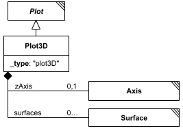

**Category:** outputs  
**Version:** v1  
**Schema:** [`schema.json`](specsheets/outputs/Plot3D/v1.0.0/schema.json)  
**`_type` discriminator:** `"plot3D"`

##### What it does

A plot of three-dimensional data. Beyond `Plot`'s x/y axes, it adds a `zAxis` and a dictionary of named `surfaces` (each a `Surface`) to display.

##### Attributes

All classes additionally inherit the optional `name`, `description`, `notes`, and `annotations` fields from `SEDBase` - see [`core/SEDBase`](#sedbase).

| Attribute | Type | Required | Notes |
|---|---|---|---|
| `outputParameters` | array of OutputParameter | no |  |
| `legend` | BooleanOrRef | no |  |
| `height` | NumberOrRef | no |  |
| `width` | NumberOrRef | no |  |
| `xAxis` | Axis | no |  |
| `yAxis` | Axis | no |  |
| `zAxis` | Axis | no |  |
| `surfaces` | object (values: Surface) | yes |  |

###### Attribute details

**`outputParameters`** (array of OutputParameter, optional) - _(no description yet - placeholder, needs to be filled in)_

**`legend`** (BooleanOrRef, optional) - _(no description yet - placeholder, needs to be filled in)_

**`height`** (NumberOrRef, optional) - _(no description yet - placeholder, needs to be filled in)_

**`width`** (NumberOrRef, optional) - _(no description yet - placeholder, needs to be filled in)_

**`xAxis`** (Axis, optional) - _(no description yet - placeholder, needs to be filled in)_

**`yAxis`** (Axis, optional) - _(no description yet - placeholder, needs to be filled in)_

**`zAxis`** (Axis, optional) - _(no description yet - placeholder, needs to be filled in)_

**`surfaces`** (object (values: Surface), required) - _(no description yet - placeholder, needs to be filled in)_


##### Outputs

By design, nothing further - as an `AbstractOutput`, a `Plot3D` is a terminal node.

- `[id]`: **Invalid**
- `[id].model`: **Invalid**
- `[id].strings`: **Invalid**

(Any output suffix not listed above is invalid for this class.)

Terminal node - see `AbstractOutput`.

##### Validation Rules

**`Plot3D-0000`** (error) - The element fails a JSON Schema constraint attributable to Plot3D that does not match any other numbered rule. ([source](specsheets/outputs/Plot3D/v1.0.0/validation/Plot3D-0000.md))

> Catch-all rule for schema-pass failures attributable to Plot3D (or a
> more specific descendant whose own class's failure location can't be
> resolved to any other numbered rule). See Design.md, Schema-Pass Errors.

**`Plot3D-0001`** (error) - The surfaces attribute of a Plot3D is required. ([source](specsheets/outputs/Plot3D/v1.0.0/validation/Plot3D-0001.md))

> `surfaces` is required.

**`Plot3D-0002`** (error) - The surfaces attribute of a Plot3D must be an object whose values are Surface. ([source](specsheets/outputs/Plot3D/v1.0.0/validation/Plot3D-0002.md))

> `surfaces` is `object (values: Surface)`: it must be an object whose values are Surface.

**`Plot3D-0003`** (error) - The zAxis attribute of a Plot3D must be an Axis object. ([source](specsheets/outputs/Plot3D/v1.0.0/validation/Plot3D-0003.md))

> `zAxis` is `Axis`: it must be an Axis object.

**`Plot3D-0004`** (error) - The _type attribute of a Plot3D must be "plot3D". ([source](specsheets/outputs/Plot3D/v1.0.0/validation/Plot3D-0004.md))

> `_type` is the discriminator field. For `Plot3D` it must always equal `"plot3D"`.

#### Report

*Source: [specsheets/outputs/Report/v1.0.0/description.md](specsheets/outputs/Report/v1.0.0/description.md)*

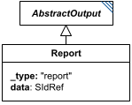

**Category:** outputs  
**Version:** v1  
**Schema:** [`schema.json`](specsheets/outputs/Report/v1.0.0/schema.json)  
**`_type` discriminator:** `"report"`

##### What it does

Exports an `AnnotatedData` reference (`data`) for consumption outside the document. The simplest case is two-dimensional data, which is easy to display to a user or save as CSV; higher-dimensional data may be better suited to a format like HDF5. SED2 only dictates *what* data must be exported, never the storage format.

`data` must reference `AnnotatedData` from any task in the document, or a slice of one (e.g. `#tasks:sim2['S1']`). If the referenced data carries labels, those labels should be exported too (e.g. as row/column headers in a CSV).

##### Attributes

All classes additionally inherit the optional `name`, `description`, `notes`, and `annotations` fields from `SEDBase` - see [`core/SEDBase`](#sedbase).

| Attribute | Type | Required | Notes |
|---|---|---|---|
| `outputParameters` | array of OutputParameter | no |  |
| `data` | SIdRef | yes |  |

###### Attribute details

**`outputParameters`** (array of OutputParameter, optional) - _(no description yet - placeholder, needs to be filled in)_

**`data`** (SIdRef, required) - _(no description yet - placeholder, needs to be filled in)_


##### Outputs

By design, nothing further - as an `AbstractOutput`, a `Report` is a terminal node.

- `[id]`: **Invalid**
- `[id].model`: **Invalid**
- `[id].strings`: **Invalid**

(Any output suffix not listed above is invalid for this class.)

Terminal node - see `AbstractOutput`.

##### Validation Rules

**`Report-0000`** (error) - The element fails a JSON Schema constraint attributable to Report that does not match any other numbered rule. ([source](specsheets/outputs/Report/v1.0.0/validation/Report-0000.md))

> Catch-all rule for schema-pass failures attributable to Report (or a
> more specific descendant whose own class's failure location can't be
> resolved to any other numbered rule). See Design.md, Schema-Pass Errors.

**`Report-0001`** (error) - The data attribute of a Report is required. ([source](specsheets/outputs/Report/v1.0.0/validation/Report-0001.md))

> `data` is required.

**`Report-0002`** (error) - The data attribute of a Report, if present, must be a reference (a string starting with '#'). ([source](specsheets/outputs/Report/v1.0.0/validation/Report-0002.md))

> `data` is `SIdRef` - always a reference, never a literal value.

**`Report-0003`** (error) - The _type attribute of a Report must be "report". ([source](specsheets/outputs/Report/v1.0.0/validation/Report-0003.md))

> `_type` is the discriminator field. For `Report` it must always equal `"report"`.

#### Surface

*Source: [specsheets/outputs/Surface/v1.0.0/description.md](specsheets/outputs/Surface/v1.0.0/description.md)*

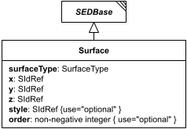

**Category:** outputs  
**Version:** v1  
**Schema:** [`schema.json`](specsheets/outputs/Surface/v1.0.0/schema.json)

##### What it does

Defines a single 3D surface to plot within a `Plot3D`'s `surfaces` dictionary - `x`, `y`, and `z` value references plus a `surfaceType` (`parametricCurve`, `surfaceMesh`, `surfaceContour`, `contour`, `heatMap`, `stackedCurves`, or `bar`).

##### Attributes

All classes additionally inherit the optional `name`, `description`, `notes`, and `annotations` fields from `SEDBase` - see [`core/SEDBase`](#sedbase).

| Attribute | Type | Required | Notes |
|---|---|---|---|
| `surfaceType` | SurfaceType or SIdRef | yes |  |
| `x` | SIdRef | yes |  |
| `y` | SIdRef | yes |  |
| `z` | SIdRef | yes |  |
| `style` | SIdRef | no |  |
| `order` | NonNegativeIntegerOrRef | no |  |

###### Attribute details

**`surfaceType`** (SurfaceType or SIdRef, required) - _(no description yet - placeholder, needs to be filled in)_

**`x`** (SIdRef, required) - _(no description yet - placeholder, needs to be filled in)_

**`y`** (SIdRef, required) - _(no description yet - placeholder, needs to be filled in)_

**`z`** (SIdRef, required) - _(no description yet - placeholder, needs to be filled in)_

**`style`** (SIdRef, optional) - _(no description yet - placeholder, needs to be filled in)_

**`order`** (NonNegativeIntegerOrRef, optional) - _(no description yet - placeholder, needs to be filled in)_


##### Outputs

Not independently referenceable - a `Surface` only exists as a named child within a `Plot3D`'s `surfaces` dictionary.

- `[id]`: **Invalid**
- `[id].model`: **Invalid**
- `[id].strings`: **Invalid**

(Any output suffix not listed above is invalid for this class.)

Not independently referenceable - only exists as a named child within a `Plot3D`'s `surfaces` dictionary.

##### Validation Rules

**`Surface-0000`** (error) - The element fails a JSON Schema constraint attributable to Surface that does not match any other numbered rule. ([source](specsheets/outputs/Surface/v1.0.0/validation/Surface-0000.md))

> Catch-all rule for schema-pass failures attributable to Surface (or a
> more specific descendant whose own class's failure location can't be
> resolved to any other numbered rule). See Design.md, Schema-Pass Errors.

**`Surface-0001`** (error) - The surfaceType attribute of a Surface is required. ([source](specsheets/outputs/Surface/v1.0.0/validation/Surface-0001.md))

> `surfaceType` is required.

**`Surface-0002`** (error) - When the value of surfaceType of a Surface is provided directly, it must be one of 'parametricCurve', 'surfaceMesh', 'surfaceContour', 'contour', 'heatMap', 'stackedCurves', 'bar'. ([source](specsheets/outputs/Surface/v1.0.0/validation/Surface-0002.md))

> `SurfaceType` is defined in `core/Types` with the allowed values 'parametricCurve', 'surfaceMesh', 'surfaceContour', 'contour', 'heatMap', 'stackedCurves', 'bar' (see `core/Types/v1.0.0/schema.json`).

**`Surface-0003`** (error) - When the value of surfaceType of a Surface is a reference, it must be a reference to a valid SurfaceType value. ([source](specsheets/outputs/Surface/v1.0.0/validation/Surface-0003.md))

> `surfaceType` is `SurfaceType or SIdRef`: when the value is a reference, it must resolve to a valid SurfaceType value.

**`Surface-0004`** (error) - The x attribute of a Surface is required. ([source](specsheets/outputs/Surface/v1.0.0/validation/Surface-0004.md))

> `x` is required.

**`Surface-0005`** (error) - The x attribute of a Surface, if present, must be a reference (a string starting with '#'). ([source](specsheets/outputs/Surface/v1.0.0/validation/Surface-0005.md))

> `x` is `SIdRef` - always a reference, never a literal value.

**`Surface-0006`** (error) - The y attribute of a Surface is required. ([source](specsheets/outputs/Surface/v1.0.0/validation/Surface-0006.md))

> `y` is required.

**`Surface-0007`** (error) - The y attribute of a Surface, if present, must be a reference (a string starting with '#'). ([source](specsheets/outputs/Surface/v1.0.0/validation/Surface-0007.md))

> `y` is `SIdRef` - always a reference, never a literal value.

**`Surface-0008`** (error) - The z attribute of a Surface is required. ([source](specsheets/outputs/Surface/v1.0.0/validation/Surface-0008.md))

> `z` is required.

**`Surface-0009`** (error) - The z attribute of a Surface, if present, must be a reference (a string starting with '#'). ([source](specsheets/outputs/Surface/v1.0.0/validation/Surface-0009.md))

> `z` is `SIdRef` - always a reference, never a literal value.

**`Surface-0010`** (error) - The style attribute of a Surface, if present, must be a reference (a string starting with '#'). ([source](specsheets/outputs/Surface/v1.0.0/validation/Surface-0010.md))

> `style` is `SIdRef` - always a reference, never a literal value.

**`Surface-0011`** (error) - When the value of order of a Surface is provided directly, it must be a non-negative integer. ([source](specsheets/outputs/Surface/v1.0.0/validation/Surface-0011.md))

> `order` is `NonNegativeIntegerOrRef`: the value, when not a reference, must be a non-negative integer.

**`Surface-0012`** (error) - When the value of order of a Surface is a reference, it must be a reference to a non-negative integer. ([source](specsheets/outputs/Surface/v1.0.0/validation/Surface-0012.md))

> `order` is `NonNegativeIntegerOrRef`: when the value is a reference, it must resolve to a non-negative integer.

---

### Auxiliary Classes

#### AbstractCurve

*Source: [specsheets/auxiliary/AbstractCurve/v1.0.0/description.md](specsheets/auxiliary/AbstractCurve/v1.0.0/description.md)*

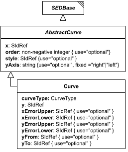

**Category:** auxiliary  
**Version:** v1  
**Schema:** [`schema.json`](specsheets/auxiliary/AbstractCurve/v1.0.0/schema.json) + [`common.schema.json`](specsheets/auxiliary/AbstractCurve/v1.0.0/common.schema.json) (`AbstractCurveCommon`)

##### What it does

`AbstractCurve` is the base class every concrete curve class derives from (which in turn derives from `SEDBase`), discriminated by `_type`. It contributes the required `x` data reference plus the optional `order`, `style`, and `yAxis` fields shared by every curve type. `AbstractCurve` has only one concrete subclass so far, `Curve` (`_type` `"curve"`); a `ShadedArea` subclass (matching SED-ML) is expected to join it later.

**Two schema files in this folder.** `schema.json` defines `AbstractCurve` itself - the generated `oneOf` discriminator listing all concrete curve types (currently just `Curve`). `common.schema.json` defines `AbstractCurveCommon` - a schema-only mixin (composed via `allOf`, not instantiated directly, no `_type` or diagram box of its own) contributing the fields every concrete curve class picks up beyond `SEDBase`: `x`, `order`, `style`, `yAxis`.

##### Attributes

All classes additionally inherit the optional `name`, `description`, `notes`, and `annotations` fields from `SEDBase` - see [`core/SEDBase`](#sedbase).

| Attribute | Type | Required | Notes |
|---|---|---|---|
| `x` | SIdRef | yes |  |
| `order` | NonNegativeIntegerOrRef | no |  |
| `style` | SIdRef | no |  |
| `yAxis` | one of `"right"`, `"left"` or SIdRef | no |  |

###### Attribute details

**`x`** (SIdRef, required) - _(no description yet - placeholder, needs to be filled in)_

**`order`** (NonNegativeIntegerOrRef, optional) - _(no description yet - placeholder, needs to be filled in)_

**`style`** (SIdRef, optional) - _(no description yet - placeholder, needs to be filled in)_

**`yAxis`** (one of `"right"`, `"left"` or SIdRef, optional) - _(no description yet - placeholder, needs to be filled in)_


##### Outputs

Not independently referenceable - `AbstractCurve` is never used directly; only its concrete subclasses (e.g. `Curve`) appear as named children within a `Plot2D`'s `curves` dictionary.

- `[id]`: **Invalid**
- `[id].model`: **Invalid**
- `[id].strings`: **Invalid**

(Any output suffix not listed above is invalid for this class.)

##### Validation Rules

**`AbstractCurve-0000`** (error) - The element fails a JSON Schema constraint attributable to AbstractCurve that does not match any other numbered rule. ([source](specsheets/auxiliary/AbstractCurve/v1.0.0/validation/AbstractCurve-0000.md))

> Catch-all rule for schema-pass failures attributable to AbstractCurve (or a
> more specific descendant whose own class's failure location can't be
> resolved to any other numbered rule). See Design.md, Schema-Pass Errors.

**`AbstractCurve-0001`** (error) - The x attribute of an AbstractCurve is required. ([source](specsheets/auxiliary/AbstractCurve/v1.0.0/validation/AbstractCurve-0001.md))

> `x` is required.

**`AbstractCurve-0002`** (error) - The x attribute of an AbstractCurve, if present, must be a reference (a string starting with '#'). ([source](specsheets/auxiliary/AbstractCurve/v1.0.0/validation/AbstractCurve-0002.md))

> `x` is `SIdRef` in AbstractCurveCommon - always a reference, never a literal value.

**`AbstractCurve-0003`** (error) - When the value of order of an AbstractCurve is provided directly, it must be a non-negative integer. ([source](specsheets/auxiliary/AbstractCurve/v1.0.0/validation/AbstractCurve-0003.md))

> `order` is `NonNegativeIntegerOrRef` in AbstractCurveCommon: the value, when not a reference, must be a non-negative integer.

**`AbstractCurve-0004`** (error) - When the value of order of an AbstractCurve is a reference, it must be a reference to a non-negative integer. ([source](specsheets/auxiliary/AbstractCurve/v1.0.0/validation/AbstractCurve-0004.md))

> `order` is `NonNegativeIntegerOrRef` in AbstractCurveCommon: when the value is a reference, it must resolve to a non-negative integer.

**`AbstractCurve-0005`** (error) - The style attribute of an AbstractCurve, if present, must be a reference (a string starting with '#'). ([source](specsheets/auxiliary/AbstractCurve/v1.0.0/validation/AbstractCurve-0005.md))

> `style` is `SIdRef` in AbstractCurveCommon - always a reference, never a literal value.

**`AbstractCurve-0006`** (error) - When the value of yAxis of an AbstractCurve is provided directly, it must be one of 'right' or 'left'. ([source](specsheets/auxiliary/AbstractCurve/v1.0.0/validation/AbstractCurve-0006.md))

> `yAxis` is `one of "right", "left" or SIdRef` in AbstractCurveCommon: the value, when not a reference, must be one of 'right' or 'left'.

**`AbstractCurve-0007`** (error) - When the value of yAxis of an AbstractCurve is a reference, it must be a reference to one of 'right' or 'left'. ([source](specsheets/auxiliary/AbstractCurve/v1.0.0/validation/AbstractCurve-0007.md))

> `yAxis` is `one of "right", "left" or SIdRef` in AbstractCurveCommon: when the value is a reference, it must resolve to one of 'right' or 'left'.

**`AbstractCurve-0008`** (error) - A value that must resolve to a concrete AbstractCurve subtype must declare a _type attribute. ([source](specsheets/auxiliary/AbstractCurve/v1.0.0/validation/AbstractCurve-0008.md))

> A narrower case of AbstractCurve-0000's catch-all: fires specifically when
> the generated oneOf fails because _type is missing entirely, rather than
> present but unrecognized. Wired via the x-missing-type-rule-id keyword,
> a sibling of x-generated-oneOf; see core-spec.md Section 8 and Design.md's
> Classes section.

#### Annotation

*Source: [specsheets/auxiliary/Annotation/v1.0.0/description.md](specsheets/auxiliary/Annotation/v1.0.0/description.md)*


*(`Annotation` has no standalone diagram of its own - the image above is `SEDBase`'s diagram, reused here because `Annotation` is drawn fully within it as a linked box, right next to `SEDBase`. Look for the `Annotation` box.)*

**Category:** auxiliary  
**Version:** v1  
**Schema:** [`schema.json`](specsheets/auxiliary/Annotation/v1.0.0/schema.json)

##### What it does

A single qualifier/value pair attached to any `SEDBase`-derived element's `annotations` list, describing the parent object - e.g. `{"qualifier": "dc:license", "value": "http://creativecommons.org/publicdomain/zero/1.0/"}`. `qualifier` is a `"namespace:qualifier"` string (several namespaces are predefined for commonly-used modeling URIs, e.g. `bqbiol:hasPart`, `dc:title`, `bibo:Journal`); `value` may be any value (or a reference to one).

##### Attributes

All classes additionally inherit the optional `name`, `description`, `notes`, and `annotations` fields from `SEDBase` - see [`core/SEDBase`](#sedbase).

| Attribute | Type | Required | Notes |
|---|---|---|---|
| `qualifier` | Qualifier | yes |  |
| `value` | AnyValueOrRef | yes |  |

###### Attribute details

**`qualifier`** (Qualifier, required) - _(no description yet - placeholder, needs to be filled in)_

**`value`** (AnyValueOrRef, required) - _(no description yet - placeholder, needs to be filled in)_


##### Outputs

Not independently referenceable - an `Annotation` only exists as an entry in its parent element's `annotations` list.

- `[id]`: **Invalid**
- `[id].model`: **Invalid**
- `[id].strings`: **Invalid**

(Any output suffix not listed above is invalid for this class.)

Not independently referenceable - only exists as an entry in its parent element's `annotations` list.

##### Validation Rules

**`Annotation-0000`** (error) - The element fails a JSON Schema constraint attributable to Annotation that does not match any other numbered rule. ([source](specsheets/auxiliary/Annotation/v1.0.0/validation/Annotation-0000.md))

> Catch-all rule for schema-pass failures attributable to Annotation (or a
> more specific descendant whose own class's failure location can't be
> resolved to any other numbered rule). See Design.md, Schema-Pass Errors.

**`Annotation-0001`** (error) - The qualifier attribute of an Annotation is required. ([source](specsheets/auxiliary/Annotation/v1.0.0/validation/Annotation-0001.md))

> `qualifier` is required.

**`Annotation-0002`** (error) - The qualifier attribute of an Annotation must be a Qualifier string (a 'namespace:term' pair). ([source](specsheets/auxiliary/Annotation/v1.0.0/validation/Annotation-0002.md))

> `qualifier` is `Qualifier`: it must be a Qualifier string (a 'namespace:term' pair).

**`Annotation-0003`** (error) - The value attribute of an Annotation is required. ([source](specsheets/auxiliary/Annotation/v1.0.0/validation/Annotation-0003.md))

> `value` is required.

#### Axis

*Source: [specsheets/auxiliary/Axis/v1.0.0/description.md](specsheets/auxiliary/Axis/v1.0.0/description.md)*


*(`Axis` has no standalone diagram of its own - the image above is `Plot`'s diagram, reused here because `Axis` is drawn fully within it as a linked box, right next to `Plot`. Look for the `Axis` box.)*

**Category:** auxiliary  
**Version:** v1  
**Schema:** [`schema.json`](specsheets/auxiliary/Axis/v1.0.0/schema.json)

##### What it does

An axis of a `Plot2D`/`Plot3D` (`xAxis`, `yAxis`, optionally `rightYAxis`/`zAxis`). Configures the display `scale` (`"linear"` or `"log10"`), optional `min`/`max` bounds, whether to draw a `grid`, an optional `style` reference, and whether the axis is `reverse`d.

##### Attributes

All classes additionally inherit the optional `name`, `description`, `notes`, and `annotations` fields from `SEDBase` - see [`core/SEDBase`](#sedbase).

| Attribute | Type | Required | Notes |
|---|---|---|---|
| `scale` | ScaleTypeOrRef | no |  |
| `min` | NumberOrRef | no |  |
| `max` | NumberOrRef | no |  |
| `grid` | BooleanOrRef | no |  |
| `style` | SIdRef | no |  |
| `reverse` | BooleanOrRef | no |  |

###### Attribute details

**`scale`** (ScaleTypeOrRef, optional) - _(no description yet - placeholder, needs to be filled in)_

**`min`** (NumberOrRef, optional) - _(no description yet - placeholder, needs to be filled in)_

**`max`** (NumberOrRef, optional) - _(no description yet - placeholder, needs to be filled in)_

**`grid`** (BooleanOrRef, optional) - _(no description yet - placeholder, needs to be filled in)_

**`style`** (SIdRef, optional) - _(no description yet - placeholder, needs to be filled in)_

**`reverse`** (BooleanOrRef, optional) - _(no description yet - placeholder, needs to be filled in)_


##### Outputs

Not independently referenceable - an `Axis` only exists as a named child within a `Plot`-derived output.

- `[id]`: **Invalid**
- `[id].model`: **Invalid**
- `[id].strings`: **Invalid**

(Any output suffix not listed above is invalid for this class.)

Not independently referenceable - only exists as a named child of a `Plot`-derived output.

##### Validation Rules

**`Axis-0000`** (error) - The element fails a JSON Schema constraint attributable to Axis that does not match any other numbered rule. ([source](specsheets/auxiliary/Axis/v1.0.0/validation/Axis-0000.md))

> Catch-all rule for schema-pass failures attributable to Axis (or a
> more specific descendant whose own class's failure location can't be
> resolved to any other numbered rule). See Design.md, Schema-Pass Errors.

**`Axis-0001`** (error) - When the value of scale of an Axis is provided directly, it must be one of 'linear', 'log10'. ([source](specsheets/auxiliary/Axis/v1.0.0/validation/Axis-0001.md))

> `ScaleType` is defined in `core/Types` with the allowed values 'linear', 'log10' (see `core/Types/v1.0.0/schema.json`).

**`Axis-0002`** (error) - When the value of scale of an Axis is a reference, it must be a reference to a valid ScaleType value. ([source](specsheets/auxiliary/Axis/v1.0.0/validation/Axis-0002.md))

> `scale` is `ScaleTypeOrRef`: when the value is a reference, it must resolve to a valid ScaleType value.

**`Axis-0003`** (error) - When the value of min of an Axis is provided directly, it must be a number. ([source](specsheets/auxiliary/Axis/v1.0.0/validation/Axis-0003.md))

> `min` is `NumberOrRef`: the value, when not a reference, must be a number.

**`Axis-0004`** (error) - When the value of min of an Axis is a reference, it must be a reference to a number. ([source](specsheets/auxiliary/Axis/v1.0.0/validation/Axis-0004.md))

> `min` is `NumberOrRef`: when the value is a reference, it must resolve to a number.

**`Axis-0005`** (error) - When the value of max of an Axis is provided directly, it must be a number. ([source](specsheets/auxiliary/Axis/v1.0.0/validation/Axis-0005.md))

> `max` is `NumberOrRef`: the value, when not a reference, must be a number.

**`Axis-0006`** (error) - When the value of max of an Axis is a reference, it must be a reference to a number. ([source](specsheets/auxiliary/Axis/v1.0.0/validation/Axis-0006.md))

> `max` is `NumberOrRef`: when the value is a reference, it must resolve to a number.

**`Axis-0007`** (error) - When the value of grid of an Axis is provided directly, it must be a boolean. ([source](specsheets/auxiliary/Axis/v1.0.0/validation/Axis-0007.md))

> `grid` is `BooleanOrRef`: the value, when not a reference, must be a boolean.

**`Axis-0008`** (error) - When the value of grid of an Axis is a reference, it must be a reference to a boolean. ([source](specsheets/auxiliary/Axis/v1.0.0/validation/Axis-0008.md))

> `grid` is `BooleanOrRef`: when the value is a reference, it must resolve to a boolean.

**`Axis-0009`** (error) - The style attribute of an Axis, if present, must be a reference (a string starting with '#'). ([source](specsheets/auxiliary/Axis/v1.0.0/validation/Axis-0009.md))

> `style` is `SIdRef` - always a reference, never a literal value.

**`Axis-0010`** (error) - When the value of reverse of an Axis is provided directly, it must be a boolean. ([source](specsheets/auxiliary/Axis/v1.0.0/validation/Axis-0010.md))

> `reverse` is `BooleanOrRef`: the value, when not a reference, must be a boolean.

**`Axis-0011`** (error) - When the value of reverse of an Axis is a reference, it must be a reference to a boolean. ([source](specsheets/auxiliary/Axis/v1.0.0/validation/Axis-0011.md))

> `reverse` is `BooleanOrRef`: when the value is a reference, it must resolve to a boolean.

#### Curve

*Source: [specsheets/auxiliary/Curve/v1.0.0/description.md](specsheets/auxiliary/Curve/v1.0.0/description.md)*


*(`Curve` has no standalone diagram of its own - the image above is `AbstractCurve`'s diagram, which already draws `Curve` directly as `AbstractCurve`'s one concrete subclass.)*

**Category:** auxiliary  
**Version:** v1  
**Schema:** [`schema.json`](specsheets/auxiliary/Curve/v1.0.0/schema.json)

##### What it does

`AbstractCurve` is the base class (see `auxiliary/AbstractCurve`); `Curve` is its only concrete subclass so far, always pinning `_type` to `"curve"` (a `ShadedArea` subclass, matching SED-ML, is expected to join it later - `AbstractCurve`'s `oneOf` is generated, so adding that branch needs no edit here). `Curve` composes `AbstractCurve`'s `AbstractCurveCommon` mixin - `x`, `order`, `style`, `yAxis` - and adds its own `curveType` (`"points"`, `"bar"`, `"barStacked"`, `"horizontalBar"`, `"horizontalBarStacked"`, or `"shadedArea"`), the `y` data reference, and the error-bar fields `xErrorLower`/`xErrorUpper`/`yErrorLower`/`yErrorUpper`. `yFrom`/`yTo` are meaningful only when `curveType` is `"shadedArea"`.

**One schema file in this folder.** `schema.json` defines `Curve` itself, composing `AbstractCurve`'s `AbstractCurveCommon` mixin (in `auxiliary/AbstractCurve/v1.0.0/common.schema.json`) via `allOf`, plus its own `_type`/`curveType`/`y`/error-bar/`yFrom`/`yTo` fields.

##### Attributes

All classes additionally inherit the optional `name`, `description`, `notes`, and `annotations` fields from `SEDBase` - see [`core/SEDBase`](#sedbase).

| Attribute | Type | Required | Notes |
|---|---|---|---|
| `_type` | const `"curve"` | yes |  |
| `curveType` | CurveType or SIdRef | yes |  |
| `x` | SIdRef | yes |  |
| `y` | SIdRef | yes |  |
| `order` | NonNegativeIntegerOrRef | no |  |
| `style` | SIdRef | no |  |
| `yAxis` | one of `"right"`, `"left"` or SIdRef | no |  |
| `xErrorUpper` | SIdRef | no |  |
| `xErrorLower` | SIdRef | no |  |
| `yErrorUpper` | SIdRef | no |  |
| `yErrorLower` | SIdRef | no |  |
| `yFrom` | SIdRef | no |  |
| `yTo` | SIdRef | no |  |

###### Attribute details

**`_type`** (const `"curve"`, required) - The discriminator field; always `"curve"`.

**`curveType`** (CurveType or SIdRef, required) - _(no description yet - placeholder, needs to be filled in)_

**`x`** (SIdRef, required) - _(no description yet - placeholder, needs to be filled in)_

**`y`** (SIdRef, required) - _(no description yet - placeholder, needs to be filled in)_

**`order`** (NonNegativeIntegerOrRef, optional) - _(no description yet - placeholder, needs to be filled in)_

**`style`** (SIdRef, optional) - _(no description yet - placeholder, needs to be filled in)_

**`yAxis`** (one of `"right"`, `"left"` or SIdRef, optional) - _(no description yet - placeholder, needs to be filled in)_

**`xErrorUpper`** (SIdRef, optional) - _(no description yet - placeholder, needs to be filled in)_

**`xErrorLower`** (SIdRef, optional) - _(no description yet - placeholder, needs to be filled in)_

**`yErrorUpper`** (SIdRef, optional) - _(no description yet - placeholder, needs to be filled in)_

**`yErrorLower`** (SIdRef, optional) - _(no description yet - placeholder, needs to be filled in)_

**`yFrom`** (SIdRef, optional) - _(no description yet - placeholder, needs to be filled in)_

**`yTo`** (SIdRef, optional) - _(no description yet - placeholder, needs to be filled in)_


##### Outputs

Not independently referenceable - a `Curve` only exists as a named child within a `Plot2D`'s `curves` dictionary.

- `[id]`: **Invalid**
- `[id].model`: **Invalid**
- `[id].strings`: **Invalid**

(Any output suffix not listed above is invalid for this class.)

Not independently referenceable - only exists as a named child within a `Plot2D`'s `curves` dictionary.

##### Validation Rules

**`Curve-0000`** (error) - The element fails a JSON Schema constraint attributable to Curve that does not match any other numbered rule. ([source](specsheets/auxiliary/Curve/v1.0.0/validation/Curve-0000.md))

> Catch-all rule for schema-pass failures attributable to Curve (or a
> more specific descendant whose own class's failure location can't be
> resolved to any other numbered rule). See Design.md, Schema-Pass Errors.

**`Curve-0001`** (error) - The curveType attribute of a Curve is required. ([source](specsheets/auxiliary/Curve/v1.0.0/validation/Curve-0001.md))

> `curveType` is required.

**`Curve-0002`** (error) - When the value of curveType of a Curve is provided directly, it must be one of 'points', 'bar', 'barStacked', 'horizontalBar', 'horizontalBarStacked', 'shadedArea'. ([source](specsheets/auxiliary/Curve/v1.0.0/validation/Curve-0002.md))

> `CurveType` is defined in `core/Types` with the allowed values 'points', 'bar', 'barStacked', 'horizontalBar', 'horizontalBarStacked', 'shadedArea' (see `core/Types/v1.0.0/schema.json`).

**`Curve-0003`** (error) - When the value of curveType of a Curve is a reference, it must be a reference to a valid CurveType value. ([source](specsheets/auxiliary/Curve/v1.0.0/validation/Curve-0003.md))

> `curveType` is `CurveType or SIdRef`: when the value is a reference, it must resolve to a valid CurveType value.

**`Curve-0004`** (error) - The y attribute of a Curve is required. ([source](specsheets/auxiliary/Curve/v1.0.0/validation/Curve-0004.md))

> `y` is required.

**`Curve-0005`** (error) - The y attribute of a Curve, if present, must be a reference (a string starting with '#'). ([source](specsheets/auxiliary/Curve/v1.0.0/validation/Curve-0005.md))

> `y` is `SIdRef` - always a reference, never a literal value.

**`Curve-0006`** (error) - The xErrorUpper attribute of a Curve, if present, must be a reference (a string starting with '#'). ([source](specsheets/auxiliary/Curve/v1.0.0/validation/Curve-0006.md))

> `xErrorUpper` is `SIdRef` - always a reference, never a literal value.

**`Curve-0007`** (error) - The xErrorLower attribute of a Curve, if present, must be a reference (a string starting with '#'). ([source](specsheets/auxiliary/Curve/v1.0.0/validation/Curve-0007.md))

> `xErrorLower` is `SIdRef` - always a reference, never a literal value.

**`Curve-0008`** (error) - The yErrorUpper attribute of a Curve, if present, must be a reference (a string starting with '#'). ([source](specsheets/auxiliary/Curve/v1.0.0/validation/Curve-0008.md))

> `yErrorUpper` is `SIdRef` - always a reference, never a literal value.

**`Curve-0009`** (error) - The yErrorLower attribute of a Curve, if present, must be a reference (a string starting with '#'). ([source](specsheets/auxiliary/Curve/v1.0.0/validation/Curve-0009.md))

> `yErrorLower` is `SIdRef` - always a reference, never a literal value.

**`Curve-0010`** (error) - The yFrom attribute of a Curve, if present, must be a reference (a string starting with '#'). ([source](specsheets/auxiliary/Curve/v1.0.0/validation/Curve-0010.md))

> `yFrom` is `SIdRef` - always a reference, never a literal value.

**`Curve-0011`** (error) - The yTo attribute of a Curve, if present, must be a reference (a string starting with '#'). ([source](specsheets/auxiliary/Curve/v1.0.0/validation/Curve-0011.md))

> `yTo` is `SIdRef` - always a reference, never a literal value.

**`Curve-0012`** (error) - The _type attribute of a Curve must be "curve". ([source](specsheets/auxiliary/Curve/v1.0.0/validation/Curve-0012.md))

> `_type` is the discriminator field. For `Curve` it must always equal `"curve"`.

#### LoopVariable

*Source: [specsheets/auxiliary/LoopVariable/v1.0.0/description.md](specsheets/auxiliary/LoopVariable/v1.0.0/description.md)*

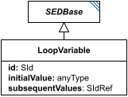

**Category:** auxiliary  
**Version:** v1  
**Schema:** [`schema.json`](specsheets/auxiliary/LoopVariable/v1.0.0/schema.json)

##### What it does

A named child of a `Loop`, representing a value that starts at `initialValue` (sometimes called a 'seed' in workflow languages) on the loop's first iteration, and thereafter takes on `subsequentValues` - a reference to an output of one of the loop's `subTasks`. A subTask reads the current value as `#tasks:[loop_id]:loopVariables:[loopvar_id]`.

##### Attributes

All classes additionally inherit the optional `name`, `description`, `notes`, and `annotations` fields from `SEDBase` - see [`core/SEDBase`](#sedbase).

| Attribute | Type | Required | Notes |
|---|---|---|---|
| `initialValue` | AnyValueOrRef | yes |  |
| `subsequentValues` | SIdRef | yes |  |

###### Attribute details

**`initialValue`** (AnyValueOrRef, required) - _(no description yet - placeholder, needs to be filled in)_

**`subsequentValues`** (SIdRef, required) - _(no description yet - placeholder, needs to be filled in)_


##### Outputs

Not independently referenceable outside its parent `Loop` - see `Loop` for how its current value is addressed from a subTask.

- `[id]`: **Invalid**
- `[id].model`: **Invalid**
- `[id].strings`: **Invalid**

Additional possible outputs beyond the three standard ones:

- `#tasks:[loop_id]:loopVariables:[loopvar_id]`: A `LoopVariable`'s current value, addressed this way from within a subTask - not via the `[id]`/`[id].model`/`[id].strings` scheme, since a `LoopVariable` is not itself a `tasks` dictionary entry.
    - Dimensions: One dimension more than `initialValue` itself, with the added dimension being the parent `Loop`'s `range` - i.e. this holds one `initialValue`-shaped value per iteration, indexed by the loop's range. (`initialValue` is typed `anyType` in the schema, so its own shape is otherwise open/unconstrained.)

Not independently referenceable outside its parent `Loop`.

##### Validation Rules

**`LoopVariable-0000`** (error) - The element fails a JSON Schema constraint attributable to LoopVariable that does not match any other numbered rule. ([source](specsheets/auxiliary/LoopVariable/v1.0.0/validation/LoopVariable-0000.md))

> Catch-all rule for schema-pass failures attributable to LoopVariable (or a
> more specific descendant whose own class's failure location can't be
> resolved to any other numbered rule). See Design.md, Schema-Pass Errors.

**`LoopVariable-0001`** (error) - The initialValue attribute of a LoopVariable is required. ([source](specsheets/auxiliary/LoopVariable/v1.0.0/validation/LoopVariable-0001.md))

> `initialValue` is required.

**`LoopVariable-0002`** (error) - The subsequentValues attribute of a LoopVariable is required. ([source](specsheets/auxiliary/LoopVariable/v1.0.0/validation/LoopVariable-0002.md))

> `subsequentValues` is required.

**`LoopVariable-0003`** (error) - The subsequentValues attribute of a LoopVariable, if present, must be a reference (a string starting with '#'). ([source](specsheets/auxiliary/LoopVariable/v1.0.0/validation/LoopVariable-0003.md))

> `subsequentValues` is `SIdRef` - always a reference, never a literal value.

**`LoopVariable-0004`** (error) - The subsequentValues of a LoopVariable must reference one of its enclosing Loop's own subTasks, or an output of one. ([source](specsheets/auxiliary/LoopVariable/v1.0.0/validation/LoopVariable-0004.md))

> subsequentValues is the value this loop variable takes on after each
> iteration, produced by one of the loop's own subTasks. This is the one place
> a reference may point forward in file order (the subTasks are defined after
> loopVariables), which AbstractTask-0003 must allow.

#### OutputParameter

*Source: [specsheets/auxiliary/OutputParameter/v1.0.0/description.md](specsheets/auxiliary/OutputParameter/v1.0.0/description.md)*


*(`OutputParameter` has no standalone diagram of its own - the image above is `AbstractOutput`'s diagram, reused here because `OutputParameter` is drawn fully within it as a linked box, right next to `AbstractOutput`. Look for the `OutputParameter` box.)*

**Category:** auxiliary  
**Version:** v1  
**Schema:** [`schema.json`](specsheets/auxiliary/OutputParameter/v1.0.0/schema.json)

##### What it does

The `AbstractOutput` counterpart to `TaskParameter`: an algorithm/output parameter attached to an output's `outputParameters` list, used to further configure a custom output algorithm identified by the output's `_type`.

##### Attributes

All classes additionally inherit the optional `name`, `description`, `notes`, and `annotations` fields from `SEDBase` - see [`core/SEDBase`](#sedbase).

| Attribute | Type | Required | Notes |
|---|---|---|---|
| `value` | AnyValueOrRef | yes |  |

###### Attribute details

**`value`** (AnyValueOrRef, required) - _(no description yet - placeholder, needs to be filled in)_


##### Outputs

Not independently referenceable - an `OutputParameter` only exists as an entry in its parent output's `outputParameters` list.

- `[id]`: **Invalid**
- `[id].model`: **Invalid**
- `[id].strings`: **Invalid**

(Any output suffix not listed above is invalid for this class.)

Not independently referenceable - only exists as an entry in its parent output's `outputParameters` list.

##### Validation Rules

**`OutputParameter-0000`** (error) - The element fails a JSON Schema constraint attributable to OutputParameter that does not match any other numbered rule. ([source](specsheets/auxiliary/OutputParameter/v1.0.0/validation/OutputParameter-0000.md))

> Catch-all rule for schema-pass failures attributable to OutputParameter (or a
> more specific descendant whose own class's failure location can't be
> resolved to any other numbered rule). See Design.md, Schema-Pass Errors.

**`OutputParameter-0001`** (error) - The value attribute of an OutputParameter is required. ([source](specsheets/auxiliary/OutputParameter/v1.0.0/validation/OutputParameter-0001.md))

> `value` is required. Its type is `AnyValueOrRef` - any JSON value or a reference is accepted, so no separate type rule applies beyond presence.

#### Span

*Source: [specsheets/auxiliary/Span/v1.0.0/description.md](specsheets/auxiliary/Span/v1.0.0/description.md)*

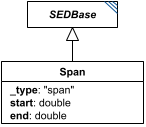

**Category:** auxiliary  
**Version:** v1  
**Schema:** [`schema.json`](specsheets/auxiliary/Span/v1.0.0/schema.json) + [`inline.schema.json`](specsheets/auxiliary/Span/v1.0.0/inline.schema.json) (`SpanInline`)  
**`_type` discriminator:** `"span"`

##### What it does

A minimal range: just a `start` and an `end` value, with no explicit intermediate points. Used by `BoundedODESimulation` (`independentVariableSpan`) and `BoundedStochasticSimulation` (`independentVariableSpan`) to bound a simulation whose output points are chosen by the solver rather than the document.

**Two schema files in this folder.** `schema.json` defines `Span` itself. `inline.schema.json` defines `SpanInline` - the wrapper used for named child fields like `independentVariableSpan`. See `tasks/Range` for why the two are kept separate. Unlike `Range`/`NumericRange`/`ParameterRange`, `Span` is an auxiliary class rather than a task: it does not inherit from `AbstractTask` and is not in `AbstractTask`'s union, so it cannot appear as a standalone `tasks` dictionary entry - it only ever appears embedded, via `SpanInline`.

##### Attributes

All classes additionally inherit the optional `name`, `description`, `notes`, and `annotations` fields from `SEDBase` - see [`core/SEDBase`](#sedbase).

| Attribute | Type | Required | Notes |
|---|---|---|---|
| `start` | NumberOrRef | yes |  |
| `end` | NumberOrRef | yes |  |

###### Attribute details

**`start`** (NumberOrRef, required) - _(no description yet - placeholder, needs to be filled in)_

**`end`** (NumberOrRef, required) - _(no description yet - placeholder, needs to be filled in)_


##### Outputs

Not independently referenceable - a `Span` only exists as a named child of the task that bounds itself with it.

- `[id]`: **Invalid**
- `[id].model`: **Invalid**
- `[id].strings`: **Invalid**

(Any output suffix not listed above is invalid for this class.)

`Span` is not a task, so it can never be a standalone `tasks` entry - it only ever appears embedded (via `SpanInline`), and has no output of its own.

##### Validation Rules

**`Span-0000`** (error) - The element fails a JSON Schema constraint attributable to Span that does not match any other numbered rule. ([source](specsheets/auxiliary/Span/v1.0.0/validation/Span-0000.md))

> Catch-all rule for schema-pass failures attributable to Span (or a
> more specific descendant whose own class's failure location can't be
> resolved to any other numbered rule). See Design.md, Schema-Pass Errors.

**`Span-0001`** (error) - The start attribute of a Span is required. ([source](specsheets/auxiliary/Span/v1.0.0/validation/Span-0001.md))

> `start` is required.

**`Span-0002`** (error) - When the value of start of a Span is provided directly, it must be a number. ([source](specsheets/auxiliary/Span/v1.0.0/validation/Span-0002.md))

> `start` is `NumberOrRef`: the value, when not a reference, must be a number.

**`Span-0003`** (error) - When the value of start of a Span is a reference, it must be a reference to a number. ([source](specsheets/auxiliary/Span/v1.0.0/validation/Span-0003.md))

> `start` is `NumberOrRef`: when the value is a reference, it must resolve to a number.

**`Span-0004`** (error) - The end attribute of a Span is required. ([source](specsheets/auxiliary/Span/v1.0.0/validation/Span-0004.md))

> `end` is required.

**`Span-0005`** (error) - When the value of end of a Span is provided directly, it must be a number. ([source](specsheets/auxiliary/Span/v1.0.0/validation/Span-0005.md))

> `end` is `NumberOrRef`: the value, when not a reference, must be a number.

**`Span-0006`** (error) - When the value of end of a Span is a reference, it must be a reference to a number. ([source](specsheets/auxiliary/Span/v1.0.0/validation/Span-0006.md))

> `end` is `NumberOrRef`: when the value is a reference, it must resolve to a number.

**`Span-0007`** (error) - The _type attribute of a Span must be "span". ([source](specsheets/auxiliary/Span/v1.0.0/validation/Span-0007.md))

> `_type` is the discriminator field. For `Span` it must always equal `"span"`.

#### TaskParameter

*Source: [specsheets/auxiliary/TaskParameter/v1.0.0/description.md](specsheets/auxiliary/TaskParameter/v1.0.0/description.md)*


*(`TaskParameter` has no standalone diagram of its own - the image above is `AbstractTask`'s diagram, reused here because `TaskParameter` is drawn fully within it as a linked box, right next to `AbstractTask`. Look for the `TaskParameter` box.)*

**Category:** auxiliary  
**Version:** v1  
**Schema:** [`schema.json`](specsheets/auxiliary/TaskParameter/v1.0.0/schema.json)

##### What it does

An algorithm/task parameter attached to a Task's `taskParameters` list, used to further configure the algorithm identified by the task's `_type`. Beyond the fields it inherits from `SEDBase`, it carries a required `value`.

##### Attributes

All classes additionally inherit the optional `name`, `description`, `notes`, and `annotations` fields from `SEDBase` - see [`core/SEDBase`](#sedbase).

| Attribute | Type | Required | Notes |
|---|---|---|---|
| `value` | AnyValueOrRef | yes |  |

###### Attribute details

**`value`** (AnyValueOrRef, required) - _(no description yet - placeholder, needs to be filled in)_


##### Outputs

Not independently referenceable - a `TaskParameter` only exists as an entry in its parent task's `taskParameters` list.

- `[id]`: **Invalid**
- `[id].model`: **Invalid**
- `[id].strings`: **Invalid**

(Any output suffix not listed above is invalid for this class.)

Not independently referenceable - only exists as an entry in its parent task's `taskParameters` list.

##### Validation Rules

**`TaskParameter-0000`** (error) - The element fails a JSON Schema constraint attributable to TaskParameter that does not match any other numbered rule. ([source](specsheets/auxiliary/TaskParameter/v1.0.0/validation/TaskParameter-0000.md))

> Catch-all rule for schema-pass failures attributable to TaskParameter (or a
> more specific descendant whose own class's failure location can't be
> resolved to any other numbered rule). See Design.md, Schema-Pass Errors.

**`TaskParameter-0001`** (error) - The value attribute of a TaskParameter is required. ([source](specsheets/auxiliary/TaskParameter/v1.0.0/validation/TaskParameter-0001.md))

> `value` is required. Its type is `AnyValueOrRef` - any JSON value or a reference is accepted, so no separate type rule applies beyond presence.

#### WorkingAlgorithm

*Source: [specsheets/auxiliary/WorkingAlgorithm/v1.0.0/description.md](specsheets/auxiliary/WorkingAlgorithm/v1.0.0/description.md)*

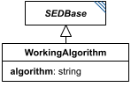

**Category:** auxiliary  
**Version:** v1  
**Schema:** [`schema.json`](specsheets/auxiliary/WorkingAlgorithm/v1.0.0/schema.json)  

##### What it does

An algorithm used internally by a task, attached via a `workingAlgorithms` list: the one `AbstractSimulation` defines (and so every ODE/stochastic simulation task has), or the one `SteadyState` and `FluxBalanceAnalysis` each declare directly. Beyond the fields it inherits from `SEDBase`, it carries a required `algorithm`.

_(No description yet - placeholder. It's not yet clear from the diagram alone how `algorithm` relates to the task's own `_type` discriminator and `taskParameters`, or how multiple `workingAlgorithms` entries on one task are meant to be distinguished/used - needs updating once that's settled.)_

##### Attributes

All classes additionally inherit the optional `name`, `description`, `notes`, and `annotations` fields from `SEDBase` - see [`core/SEDBase`](#sedbase).

| Attribute | Type | Required | Notes |
|---|---|---|---|
| `algorithm` | StringOrRef | yes |  |

###### Attribute details

**`algorithm`** (StringOrRef, required) - _(no description yet - placeholder, needs to be filled in)_


##### Outputs

Not independently referenceable - a `WorkingAlgorithm` only exists as an entry in its parent simulation task's `workingAlgorithms` list.

- `[id]`: **Invalid**
- `[id].model`: **Invalid**
- `[id].strings`: **Invalid**

(Any output suffix not listed above is invalid for this class.)

Not independently referenceable - only exists as an entry in its parent task's `workingAlgorithms` list.

##### Validation Rules

**`WorkingAlgorithm-0000`** (error) - The element fails a JSON Schema constraint attributable to WorkingAlgorithm that does not match any other numbered rule. ([source](specsheets/auxiliary/WorkingAlgorithm/v1.0.0/validation/WorkingAlgorithm-0000.md))

> Catch-all rule for schema-pass failures attributable to WorkingAlgorithm (or a
> more specific descendant whose own class's failure location can't be
> resolved to any other numbered rule). See Design.md, Schema-Pass Errors.

**`WorkingAlgorithm-0001`** (error) - The algorithm attribute of a WorkingAlgorithm is required. ([source](specsheets/auxiliary/WorkingAlgorithm/v1.0.0/validation/WorkingAlgorithm-0001.md))

> `algorithm` is required. Its type is `StringOrRef` - a string value or a reference to one.

---
