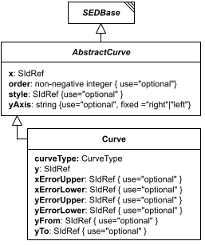

# AbstractCurve

**Category:** auxiliary  
**Version:** v1  
**Schema:** [`schema.json`](./schema.json) + [`common.schema.json`](./common.schema.json) (`AbstractCurveCommon`)

## What it does

`AbstractCurve` is the base class every concrete curve class derives from (which in turn derives from `SEDBase`), discriminated by `_type`. It contributes the required `x` data reference plus the optional `order`, `style`, and `yAxis` fields shared by every curve type. `AbstractCurve` has only one concrete subclass so far, `Curve` (`_type` `"curve"`); a `ShadedArea` subclass (matching SED-ML) is expected to join it later.

**Two schema files in this folder.** `schema.json` defines `AbstractCurve` itself - the generated `oneOf` discriminator listing all concrete curve types (currently just `Curve`). `common.schema.json` defines `AbstractCurveCommon` - a schema-only mixin (composed via `allOf`, not instantiated directly, no `_type` or diagram box of its own) contributing the fields every concrete curve class picks up beyond `SEDBase`: `x`, `order`, `style`, `yAxis`.

## Attributes

All classes additionally inherit the optional `name`, `description`, `notes`, and `annotations` fields from `SEDBase` - see [`core/SEDBase`](../../../core/SEDBase/v1.0.0/description.md).

| Attribute | Type | Required | Notes |
|---|---|---|---|
| `x` | SIdRef | yes |  |
| `order` | NonNegativeIntegerOrRef | no |  |
| `style` | SIdRef | no |  |
| `yAxis` | one of `"right"`, `"left"` or SIdRef | no |  |

### Attribute details

**`x`** (SIdRef, required) - _(no description yet - placeholder, needs to be filled in)_

**`order`** (NonNegativeIntegerOrRef, optional) - _(no description yet - placeholder, needs to be filled in)_

**`style`** (SIdRef, optional) - _(no description yet - placeholder, needs to be filled in)_

**`yAxis`** (one of `"right"`, `"left"` or SIdRef, optional) - _(no description yet - placeholder, needs to be filled in)_

## Outputs

Not independently referenceable - `AbstractCurve` is never used directly; only its concrete subclasses (e.g. `Curve`) appear as named children within a `Plot2D`'s `curves` dictionary.

- `[id]`: **Invalid**
- `[id].model`: **Invalid**
- `[id].strings`: **Invalid**

(Any output suffix not listed above is invalid for this class.)
