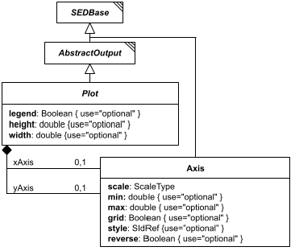

# Axis

*(`Axis` has no standalone diagram of its own - the image above is `Plot`'s diagram, reused here because `Axis` is drawn fully within it as a linked box, right next to `Plot`. Look for the `Axis` box.)*

**Category:** auxiliary  
**Version:** v1  
**Schema:** [`schema.json`](./schema.json)

## What it does

An axis of a `Plot2D`/`Plot3D` (`xAxis`, `yAxis`, optionally `rightYAxis`/`zAxis`). Configures the display `scale` (`"linear"` or `"log10"`), optional `min`/`max` bounds, whether to draw a `grid`, an optional `style` reference, and whether the axis is `reverse`d.

## Attributes

All classes additionally inherit the optional `name`, `description`, `notes`, and `annotations` fields from `SEDBase` - see [`core/SEDBase`](../../../core/SEDBase/v1.0.0/description.md).

| Attribute | Type | Required | Notes |
|---|---|---|---|
| `scale` | ScaleTypeOrRef | no |  |
| `min` | NumberOrRef | no |  |
| `max` | NumberOrRef | no |  |
| `grid` | BooleanOrRef | no |  |
| `style` | SIdRef | no |  |
| `reverse` | BooleanOrRef | no |  |

### Attribute details

**`scale`** (ScaleTypeOrRef, optional) - _(no description yet - placeholder, needs to be filled in)_

**`min`** (NumberOrRef, optional) - _(no description yet - placeholder, needs to be filled in)_

**`max`** (NumberOrRef, optional) - _(no description yet - placeholder, needs to be filled in)_

**`grid`** (BooleanOrRef, optional) - _(no description yet - placeholder, needs to be filled in)_

**`style`** (SIdRef, optional) - _(no description yet - placeholder, needs to be filled in)_

**`reverse`** (BooleanOrRef, optional) - _(no description yet - placeholder, needs to be filled in)_

## Outputs

Not independently referenceable - an `Axis` only exists as a named child within a `Plot`-derived output.

- `[id]`: **Invalid**
- `[id].model`: **Invalid**
- `[id].strings`: **Invalid**

(Any output suffix not listed above is invalid for this class.)

Not independently referenceable - only exists as a named child of a `Plot`-derived output.
