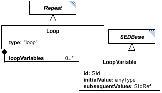

# LoopVariable

*(`LoopVariable` has no standalone diagram of its own - the image above is `Loop`'s diagram, reused here because `LoopVariable` is drawn fully within it as a linked box, right next to `Loop`. Look for the `LoopVariable` box.)*

**Category:** auxiliary  
**Version:** v1  
**Schema:** [`schema.json`](./schema.json)

## What it does

A named child of a `Loop`, representing a value that starts at `initialValue` (sometimes called a 'seed' in workflow languages) on the loop's first iteration, and thereafter takes on `subsequentValues` - a reference to an output of one of the loop's `subTasks`. A subTask reads the current value as `#tasks:[loop_id]:loopVariables:[loopvar_id]`.

## Attributes

All classes additionally inherit the optional `name`, `description`, `notes`, and `annotations` fields from `SEDBase` - see [`core/SEDBase`](../../../core/SEDBase/v1.0.0/description.md). `kisaoID`/`altDefinition` have been rolled into the `_type` discriminator and are no longer separate attributes.

| Attribute | Type | Required | Notes |
|---|---|---|---|
| `initialValue` | AnyValueOrRef | yes |  |
| `subsequentValues` | SIdRef | yes |  |

### Attribute details

**`initialValue`** (AnyValueOrRef, required) - _(no description yet - placeholder, needs to be filled in)_

**`subsequentValues`** (SIdRef, required) - _(no description yet - placeholder, needs to be filled in)_

## Outputs

Not independently referenceable outside its parent `Loop` - see `Loop` for how its current value is addressed from a subTask.

- `[id]`: **Invalid**
- `[id].model`: **Invalid**
- `[id].strings`: **Invalid**

Additional possible outputs beyond the three standard ones:

- `#tasks:[loop_id]:loopVariables:[loopvar_id]`: A `LoopVariable`'s current value, addressed this way from within a subTask - not via the `[id]`/`[id].model`/`[id].strings` scheme, since a `LoopVariable` is not itself a `tasks` dictionary entry.
    - Dimensions: One dimension more than `initialValue` itself, with the added dimension being the parent `Loop`'s `range` - i.e. this holds one `initialValue`-shaped value per iteration, indexed by the loop's range. (`initialValue` is typed `anyType` in the schema, so its own shape is otherwise open/unconstrained.)

Not independently referenceable outside its parent `Loop`.
