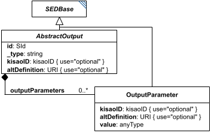

# OutputParameter

*(`OutputParameter` has no standalone diagram of its own - the image above is `AbstractOutput`'s diagram, reused here because `OutputParameter` is drawn fully within it as a linked box, right next to `AbstractOutput`. Look for the `OutputParameter` box.)*

**Category:** auxiliary  
**Version:** v1  
**Schema:** [`schema.json`](./schema.json)

## What it does

The `AbstractOutput` counterpart to `TaskParameter`: an algorithm/output parameter attached to an output's `outputParameters` list, used to further configure a custom output algorithm identified by the output's `_type`.

## Attributes

All classes additionally inherit the optional `name`, `description`, `notes`, and `annotations` fields from `SEDBase` - see [`core/SEDBase`](../../../core/SEDBase/v1.0.0/description.md).

| Attribute | Type | Required | Notes |
|---|---|---|---|
| `value` | AnyValueOrRef | yes |  |

### Attribute details

**`value`** (AnyValueOrRef, required) - _(no description yet - placeholder, needs to be filled in)_

## Outputs

Not independently referenceable - an `OutputParameter` only exists as an entry in its parent output's `outputParameters` list.

- `[id]`: **Invalid**
- `[id].model`: **Invalid**
- `[id].strings`: **Invalid**

(Any output suffix not listed above is invalid for this class.)

Not independently referenceable - only exists as an entry in its parent output's `outputParameters` list.
