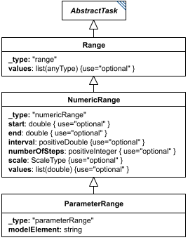

# Range

**Category:** auxiliary  
**Version:** v1  
**Schema:** [`schema.json`](./schema.json) + [`inline.schema.json`](./inline.schema.json) (`RangeInline`)  
**`_type` discriminator:** `"range"`

## What it does

A `Range` defines a list of values to be taken in sequence. It is most often used as the `range` child of a Repeat (Scatter/Loop) rather than as a standalone task, though - like `NumericRange` and `ParameterRange` - it may also appear directly as an entry in the `tasks` dictionary.

The base `Range` class simply lists the values explicitly via its `values` attribute. Its subclass `NumericRange` inherits `values` (narrowed to doubles) and adds several other ways to define a numeric sequence; see that class's Data Sheet.

**Three schema files in this folder.** `schema.json` defines `Range` itself (usable standalone, as a `tasks` dictionary entry, with the full `AbstractTaskCommon` fields). `common.schema.json` defines `RangeCommon` - just the `values` field, composed via `allOf` by `Range` itself and, in turn, by `NumericRange` (and transitively `ParameterRange`), which is how the inheritance chain `Range -> NumericRange -> ParameterRange` is expressed in JSON Schema without conflicting `_type` consts. `inline.schema.json` defines `RangeInline` - the discriminated union of every class composing `RangeCommon` (currently `Range | NumericRange | ParameterRange`, generator-populated the same way `AbstractTask`'s and `AbstractOutput`'s discriminators are - see Design.md's Classes section) used wherever a *named child* field (e.g. a Repeat's `range`) may hold any range subtype.

## Attributes

All classes additionally inherit the optional `name`, `description`, `notes`, and `annotations` fields from `SEDBase` - see [`core/SEDBase`](../../../core/SEDBase/v1.0.0/description.md).

| Attribute | Type | Required | Notes |
|---|---|---|---|
| `taskParameters` | array of TaskParameter | no |  |
| `values` | array of AnyValueOrRef or SIdRef | no |  |

### Attribute details

**`taskParameters`** (array of TaskParameter, optional) - _(no description yet - placeholder, needs to be filled in)_

**`values`** (array of AnyValueOrRef or SIdRef, optional) - _(no description yet - placeholder, needs to be filled in)_

## Outputs

When used as the `range` child of a Repeat, `Range` has no independent output - its values are consumed directly by the containing task. When it instead appears directly in the `tasks` dictionary, its output is the list of values itself, accessible as `[id]`.

- `[id]`: **Valid**
    - Dimensions: 1D: one value per element of `values`, in the order given.
- `[id].model`: **Invalid**
- `[id].strings`: **Invalid**

Only valid when `Range` is used directly as a `tasks` dictionary entry. As an embedded child (via `RangeInline`, e.g. a Repeat's `range`), it has no independent output of its own - its values are consumed directly by the containing task.
