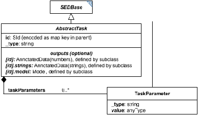

# TaskParameter

*(`TaskParameter` has no standalone diagram of its own - the image above is `AbstractTask`'s diagram, reused here because `TaskParameter` is drawn fully within it as a linked box, right next to `AbstractTask`. Look for the `TaskParameter` box.)*

**Category:** auxiliary  
**Version:** v1  
**Schema:** [`schema.json`](./schema.json)

## What it does

An algorithm/task parameter attached to a Task's `taskParameters` list, used to further configure the algorithm identified by the task's `_type`. Beyond the fields it inherits from `SEDBase`, it carries a required `value`.

`kisaoID`/`altDefinition` previously named which specific parameter this was, but have been rolled into the `_type` discriminator instead and are no longer separate attributes here (2026-09-22) - `schema.json` still needs updating to match, and it's not yet clear from the docs alone how a `TaskParameter`'s specific identity is now expressed without them.

## Attributes

All classes additionally inherit the optional `name`, `description`, `notes`, and `annotations` fields from `SEDBase` - see [`core/SEDBase`](../../../core/SEDBase/v1.0.0/description.md). `kisaoID`/`altDefinition` have been rolled into the `_type` discriminator and are no longer separate attributes.

| Attribute | Type | Required | Notes |
|---|---|---|---|
| `value` | AnyValueOrRef | yes |  |

### Attribute details

**`value`** (AnyValueOrRef, required) - _(no description yet - placeholder, needs to be filled in)_

## Outputs

Not independently referenceable - a `TaskParameter` only exists as an entry in its parent task's `taskParameters` list.

- `[id]`: **Invalid**
- `[id].model`: **Invalid**
- `[id].strings`: **Invalid**

(Any output suffix not listed above is invalid for this class.)

Not independently referenceable - only exists as an entry in its parent task's `taskParameters` list.

## Open issues / notes

- `schema.json` still literally defines `kisaoID`/`altDefinition` as properties even though they're no longer listed as attributes above - needs updating to match the `_type`-based design.
