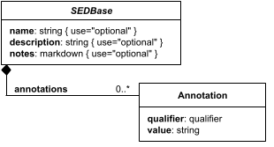

# SEDBase

**Category:** core  
**Version:** v1  
**Schema:** [`schema.json`](./schema.json)

## What it does

Every element in a SED2 document may optionally carry a `name`, `description`, `notes`, and `annotations`. `name` and `description` are unrestricted strings; `notes` is markdown; `annotations` is a list of qualifier/value pairs describing the parent object (e.g. `{"qualifier": "bibo:Journal", "value": "..."}`).

Many SED2 elements also have an implicit `id`: this is not a child field of the object itself, but the dictionary key under which the object appears in its parent collection (e.g. a task's key in the `tasks` dictionary). Elements that can appear more than once in the same list (tasks, styles, algorithm parameters, etc.) get an id this way; one-off elements (most Ranges, for instance) do not.

Every other Data Sheet's schema composes `SEDBaseFields` via `allOf` to pick up these four optional fields, so this page documents them once rather than repeating them on every sheet.

## Attributes

All classes additionally inherit the optional `name`, `description`, `notes`, and `annotations` fields from `SEDBase` - see [`core/SEDBase`](../../../core/SEDBase/v1.0.0/description.md).

_This class defines no additional attributes beyond `SEDBaseFields`._

## Outputs

Every element inherits `SEDBase`, but whether `[id]`, `[id].model`, or `[id].strings` apply depends entirely on the concrete Task/Output subclass - `SEDBase` itself is never independently addressed this way.
