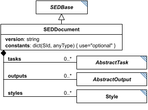

# SEDDocument

**Category:** core  
**Version:** v1  
**Schema:** [`schema.json`](./schema.json)

## What it does

A SED2 document is the root object of a SED2 file. It has one required child, `version` (a string, of the form `v#.#.#` - e.g. `v1.0.0` - naming the document format version this document was written against, see Design.md's Versioning section), and four optional dictionary children: `constants`, `tasks`, `outputs`, and `styles`.

`constants` is simply a dictionary of ids associated with data, centrally located so they can be referenced and changed in one place. `tasks` is a dictionary of `AbstractTask`-derived objects describing *how to do things*; `outputs` is a dictionary of `AbstractOutput`-derived objects describing *how to organize results*. `styles` is a dictionary of `Style` objects (used by plots; the Style class itself is still a placeholder - see its own Data Sheet). In every dictionary, the key is the element's id and the value is the element itself.

**Chronological organization.** No Task nor Output may rely on input from a later Task: a document can always be executed by walking `tasks` then `outputs` in file order. More sophisticated interpreters may instead distribute Tasks across parallel workers by following the DAG formed by input/output references. When a Repeat (Scatter/Loop/ParameterScan) defines child subTasks, those children follow the same ordering rule among themselves.

**Abstraction.** SED2 resembles a workflow language, but it describes general, abstract tasks rather than specific implementations: instead of a shell command like `ls -asF`, SED2 would describe a 'list the contents of a directory' task with an input directory, a list-of-strings output, and parameters indicating whether to include sizes and file/directory type.

## Attributes

All classes additionally inherit the optional `name`, `description`, `notes`, and `annotations` fields from `SEDBase` - see [`core/SEDBase`](../../../core/SEDBase/v1.0.0/description.md).

| Attribute | Type | Required | Notes |
|---|---|---|---|
| `version` | string | yes | Document format version; must match `v#.#.#`. |
| `constants` | object (values: AnyValueOrRef) | no | Predefined constants. Keys are SIds; values may be any JSON value. |
| `tasks` | object (values: AbstractTask) | no | Tasks describe how to do things (simulations, calculations, imports, conversions, etc.). |
| `outputs` | object (values: AbstractOutput) | no | Outputs describe how to package results (reports, plots). |
| `styles` | object (values: Style) | no | Styles used by plots. Permissive placeholder; the formal Style spec is TBD. |

### Attribute details

**`version`** (string, required) - The document format version this document was written against (e.g. `v1.0.0`), used to resolve which version directory each class in the document resolves to (see Design.md's Versioning section). Must match the pattern `v#.#.#`.

**`constants`** (object (values: AnyValueOrRef), optional) - Predefined constants. Keys are SIds; values may be any JSON value.

**`tasks`** (object (values: AbstractTask), optional) - Tasks describe how to do things (simulations, calculations, imports, conversions, etc.).

**`outputs`** (object (values: AbstractOutput), optional) - Outputs describe how to package results (reports, plots).

**`styles`** (object (values: Style), optional) - Styles used by plots. Permissive placeholder; the formal Style spec is TBD.

## Outputs

The document itself is the top-level container and is not referenced from within itself; every reference within the document (`#tasks:...`, `#constants:...`, `#outputs:...` where relevant) resolves against this root object's `tasks`, `constants`, `outputs`, and `styles` dictionaries.

- `[id]`: **Invalid**
- `[id].model`: **Invalid**
- `[id].strings`: **Invalid**

(Any output suffix not listed above is invalid for this class.)

The document is the root container, not an addressable element - it is never referenced via `#tasks:`/`#outputs:` itself; everything else in the document is referenced against its own `tasks`/`constants`/`outputs`/`styles` dictionaries.
