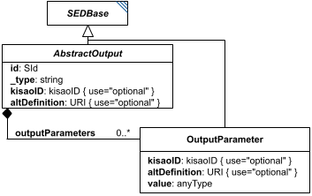

# AbstractOutput

**Category:** outputs  
**Version:** v1  
**Schema:** [`schema.json`](./schema.json) + [`common.schema.json`](./common.schema.json) (`AbstractOutputCommon`)

## What it does

`AbstractOutput` is the base class every concrete Output class derives from (in turn deriving from `SEDBase`); it takes data from Tasks and packages it for a person or downstream tool. Concretely this takes two basic forms: a `Report` (text/numbers) or a `Plot` (graphics). If a needed output form isn't defined in SED2 core, `outputParameters` may describe a custom algorithm.

An `AbstractOutput` may never be used as input to anything else in SED2 - it is always the final stage of processing. Anything that needs to be reused elsewhere belongs in a Task instead. SED2 also does not dictate the concrete *form* an output takes (an in-memory object, a web page, exported files); it only dictates what data the output must contain.

**Two schema files in this folder.** `schema.json` defines `AbstractOutput` itself - the `oneOf` discriminator listing `Report`/`Plot2D`/`Plot3D`. `common.schema.json` defines `AbstractOutputCommon` - a schema-only mixin (composed via `allOf`, not instantiated directly, no `_type` or diagram box of its own), mirroring `AbstractTaskCommon`'s role on the task side: `outputParameters` (a list of `OutputParameter` objects configuring it).

## Attributes

All classes additionally inherit the optional `name`, `description`, `notes`, and `annotations` fields from `SEDBase` - see [`core/SEDBase`](../../../core/SEDBase/v1.0.0/description.md).

_This class defines no additional attributes beyond `SEDBaseFields`._

## Outputs

By design, nothing - an `AbstractOutput` is a terminal node and cannot be referenced by anything else in the document.

- `[id]`: **Invalid**
- `[id].model`: **Invalid**
- `[id].strings`: **Invalid**

(Any output suffix not listed above is invalid for this class.)

By design, nothing - an `AbstractOutput` is always a terminal node and is never referenced by anything else in the document. This holds for every concrete Output subclass.
