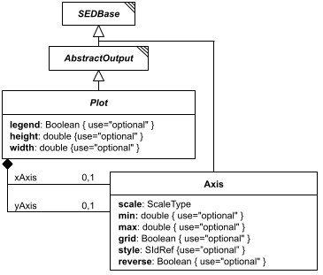

# Plot

**Category:** outputs  
**Version:** v1  
**Schema:** [`schema.json`](./schema.json)

## What it does

`Plot` is the abstract parent of `Plot2D` and `Plot3D`, composed via `allOf` rather than instantiated directly. It defines the `xAxis`/`yAxis` (each an `Axis`), the rendered `width`/`height`, and whether a `legend` should be shown.

## Attributes

All classes additionally inherit the optional `name`, `description`, `notes`, and `annotations` fields from `SEDBase` - see [`core/SEDBase`](../../../core/SEDBase/v1.0.0/description.md).

| Attribute | Type | Required | Notes |
|---|---|---|---|
| `legend` | BooleanOrRef | no |  |
| `height` | NumberOrRef | no |  |
| `width` | NumberOrRef | no |  |
| `xAxis` | Axis | no |  |
| `yAxis` | Axis | no |  |

### Attribute details

**`legend`** (BooleanOrRef, optional) - _(no description yet - placeholder, needs to be filled in)_

**`height`** (NumberOrRef, optional) - _(no description yet - placeholder, needs to be filled in)_

**`width`** (NumberOrRef, optional) - _(no description yet - placeholder, needs to be filled in)_

**`xAxis`** (Axis, optional) - _(no description yet - placeholder, needs to be filled in)_

**`yAxis`** (Axis, optional) - _(no description yet - placeholder, needs to be filled in)_

## Outputs

Not applicable - see `Plot2D`/`Plot3D` for the concrete output.

Shared mixin for `Plot2D`/`Plot3D` - not instantiated on its own. Every concrete Output is a terminal node regardless; see `AbstractOutput`.
