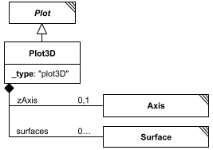

# Plot3D

**Category:** outputs  
**Version:** v1  
**Schema:** [`schema.json`](./schema.json)  
**`_type` discriminator:** `"plot3D"`

## What it does

A plot of three-dimensional data. Beyond `Plot`'s x/y axes, it adds a `zAxis` and a dictionary of named `surfaces` (each a `Surface`) to display.

## Attributes

All classes additionally inherit the optional `name`, `description`, `notes`, and `annotations` fields from `SEDBase` - see [`core/SEDBase`](../../../core/SEDBase/v1.0.0/description.md).

| Attribute | Type | Required | Notes |
|---|---|---|---|
| `outputParameters` | array of OutputParameter | no |  |
| `legend` | BooleanOrRef | no |  |
| `height` | NumberOrRef | no |  |
| `width` | NumberOrRef | no |  |
| `xAxis` | Axis | no |  |
| `yAxis` | Axis | no |  |
| `zAxis` | Axis | no |  |
| `surfaces` | object (values: Surface) | yes |  |

### Attribute details

**`outputParameters`** (array of OutputParameter, optional) - _(no description yet - placeholder, needs to be filled in)_

**`legend`** (BooleanOrRef, optional) - _(no description yet - placeholder, needs to be filled in)_

**`height`** (NumberOrRef, optional) - _(no description yet - placeholder, needs to be filled in)_

**`width`** (NumberOrRef, optional) - _(no description yet - placeholder, needs to be filled in)_

**`xAxis`** (Axis, optional) - _(no description yet - placeholder, needs to be filled in)_

**`yAxis`** (Axis, optional) - _(no description yet - placeholder, needs to be filled in)_

**`zAxis`** (Axis, optional) - _(no description yet - placeholder, needs to be filled in)_

**`surfaces`** (object (values: Surface), required) - _(no description yet - placeholder, needs to be filled in)_

## Outputs

By design, nothing further - as an `AbstractOutput`, a `Plot3D` is a terminal node.

- `[id]`: **Invalid**
- `[id].model`: **Invalid**
- `[id].strings`: **Invalid**

(Any output suffix not listed above is invalid for this class.)

Terminal node - see `AbstractOutput`.
