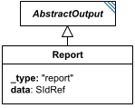

# Report

**Category:** outputs  
**Version:** v1  
**Schema:** [`schema.json`](./schema.json)  
**`_type` discriminator:** `"report"`

## What it does

Exports an `AnnotatedData` reference (`data`) for consumption outside the document. The simplest case is two-dimensional data, which is easy to display to a user or save as CSV; higher-dimensional data may be better suited to a format like HDF5. SED2 only dictates *what* data must be exported, never the storage format.

`data` must reference `AnnotatedData` from any task in the document, or a slice of one (e.g. `#tasks:sim2['S1']`). If the referenced data carries labels, those labels should be exported too (e.g. as row/column headers in a CSV).

## Attributes

All classes additionally inherit the optional `name`, `description`, `notes`, and `annotations` fields from `SEDBase` - see [`core/SEDBase`](../../../core/SEDBase/v1.0.0/description.md). `kisaoID`/`altDefinition` have been rolled into the `_type` discriminator and are no longer separate attributes.

| Attribute | Type | Required | Notes |
|---|---|---|---|
| `outputParameters` | array of OutputParameter | no |  |
| `data` | SIdRef | yes |  |

### Attribute details

**`outputParameters`** (array of OutputParameter, optional) - _(no description yet - placeholder, needs to be filled in)_

**`data`** (SIdRef, required) - _(no description yet - placeholder, needs to be filled in)_

## Outputs

By design, nothing further - as an `AbstractOutput`, a `Report` is a terminal node.

- `[id]`: **Invalid**
- `[id].model`: **Invalid**
- `[id].strings`: **Invalid**

(Any output suffix not listed above is invalid for this class.)

Terminal node - see `AbstractOutput`.
