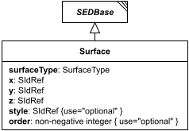

# Surface

**Category:** outputs  
**Version:** v1  
**Schema:** [`schema.json`](./schema.json)

## What it does

Defines a single 3D surface to plot within a `Plot3D`'s `surfaces` dictionary - `x`, `y`, and `z` value references plus a `surfaceType` (`parametricCurve`, `surfaceMesh`, `surfaceContour`, `contour`, `heatMap`, `stackedCurves`, or `bar`).

## Attributes

All classes additionally inherit the optional `name`, `description`, `notes`, and `annotations` fields from `SEDBase` - see [`core/SEDBase`](../../../core/SEDBase/v1.0.0/description.md). `kisaoID`/`altDefinition` have been rolled into the `_type` discriminator and are no longer separate attributes.

| Attribute | Type | Required | Notes |
|---|---|---|---|
| `surfaceType` | SurfaceType or SIdRef | yes |  |
| `x` | SIdRef | yes |  |
| `y` | SIdRef | yes |  |
| `z` | SIdRef | yes |  |
| `style` | SIdRef | no |  |
| `order` | NonNegativeIntegerOrRef | no |  |

### Attribute details

**`surfaceType`** (SurfaceType or SIdRef, required) - _(no description yet - placeholder, needs to be filled in)_

**`x`** (SIdRef, required) - _(no description yet - placeholder, needs to be filled in)_

**`y`** (SIdRef, required) - _(no description yet - placeholder, needs to be filled in)_

**`z`** (SIdRef, required) - _(no description yet - placeholder, needs to be filled in)_

**`style`** (SIdRef, optional) - _(no description yet - placeholder, needs to be filled in)_

**`order`** (NonNegativeIntegerOrRef, optional) - _(no description yet - placeholder, needs to be filled in)_

## Outputs

Not independently referenceable - a `Surface` only exists as a named child within a `Plot3D`'s `surfaces` dictionary.

- `[id]`: **Invalid**
- `[id].model`: **Invalid**
- `[id].strings`: **Invalid**

(Any output suffix not listed above is invalid for this class.)

Not independently referenceable - only exists as a named child within a `Plot3D`'s `surfaces` dictionary.
