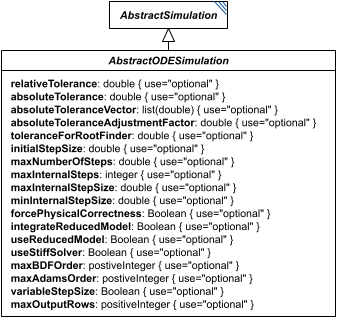

# AbstractODESimulation

**Category:** tasks  
**Version:** v1  
**Schema:** [`schema.json`](./schema.json)  

## What it does

`AbstractODESimulation` is a schema-only mixin (composed via `allOf`, not instantiated directly, no `_type` or diagram box of its own beyond the one shown here) contributing ODE-solver tuning fields shared by `ExplicitODESimulation`, `BoundedODESimulation`, and `OneStepODESimulation`, on top of what `AbstractSimulation` already provides. Every field here is optional - a solver is free to use its own defaults for anything not set.

## Attributes

All classes additionally inherit the optional `name`, `description`, `notes`, and `annotations` fields from `SEDBase` - see [`core/SEDBase`](../../../core/SEDBase/v1.0.0/description.md). `kisaoID`/`altDefinition` have been rolled into the `_type` discriminator and are no longer separate attributes.

| Attribute | Type | Required | Notes |
|---|---|---|---|
| `relativeTolerance` | NumberOrRef | no |  |
| `absoluteTolerance` | NumberOrRef | no |  |
| `absoluteToleranceVector` | ListOfNumbersOrRef | no |  |
| `absoluteToleranceAdjustmentFactor` | NumberOrRef | no |  |
| `toleranceForRootFinder` | NumberOrRef | no |  |
| `initialStepSize` | NumberOrRef | no |  |
| `maxNumberOfSteps` | NumberOrRef | no |  |
| `maxInternalSteps` | IntegerOrRef | no |  |
| `maxInternalStepSize` | NumberOrRef | no |  |
| `minInternalStepSize` | NumberOrRef | no |  |
| `forcePhysicalCorrectness` | BooleanOrRef | no |  |
| `integrateReducedModel` | BooleanOrRef | no |  |
| `useReducedModel` | BooleanOrRef | no |  |
| `useStiffSolver` | BooleanOrRef | no |  |
| `maxBDForder` | PositiveIntegerOrRef | no |  |
| `maxAdamsOrder` | PositiveIntegerOrRef | no |  |
| `variableStepSize` | BooleanOrRef | no |  |
| `maxOutputRows` | PositiveIntegerOrRef | no |  |

### Attribute details

**`relativeTolerance`** (NumberOrRef, optional) - _(no description yet - placeholder, needs to be filled in)_

**`absoluteTolerance`** (NumberOrRef, optional) - _(no description yet - placeholder, needs to be filled in)_

**`absoluteToleranceVector`** (ListOfNumbersOrRef, optional) - _(no description yet - placeholder, needs to be filled in)_

**`absoluteToleranceAdjustmentFactor`** (NumberOrRef, optional) - _(no description yet - placeholder, needs to be filled in)_

**`toleranceForRootFinder`** (NumberOrRef, optional) - _(no description yet - placeholder, needs to be filled in)_

**`initialStepSize`** (NumberOrRef, optional) - _(no description yet - placeholder, needs to be filled in)_

**`maxNumberOfSteps`** (NumberOrRef, optional) - _(no description yet - placeholder, needs to be filled in)_

**`maxInternalSteps`** (IntegerOrRef, optional) - _(no description yet - placeholder, needs to be filled in)_

**`maxInternalStepSize`** (NumberOrRef, optional) - _(no description yet - placeholder, needs to be filled in)_

**`minInternalStepSize`** (NumberOrRef, optional) - _(no description yet - placeholder, needs to be filled in)_

**`forcePhysicalCorrectness`** (BooleanOrRef, optional) - _(no description yet - placeholder, needs to be filled in)_

**`integrateReducedModel`** (BooleanOrRef, optional) - _(no description yet - placeholder, needs to be filled in)_

**`useReducedModel`** (BooleanOrRef, optional) - _(no description yet - placeholder, needs to be filled in)_

**`useStiffSolver`** (BooleanOrRef, optional) - _(no description yet - placeholder, needs to be filled in)_

**`maxBDForder`** (PositiveIntegerOrRef, optional) - _(no description yet - placeholder, needs to be filled in)_

**`maxAdamsOrder`** (PositiveIntegerOrRef, optional) - _(no description yet - placeholder, needs to be filled in)_

**`variableStepSize`** (BooleanOrRef, optional) - _(no description yet - placeholder, needs to be filled in)_

**`maxOutputRows`** (PositiveIntegerOrRef, optional) - _(no description yet - placeholder, needs to be filled in)_

## Outputs

There is no output rule for `AbstractODESimulation` itself - see `ExplicitODESimulation`, `BoundedODESimulation`, and `OneStepODESimulation` for their concrete output shapes.
