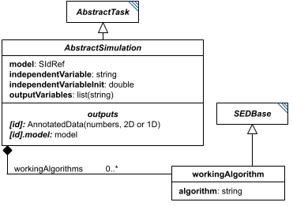

# AbstractSimulation

**Category:** tasks  
**Version:** v1  
**Schema:** [`schema.json`](./schema.json)  

## What it does

`AbstractSimulation` is a schema-only mixin (composed via `allOf`, not instantiated directly, no `_type` or diagram box of its own beyond the one shown here) contributing the fields shared by every ODE or stochastic simulation task, by way of `AbstractODESimulation` and `AbstractStochasticSimulation`. It replaces the earlier `SimulationCommon`, and (unlike `SimulationCommon`) is no longer used by `SteadyState` or `FluxBalanceAnalysis`, which now declare their own fields directly.

Beyond the fields it inherits from `AbstractTask`, it contributes `model`, `independentVariable`, `independentVariableInit`, `outputVariables`, and `workingAlgorithms` - a list of `WorkingAlgorithm` entries describing the algorithm(s) used internally by the simulation.

## Attributes

All classes additionally inherit the optional `name`, `description`, `notes`, and `annotations` fields from `SEDBase` - see [`core/SEDBase`](../../../core/SEDBase/v1.0.0/description.md). `kisaoID`/`altDefinition` have been rolled into the `_type` discriminator and are no longer separate attributes.

| Attribute | Type | Required | Notes |
|---|---|---|---|
| `model` | SIdRef | no |  |
| `independentVariable` | StringOrRef | no |  |
| `independentVariableInit` | NumberOrRef | no |  |
| `outputVariables` | ListOfStringsOrRef | no |  |
| `workingAlgorithms` | array of WorkingAlgorithm | no |  |

### Attribute details

**`model`** (SIdRef, required by every concrete subclass) - _(no description yet - placeholder, needs to be filled in)_

**`independentVariable`** (StringOrRef, required by every concrete subclass) - _(no description yet - placeholder, needs to be filled in)_

**`independentVariableInit`** (NumberOrRef, optional) - _(no description yet - placeholder, needs to be filled in)_

**`outputVariables`** (ListOfStringsOrRef, required by every concrete subclass) - _(no description yet - placeholder, needs to be filled in)_

**`workingAlgorithms`** (array of WorkingAlgorithm, optional) - _(no description yet - placeholder, needs to be filled in)_

## Outputs

There is no single output rule for `AbstractSimulation` itself - see each concrete subclass's Data Sheet. As a family: `[id]` yields an `AnnotatedData` of `outputVariables` (2D for `ExplicitODESimulation`/`BoundedODESimulation`/`ExplicitStochasticSimulation`/`BoundedStochasticSimulation`, 1D for the `OneStep*` variants), and `[id].model` always yields the model's end-of-run state (no longer conditional on an `outputModel` flag - that flag has been removed).

`AbstractSimulation` states the general framework only - see each concrete subclass's own Data Sheet for its exact output shape.
