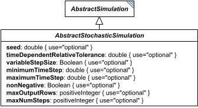

# AbstractStochasticSimulation

**Category:** tasks  
**Version:** v1  
**Schema:** [`schema.json`](./schema.json)  

## What it does

`AbstractStochasticSimulation` is a schema-only mixin (composed via `allOf`, not instantiated directly, no `_type` or diagram box of its own beyond the one shown here) contributing stochastic-solver tuning fields shared by `ExplicitStochasticSimulation`, `BoundedStochasticSimulation`, and `OneStepStochasticSimulation`, on top of what `AbstractSimulation` already provides. Every field here is optional - a solver is free to use its own defaults for anything not set.

## Attributes

All classes additionally inherit the optional `name`, `description`, `notes`, and `annotations` fields from `SEDBase` - see [`core/SEDBase`](../../../core/SEDBase/v1.0.0/description.md). `kisaoID`/`altDefinition` have been rolled into the `_type` discriminator and are no longer separate attributes.

| Attribute | Type | Required | Notes |
|---|---|---|---|
| `seed` | NumberOrRef | no |  |
| `timeDependentRelativeTolerance` | NumberOrRef | no |  |
| `variableStepSize` | BooleanOrRef | no |  |
| `minimumTimeStep` | NumberOrRef | no |  |
| `maximumTimeStep` | NumberOrRef | no |  |
| `nonNegative` | BooleanOrRef | no |  |
| `maxOutputRows` | PositiveIntegerOrRef | no |  |
| `maxNumSteps` | PositiveIntegerOrRef | no |  |

### Attribute details

**`seed`** (NumberOrRef, optional) - _(no description yet - placeholder, needs to be filled in)_

**`timeDependentRelativeTolerance`** (NumberOrRef, optional) - _(no description yet - placeholder, needs to be filled in)_

**`variableStepSize`** (BooleanOrRef, optional) - _(no description yet - placeholder, needs to be filled in)_

**`minimumTimeStep`** (NumberOrRef, optional) - _(no description yet - placeholder, needs to be filled in)_

**`maximumTimeStep`** (NumberOrRef, optional) - _(no description yet - placeholder, needs to be filled in)_

**`nonNegative`** (BooleanOrRef, optional) - _(no description yet - placeholder, needs to be filled in)_

**`maxOutputRows`** (PositiveIntegerOrRef, optional) - _(no description yet - placeholder, needs to be filled in)_

**`maxNumSteps`** (PositiveIntegerOrRef, optional) - _(no description yet - placeholder, needs to be filled in)_

## Outputs

There is no output rule for `AbstractStochasticSimulation` itself - see `ExplicitStochasticSimulation`, `BoundedStochasticSimulation`, and `OneStepStochasticSimulation` for their concrete output shapes.
