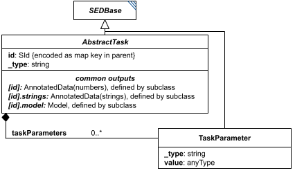

# AbstractTask

**Category:** tasks  
**Version:** v1  
**Schema:** [`schema.json`](./schema.json) + [`common.schema.json`](./common.schema.json) (`AbstractTaskCommon`)

## What it does

`AbstractTask` is the base class every concrete Task class derives from (which in turn derives from `SEDBase`). It contributes an implicit id (its key in the `tasks` dictionary) and a `_type` discriminator field that names the concrete task class.

Every concrete subclass of `AbstractTask` must define what its output (or outputs) are. In particular, a task's own id (`#tasks:id`) - when the task defines it - always resolves to an `AnnotatedData` value (dimensions vary by task). A task's id suffixed with `.model` (`#tasks:id.model`) is used whenever the task exports a model; suffixed with `.strings` (`#tasks:id.strings`) whenever it exports a list of strings. Other output suffixes may be used when needed, but common suffixes should stay standardized across tasks.

**Two schema files in this folder.** `schema.json` defines `AbstractTask` itself - the `oneOf` discriminator listing all 26 concrete task types. `common.schema.json` defines `AbstractTaskCommon` - a schema-only mixin (composed via `allOf`, not instantiated directly, no `_type` or diagram box of its own) contributing the fields every concrete task picks up beyond `SEDBase`: `taskParameters` (a list of `TaskParameter` objects further configuring the algorithm).

## Attributes

All classes additionally inherit the optional `name`, `description`, `notes`, and `annotations` fields from `SEDBase` - see [`core/SEDBase`](../../../core/SEDBase/v1.0.0/description.md).

_This class defines no additional attributes beyond `SEDBaseFields`._

## Outputs

There is no single output rule for `AbstractTask` itself - see each concrete subclass's Data Sheet for its specific output. As a family, though, `[id]` yields `AnnotatedData` when defined, `[id].model` yields a model when the task exports one, and `[id].strings` yields a list of strings when the task exports one.

`AbstractTask` states the general framework only - see each concrete Task's own Data Sheet for which of `[id]`/`[id].model`/`[id].strings` actually apply to it.
