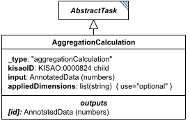

# AggregationCalculation

**Category:** tasks  
**Version:** v1  
**Schema:** [`schema.json`](./schema.json)  
**`_type` discriminator:** `"aggregationCalculation"`

## What it does

Reduces dimensional data by an aggregation calculation (sum, average, standard deviation, etc.). By default only the outermost dimension of `input` is reduced (e.g. averaging every value of a matrix along its first axis), but `appliedDimensions` can name one or more specific dimensions to reduce instead.

When used as a Loop's `aggregateOutputVariables` entry, the reduction defaults to the loop's own dimension (e.g. averaging a simulation's id across loop iterations); `appliedDimensions` can override this default too.

This is an implementation of KISAO:0000824 (aggregation function).

## Attributes

All classes additionally inherit the optional `name`, `description`, `notes`, and `annotations` fields from `SEDBase` - see [`core/SEDBase`](../../../core/SEDBase/v1.0.0/description.md).

| Attribute | Type | Required | Notes |
|---|---|---|---|
| `taskParameters` | array of TaskParameter | no |  |
| `input` | AnyValueOrRef | yes |  |
| `appliedDimensions` | ListOfStringsOrRef | no |  |

### Attribute details

**`taskParameters`** (array of TaskParameter, optional) - _(no description yet - placeholder, needs to be filled in)_

**`input`** (AnyValueOrRef, required) - _(no description yet - placeholder, needs to be filled in)_

**`appliedDimensions`** (ListOfStringsOrRef, optional) - _(no description yet - placeholder, needs to be filled in)_

## Outputs

The aggregated value, accessible as `[id]`.

- `[id]`: **Valid**
    - Dimensions: Same shape as `input`, minus the dimension(s) named in `appliedDimensions` (or minus the outermost dimension by default) - e.g. reducing a 2D `input` along its outermost dimension yields 1D.
- `[id].model`: **Invalid**
- `[id].strings`: **Invalid**

## Open issues / notes

- A COMBINE 2026 meeting note in the spec flags a desired future capability: letting `AggregationCalculation` define an objective function, so a ParameterScan/Repeat could, e.g., 'fit and return the best' result - not yet designed.
- No attribute currently selects which KISAO:0000824 aggregation function (sum, mean, standard deviation, ...) this instance computes - `kisaoID` was rolled into `_type` (see `tasks/AbstractTask`) without a replacement, and `_type` itself is a fixed `"aggregationCalculation"` const. Expected fix: split into one concrete class per aggregation function, the way `Jacobian` was split into `JacobianFull`/`JacobianReduced` - see core-spec.md Section 10. Not yet designed.
