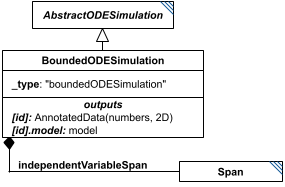

# BoundedODESimulation

**Category:** tasks  
**Version:** v1  
**Schema:** [`schema.json`](./schema.json)  
**`_type` discriminator:** `"boundedODESimulation"`  

## What it does

Like `ExplicitODESimulation`, but defines only a start/end `Span` (`independentVariableSpan`) rather than a fully-explicit range - the solver chooses its own output points, typically denser where the simulation is changing rapidly and sparser where it is slow. Algorithm parameters (`taskParameters`) may further refine how output points are chosen.

Its child `Span` - a simple `start`/`end` pair - is documented on its own Data Sheet since it is reused by `BoundedStochasticSimulation` as well.

This is an implementation of KISAO:0000694 (ODE solver).

## Attributes

All classes additionally inherit the optional `name`, `description`, `notes`, and `annotations` fields from `SEDBase` - see [`core/SEDBase`](../../../core/SEDBase/v1.0.0/description.md). `kisaoID`/`altDefinition` have been rolled into the `_type` discriminator and are no longer separate attributes.

| Attribute | Type | Required | Notes |
|---|---|---|---|
| `taskParameters` | array of TaskParameter | no |  |
| `model` | SIdRef | yes |  |
| `independentVariable` | StringOrRef | yes |  |
| `independentVariableInit` | NumberOrRef | no |  |
| `outputVariables` | ListOfStringsOrRef | yes |  |
| `workingAlgorithms` | array of WorkingAlgorithm | no |  |
| `independentVariableSpan` | SpanInline | yes |  |
| `relativeTolerance` | NumberOrRef | no |  |
| `absoluteTolerance` | NumberOrRef | no |  |
| `absoluteToleranceVector` | ListOfNumbersOrRef | no |  |
| `absoluteToleranceAdjustmentFactor` | NumberOrRef | no |  |
| `toleranceForRootFinder` | NumberOrRef | no |  |
| `initialStepSize` | NumberOrRef | no |  |
| `maxNumberOfSteps` | NumberOrRef | no |  |
| `maxInternalSteps` | IntegerOrRef | no |  |
| `maxInternalStepSize` | NumberOrRef | no |  |
| `minInternalStepSize` | NumberOrRef | no |  |
| `forcePhysicalCorrectness` | BooleanOrRef | no |  |
| `integrateReducedModel` | BooleanOrRef | no |  |
| `useReducedModel` | BooleanOrRef | no |  |
| `useStiffSolver` | BooleanOrRef | no |  |
| `maxBDForder` | PositiveIntegerOrRef | no |  |
| `maxAdamsOrder` | PositiveIntegerOrRef | no |  |
| `variableStepSize` | BooleanOrRef | no |  |
| `maxOutputRows` | PositiveIntegerOrRef | no |  |

### Attribute details

**`taskParameters`** (array of TaskParameter, optional) - _(no description yet - placeholder, needs to be filled in)_

**`model`** (SIdRef, required) - _(no description yet - placeholder, needs to be filled in)_

**`independentVariable`** (StringOrRef, required) - _(no description yet - placeholder, needs to be filled in)_

**`independentVariableInit`** (NumberOrRef, optional) - _(no description yet - placeholder, needs to be filled in)_

**`outputVariables`** (ListOfStringsOrRef, required) - _(no description yet - placeholder, needs to be filled in)_

**`workingAlgorithms`** (array of WorkingAlgorithm, optional) - _(no description yet - placeholder, needs to be filled in)_

**`independentVariableSpan`** (SpanInline, required) - _(no description yet - placeholder, needs to be filled in)_

**`relativeTolerance`** (NumberOrRef, optional) - _(no description yet - placeholder, needs to be filled in)_

**`absoluteTolerance`** (NumberOrRef, optional) - _(no description yet - placeholder, needs to be filled in)_

**`absoluteToleranceVector`** (ListOfNumbersOrRef, optional) - _(no description yet - placeholder, needs to be filled in)_

**`absoluteToleranceAdjustmentFactor`** (NumberOrRef, optional) - _(no description yet - placeholder, needs to be filled in)_

**`toleranceForRootFinder`** (NumberOrRef, optional) - _(no description yet - placeholder, needs to be filled in)_

**`initialStepSize`** (NumberOrRef, optional) - _(no description yet - placeholder, needs to be filled in)_

**`maxNumberOfSteps`** (NumberOrRef, optional) - _(no description yet - placeholder, needs to be filled in)_

**`maxInternalSteps`** (IntegerOrRef, optional) - _(no description yet - placeholder, needs to be filled in)_

**`maxInternalStepSize`** (NumberOrRef, optional) - _(no description yet - placeholder, needs to be filled in)_

**`minInternalStepSize`** (NumberOrRef, optional) - _(no description yet - placeholder, needs to be filled in)_

**`forcePhysicalCorrectness`** (BooleanOrRef, optional) - _(no description yet - placeholder, needs to be filled in)_

**`integrateReducedModel`** (BooleanOrRef, optional) - _(no description yet - placeholder, needs to be filled in)_

**`useReducedModel`** (BooleanOrRef, optional) - _(no description yet - placeholder, needs to be filled in)_

**`useStiffSolver`** (BooleanOrRef, optional) - _(no description yet - placeholder, needs to be filled in)_

**`maxBDForder`** (PositiveIntegerOrRef, optional) - _(no description yet - placeholder, needs to be filled in)_

**`maxAdamsOrder`** (PositiveIntegerOrRef, optional) - _(no description yet - placeholder, needs to be filled in)_

**`variableStepSize`** (BooleanOrRef, optional) - _(no description yet - placeholder, needs to be filled in)_

**`maxOutputRows`** (PositiveIntegerOrRef, optional) - _(no description yet - placeholder, needs to be filled in)_

## Outputs

A 2D matrix of numbers, accessible as `[id]`, with the same column layout as `ExplicitODESimulation` but with solver-chosen row spacing. The model's end-of-run state is always also available as `[id].model`.

- `[id]`: **Valid**
    - Dimensions: 2D: columns = `independentVariable` plus one column per entry of `outputVariables` (same layout as `ExplicitODESimulation`), but row count is chosen by the solver at run time - not fixed by `independentVariableSpan` (only its `start`/`end` are).
- `[id].model`: **Valid**
- `[id].strings`: **Invalid**
