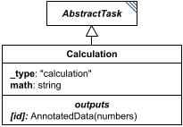

# Calculation

**Category:** tasks  
**Version:** v1  
**Schema:** [`schema.json`](./schema.json)  
**`_type` discriminator:** `"calculation"`

## What it does

Performs a calculation written in infix as the `math` attribute; its id may then be used as that calculation's result elsewhere in the document.

References to `AnnotatedData` may appear within `math`, evaluated element-by-element: combining a lower-dimension value with a higher-dimension one broadcasts the lower one across the higher (e.g. `5 + [list]` adds 5 to every element; `[1D] * [2D]` multiplies each row); combining two same-dimension values requires matching keys (dictionaries) or matching lengths (lists). Allowed operations are `+ - * / ^`, parentheses, standard PEMDAS ordering, the functions allowed in SBML, and the constants allowed in SBML (`pi`, `exponentiale`, etc.).

## Attributes

All classes additionally inherit the optional `name`, `description`, `notes`, and `annotations` fields from `SEDBase` - see [`core/SEDBase`](../../../core/SEDBase/v1.0.0/description.md).

| Attribute | Type | Required | Notes |
|---|---|---|---|
| `taskParameters` | array of TaskParameter | no |  |
| `math` | StringOrRef | yes |  |

### Attribute details

**`taskParameters`** (array of TaskParameter, optional) - _(no description yet - placeholder, needs to be filled in)_

**`math`** (StringOrRef, required) - _(no description yet - placeholder, needs to be filled in)_

## Outputs

The result of evaluating `math`, accessible as `[id]`.

- `[id]`: **Valid**
    - Dimensions: Matches the shape of the evaluated `math` expression: scalar if every operand is scalar, otherwise broadcasts across the shape of any `AnnotatedData` operand(s) per the broadcasting rules above - not fixed ahead of time.
- `[id].model`: **Invalid**
- `[id].strings`: **Invalid**
