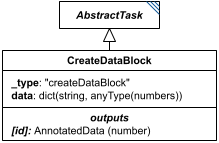

# CreateDataBlock

**Category:** tasks  
**Version:** v1  
**Schema:** [`schema.json`](./schema.json)  
**`_type` discriminator:** `"createDataBlock"`

## What it does

`CreateDataBlock` assembles a new block of `AnnotatedData` from several other pieces of data. Its `data` attribute is a dictionary mapping labels to values (numbers, lists, or `AnnotatedData`).

## Attributes

All classes additionally inherit the optional `name`, `description`, `notes`, and `annotations` fields from `SEDBase` - see [`core/SEDBase`](../../../core/SEDBase/v1.0.0/description.md). `kisaoID`/`altDefinition` have been rolled into the `_type` discriminator and are no longer separate attributes.

| Attribute | Type | Required | Notes |
|---|---|---|---|
| `taskParameters` | array of TaskParameter | no |  |
| `data` | object (values: AnyValueOrRef) or SIdRef | yes |  |

### Attribute details

**`taskParameters`** (array of TaskParameter, optional) - _(no description yet - placeholder, needs to be filled in)_

**`data`** (object (values: AnyValueOrRef) or SIdRef, required) - _(no description yet - placeholder, needs to be filled in)_

## Outputs

A new `AnnotatedData` object whose labels are the `data` dictionary's keys and whose content is the corresponding values, accessible as `[id]`.

- `[id]`: **Valid**
    - Dimensions: 1D, length = number of keys in the `data` dictionary, labeled by those keys - unless a value in `data` is itself multi-dimensional (a list or `AnnotatedData`), in which case that value's own dimensions carry through for that entry. _(Whether/how mixed-dimension entries combine into one overall shape is open - placeholder.)_
- `[id].model`: **Invalid**
- `[id].strings`: **Invalid**
