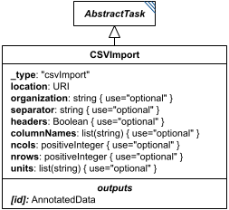

# CsvImport

**Category:** tasks  
**Version:** v1  
**Schema:** [`schema.json`](./schema.json)  
**`_type` discriminator:** `"csvImport"`

## What it does

`CsvImport` imports a CSV (or other delimiter-separated-values) file found at `location` and converts it to a numeric `AnnotatedData` object. Only `location` is strictly required; the schema additionally defines `organization`, `separator`, `headers`, `columnNames`, `ncols`, `nrows`, and `units` to further describe how to parse the file, all of which are optional.

## Attributes

All classes additionally inherit the optional `name`, `description`, `notes`, and `annotations` fields from `SEDBase` - see [`core/SEDBase`](../../../core/SEDBase/v1.0.0/description.md).

| Attribute | Type | Required | Notes |
|---|---|---|---|
| `taskParameters` | array of TaskParameter | no |  |
| `location` | URIOrRef | yes |  |
| `organization` | StringOrRef | no |  |
| `separator` | StringOrRef | no |  |
| `headers` | BooleanOrRef | no |  |
| `columnNames` | ListOfStringsOrRef | no |  |
| `ncols` | PositiveIntegerOrRef | no |  |
| `nrows` | PositiveIntegerOrRef | no |  |
| `units` | ListOfStringsOrRef | no |  |

### Attribute details

**`taskParameters`** (array of TaskParameter, optional) - _(no description yet - placeholder, needs to be filled in)_

**`location`** (URIOrRef, required) - _(no description yet - placeholder, needs to be filled in)_

**`organization`** (StringOrRef, optional) - _(no description yet - placeholder, needs to be filled in)_

**`separator`** (StringOrRef, optional) - _(no description yet - placeholder, needs to be filled in)_

**`headers`** (BooleanOrRef, optional) - _(no description yet - placeholder, needs to be filled in)_

**`columnNames`** (ListOfStringsOrRef, optional) - _(no description yet - placeholder, needs to be filled in)_

**`ncols`** (PositiveIntegerOrRef, optional) - _(no description yet - placeholder, needs to be filled in)_

**`nrows`** (PositiveIntegerOrRef, optional) - _(no description yet - placeholder, needs to be filled in)_

**`units`** (ListOfStringsOrRef, optional) - _(no description yet - placeholder, needs to be filled in)_

## Outputs

The imported numeric `AnnotatedData`, accessible as `[id]`.

- `[id]`: **Valid**
    - Dimensions: 2D: rows x columns, as determined by the CSV file at `location` together with `organization`/`headers`/`columnNames`/`ncols`/`nrows`/`separator`.
- `[id].model`: **Invalid**
- `[id].strings`: **Invalid**

## Open issues / notes

- The prose spec's "CSVImport" section is a single unfinished sentence ("All of the other arguments are optional,") - the schema is noticeably more complete than the prose here (it names `organization`/`separator`/`headers`/`columnNames`/`ncols`/`nrows`/`units` explicitly), so this Data Sheet leans on the schema; the prose section should be filled back in to match.
