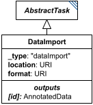

# DataImport

**Category:** tasks  
**Version:** v1  
**Schema:** [`schema.json`](./schema.json)  
**`_type` discriminator:** `"dataImport"`

## What it does

`DataImport` pulls in a file at `location` (in the format named by `format`) and imports it into an `AnnotatedData` object. `taskParameters` may be used to further specify how a particular file should be imported (e.g. a delimiter, or whether a header row is present).

`DataImport` is meant for non-standard file formats; common formats such as CSV have their own specialized importer (`CsvImport`).

## Attributes

All classes additionally inherit the optional `name`, `description`, `notes`, and `annotations` fields from `SEDBase` - see [`core/SEDBase`](../../../core/SEDBase/v1.0.0/description.md). `kisaoID`/`altDefinition` have been rolled into the `_type` discriminator and are no longer separate attributes.

| Attribute | Type | Required | Notes |
|---|---|---|---|
| `taskParameters` | array of TaskParameter | no |  |
| `location` | URIOrRef | yes |  |
| `format` | URIOrRef | yes |  |

### Attribute details

**`taskParameters`** (array of TaskParameter, optional) - _(no description yet - placeholder, needs to be filled in)_

**`location`** (URIOrRef, required) - _(no description yet - placeholder, needs to be filled in)_

**`format`** (URIOrRef, required) - _(no description yet - placeholder, needs to be filled in)_

## Outputs

The imported `AnnotatedData`, accessible as `[id]` (e.g. `#tasks:data1`).

- `[id]`: **Valid**
    - Dimensions: Whatever shape the imported file itself has - not fixed by the schema; depends on `format` and the file at `location`.
- `[id].model`: **Invalid**
- `[id].strings`: **Invalid**
