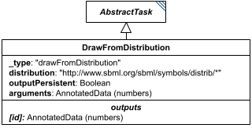

# DrawFromDistribution

**Category:** tasks  
**Version:** v1  
**Schema:** [`schema.json`](./schema.json)  
**`_type` discriminator:** `"drawFromDistribution"`

## What it does

Draws from one of the distributions defined in the SBML distrib package - normal, uniform, bernoulli, binomial, cauchy, chisquare, exponential, gamma, laplace, lognormal, poisson, and rayleigh - named by the `distribution` attribute, which holds that distribution's `http://www.sbml.org/sbml/symbols/distrib/*` definitionURL (see `core/Types`'s `DistributionURI`, kept in sync with `schema/predefined-functions.json`'s `distrib` registry). `arguments` supplies the distribution's parameters in the order SBML defines them - e.g. a normal distribution takes `(mean, stdev)` or `(mean, stdev, min, max)`. For distributions outside this list, other ontologies (e.g. UncertML, though dormant) may be used, with `distribution` given as a reference instead of a direct URI value.

`outputPersistent` controls whether every reference to this task's id always yields the same drawn value (`true` - useful when multiple tasks must share one draw) or yields a fresh draw from the same distribution each time it's referenced (`false` - useful when multiple tasks need independent draws).

## Attributes

All classes additionally inherit the optional `name`, `description`, `notes`, and `annotations` fields from `SEDBase` - see [`core/SEDBase`](../../../core/SEDBase/v1.0.0/description.md). Which distribution to draw from is named explicitly by the `distribution` attribute, since every `DrawFromDistribution` shares the one `"drawFromDistribution"` `_type`.

| Attribute | Type | Required | Notes |
|---|---|---|---|
| `taskParameters` | array of TaskParameter | no |  |
| `distribution` | DistributionURI or SIdRef | yes | Which distribution to draw from |
| `arguments` | ListOfAnyOrRef | yes |  |
| `outputPersistent` | BooleanOrRef | no |  |

### Attribute details

**`taskParameters`** (array of TaskParameter, optional) - _(no description yet - placeholder, needs to be filled in)_

**`distribution`** (DistributionURI or SIdRef, required) - Names the distribution to draw from, as one of the 12 `http://www.sbml.org/sbml/symbols/distrib/*` definitionURL values (see `core/Types`'s `DistributionURI`) - or a reference to a value that resolves to one of them.

**`arguments`** (ListOfAnyOrRef, required) - _(no description yet - placeholder, needs to be filled in)_

**`outputPersistent`** (BooleanOrRef, optional) - _(no description yet - placeholder, needs to be filled in)_

## Outputs

Officially `AnnotatedData`, usually a single number accessible as `[id][0]`; the type is multidimensional to leave room for future draws of correlated values.

- `[id]`: **Valid**
    - Dimensions: Currently always a single value, at `[id][0]` (effectively 0-D/scalar today). _(How a future correlated multi-value draw would be shaped is open - placeholder.)_
- `[id].model`: **Invalid**
- `[id].strings`: **Invalid**

Typically a single number, indexed as `[id][0]`; the type is multidimensional `AnnotatedData` to leave room for correlated multi-value draws in the future.

## Open issues / notes

- `arguments` is a flat, unlabeled `ListOfAnyOrRef` array, but each distribution named by `distribution` needs a different number of differently-meaning parameters (a `normal` draw takes `mean`/`stdev`, optionally `min`/`max`; a `cauchy` draw takes `scale`, or `location`/`scale`, or `location`/`scale`/`min`/`max` - see `schema/predefined-functions.json`'s `distrib` entries for the full per-distribution argument lists). Nothing in the schema ties a specific positional `arguments` entry to its meaning for the chosen distribution. Expected fix: split into one concrete class per distribution (e.g. `DrawFromNormalDistribution`, `DrawFromCauchyDistribution`, ...), each with its own `_type` and properly named attributes instead of a generic `distribution` + `arguments` pair - the way `Jacobian` was split into `JacobianFull`/`JacobianReduced` - see core-spec.md Section 10. Not yet designed. Decided: frozen as a single class for v1; the split is deferred, not scheduled.
