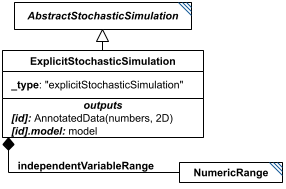

# ExplicitStochasticSimulation

**Category:** tasks  
**Version:** v1  
**Schema:** [`schema.json`](./schema.json)  
**`_type` discriminator:** `"explicitStochasticSimulation"`  

## What it does

A stochastic simulation is one where the model's processes (e.g. SBML reactions) are treated as statistical likelihoods of occurring, rather than as continuous rates of change - distinct from a Stochastic Differential Equation, where the rates themselves are stochastic.

`ExplicitStochasticSimulation` has its output points defined by the child `independentVariableRange`. The stochastic events themselves need not fall on those output points - whatever the model's element values are *at* each output point is what gets recorded.

This is an implementation of KISAO:0000319 (Monte Carlo method).

## Attributes

All classes additionally inherit the optional `name`, `description`, `notes`, and `annotations` fields from `SEDBase` - see [`core/SEDBase`](../../../core/SEDBase/v1.0.0/description.md). `kisaoID`/`altDefinition` have been rolled into the `_type` discriminator and are no longer separate attributes.

| Attribute | Type | Required | Notes |
|---|---|---|---|
| `taskParameters` | array of TaskParameter | no |  |
| `model` | SIdRef | yes |  |
| `independentVariable` | StringOrRef | yes |  |
| `independentVariableInit` | NumberOrRef | no |  |
| `outputVariables` | ListOfStringsOrRef | yes |  |
| `workingAlgorithms` | array of WorkingAlgorithm | no |  |
| `independentVariableRange` | NumericRangeInline | yes |  |
| `seed` | NumberOrRef | no |  |
| `timeDependentRelativeTolerance` | NumberOrRef | no |  |
| `variableStepSize` | BooleanOrRef | no |  |
| `minimumTimeStep` | NumberOrRef | no |  |
| `maximumTimeStep` | NumberOrRef | no |  |
| `nonNegative` | BooleanOrRef | no |  |
| `maxOutputRows` | PositiveIntegerOrRef | no |  |
| `maxNumSteps` | PositiveIntegerOrRef | no |  |

### Attribute details

**`taskParameters`** (array of TaskParameter, optional) - _(no description yet - placeholder, needs to be filled in)_

**`model`** (SIdRef, required) - _(no description yet - placeholder, needs to be filled in)_

**`independentVariable`** (StringOrRef, required) - _(no description yet - placeholder, needs to be filled in)_

**`independentVariableInit`** (NumberOrRef, optional) - _(no description yet - placeholder, needs to be filled in)_

**`outputVariables`** (ListOfStringsOrRef, required) - _(no description yet - placeholder, needs to be filled in)_

**`workingAlgorithms`** (array of WorkingAlgorithm, optional) - _(no description yet - placeholder, needs to be filled in)_

**`independentVariableRange`** (NumericRangeInline, required) - _(no description yet - placeholder, needs to be filled in)_

**`seed`** (NumberOrRef, optional) - _(no description yet - placeholder, needs to be filled in)_

**`timeDependentRelativeTolerance`** (NumberOrRef, optional) - _(no description yet - placeholder, needs to be filled in)_

**`variableStepSize`** (BooleanOrRef, optional) - _(no description yet - placeholder, needs to be filled in)_

**`minimumTimeStep`** (NumberOrRef, optional) - _(no description yet - placeholder, needs to be filled in)_

**`maximumTimeStep`** (NumberOrRef, optional) - _(no description yet - placeholder, needs to be filled in)_

**`nonNegative`** (BooleanOrRef, optional) - _(no description yet - placeholder, needs to be filled in)_

**`maxOutputRows`** (PositiveIntegerOrRef, optional) - _(no description yet - placeholder, needs to be filled in)_

**`maxNumSteps`** (PositiveIntegerOrRef, optional) - _(no description yet - placeholder, needs to be filled in)_

## Outputs

A 2D matrix of numbers, accessible as `[id]`: the first column is `independentVariable`, subsequent columns are (in order) each variable from `outputVariables`. The model's end-of-run state is always also available as `[id].model`.

- `[id]`: **Valid**
    - Dimensions: 2D: rows = each value in `independentVariableRange`; columns = `independentVariable` plus one column per entry of `outputVariables` (same layout as `ExplicitODESimulation`).
- `[id].model`: **Valid**
- `[id].strings`: **Invalid**
