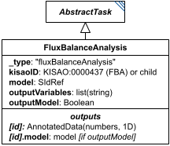

# FluxBalanceAnalysis

**Category:** tasks  
**Version:** v1  
**Schema:** [`schema.json`](./schema.json)  
**`_type` discriminator:** `"fluxBalanceAnalysis"`

## What it does

Uses an objective function and reaction rate bounds (both defined within the model itself) to determine the set of reaction rates that maximizes the objective function. Unlike the other simulation tasks, FBA has no independent variable.

This is an implementation of KISAO:0000437 (FBA).

## Attributes

All classes additionally inherit the optional `name`, `description`, `notes`, and `annotations` fields from `SEDBase` - see [`core/SEDBase`](../../../core/SEDBase/v1.0.0/description.md). `kisaoID`/`altDefinition` have been rolled into the `_type` discriminator and are no longer separate attributes.

| Attribute | Type | Required | Notes |
|---|---|---|---|
| `taskParameters` | array of TaskParameter | no |  |
| `model` | SIdRef | yes |  |
| `outputVariables` | ListOfStringsOrRef | yes |  |
| `outputModel` | BooleanOrRef | no |  |

### Attribute details

**`taskParameters`** (array of TaskParameter, optional) - _(no description yet - placeholder, needs to be filled in)_

**`model`** (SIdRef, required) - _(no description yet - placeholder, needs to be filled in)_

**`outputVariables`** (ListOfStringsOrRef, required) - _(no description yet - placeholder, needs to be filled in)_

**`outputModel`** (BooleanOrRef, optional) - _(no description yet - placeholder, needs to be filled in)_

## Outputs

A dictionary of model variables (usually fluxes) to their final values, accessible via `outputVariables` as `[id]` - analogous to a `SteadyState` result. If `outputModel` is `true`, the resulting model state is also available as `[id].model`.

- `[id]`: **Valid**
    - Dimensions: 1D: one value per entry of `outputVariables` (typically reaction fluxes) - length depends on how many variables are named there.
- `[id].model`: **Valid**
- `[id].strings`: **Invalid**

`[id].model` is only produced when `outputModel` is `true`.
