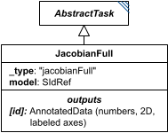

# JacobianFull

**Category:** tasks  
**Version:** v1  
**Schema:** [`schema.json`](./schema.json)  
**`_type` discriminator:** `"jacobianFull"`

## What it does

Calculates the full Jacobian matrix of a model - a species-by-species matrix, with identical row and column species orderings. Split out from the former single `Jacobian` class (which distinguished full vs. reduced via an `isFull` flag) into its own `_type`, alongside `JacobianReduced`.

This is an implementation of KISAO:0000812 (full Jacobian).

## Attributes

All classes additionally inherit the optional `name`, `description`, `notes`, and `annotations` fields from `SEDBase` - see [`core/SEDBase`](../../../core/SEDBase/v1.0.0/description.md). `kisaoID`/`altDefinition` have been rolled into the `_type` discriminator and are no longer separate attributes.

| Attribute | Type | Required | Notes |
|---|---|---|---|
| `taskParameters` | array of TaskParameter | no |  |
| `model` | SIdRef | yes |  |

### Attribute details

**`taskParameters`** (array of TaskParameter, optional) - _(no description yet - placeholder, needs to be filled in)_

**`model`** (SIdRef, required) - _(no description yet - placeholder, needs to be filled in)_

## Outputs

The full Jacobian as a list of lists, accessible as `[id]`, with axis labels given by the ordered list of species.

- `[id]`: **Valid**
    - Dimensions: 2D: species x species - row and column ordering both match the model's ordered list of species.
- `[id].model`: **Invalid**
- `[id].strings`: **Invalid**
