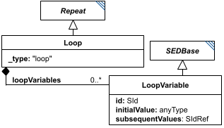

# Loop

**Category:** tasks  
**Version:** v1  
**Schema:** [`schema.json`](./schema.json)  
**`_type` discriminator:** `"loop"`

## What it does

A `Repeat` whose iterations are chained: each depends on the output of the previous one. This is expressed with `loopVariables` - named `LoopVariable` entries whose value equals `initialValue` on the first iteration and thereafter equals `subsequentValues` (an output of one of the loop's `subTasks`). A subTask references a loop variable as `#tasks:[loop_id]:loopVariables:[loopvar_id]`.

## Attributes

All classes additionally inherit the optional `name`, `description`, `notes`, and `annotations` fields from `SEDBase` - see [`core/SEDBase`](../../../core/SEDBase/v1.0.0/description.md).

| Attribute | Type | Required | Notes |
|---|---|---|---|
| `taskParameters` | array of TaskParameter | no |  |
| `subTasks` | object (values: AbstractTask) | yes |  |
| `outputVariableMap` | object (values: SIdRef) or SIdRef | no |  |
| `aggregateOutputVariables` | object (values: AggregationCalculation) | no |  |
| `range` | RangeInline | no |  |
| `loopVariables` | object (values: LoopVariable) | yes |  |

### Attribute details

**`taskParameters`** (array of TaskParameter, optional) - _(no description yet - placeholder, needs to be filled in)_

**`subTasks`** (object (values: AbstractTask), required) - _(no description yet - placeholder, needs to be filled in)_

**`outputVariableMap`** (object (values: SIdRef) or SIdRef, optional) - _(no description yet - placeholder, needs to be filled in)_

**`aggregateOutputVariables`** (object (values: AggregationCalculation), optional) - _(no description yet - placeholder, needs to be filled in)_

**`range`** (RangeInline, optional) - _(no description yet - placeholder, needs to be filled in)_

**`loopVariables`** (object (values: LoopVariable), required) - _(no description yet - placeholder, needs to be filled in)_

## Outputs

`[id]`: an `AnnotatedData` whose first column is the range values and whose subsequent columns follow `outputVariableMap`. `[id].aggregates`: an `AnnotatedData` following `aggregateOutputVariables`, when defined.

- `[id]`: **Valid**
    - Dimensions: 2D (or more): first dimension = one row per iteration; remaining dimension(s) = one column per entry of `outputVariableMap`. Unlike `Scatter`, the row count isn't known in advance from a `range` - it's however many iterations the loop actually runs. _(Exact termination condition for a Loop's iteration count - placeholder, needs to be filled in from the spec.)_
- `[id].model`: **Invalid**
- `[id].strings`: **Invalid**

Additional possible outputs beyond the three standard ones:

- `[id].aggregates`: An `AnnotatedData` following `aggregateOutputVariables`, when that attribute is defined.
    - Dimensions: 1D: one entry per `aggregateOutputVariables` mapping, each collapsing the iteration dimension of `[id]` down to a single value (per `Repeat`, the applied dimension defaults to the Repeat's own iterations) - unless the underlying subTask output was itself multi-dimensional, in which case that dimensionality carries through per entry.

- `[id].range`: Within the loop, the current value of `range`, when `range` is defined (see `Repeat`).
    - Dimensions: Scalar (0-D) per iteration.
- `[id].index`: Within the loop, the current index into `range`, when `range` is defined.
    - Dimensions: Scalar (0-D) per iteration.
