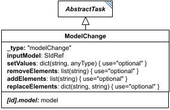

# ModelChange

**Category:** tasks  
**Version:** v1  
**Schema:** [`schema.json`](./schema.json)  
**`_type` discriminator:** `"modelChange"`

## What it does

`ModelChange` modifies a model (`inputModel`, an `SIdRef` to another element's model output) and produces a new model as `[id].model`.

Four optional attributes each describe a kind of change: `setValues` (the simplest - sets the string key to the corresponding value, most commonly a model element id mapped to a number, though model-format-specific keys like `"S1.boundary"` are also possible), `removeElements` (removes the named element from the model; anything still referencing it must be separately handled), `addElements` (adds the named element to the model - e.g. an Antimony-formatted string for SBML), and `replaceElements` (each key is removed and replaced by its value, with internal references retargeted). `replaceElements` is inherited from SED-ML Level 1 and was rarely used there; the spec authors flag it as a candidate for removal from SED2, since `addElements`/`removeElements` can accomplish most of the same thing.

## Attributes

All classes additionally inherit the optional `name`, `description`, `notes`, and `annotations` fields from `SEDBase` - see [`core/SEDBase`](../../../core/SEDBase/v1.0.0/description.md). `kisaoID`/`altDefinition` have been rolled into the `_type` discriminator and are no longer separate attributes.

| Attribute | Type | Required | Notes |
|---|---|---|---|
| `taskParameters` | array of TaskParameter | no |  |
| `inputModel` | SIdRef | yes |  |
| `setValues` | object (values: AnyValueOrRef) or SIdRef | no |  |
| `removeElements` | ListOfStringsOrRef | no |  |
| `addElements` | ListOfStringsOrRef | no |  |
| `replaceElements` | object (values: StringOrRef) or SIdRef | no |  |

### Attribute details

**`taskParameters`** (array of TaskParameter, optional) - _(no description yet - placeholder, needs to be filled in)_

**`inputModel`** (SIdRef, required) - _(no description yet - placeholder, needs to be filled in)_

**`setValues`** (object (values: AnyValueOrRef) or SIdRef, optional) - _(no description yet - placeholder, needs to be filled in)_

**`removeElements`** (ListOfStringsOrRef, optional) - _(no description yet - placeholder, needs to be filled in)_

**`addElements`** (ListOfStringsOrRef, optional) - _(no description yet - placeholder, needs to be filled in)_

**`replaceElements`** (object (values: StringOrRef) or SIdRef, optional) - _(no description yet - placeholder, needs to be filled in)_

## Outputs

The modified model, accessible as `[id].model`.

- `[id]`: **Invalid**
- `[id].model`: **Valid**
- `[id].strings`: **Invalid**

## Open issues / notes

- The spec text itself questions whether `replaceElements` should be kept in SED2 at all - worth a decision before this attribute is finalized.
