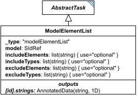

# ModelElementList

**Category:** tasks  
**Version:** v1  
**Schema:** [`schema.json`](./schema.json)  
**`_type` discriminator:** `"modelElementList"`

## What it does

`ModelElementList` analyzes a model and returns a list of element-id strings, filtered by `includeElements`/`includeTypes`/`excludeElements`/`excludeTypes` - four lists of strings whose meaning is defined per model format. For example, for SBML, putting `"J0"`/`"J1"` in `includeElements`, `"species"` in `includeTypes`, and `"S1"` in `excludeElements` selects 'every species plus reactions J0 and J1, except S1'. If an element appears in both an include and an exclude list, it is excluded.

## Attributes

All classes additionally inherit the optional `name`, `description`, `notes`, and `annotations` fields from `SEDBase` - see [`core/SEDBase`](../../../core/SEDBase/v1.0.0/description.md). `kisaoID`/`altDefinition` have been rolled into the `_type` discriminator and are no longer separate attributes.

| Attribute | Type | Required | Notes |
|---|---|---|---|
| `taskParameters` | array of TaskParameter | no |  |
| `model` | SIdRef | yes |  |
| `includeElements` | ListOfStringsOrRef | no |  |
| `includeTypes` | ListOfStringsOrRef | no |  |
| `excludeElements` | ListOfStringsOrRef | no |  |
| `excludeTypes` | ListOfStringsOrRef | no |  |

### Attribute details

**`taskParameters`** (array of TaskParameter, optional) - _(no description yet - placeholder, needs to be filled in)_

**`model`** (SIdRef, required) - _(no description yet - placeholder, needs to be filled in)_

**`includeElements`** (ListOfStringsOrRef, optional) - _(no description yet - placeholder, needs to be filled in)_

**`includeTypes`** (ListOfStringsOrRef, optional) - _(no description yet - placeholder, needs to be filled in)_

**`excludeElements`** (ListOfStringsOrRef, optional) - _(no description yet - placeholder, needs to be filled in)_

**`excludeTypes`** (ListOfStringsOrRef, optional) - _(no description yet - placeholder, needs to be filled in)_

## Outputs

A list of element-id strings, accessible as `[id]`.

- `[id]`: **Invalid**
- `[id].model`: **Invalid**
- `[id].strings`: **Valid**
    - Dimensions: 1D: one string per matched model element (after `includeElements`/`includeTypes`/`excludeElements`/`excludeTypes` filtering) - length not fixed ahead of time, depends on the referenced model.

Corrected here to `[id].strings`, per the general `AbstractTask` addressing convention for a list-of-strings export - an earlier draft of this Data Sheet said `[id]`; flagging in case `[id]` was actually intended.
