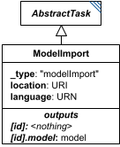

# ModelImport

**Category:** tasks  
**Version:** v1  
**Schema:** [`schema.json`](./schema.json)  
**`_type` discriminator:** `"modelImport"`

## What it does

Two tasks are designed to import files from an external source: `ModelImport` and `DataImport`. All other tasks use predefined input (attribute values) or information defined elsewhere in the document.

A `ModelImport`'s `location` is a URI pointing to a model file; `language` is a URN naming what kind of model it is (e.g. `urn:sedml:language:sbml`). The task's own id carries no independent meaning and should not be referenced directly.

## Attributes

All classes additionally inherit the optional `name`, `description`, `notes`, and `annotations` fields from `SEDBase` - see [`core/SEDBase`](../../../core/SEDBase/v1.0.0/description.md). `kisaoID`/`altDefinition` have been rolled into the `_type` discriminator and are no longer separate attributes.

| Attribute | Type | Required | Notes |
|---|---|---|---|
| `taskParameters` | array of TaskParameter | no |  |
| `location` | URIOrRef | yes |  |
| `language` | URNOrRef | yes |  |

### Attribute details

**`taskParameters`** (array of TaskParameter, optional) - _(no description yet - placeholder, needs to be filled in)_

**`location`** (URIOrRef, required) - _(no description yet - placeholder, needs to be filled in)_

**`language`** (URNOrRef, required) - _(no description yet - placeholder, needs to be filled in)_

## Outputs

The imported model, accessible as `[id].model` (e.g. `#tasks:model1.model`). The bare id (`#tasks:model1`) has no meaning and must not be used.

- `[id]`: **Invalid**
- `[id].model`: **Valid**
- `[id].strings`: **Invalid**

The bare id (`#tasks:model1`) has no meaning and must not be used.
