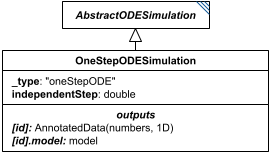

# OneStepODESimulation

**Category:** tasks  
**Version:** v1  
**Schema:** [`schema.json`](./schema.json)  
**`_type` discriminator:** `"oneStepODE"`  

## What it does

A single-output-point simulation: the values of `outputVariables` after the independent variable advances by `independentStep`. Internally the solver may still take any step size it likes; only the *output* - a single final point rather than a series - distinguishes this from `BoundedODESimulation`. It is agnostic to the independent variable's starting value: it simply simulates across a given distance and reports the final values.

This is an implementation of KISAO:0000694 (ODE solver).

## Attributes

All classes additionally inherit the optional `name`, `description`, `notes`, and `annotations` fields from `SEDBase` - see [`core/SEDBase`](../../../core/SEDBase/v1.0.0/description.md).

| Attribute | Type | Required | Notes |
|---|---|---|---|
| `taskParameters` | array of TaskParameter | no |  |
| `model` | SIdRef | yes |  |
| `independentVariable` | StringOrRef | yes |  |
| `independentVariableInit` | NumberOrRef | no |  |
| `outputVariables` | ListOfStringsOrRef | yes |  |
| `workingAlgorithms` | array of WorkingAlgorithm | no |  |
| `independentStep` | NumberOrRef | yes |  |
| `relativeTolerance` | NumberOrRef | no |  |
| `absoluteTolerance` | NumberOrRef | no |  |
| `absoluteToleranceVector` | ListOfNumbersOrRef | no |  |
| `absoluteToleranceAdjustmentFactor` | NumberOrRef | no |  |
| `toleranceForRootFinder` | NumberOrRef | no |  |
| `initialStepSize` | NumberOrRef | no |  |
| `maxNumberOfSteps` | NumberOrRef | no |  |
| `maxInternalSteps` | IntegerOrRef | no |  |
| `maxInternalStepSize` | NumberOrRef | no |  |
| `minInternalStepSize` | NumberOrRef | no |  |
| `forcePhysicalCorrectness` | BooleanOrRef | no |  |
| `integrateReducedModel` | BooleanOrRef | no |  |
| `useReducedModel` | BooleanOrRef | no |  |
| `useStiffSolver` | BooleanOrRef | no |  |
| `maxBDForder` | PositiveIntegerOrRef | no |  |
| `maxAdamsOrder` | PositiveIntegerOrRef | no |  |
| `variableStepSize` | BooleanOrRef | no |  |
| `maxOutputRows` | PositiveIntegerOrRef | no |  |

### Attribute details

**`taskParameters`** (array of TaskParameter, optional) - _(no description yet - placeholder, needs to be filled in)_

**`model`** (SIdRef, required) - _(no description yet - placeholder, needs to be filled in)_

**`independentVariable`** (StringOrRef, required) - _(no description yet - placeholder, needs to be filled in)_

**`independentVariableInit`** (NumberOrRef, optional) - _(no description yet - placeholder, needs to be filled in)_

**`outputVariables`** (ListOfStringsOrRef, required) - _(no description yet - placeholder, needs to be filled in)_

**`workingAlgorithms`** (array of WorkingAlgorithm, optional) - _(no description yet - placeholder, needs to be filled in)_

**`independentStep`** (NumberOrRef, required) - _(no description yet - placeholder, needs to be filled in)_

**`relativeTolerance`** (NumberOrRef, optional) - _(no description yet - placeholder, needs to be filled in)_

**`absoluteTolerance`** (NumberOrRef, optional) - _(no description yet - placeholder, needs to be filled in)_

**`absoluteToleranceVector`** (ListOfNumbersOrRef, optional) - _(no description yet - placeholder, needs to be filled in)_

**`absoluteToleranceAdjustmentFactor`** (NumberOrRef, optional) - _(no description yet - placeholder, needs to be filled in)_

**`toleranceForRootFinder`** (NumberOrRef, optional) - _(no description yet - placeholder, needs to be filled in)_

**`initialStepSize`** (NumberOrRef, optional) - _(no description yet - placeholder, needs to be filled in)_

**`maxNumberOfSteps`** (NumberOrRef, optional) - _(no description yet - placeholder, needs to be filled in)_

**`maxInternalSteps`** (IntegerOrRef, optional) - _(no description yet - placeholder, needs to be filled in)_

**`maxInternalStepSize`** (NumberOrRef, optional) - _(no description yet - placeholder, needs to be filled in)_

**`minInternalStepSize`** (NumberOrRef, optional) - _(no description yet - placeholder, needs to be filled in)_

**`forcePhysicalCorrectness`** (BooleanOrRef, optional) - _(no description yet - placeholder, needs to be filled in)_

**`integrateReducedModel`** (BooleanOrRef, optional) - _(no description yet - placeholder, needs to be filled in)_

**`useReducedModel`** (BooleanOrRef, optional) - _(no description yet - placeholder, needs to be filled in)_

**`useStiffSolver`** (BooleanOrRef, optional) - _(no description yet - placeholder, needs to be filled in)_

**`maxBDForder`** (PositiveIntegerOrRef, optional) - _(no description yet - placeholder, needs to be filled in)_

**`maxAdamsOrder`** (PositiveIntegerOrRef, optional) - _(no description yet - placeholder, needs to be filled in)_

**`variableStepSize`** (BooleanOrRef, optional) - _(no description yet - placeholder, needs to be filled in)_

**`maxOutputRows`** (PositiveIntegerOrRef, optional) - _(no description yet - placeholder, needs to be filled in)_

## Outputs

The final values of `outputVariables` after stepping by `independentStep`, accessible as `[id]`. The model's end-of-run state is always also available as `[id].model`.

- `[id]`: **Valid**
    - Dimensions: 1D: one value per entry of `outputVariables` - a single point, not a series (see `independentStep`).
- `[id].model`: **Valid**
- `[id].strings`: **Invalid**

## Open issues / notes

- The spec text itself flags an open question here: it's unclear whether it's acceptable that the independent variable's own final value is neither tracked nor output.
