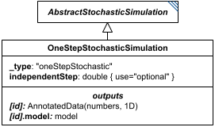

# OneStepStochasticSimulation

**Category:** tasks  
**Version:** v1  
**Schema:** [`schema.json`](./schema.json)  
**`_type` discriminator:** `"oneStepStochastic"`  

## What it does

Similar to `OneStepODESimulation`, but `independentStep` is optional. If unset, the simulation runs until a stochastic event occurs, the model changes, `outputVariables` are recorded, and the step size actually taken is saved as `[id].independentStep`. If `independentStep` is set, the independent variable advances by exactly that much regardless of how many stochastic events occur in the interval (zero or more).

This is an implementation of KISAO:0000319 (Monte Carlo method).

## Attributes

All classes additionally inherit the optional `name`, `description`, `notes`, and `annotations` fields from `SEDBase` - see [`core/SEDBase`](../../../core/SEDBase/v1.0.0/description.md). `kisaoID`/`altDefinition` have been rolled into the `_type` discriminator and are no longer separate attributes.

| Attribute | Type | Required | Notes |
|---|---|---|---|
| `taskParameters` | array of TaskParameter | no |  |
| `model` | SIdRef | yes |  |
| `independentVariable` | StringOrRef | yes |  |
| `independentVariableInit` | NumberOrRef | no |  |
| `outputVariables` | ListOfStringsOrRef | yes |  |
| `workingAlgorithms` | array of WorkingAlgorithm | no |  |
| `independentStep` | NumberOrRef | no |  |
| `seed` | NumberOrRef | no |  |
| `timeDependentRelativeTolerance` | NumberOrRef | no |  |
| `variableStepSize` | BooleanOrRef | no |  |
| `minimumTimeStep` | NumberOrRef | no |  |
| `maximumTimeStep` | NumberOrRef | no |  |
| `nonNegative` | BooleanOrRef | no |  |
| `maxOutputRows` | PositiveIntegerOrRef | no |  |
| `maxNumSteps` | PositiveIntegerOrRef | no |  |

### Attribute details

**`taskParameters`** (array of TaskParameter, optional) - _(no description yet - placeholder, needs to be filled in)_

**`model`** (SIdRef, required) - _(no description yet - placeholder, needs to be filled in)_

**`independentVariable`** (StringOrRef, required) - _(no description yet - placeholder, needs to be filled in)_

**`independentVariableInit`** (NumberOrRef, optional) - _(no description yet - placeholder, needs to be filled in)_

**`outputVariables`** (ListOfStringsOrRef, required) - _(no description yet - placeholder, needs to be filled in)_

**`workingAlgorithms`** (array of WorkingAlgorithm, optional) - _(no description yet - placeholder, needs to be filled in)_

**`independentStep`** (NumberOrRef, optional) - _(no description yet - placeholder, needs to be filled in)_

**`seed`** (NumberOrRef, optional) - _(no description yet - placeholder, needs to be filled in)_

**`timeDependentRelativeTolerance`** (NumberOrRef, optional) - _(no description yet - placeholder, needs to be filled in)_

**`variableStepSize`** (BooleanOrRef, optional) - _(no description yet - placeholder, needs to be filled in)_

**`minimumTimeStep`** (NumberOrRef, optional) - _(no description yet - placeholder, needs to be filled in)_

**`maximumTimeStep`** (NumberOrRef, optional) - _(no description yet - placeholder, needs to be filled in)_

**`nonNegative`** (BooleanOrRef, optional) - _(no description yet - placeholder, needs to be filled in)_

**`maxOutputRows`** (PositiveIntegerOrRef, optional) - _(no description yet - placeholder, needs to be filled in)_

**`maxNumSteps`** (PositiveIntegerOrRef, optional) - _(no description yet - placeholder, needs to be filled in)_

## Outputs

The values of `outputVariables` at the end of the step, accessible as `[id]`. When `independentStep` was not provided, the actual elapsed step is available as `[id].independentStep`. The model's end-of-run state is always also available as `[id].model`.

- `[id]`: **Valid**
    - Dimensions: 1D: one value per entry of `outputVariables` - a single point, not a series.
- `[id].model`: **Valid**
- `[id].strings`: **Invalid**

Additional possible outputs beyond the three standard ones:

- `[id].independentStep`: The step size actually taken, available only when `independentStep` was *not* provided as input (the task ran until the next stochastic event).
    - Dimensions: Scalar (0-D): a single number.
