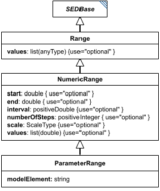

# ParameterRange

**Category:** tasks  
**Version:** v1  
**Schema:** [`schema.json`](./schema.json) + [`inline.schema.json`](./inline.schema.json) (`ParameterRangeInline`)  
**`_type` discriminator:** `"parameterRange"`

## What it does

A `NumericRange` (its subclass) for when a range of values over a specific model element is needed - most commonly as one of a `ParameterScan`'s `parameterRanges`. It inherits everything `NumericRange` defines (which in turn inherits from `Range`) and adds `modelElement`, the id of the model element to vary.

**Two schema files in this folder.** `schema.json` defines `ParameterRange` itself, composing `NumericRange`'s `NumericRangeCommon` mixin (which itself composes `Range`'s `RangeCommon`) alongside its own `modelElement`. Unlike `Range` and `NumericRange`, `ParameterRange` has no `common.schema.json` of its own, since nothing currently inherits further from it. `inline.schema.json` defines `ParameterRangeInline` - the wrapper used for `ParameterScan.parameterRanges` entries. See `tasks/Range` for why the standalone and common forms are kept separate.

## Attributes

All classes additionally inherit the optional `name`, `description`, `notes`, and `annotations` fields from `SEDBase` - see [`core/SEDBase`](../../../core/SEDBase/v1.0.0/description.md).

| Attribute | Type | Required | Notes |
|---|---|---|---|
| `taskParameters` | array of TaskParameter | no |  |
| `modelElement` | StringOrRef | yes |  |
| `start` | NumberOrRef | no |  |
| `end` | NumberOrRef | no |  |
| `interval` | PositiveDoubleOrRef | no |  |
| `numberOfSteps` | PositiveIntegerOrRef | no |  |
| `scale` | ScaleTypeOrRef | no |  |
| `values` | array of NumberOrRef or SIdRef | no |  |

### Attribute details

**`taskParameters`** (array of TaskParameter, optional) - _(no description yet - placeholder, needs to be filled in)_

**`modelElement`** (StringOrRef, required) - _(no description yet - placeholder, needs to be filled in)_

**`start`** (NumberOrRef, optional) - _(no description yet - placeholder, needs to be filled in)_

**`end`** (NumberOrRef, optional) - _(no description yet - placeholder, needs to be filled in)_

**`interval`** (PositiveDoubleOrRef, optional) - _(no description yet - placeholder, needs to be filled in)_

**`numberOfSteps`** (PositiveIntegerOrRef, optional) - _(no description yet - placeholder, needs to be filled in)_

**`scale`** (ScaleTypeOrRef, optional) - _(no description yet - placeholder, needs to be filled in)_

**`values`** (array of NumberOrRef or SIdRef, optional) - _(no description yet - placeholder, needs to be filled in)_

## Outputs

As a `ParameterScan` child, `ParameterRange` has no independent output - its values are consumed directly by the scan. When it appears directly in the `tasks` dictionary, its output is the list of numeric values, accessible as `[id]`.

- `[id]`: **Valid**
    - Dimensions: 1D: one value per generated point, same rule as `NumericRange`.
- `[id].model`: **Invalid**
- `[id].strings`: **Invalid**

Only valid when `ParameterRange` is used directly as a `tasks` dictionary entry. As a `ParameterScan` child (via `ParameterRangeInline`), it has no independent output of its own.
