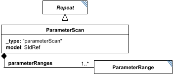

# ParameterScan

**Category:** tasks  
**Version:** v1  
**Schema:** [`schema.json`](./schema.json)  
**`_type` discriminator:** `"parameterScan"`

## What it does

Runs simulations/analyses over several systematically-varied versions of a model: a `Repeat` subclass that adds a `model` child (the model to scan) and one or more `ParameterRange` children (`parameterRanges`) - each scanned element adds a dimension to the output. Each `ParameterRange` must target a distinct `modelElement`, which must be an id within the child `model`. One of the `subTasks` must reference the scan's `model` child (`#tasks:[scanid]:model`) as its own input; the model is initialized with every combination of values across all the ranges. Mechanically it's otherwise identical to `Scatter`, and could in principle be reproduced with nested `Scatter`s plus careful `ModelChange` tasks.

## Attributes

All classes additionally inherit the optional `name`, `description`, `notes`, and `annotations` fields from `SEDBase` - see [`core/SEDBase`](../../../core/SEDBase/v1.0.0/description.md).

| Attribute | Type | Required | Notes |
|---|---|---|---|
| `taskParameters` | array of TaskParameter | no |  |
| `subTasks` | object (values: AbstractTask) | yes |  |
| `outputVariableMap` | object (values: SIdRef) or SIdRef | no |  |
| `aggregateOutputVariables` | object (values: AggregationCalculation) | no |  |
| `model` | SIdRef | yes |  |
| `parameterRanges` | array of ParameterRangeInline | yes |  |

### Attribute details

**`taskParameters`** (array of TaskParameter, optional) - _(no description yet - placeholder, needs to be filled in)_

**`subTasks`** (object (values: AbstractTask), required) - _(no description yet - placeholder, needs to be filled in)_

**`outputVariableMap`** (object (values: SIdRef) or SIdRef, optional) - _(no description yet - placeholder, needs to be filled in)_

**`aggregateOutputVariables`** (object (values: AggregationCalculation), optional) - _(no description yet - placeholder, needs to be filled in)_

**`model`** (SIdRef, required) - _(no description yet - placeholder, needs to be filled in)_

**`parameterRanges`** (array of ParameterRangeInline, required) - _(no description yet - placeholder, needs to be filled in)_

## Outputs

`[id]`: an `AnnotatedData` with one dimension per entry of `parameterRanges`, plus one further dimension sized by the number of entries in `outputVariableMap`. `[id].aggregates`: an `AnnotatedData` following `aggregateOutputVariables`, when defined.

- `[id]`: **Valid**
    - Dimensions: N-D: one dimension per entry in `parameterRanges` (each sized by that range's own number of steps), plus one further dimension sized by the number of entries in `outputVariableMap` - dimensionality grows with the number of ranges scanned.
- `[id].model`: **Invalid**
- `[id].strings`: **Invalid**

Additional possible outputs beyond the three standard ones:

- `[id].aggregates`: An `AnnotatedData` following `aggregateOutputVariables`, when that attribute is defined.
    - Dimensions: 1D: one entry per `aggregateOutputVariables` mapping. Each entry's aggregation collapses *all* of `[id]`'s scanned-range dimensions together (per `Repeat`, the applied dimension defaults to 'the Repeat' itself - here, the whole combined scan) down to a single value - unless the underlying subTask output was itself multi-dimensional, in which case that dimensionality carries through per entry.
