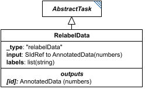

# RelabelData

**Category:** tasks  
**Version:** v1  
**Schema:** [`schema.json`](./schema.json)  
**`_type` discriminator:** `"relabelData"`

## What it does

`RelabelData` replaces the existing labels of the topmost dimension of the referenced `input` `AnnotatedData` with the strings given in `labels`.

## Attributes

All classes additionally inherit the optional `name`, `description`, `notes`, and `annotations` fields from `SEDBase` - see [`core/SEDBase`](../../../core/SEDBase/v1.0.0/description.md).

| Attribute | Type | Required | Notes |
|---|---|---|---|
| `taskParameters` | array of TaskParameter | no |  |
| `input` | SIdRef | yes |  |
| `labels` | ListOfStringsOrRef | yes |  |

### Attribute details

**`taskParameters`** (array of TaskParameter, optional) - _(no description yet - placeholder, needs to be filled in)_

**`input`** (SIdRef, required) - _(no description yet - placeholder, needs to be filled in)_

**`labels`** (ListOfStringsOrRef, required) - _(no description yet - placeholder, needs to be filled in)_

## Outputs

The relabeled `AnnotatedData`, accessible as `[id]`.

- `[id]`: **Valid**
    - Dimensions: Same dimensions as the referenced `input` `AnnotatedData` - this task only replaces the topmost dimension's labels, not the shape.
- `[id].model`: **Invalid**
- `[id].strings`: **Invalid**
