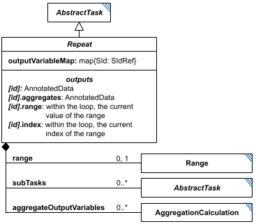

# Repeat

**Category:** tasks  
**Version:** v1  
**Schema:** [`schema.json`](./schema.json)

## What it does

Like SED-ML Level 1's RepeatedTask, SED2 needs to repeat a group of tasks multiple times. `Repeat` is the set of fields shared by all three concrete subclasses (`Scatter`, `Loop`, `ParameterScan`), composed via `allOf` rather than instantiated on its own - the prose spec calls this abstract concept simply "Repeat".

The repeat's `subTasks` are true children (not references) of the parent, and may depend on each other, on outputs of tasks outside the repeat, or on the repeat's own `range`/`index` (the current iteration's range value and position, available as `[id].range`/`[id].index` - see Outputs below). `outputVariableMap` defines the columns of the repeat's own `[id]` output: the first column is always the range values, and each further named entry maps an output column name to a value produced by a subTask; if empty, `[id]` contains only the range values. `aggregateOutputVariables` defines the columns of `[id].aggregates` - used to efficiently collect running summary statistics (e.g. mean/stdev) across a very large number of repeats without keeping every individual run's output; entries here may not define their own `appliedDimensions` (the applied dimension is always 'the Repeat' itself), and each `input` must reference a subTask's output.

A `Repeat`-derived task must define at least one of `outputVariableMap` or `aggregateOutputVariables`.

`range` (a `Range`/`NumericRange`/`ParameterRange`) is shared here rather than being redefined separately on each subclass - `Loop` and `Scatter` both use it directly; `ParameterScan` does not (it uses `parameterRanges` instead).

## Attributes

All classes additionally inherit the optional `name`, `description`, `notes`, and `annotations` fields from `SEDBase` - see [`core/SEDBase`](../../../core/SEDBase/v1.0.0/description.md).

| Attribute | Type | Required | Notes |
|---|---|---|---|
| `subTasks` | object (values: AbstractTask) | no |  |
| `outputVariableMap` | object (values: SIdRef) or SIdRef | no |  |
| `aggregateOutputVariables` | object (values: AggregationCalculation) | no |  |
| `range` | RangeInline | no | Used by `Loop`/`Scatter`; not used by `ParameterScan` (see `parameterRanges` there instead). |

### Attribute details

**`subTasks`** (object (values: AbstractTask), optional) - _(no description yet - placeholder, needs to be filled in)_

**`outputVariableMap`** (object (values: SIdRef) or SIdRef, optional) - _(no description yet - placeholder, needs to be filled in)_

**`aggregateOutputVariables`** (object (values: AggregationCalculation), optional) - _(no description yet - placeholder, needs to be filled in)_

**`range`** (RangeInline, optional) - _(no description yet - placeholder, needs to be filled in)_

## Outputs

Not applicable on its own - see `Scatter`, `Loop`, and `ParameterScan` for their concrete output shapes (`[id]` per `outputVariableMap`, `[id].aggregates` per `aggregateOutputVariables`).

- `[id].range`: Within the loop, the current value of `range`. _(No description yet - placeholder, needs to be filled in: exact reference form and availability when `range` is unset.)_
- `[id].index`: Within the loop, the current index into `range`. _(No description yet - placeholder, needs to be filled in.)_

Shared mixin for the three `Repeat` subclasses - not instantiated on its own; see `Scatter`, `Loop`, `ParameterScan`.
