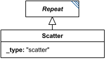

# Scatter

**Category:** tasks  
**Version:** v1  
**Schema:** [`schema.json`](./schema.json)  
**`_type` discriminator:** `"scatter"`

## What it does

A `Repeat` whose iterations are guaranteed fully independent of one another - no subTask output from one iteration feeds into another - so a conforming interpreter may execute the iterations in parallel if it chooses. `range` (a `Range`/`NumericRange`/`ParameterRange`) defines one iteration per element.

## Attributes

All classes additionally inherit the optional `name`, `description`, `notes`, and `annotations` fields from `SEDBase` - see [`core/SEDBase`](../../../core/SEDBase/v1.0.0/description.md). `kisaoID`/`altDefinition` have been rolled into the `_type` discriminator and are no longer separate attributes.

| Attribute | Type | Required | Notes |
|---|---|---|---|
| `taskParameters` | array of TaskParameter | no |  |
| `subTasks` | object (values: AbstractTask) | yes |  |
| `outputVariableMap` | object (values: SIdRef) or SIdRef | no |  |
| `aggregateOutputVariables` | object (values: AggregationCalculation) | no |  |
| `range` | RangeInline | no |  |

### Attribute details

**`taskParameters`** (array of TaskParameter, optional) - _(no description yet - placeholder, needs to be filled in)_

**`subTasks`** (object (values: AbstractTask), required) - _(no description yet - placeholder, needs to be filled in)_

**`outputVariableMap`** (object (values: SIdRef) or SIdRef, optional) - _(no description yet - placeholder, needs to be filled in)_

**`aggregateOutputVariables`** (object (values: AggregationCalculation), optional) - _(no description yet - placeholder, needs to be filled in)_

**`range`** (RangeInline, optional) - _(no description yet - placeholder, needs to be filled in)_

## Outputs

`[id]`: an `AnnotatedData` whose first column is the range values and whose subsequent columns follow `outputVariableMap` (or which contains only the range values, if `outputVariableMap` is empty). `[id].aggregates`: an `AnnotatedData` following `aggregateOutputVariables`, when defined.

- `[id]`: **Valid**
    - Dimensions: 2D (or more): first dimension = one row per value in `range`; remaining dimension(s) = one column per entry of `outputVariableMap` (or just the range-values column alone, if `outputVariableMap` is empty). A column whose subTask output is itself multi-dimensional would add further dimensions - not pinned down further here.
- `[id].model`: **Invalid**
- `[id].strings`: **Invalid**

Additional possible outputs beyond the three standard ones:

- `[id].aggregates`: An `AnnotatedData` following `aggregateOutputVariables`, when that attribute is defined.
    - Dimensions: 1D: one entry per `aggregateOutputVariables` mapping. Each entry's aggregation function collapses the `range` dimension of `[id]` (per `Repeat`, the applied dimension defaults to 'the Repeat' itself, i.e. this one) down to a single value - unless the underlying subTask output was itself multi-dimensional, in which case that dimensionality carries through per entry.

- `[id].range`: Within each iteration, the current value of `range` (see `Repeat`).
    - Dimensions: Scalar (0-D) per iteration.
- `[id].index`: Within each iteration, the current index into `range`.
    - Dimensions: Scalar (0-D) per iteration.
