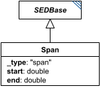

# Span

**Category:** tasks  
**Version:** v1  
**Schema:** [`schema.json`](./schema.json) + [`inline.schema.json`](./inline.schema.json) (`SpanInline`)  
**`_type` discriminator:** `"span"`

## What it does

A minimal range: just a `start` and an `end` value, with no explicit intermediate points. Used by `BoundedODESimulation` (`independentVariableSpan`) and `BoundedStochasticSimulation` (`independentVariableSpan`) to bound a simulation whose output points are chosen by the solver rather than the document.

**Two schema files in this folder.** `schema.json` defines `Span` itself. `inline.schema.json` defines `SpanInline` - the wrapper used for named child fields like `independentVariableSpan`. See `tasks/Range` for why the two are kept separate. Unlike `Range`/`NumericRange`/`ParameterRange`, `Span` is not itself in `AbstractTask`'s union, so it cannot appear as a standalone `tasks` dictionary entry - it only ever appears embedded, via `SpanInline`.

## Attributes

All classes additionally inherit the optional `name`, `description`, `notes`, and `annotations` fields from `SEDBase` - see [`core/SEDBase`](../../../core/SEDBase/v1.0.0/description.md).

| Attribute | Type | Required | Notes |
|---|---|---|---|
| `start` | NumberOrRef | yes |  |
| `end` | NumberOrRef | yes |  |

### Attribute details

**`start`** (NumberOrRef, required) - _(no description yet - placeholder, needs to be filled in)_

**`end`** (NumberOrRef, required) - _(no description yet - placeholder, needs to be filled in)_

## Outputs

Not independently referenceable - a `Span` only exists as a named child of the task that bounds itself with it.

- `[id]`: **Invalid**
- `[id].model`: **Invalid**
- `[id].strings`: **Invalid**

(Any output suffix not listed above is invalid for this class.)

`Span` can never be a standalone `tasks` entry - it only ever appears embedded (via `SpanInline`), and has no output of its own.
