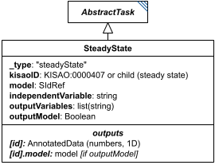

# SteadyState

**Category:** tasks  
**Version:** v1  
**Schema:** [`schema.json`](./schema.json)  
**`_type` discriminator:** `"steadyState"`

## What it does

Computes the steady state of a model: where dX/dt = 0 for every varying element X of the model, with respect to the independent variable (usually time). `independentVariable` follows the same rules as the simulation tasks (either the model's own variable, or an implicit URN such as `urn:sedml:symbol:time`).

This is an implementation of KISAO:0000407 (steady-state root-finding method).

## Attributes

All classes additionally inherit the optional `name`, `description`, `notes`, and `annotations` fields from `SEDBase` - see [`core/SEDBase`](../../../core/SEDBase/v1.0.0/description.md).

| Attribute | Type | Required | Notes |
|---|---|---|---|
| `taskParameters` | array of TaskParameter | no |  |
| `model` | SIdRef | yes |  |
| `independentVariable` | StringOrRef | no |  |
| `outputVariables` | ListOfStringsOrRef | yes |  |
| `outputModel` | BooleanOrRef | no |  |

### Attribute details

**`taskParameters`** (array of TaskParameter, optional) - _(no description yet - placeholder, needs to be filled in)_

**`model`** (SIdRef, required) - _(no description yet - placeholder, needs to be filled in)_

**`independentVariable`** (StringOrRef, optional) - _(no description yet - placeholder, needs to be filled in)_

**`outputVariables`** (ListOfStringsOrRef, required) - _(no description yet - placeholder, needs to be filled in)_

**`outputModel`** (BooleanOrRef, optional) - _(no description yet - placeholder, needs to be filled in)_

## Outputs

The steady-state values of `outputVariables`, accessible as `[id]`. If `outputModel` is `true`, the resulting model state is also available as `[id].model`.

- `[id]`: **Valid**
    - Dimensions: 1D: one value per entry of `outputVariables`, at steady state.
- `[id].model`: **Valid**
- `[id].strings`: **Invalid**

`[id].model` is only produced when `outputModel` is `true`.
