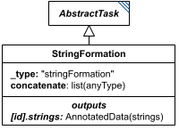

# StringFormation

**Category:** tasks  
**Version:** v1  
**Schema:** [`schema.json`](./schema.json)  
**`_type` discriminator:** `"stringFormation"`

## What it does

`StringFormation` takes the `concatenate` list, converts every element to a string, and concatenates them. If an element of the list is itself a list, each of its members is concatenated into a separate output string, so the overall result becomes a list of strings matching that dimension - e.g. `["n = ", [1, 2, 3]]` yields `["n = 1", "n = 2", "n = 3"]`. If multiple elements of `concatenate` are themselves lists, their corresponding elements are combined pairwise, and all such lists must have identical lengths; multi-dimensional lists produce multi-dimensional string results the same way.

## Attributes

All classes additionally inherit the optional `name`, `description`, `notes`, and `annotations` fields from `SEDBase` - see [`core/SEDBase`](../../../core/SEDBase/v1.0.0/description.md). `kisaoID`/`altDefinition` have been rolled into the `_type` discriminator and are no longer separate attributes.

| Attribute | Type | Required | Notes |
|---|---|---|---|
| `taskParameters` | array of TaskParameter | no |  |
| `concatenate` | ListOfAnyOrRef | yes |  |

### Attribute details

**`taskParameters`** (array of TaskParameter, optional) - _(no description yet - placeholder, needs to be filled in)_

**`concatenate`** (ListOfAnyOrRef, required) - _(no description yet - placeholder, needs to be filled in)_

## Outputs

A string, or a (possibly multi-dimensional) list of strings, accessible as `[id]`.

- `[id]`: **Valid**
    - Dimensions: Scalar (a single string) when no element of `concatenate` is itself a list.
- `[id].model`: **Invalid**
- `[id].strings`: **Valid**
    - Dimensions: Matches the shape of the list element(s) within `concatenate`: 1D if one element of `concatenate` is a list, N-D if several list elements are combined pairwise (all must share the same length/shape per dimension).

Open question: the spec text accesses both the single-string and list-of-strings cases as plain `[id]`, which is what's shown for `id` above; `id.strings` is also marked valid here per the general `AbstractTask` convention for a list-of-strings export. Worth resolving which is actually intended when the result is a list.
